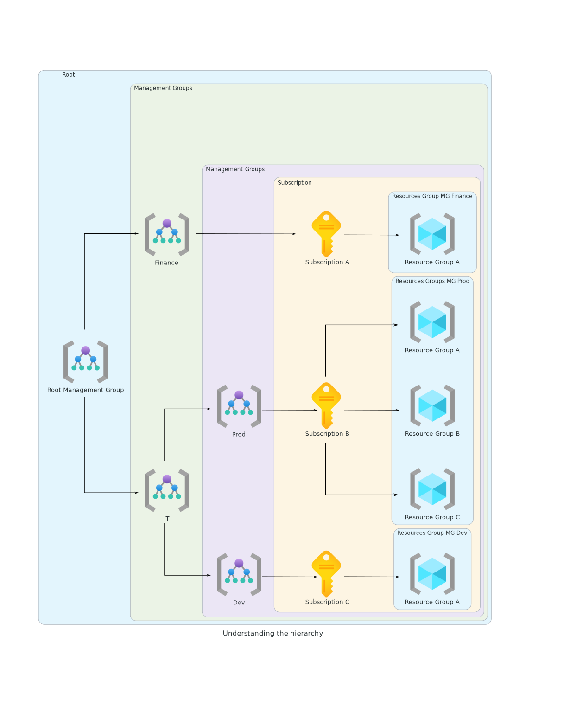

# Souscription et Gouvernance

## Gérer les souscriptions

Pour pouvoir utiliser Azure une souscription est nécessaire. Les ressources déployées sur votre compte Azure sont donc liées à cette souscription.

Les souscriptions permettent aussi de configurer les environnements différemmment. Ainsi, on peut par exemple imaginer une souscription de développment, de production, de tests, chacune ayant des ressources et des paramètres différents.

Chaque souscription possède une id unique, référencée sous le nom `id` lorsque l'on utilise la commande `az account show` de l'az-cli.

```shell
❯ az account show
{
  "environmentName": "AzureCloud",
  "homeTenantId": "xxx-6490-xxxx-a448-xxxx",
  "id": "xxxxxx-0cde-xxxxx-9162-xxxxxx",
  "isDefault": true,
  "managedByTenants": [],
  "name": "Abonnement Azure 1",
  "state": "Enabled",
  "tenantId": "xxxxx-6490-xxx-a448-xxx",
  "user": {
    "name": "john.doe@me",
    "type": "user"
  }
}
```
Un compte peut avoir plusieurs souscription, et toute identité provenant de l'Azure AD ou d'un service cloud de Microsoft peut créer une souscription.

Les souscriptions peuvent aussi air comme périmètre pour la gestion des accès.

il existe 4 types de souscriptions différentes.

1. **Enterprise Agreements**. Recommandé pour les organisations de plus de 500 utilisateurs ou devices, offre les services cloud et les licences softwares à un prix réduit.
2. **Pay-as-you-go**. Idéal pour les petites organisations ou les individus, seuls les services utilisés sont payés au fur et à mesure.
3. **Cloud Solution Provider**. Obtenu via Microsoft Partners, idéal pour les organisations petites à medium. La facturation est gérée par le partenaire.
4. **Free Trial**. 200$ de crédits sur 30 jours et accès limité gratuit pendant 12 mois.
5. **Azure for students**. Les étudiants sont éligibles à un crédit de 100$ sur 12 mois après vérification.
6. **Visual Studio**. Souscription gérée par crédit à toute pesonne ayant souscrit à Visual Studio Professionnal ou Enterprise.


## Comprendre la hiérarchie



* Les `management groups` offrent un niveau de vision au dessus des `resource groups`, ce qui permet de grouper ces derniers ensembles.
* Un `management group` racine est créé par défaut, et l'on peut avoir jusque 6 niveaux de `management group` en dehors du groupe racine.
* Chaque souscription peut contenir un ou plusieurs `resource groups` permettant de grouper logiquement les ressources telles que les machines virtuelles, les base de données, etc.
* Cette hiérarchie permet d'implémenter les politiques d'accès, de gérer les coûts, etc.

$$
\text{Resource} \subset \text {Resource Group} \subset \text {Subscription} \subset \text {Management Group}
$$

## Travailler avec le mode RBAC

**RBAC** : Role Based Access Control

Permet aux administrateurs des donner l'accès aux ressources Azure et de séparer les responsabilités dans l'équipe.

* **Qui** : N'importe quelle identité demandant un accès. Ca peut être un utilisateur, un groupe, un service principal ou une identité managée.
* **Quoi** : Définition du rôle, ensemble d'opérations que l'identité pourra effectuer. Ecrit au format JSON.
* **Où** : Définir les limites de l'accès.

Ces 3 points définissent un rôle, qui peut alors être assignée à l'identité.

On peut avoir au maximum jusque 2000 rôles par souscription.

**Principe du moindre privilège**.

Il existe deux types de rôles :

* les rôles "BuiltIn", définis par Azure lui même,
* les rôles "Custom", définis par l'administrateur.

!!! info "Les rôles et l'az cli"

    Pour avoir accès à l'ensemble des rôles définis par Azure, on peut utiliser la commande suivante via l'az cli.

    ```shell
    az role definition list --query "[].{name:name, roleType:roleType, roleName:roleName}" --output tsv
    ```

    Pour avoir accès à tous les rôles attenants à AzureML, on peut taper la commande suivante.

    ```shell
    $ az role definition list --query "[].{name:name, roleType:roleType, roleName:roleName}" --output tsv | grep AzureML

    635dd51f-9968-44d3-b7fb-6d9a6bd613ae	BuiltInRole	AzureML Metrics Writer (preview)
    f6c7c914-8db3-469d-8ca1-694a8f32e121	BuiltInRole	AzureML Data Scientist
    e503ece1-11d0-4e8e-8e2c-7a6c3bf38815	BuiltInRole	AzureML Compute Operator
    1823dd4f-9b8c-4ab6-ab4e-7397a3684615	BuiltInRole	AzureML Registry User
    ```


!!! example "Contributor role au format JSON"

    ```json
    {
      "assignableScopes": [
      "/"
      ],
      "description": "Grants full access to manage all resources, but does not allow you to assign roles in Azure RBAC, manage assignments in Azure Blueprints, or share image galleries.",
      "id": "/subscriptions/{subscriptionId}/providers/Microsoft.Authorization/roleDefinitions/b24988ac-6180-42a0-ab88-20f7382dd24c",
      "name": "b24988ac-6180-42a0-ab88-20f7382dd24c",
      "permissions": [
        {
          "actions": [
            "*"
          ],
          "notActions": [
            "Microsoft.Authorization/*/Delete",
            "Microsoft.Authorization/*/Write",
            "Microsoft.Authorization/elevateAccess/Action",
            "Microsoft.Blueprint/blueprintAssignments/write",
            "Microsoft.Blueprint/blueprintAssignments/delete",
            "Microsoft.Compute/galleries/share/action"
          ],
          "dataActions": [],
          "notDataActions": []
        }
      ],
      "roleName": "Contributor",
      "roleType": "BuiltInRole",
      "type": "Microsoft.Authorization/roleDefinitions"
    }
    ```

### Scope

Il est important de savoir à quel niveau assigner le rôle, pour rappel on a 4 niveau d'assignations possibles.

$$
\text{Resource} \subset \text {Resource Group} \subset \text {Subscription} \subset \text {Management Group}
$$

Si un rôle est affecté à un certain niveaux, les objets sous ce niveau lui appartenant hériteront de ce rôle.

!!! example "Exemple"

    Si le rôle `AzureML Data Scientist` est assignée au niveau de la souscription $A$, tous les `resource groups` $RG_{A}$ de la souscription $A$ hériteront de ce rôle et de ses droits.

### Azure RBAC vs Azure AD roles


|                   |                                 Azure RBAC                                  |                                   Azure AD role                                   |
| :---------------: | :-------------------------------------------------------------------------: | :-------------------------------------------------------------------------------: |
|        Use        |              Utilisé pour gérer les accès aux ressources Azure              |                   Utiliser pour gérer les options de l'AD Azure                   |
|       Scope       |          Management Group, Subscription, Resource Group, Resource           |                                  Azure AD tenant                                  |
| Assignment method |    Portail Azure, Azure PowerShell, Azure CLI, ARM Templates, REST API     | Portail Azure, M365 Admin Portail, Microsoft Graph API, Azure AD, Graph PS Module |
|      Example      | Owner, Contributor, Reader, User Access Admin, AzureML Data Scientist, etc. |         Global Administrator, Billing Administrator, Global Reader, etc.          |


## Built-in roles et Custom Roles

### Built-in

Les rôles "built-in", définis par Azure, peuvent être assignés à un utilisateur, un groupe, un service principal, ou une identité managée. Pour voir la liste complète, on peut utiliser comme citer précédemment la commande suivante `az role definition list`.

Les 4 rôles principaux, et les plus utilisés, sont les suivants :

* **Owner** : Accès complet à toutes les ressources et peut délégeur l'accès de ces dernières à d'autres utilisateurs.
* **Contributor** : Peut créer et gérer tous les types de ressources, mais ne peut pas en donner l'accès à d'autres personnes.
* **Reader** : Accès en lecture à toutes les ressources, mais ne peut pas en modifier le contenu.
* **User Access Administrator** : Peut gérer l'accès aux ressources des autres utilisateurs.

[Attribuer des rôles Azure à l’aide d’Azure CLI](https://learn.microsoft.com/fr-fr/azure/role-based-access-control/role-assignments-cli)

### Custom

Si les rôles de base ne sont pas suffisants, Azure permet de créer ses propres rôles. Ils peuvent êtres créés via le Portail Azure, Azure PowerShell, Azure CLI, REST API.

Chaque instance d'Azure AD peut avoir jusque 5000 rôles custom.

Ils peuvent être assignés aux utilisateurs, groups, service principal et identités managées à n'importe quel niveau, comme les rôles par défaut.


[Tutorial: Create an Azure custom role using Azure CLI](https://learn.microsoft.com/en-us/azure/role-based-access-control/tutorial-custom-role-cli)

## Les tags Azure

Il est possible d'associer à chaque ressource des tags. Un tag est une paire clé-valeu. Avec un tag il est possible :

* d'ajouter des metadonnées à nos souscriptions, resource group, ressources,
* de grouper ou filtrer logiquement les ressources pour des besoins de gestion,
* de les utiliser pour gérer l'utilisation d'Azure et la facturation : les tags ajoutés aux ressources sont propagés au système de facturation Azure.

La clé du tag est limitée à 512 caractères, sa valeur est limitée à 256 caractères, chaque ressource peut se voir assigner maximum 50 tags.

[az tag](https://learn.microsoft.com/en-us/cli/azure/tag?view=azure-cli-latest#az-tag-update)

## Verrouillage des ressources

Il est possible de verrouiller les ressources, pour les protéger d'un changement accidentel ou d'une suppression.

Les verrous peuvent être appliqués au niveau de la souscription, du resource groupe, ou de la ressource. Pour un objet verrouillé, les dépendances de plus bas niveau de ce dernier en héritetont.

Il existe de verrous :

* verrou lecture-seule, qui empêche la modification de la resource.
* verrour de suppression, qui empêche la suppression de la ressource.

[az lock](https://learn.microsoft.com/en-us/cli/azure/lock?view=azure-cli-latest)

## Analyse des coûts

## Politiques Azure
