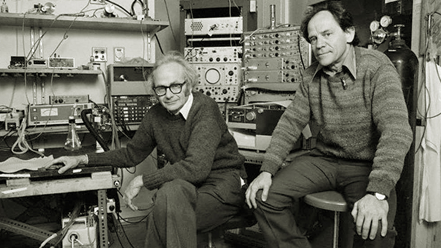
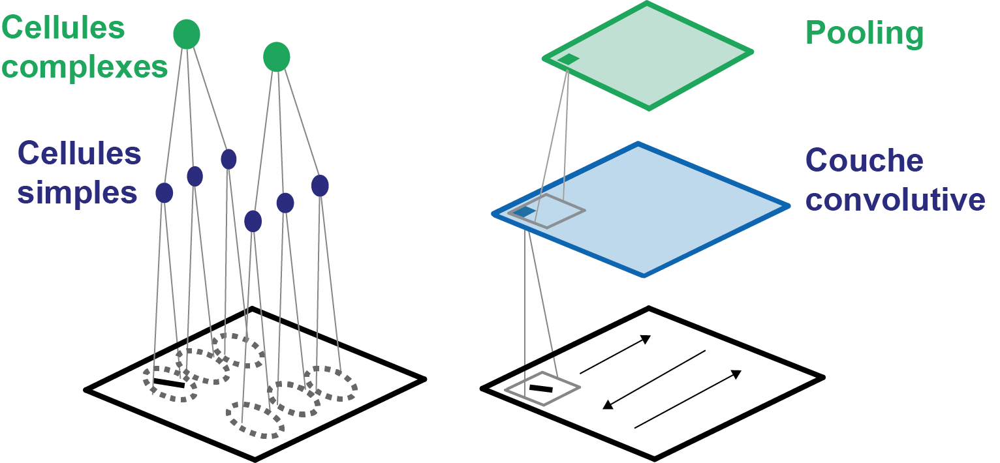
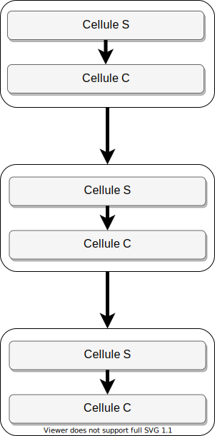
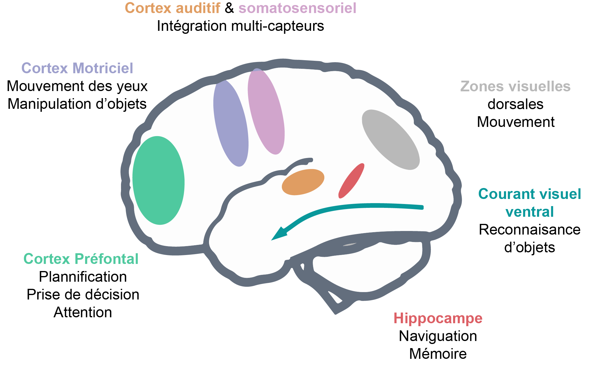
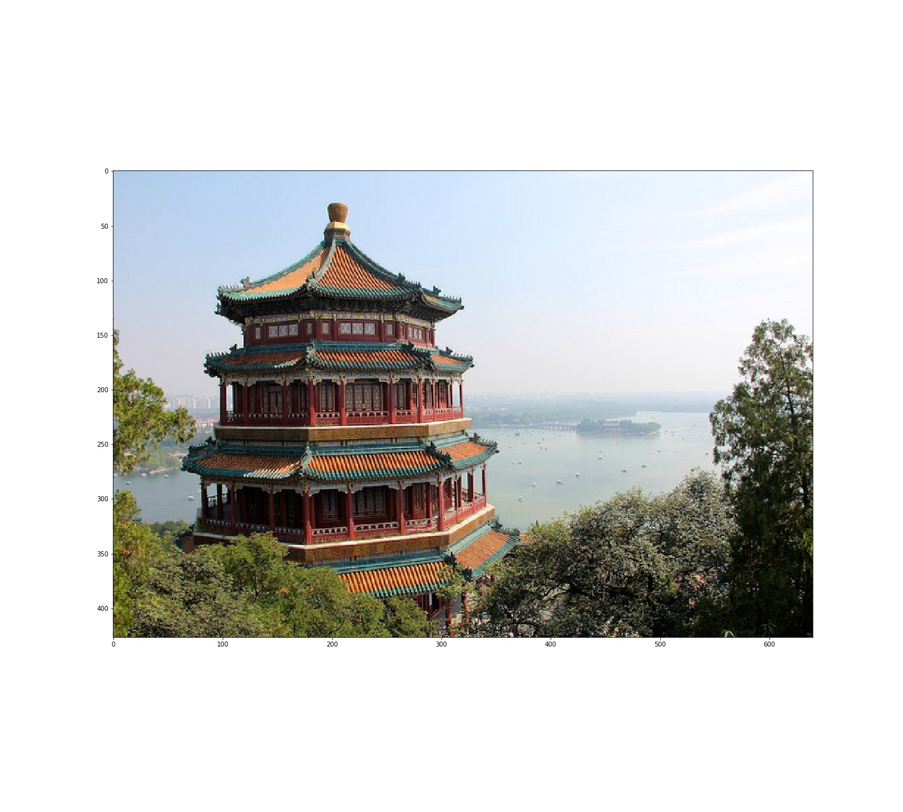
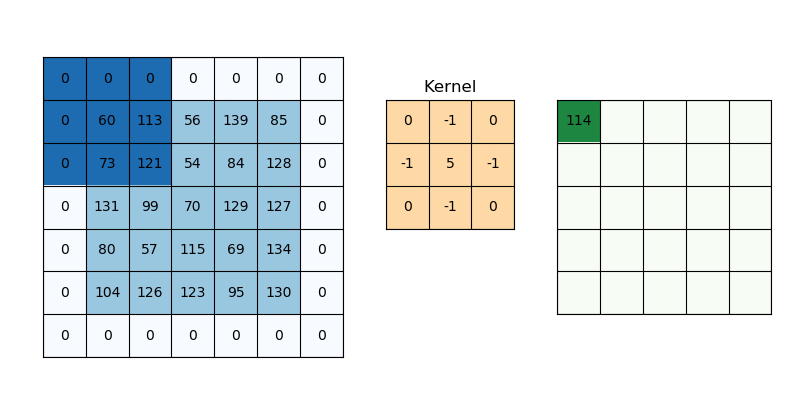
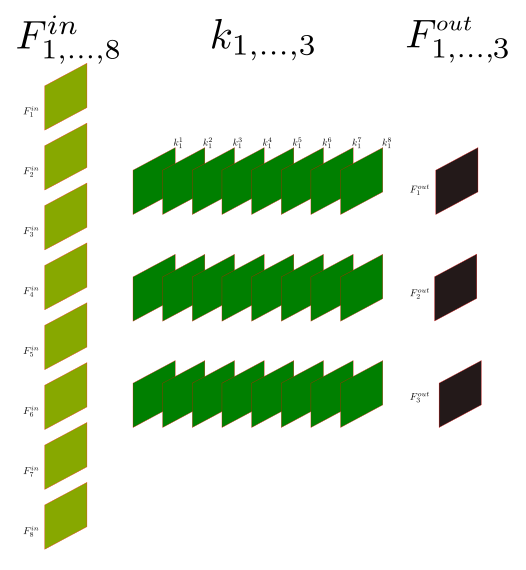
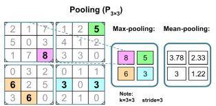
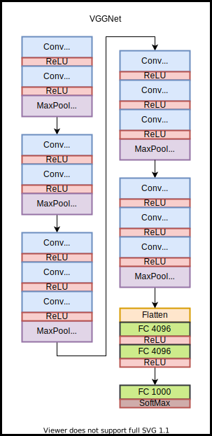

# Module 2 : Les réseaux de neurones convolutifs

## Les neurosciences toujours : La vision chez l'être humain

Les CNN (réseau de neurones convolutifs) ont été inspirés par les découvertes lors de l'étude de la vision biologique.

Au milieu du 20e siècle, David Hubel et Torsten Wiesel décrouvrent 2 types majeurs de cellules dans le cortex visuel primaire des chats :

1. Les cellules dites **simples**,
2. Les cellules dites **complexes**.

!!! info "David Hubel (gauche), Torsten Wiesel (droite)"

    

    Prix Nobel de médecine pour "leurs découvertes concernant le traitement de l'information dans le système visuel".

Les cellules simples réagissent à des barres lumineuses ou sombres placées à des endroits spécifiques, de plus chaque cellules à une orientation préférée pour laquelle la réaction est maximale.

Les cellules complexes ont un profil de réponse moins strict, elles ont toujours une orientation préférée mais elles réagissent de la même façon à des barres situées à des endroits proches.

**Hubel et Wiesel concluent alors que ces cellules reçoivent des données de plusieurs cellules simples, toutes de la même orientation, mais à des positions proches différentes.**



En 1980, Fukushima transforme les découvertes de Hubel et Wiesel en un modèle du système visuel : **Le NeoCognitron**. Précurseur des CNNs il contient deux types de cellules :

!!! example "Architecture du NeoCognitron"

    {: align=left }

    * Les **celulles S** : Une grille 2D de poids est appliquée à chaque image d'entrée, créant la réponse des cellules S. Un plan de cellules S a une structure similaire à celle de l'oeil humain, avec les cellules partageant toutes les mêmes caractéristiques visuelles préférées. Plusieurs plans peuvent alors s'organiser en couches succéssives.

    * Les **cellules C** : La réponse de ces cellules est donnée par une fonction non linéaire de plusieurs cellules S provenant du même plan mais à des positions différentes.

L'architecture de ce modèle est alors une simple répétition de ces cellules, les répétitions permettant de simuler le chemin visuel ventral en entier.

Dans les années 1990, le néocognitron est amélioré et devient le HMAX. On utilise alors la fonction maximum pour définir la réponse des cellules C.

Les CNN modernes découlent de ces découvertes, les cellules S correspondents au couches convolutives, tandis que les cellules C correspondent aux couches de pooling. L'interêt des neuroscientifiques pour les CNNs est important car ils sont capables de récapituler la représentation de l'information visuelle le long du courant ventral (responsable de la reconnaissance d'objets et de la représentation des formes.)




Pour résumer, si notre but est de détecter des objets dans des images, il est clair que **la position de l'objet dans l'image ne doit pas être un facteur impactant pour le modèle**, en d'autres termes, le modèle doit être invariant par translation le plus possible.

Se contenter de réseaux denses, comme dans le module précédent, nous fait ignorer une des propriétés clés des images : **les pixels proches sont plus fortement corrélés entre eux que des pixels distants**. Pour prendre en compte cette propriété, l'idée est alors d'extraire des caractéristiques locales ne dépendant que de petites sous-régions de l'image. Ces caractéristiques locales pourront alors être plus tard regroupées pour détecter des caractéristiques de plus haut niveau.

Ces notions sont alors incorporées dans les CNN via les 3 mécanismes suivants :

1. Les champs réceptifs locaux,
2. Le partage des poids,
3. Le sous échantillonage.

## Les réseaux convolutifs (CNN)

!!! Note "Résumé"

    Les CNN sont spécialisés en traitement des données dont la topologie ressemble à celle d'une grille connue.

    Les réseaux de neurones convolutifs sont *simplement* des ANN qui utilisent le produit de convolution à la place du produit matriciel classique.

!!! example "Exemple"

    1. Données de séries temporelles : grille 1D échantillonée à intervalles réguliers.
    2. Données d'images : grille 2D de pixels.


### L'opération de convolution

Mettons tout d'abord d'accord sur ce que l'on appelle le produit de convolution.

!!! Note "Définition"

    Pour $f$ et $g$ deux fonction de $L^{1}(\mathbb{R})$ on définit le produit de convolution de $f$ et $g$ via la formule suivante.

    \[
        (f \ast g )(t) := \int_{\mathbb{R}} f(s)g(s-t) \mathrm{d}s
    \]

    Pour $(f_{n})_{n \in \mathbb{N}}$ et $(g_{n})_{n \in \mathbb{N}}$ deux suites de  $\ell^{1}(\mathbb{R})$ le produit de convolution est défini par la formule suivante.

    \[
        (f \ast g )_{n} := \sum_{k} f_{k}g_{n-k}
    \]

Par convention, en Deep Learning, le premier argument $f$ du produit de convolution est dénommé **l'entrée**. Le second argument est appelé le **noyau**.

Le résultat est appelé **la carte de caractéristique** (feature map).

Typiquement, l'entrée est un tableau multidimensionnel **de données** et le noyau est un tableau multidimensionnel **de paramètres estimés par l'algorithme**. On se place donc dans le cadre d'une convolution discrète (la deuxième formule).

!!! warning "Attention"

    On utilise souvent des convolutions sur plus d'un axe à la fois.


### Motivation de la convolution

La convolution est une opération spécialisée dans le traitement des images. Cherchons d'abord à savoir comment est représentée une image pour Tensorflow.

```python
from sklearn.datasets import load_sample_image
import matplotlib.pyplot as plt

china = load_sample_image('china.jpg')/255
plt.figure(figsize = (20,18))
plt.imshow(china)
plt.show
```



```python
china.shape

(427,640,3)
```
Pour reprendre les termes du premier module, une image est un tenseur 3D définie suivant 3 axes.

* La hauteur,
* la largeur,
* le nombre de canaux.

Un mini-batch d'images utilisé pour l'entraînement sera alors un tenseur 4D de la forme (taille du mini-batch, hauteur, largeur, canaux). Détaillons, la hauteur et la largeur de l'image sont exprimées en nombre de pixels, le nombre de canaux nous informe si oui ou non une image est en couleur.

* Si l'image est en couleur, on a alors 3 canaux qui correspondent qui correspondent aux 3 canaux de couleurs RGB.
* Si l'image n'est qu'en niveau de gris, on a un seul canal.

Une image en couleur sera donc de la forme $(H,W,3)$, tandis d'une image en niveau de gris sera de la forme $(H,W,1)$.

### La convolution dans un CNN

Dans le contexte des CNN, l'opération de convolution diffère de celle de la littérature mathématique classique : elle implique souvent plusieurs noyaux faisant des convolutions en parallèle sur plusieurs axes pour obtenir autant de cartes de caractéristique que désirée.

La collection de noyaux définissant une convolution discrète est définie par la famille suivante.

\[
    (n, m, k_{1}, \dots, k_{N})
\]

où :

1. $n :=$ nombre de cartes de caractéristiques en sortie.
2. $m :=$ nombre de cartes de caractéristiques en entrée.
3. $k_{j} :=$ dimension du noyau le long de l'axe $j$.

De la même façon, la dimension de la sortie du CNN le long de l'axe $j$, notée $o_{j}$, est définie par la famille suivante.

\[
    (i_{j}, k_{j}, s_{j}, p_{j})
\]

où :

1. $i_{j} :=$ dimension de l'entrée le long de l'axe $j$.
2. $k_{j} :=$ dimension du noyau le long de l'axe $j$.
3. $s_{j} :=$ **foulée** (stride) le long de l'axe $j$ : distance entre deux positions consécutives du noyau.
4. $p_{j} :=$ valeur de la **marge à zéro** (zero padding) le long de l'axe $j$ : le nombre de position que le noyau peut visiter hors de l'image.

!!! info "Remarqe"

    Dans la pratique, la dimension des noyaux d'une même couche ne varie pas le long de chaque axe : on travaille avec des noyaux de forme "cubique". On choisit une dimension qui est fixe dans la couche convolutive.

Généralement, nous considérons chaque pixel de l'image source comme un pixel d'ancrage, mais nous ne sommes pas contraints de le faire. En fait, il n'est pas rare d'inclure une foulée (stride), où les pixels d'ancrage/source sont séparés par un nombre spécifique de pixels.

D'accord, alors quel est le pixel source ? C'est le point d'ancrage autour duquel le noyau est centré et où nous encodons tous les pixels voisins, y compris le pixel d'ancrage. Comme le noyau est de forme symétrique (mais pas nécessairement symétrique en termes de valeurs), il y a un nombre égal $n$ de pixels de tous les côtés du pixel d'ancrage. Par conséquent, quel que soit ce nombre de pixels, la longueur de chaque côté de notre noyau de forme symétrique est de $2n+1$ (chaque côté de l'ancre + le pixel d'ancrage), et les noyaux sont donc toujours de taille impaire. Les tailles de noyaux les plus courantes étant $\lbrace 1,3,5,7 \rbrace$.


Dans la **définition classique de la convolution**, **le noyau de convolution n'est alors autorisé à visiter que les positions où le noyau est entièrement dans l'image**.

\[
    \begin{align}
    Z_{i,j,k} & = (V_{\bullet} \ast K_{\bullet})_{i,j,k} \\
              & = \sum_{l,m,n} V_{l, j-1+m, k-1+n} \cdot K_{i,l,m,n}
    \end{align}
\]

La dimension des couches réduit donc à chacune de ces convolutions. En effet, dans une convolution classique, la dimension de la sortie $o_{j}$, est définie par la formule suivante.

\[
    o_{j} := i_{j} - k_{j} + 1
\]

!!! danger "Attention"

    Dès que $k_{j} > 1$ la dimension de la sortie suvant cette axe diminue. On ne peut donc pas empiler autant de couches convolutives que l'on veut.

!!! example "Convolution simple : pas de foulée, pas de marge à zéro, noyau de taille $(3,3)$. La dimension de la sortie est alors plus petite que la dimension de la couche de sortie."

    

        https://github.com/vdumoulin/conv_arithmetic

```python
Conv2D(64, (3, 3), padding="valid")
```

La solution est alors d'ajouter ce que l'on appelle une marge de zéros, padding, pour garder la même dimension en sortie.

!!! example "Convolution simple : pas de foulée, marge à zéro égale, noyau de taille $(3,3)$. La dimension de sortie est la même que celle d'entrée."

    

        https://github.com/vdumoulin/conv_arithmetic


La nouvelle dimension de l'output est alors donnée par la formule suivante.

\[
    o := i - k + 1 +2p
\]

Ce qui donne, si $o=i$, un padding égal à

\[
   p = \frac{k-1}{2}.
\]

D'où un intéret supplémentaire aux noyaux de tailles impaires.

!!! example "Convolution simple : pas de foulée, marge à zéro égale, noyau de taille $(3,3)$."

    

        https://www.pyimagesearch.com/2018/12/31/keras-conv2d-and-convolutional-layers/


```python
Conv2D(64, (3, 3), padding="same")
```

On peut alors empiler autant de couches que l'on souhaite. Cependant, les pixels du bord influencent moins les pixels de sorties que ceux à l'intérieur, ce qui peut les rendre sous représentés.

En espaçant les champs réceptifs par une foulée supérieure à 1, il est possible de réduire la compléxité du réseau de neurones.

!!! example "Convolution simple : foulée de 1, pas de marge à zéro, noyau de taille $(3,3)$."

    

        https://github.com/vdumoulin/conv_arithmetic

#### Les champs réceptifs locaux...

Lors de l'opération de convolution, chaque unité de la feature map ne prend en entrée qu'une petite sous région de l'image, déterminée par la taille du noyau.

!!! example "Le champ réceptif local de chaque unité de la feature map est représenté par la partie de l'image s'intersectant avec le noyau de convolution."

    

        https://github.com/vdumoulin/conv_arithmetic


Si l'on pense aux unités des features maps comme des détecteurs, alors toutes les unités d'une même feature map détectent le même schéma mais à des endroits différents.

#### ...permettent le partage des paramètres

Le partage de paramètres fait référence à l'utilisation d'un même paramètre par plusieurs fonctions dans un même modèle.

Dans le cas d'un ANN classique, chaque élément de la matrice de poids est utilisé exactement une seule fois lors du calcul de la sortie. Dans un CNN, chaque élément du noyau est utilisé par chaque position de l'entrée. Au lieu d'apprendre un ensemble de paramètres distincts pour chaque emplacement, on apprend donc un unique ensemble.

#### Interactions parcimonieuses

Comme on l'a vu pour le cas des réseaux de neurones denses, pour les ANN utilisant le produit matriciel, la matrice contient des paramètres décrivant l'interaction entre chaque unité d'entrée et chaque unité de sortie.

!!! info "Remarque"

    **Chaque unité de sortie interagit avec chaque unité de d'entrée.**

Les CNN, eux ont des *interactions parcimonieuses*, du à la taille réduite du noyau. Cela a plusieurs avantages, un gain de mémoire et une amélioration de l'éfficacité statistique, ainsi qu'un gain en complexité algorothmique.

Pour $m$ entrées et $n$ sorties, le produit matriciel avec une matrice de paramètres de dimension $m \times n$ induit une compléxité algorithmique en $\mathcal{O}(m \times n)$. Si l'on limite à $k$ le nombre de connexion des sorties possibles, la compléxité chute à $\mathcal{O}(k \times n)$.

!!! Note "Equivariance par translation"

    La convolution rend le résultat équivariant par translation. Ce qui fait qu'une caractéristique géométrique dans une photo ne dépend pas de sa position (dans une photo pas exemple) pour être apprise par un CNN.

!!! danger "Attention"

    La convolution n'est pas naturellement équivariante par d'autres transformations, par exemple le changement d'échelle ou la rotation.

### Le passage d'une couche convolutive à l'autre

Lorsque l'entrée d'une couche convolutive sont les features maps d'une couche convolutive précédente, chaque filtre se "démultiplie" pour avoir autant de copie de ce filtre que de features maps en entrée. A une copie est assignée une feature map d'entrée, le résultat de cette convolution donne une "feature map partielle".

Pour un filtre, on aura autant de feature map partielle que de feature maps en entrée, la somme de ces feature maps partielle donnera le résultat de la convolution des feature maps d'entrée avec le filtre choisi.

!!! example "8 feature maps en entrée, 3 filtres "démultipliés" chacun en 8 copie, et 3 feature maps en sortie."

    


## Pooling

Le pooling correspond à la propriété de sous échantillonnage. Dans un CNN, les couches de pooling fournissent une invariance aux petites translations qui peuvent être présentes dans les images.

Le but du pooling est de réduire la taille de l'image afin d'en réduire le coût en calcul, le coût en mémoire, ainsi que le nombre de paramètres, ce qui permet de limiter le sur-apprentissage.

De la même façon qu'une couche convolutive, les sorties d'une couche de pooling possèdent un champs réceptif local, mais au contraire d'une couche convolutive il n'y a aucun poids associés à cette couche. L'opération éffectuée dans une couche de pooling est une opération d'agrégration, telle que le maximum (MaxPooling) ou la moyenne (AvgPooling), cette opération n'étant effectuée que sur les élément présent dans le champs réceptif.

De façon usuelle, une couche de pooling se trouve après une couche convolutive et prend en entrée les feature maps obtenues en sortie de cette couche.

!!! example "Pooling"

    


!!! info "Remarque"

    Dans la pratique, le MaxPooling est plus populaire que l'AvgPooling : il est plus rapide de calculer le maximum que la moyenne, de plus il offre de meilleurs résultats.

    La taille du champs  réceptifs est souvent de 2 ou 3.

## Architecture classique

!!! example "VGG16"

    

## Transfert d'apprentissage

L'idée est que des poids qui ont été entraîné pour un tâche spécifique, devrait être performant pour une tâche similaire, même si les deux datasets sont totalements disjoints.

Des couches entraînées à classifier des vêtements devraient être performants pour en classifier d'autres.
