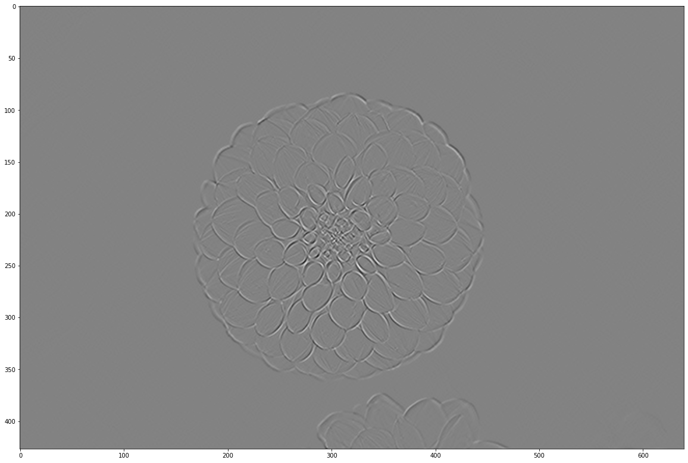
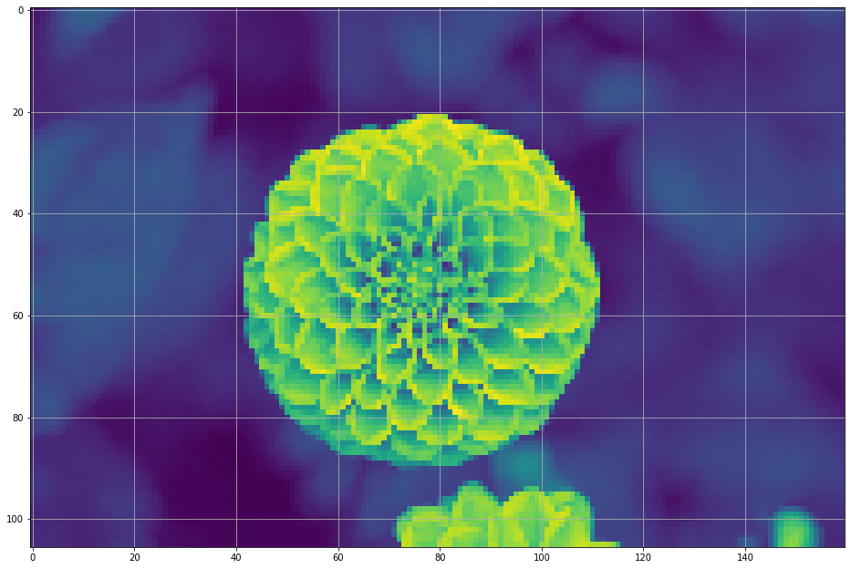
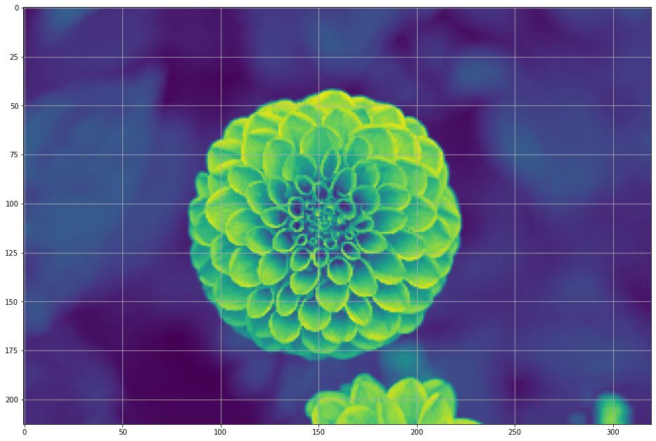
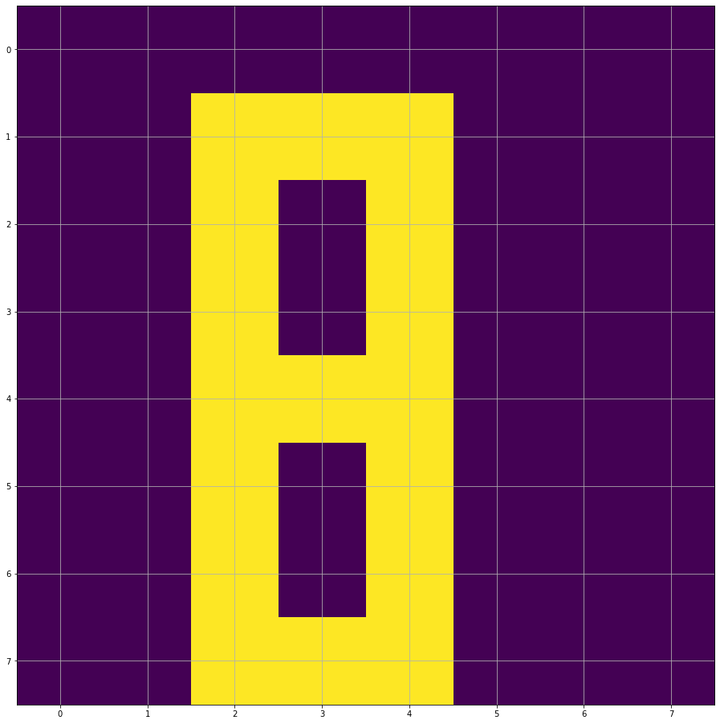
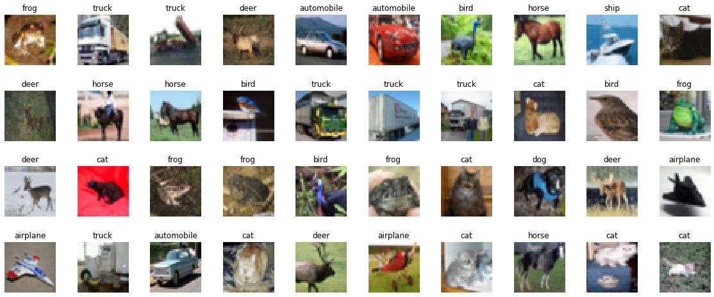
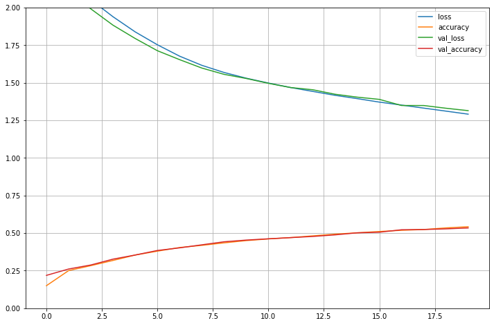
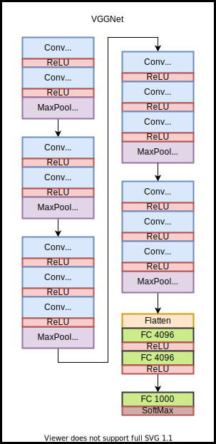
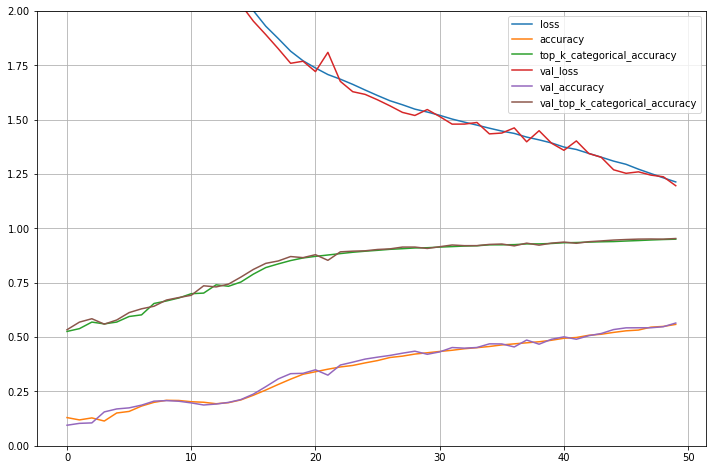

# TP Module 2 : Les réseaux de neurones convolutifs

Concentrons nous maintenant sur les réseaux spécialisés dans le traîtement d'images.


```python
import tensorflow as tf
from tensorflow import keras

print(tf.__version__)
print(keras.__version__)

# Splitting
from sklearn.model_selection import train_test_split

import matplotlib.pyplot as plt
import pandas as pd
import random
import os
import numpy as np

# freeze de l'aléatoire, pour avoir des expériences reproductibles.
RANDOM_SEED = 42

os.environ['PYTHONHASHSEED'] = str(RANDOM_SEED)
random.seed(RANDOM_SEED)
np.random.seed(RANDOM_SEED)
os.environ['TF_DETERMINISTIC_OPS'] = '1'
tf.random.set_seed(RANDOM_SEED)
```

```
!nvidia-smi
```

```python
comp = pd.DataFrame()
comp['run'] = []
comp['Perte'] = []
comp['Précision'] = []
```

## Introduction : Convolution et Pooling

La vision assistée par ordinateur (Computer Vision) n'est pas née avec le Deep Learning, c'est un domaine bien plus vieux que ça.

La différence est que précédemment, les filtres et leur poids étaient définis à la main.

Pour voir un peu ce que fait une convolution classique, observons ce que cela fait sur l'image suivante.

```python
from sklearn.datasets import load_sample_image

flower = load_sample_image('flower.jpg')/255

# L'image étant sur 3 canaux RGB, transformons la en noir et blanc.
def rgb2gray(rgb):
    return np.dot(rgb[...,:3], [0.2989, 0.5870, 0.1140])

grayscale = rgb2gray(flower).astype(np.float32)
```

```python
plt.figure(figsize = (20,18))
plt.imshow(grayscale, cmap="gray")
plt.show
grayscale.shape


(427, 640)
```


Pour les besoins de l'exemple, l'image a été convertie en niveau de gris, pour savoir pour les coefficients $[0.2989, 0.5870, 0.1140]$ sont présents dans la fonction `rgb2gray`, vous pouvez regarder la [source suivante](https://e2eml.school/convert_rgb_to_grayscale.html).

Vérifions qu'elle a bien été transformée en niveau de gris, ie il n'y plus qu'un seul canal (et donc il n'est pas affiché par `shape`.)

```python
print(flower.shape, grayscale.shape)

(427, 640, 3) (427, 640)
```

Voici quelques noyaux de convolutions utilisés avant les techniques de deep learning modernes, [source](https://fr.wikipedia.org/wiki/Noyau_(traitement_d%27image)).

```python
identity = np.array([[0, 0, 0],
                     [0, 1, 0],
                     [0, 0, 0]], dtype=np.float32)

contour1 = np.array([[1, 0, -1],
                      [0, 0, 0],
                      [-1, 0, 1]], dtype=np.float32)

contour2 = np.array([[0, 1, 0],
                     [1, -4, 1],
                     [0, 1, 0]], dtype=np.float32)

contour3 = np.array([[-1, -1, -1],
                     [-1, 8, -1],
                     [-1, -1, -1]], dtype=np.float32)

upscaling = np.array([[0, -1, 0],
                     [-1, 5, -1],
                     [0, -1, 0]], dtype=np.float32)

box_blur = np.array([[1/9, 1/9, 1/9],
                     [1/9, 1/9, 1/9],
                     [1/9, 1/9, 1/9]], dtype=np.float32)

gauss_blur = np.array([[1/16, 1/8, 1/16],
                     [1/8, 1/4, 1/8],
                     [1/16, 1/8, 1/6]], dtype=np.float32)
```

```python
def conv(img,kernel):

    ker_height, ker_width = kernel.shape
    height, width = img.shape

    tf_ker = tf.reshape(kernel, (ker_height, ker_width, 1, 1))

    tf_img = tf.reshape(img, (-1, height, width, 1))

    #print(tf_ker.dtype, tf_gray.dtype)

    outputs= tf.nn.conv2d(tf_img, tf_ker, strides=1, padding="SAME")

    plt.figure(figsize = (20,18))
    plt.imshow(outputs[0,:,:,0], cmap='gray')
    plt.show
```

??? tf "TensorFlow"

    ```python
    conv(grayscale, gauss_blur)
    ```

    

    ```python
    conv(grayscale,contour1)
    ```
    


## Anatomie d'une couche convolutive, CNN

Premièrement, importons les librairies dont nous aurons besoin.

```python
from tensorflow.keras import models
from tensorflow.keras.layers import Dense
from tensorflow.keras.layers import Flatten
from tensorflow.keras.layers import Input
from tensorflow.keras.layers import Activation
from tensorflow.keras.layers import Conv2D
from tensorflow.keras.layers import MaxPooling2D
from tensorflow.keras import optimizers
```

Avec l'API séquentielle, écrivons un CNN avec uniquement 2 couches convolutives. Evidemment il n'est pas fait pour de l'entraînement, il n'y a même pas de couche classifiante, mais utilisons le pour comprendre la structure.

```python
model = models.Sequential([
    Input(shape=(4,4,3)),
    Conv2D(8, (3,3), padding='same', name='conv1'),
    Conv2D(4, (3,3), padding='same', name='conv2')
])
```

```python
model.summary()

Model: "sequential_1"
_________________________________________________________________
Layer (type)                 Output Shape              Param #
=================================================================
conv1 (Conv2D)               (None, 4, 4, 8)           224
_________________________________________________________________
conv2 (Conv2D)               (None, 4, 4, 4)           292
=================================================================
Total params: 516
Trainable params: 516
Non-trainable params: 0
_________________________________________________________________
```

Regardons comment se comporte la première couche convolutive nommée `conv1`.

```python
layer = model.get_layer('conv1')
weights, biases = layer.get_weights()
print(f"Nombre de canaux en entrée : {weights.shape[2]},\n"
      f"Nombre de neurones dans la couche : {weights.shape},\n"
      f"Biais : {biases.shape}")

Nombre de canaux en entrée : 3,
Nombre de neurones dans la couche : (3, 3, 3, 8),
Biais : (8,)
```
### Exercice

Pouvez vous déterminer à quoi correspond chacun des nombres dans `weights.shape` ?

??? tf "TensorFlow"

    Dans une couche convolutive, les poids obtenues par `weights.shape` correspondent à

    \[
    (\text{kernel_height}, \text{kernel_width}, \text{in_channels}, \text{out_channels}).
    \]

### Exercice

* Pourquoi le nombre d'entrées de `conv1` est il égal à $3$ ?
* Quel est le nombre total de poids de `conv1` ?

??? tf "TensorFlow"

    \[
        3 \times 3 \times 3 \times 8 = 216
    \]

* Pourquoi n'y a t'il que $8$ biais ?

### Exercice

```python
layer = model.get_layer('conv2')
weights2, biases2 = layer.get_weights()
print(f"Nombre d'entrées : {weights2.shape[2]},\n"
      f"Nombre de neurones dans la couche : {weights2.shape},\n"
      f"Biais : {biases2.shape}")
```


* Pourquoi le nombre d'entrées de `conv2` est il égal à $8$ ?
* Quel est le nombre total de poids de `conv2` ?

??? tf "TensorFlow"

    \[
        3 \times 3 \times 8 \times 4 = 198
    \]

* Pourquoi n'y a t'il que $4$ biais ?

## L'opération de pooling

Comme expliquée, l'opération de pooling est là pour diminuer l'information présente dans les pixels proches, en appliquant une opération d'aggrégation.

Avec `tf.keras` les couches de pooling sont appellées via `tf.keras.layers`.


### Exercice

Dans la suite est définie une fonction permettant de voir l'effet du pooling sur notre fleur.

**Malheureusement** j'ai oublié comment on appelle les couches

  * average pooling 2D,
  * maximum pooling 2D.

Regardez la doc de l'API [tf.keras.layers](https://www.tensorflow.org/api_docs/python/tf/keras/layers) et chercher la dénomination de ces deux couches (indice, le nom est dans le menu défilent de droite)

et placez le nom nom de la couche à la place de `tf.keras.layers.FONCTION`

  * L'image que l'on placera dans la variable img sera celle définie avant grayscale.
  * `pool_size` correspond à la taille du filtre de pooling. Commencez avec 2, puis n'hésitez pas à changer voir voir ce que cela fait.


```python
def pool(img,pool_size):

    height, width = img.shape
    tf_img = tf.reshape(img, (-1, height, width, 1))

    out=tf.keras.layers.FONCTION(pool_size, padding='valid')(tf_img)
    pool = out[0,:,:,0]

    plt.figure(figsize = (16,16))
    plt.grid(True)
    plt.imshow(pool)
    plt.show

    print(f'Les dimensions avant pooling sont {img.shape} \n'
          f'Les dimensions après pooling sont {pool.shape}')
```

??? tf "TensorFlow : average pooling 2D"

    ```python
    def pool(img,pool_size):

    height, width = img.shape
    tf_img = tf.reshape(img, (-1, height, width, 1))

    out=tf.keras.layers.AvgPool2D(pool_size, padding='valid')(tf_img)
    pool = out[0,:,:,0]

    plt.figure(figsize = (16,16))
    plt.grid(True)
    plt.imshow(pool)
    plt.show

    print(f'Les dimensions avant pooling sont {img.shape} \n'
          f'Les dimensions après pooling sont {pool.shape}')
    ```

### Exercice

* Essayez avec `pool(grayscale,4)`.

??? tf "TensorFlow"

    ```python
    pool(grayscale,4)

    Les dimensions avant pooling sont (427, 640)
    Les dimensions après pooling sont (106, 160)
    ```

    

* Dans `pool`, changez la fonction d'`average pooling 2D` par un `max pool 2D`, puis voyez le résultat avec `pool(grayscale,2)`.

??? tf "TensorFlow"

    ```python
    def pool(img,pool_size):

    height, width = img.shape
    tf_img = tf.reshape(img, (-1, height, width, 1))

    out=tf.keras.layers.MaxPool2D(pool_size, padding='valid')(tf_img)
    pool = out[0,:,:,0]

    plt.figure(figsize = (16,16))
    plt.grid(True)
    plt.imshow(pool)
    plt.show

    print(f'Les dimensions avant pooling sont {img.shape} \n'
          f'Les dimensions après pooling sont {pool.shape}')
    ```

    ```python
    pool(grayscale,2)

    Les dimensions avant pooling sont (427, 640)
    Les dimensions après pooling sont (213, 320)
    ```

    


Voici un exemple "à la main".

```python
test_img2 = np.array([[0,0,0,0,0,0,0,0],
                       [0,0,1,1,1,0,0,0],
                       [0,0,1,0,1,0,0,0],
                       [0,0,1,0,1,0,0,0],
                       [0,0,1,1,1,0,0,0],
                       [0,0,1,0,1,0,0,0],
                       [0,0,1,0,1,0,0,0],
                       [0,0,1,1,1,0,0,0]], dtype=np.float32)

plt.figure(figsize = (16,16))
plt.grid(True)
plt.imshow(test_img2)
plt.show
```



```python
tf_img = tf.reshape(test_img2, (1,8, 8, 1))

out=tf.keras.layers.MaxPool2D(2)(tf_img)
pool = out[0,:,:,0]

plt.figure(figsize = (8,8))
plt.grid(True)
plt.imshow(pool)
plt.show

print(pool.shape)
```


Effectivement on perd de l'information. Mais qu'est ce qui était le plus le plus important ? le fait que ça ressemble à un 8, ou le fait que que la figure était plus haute que large ?

## Construction et entraînement d'un CNN

Pour voir la différence entre les réseaux de neurones denses vu à la séance précédente et nos CNN, nous utiliserons de nouveau le dataset CIFAR-10.

Rappelons que le dataset CIFAR-10 comprend $60000$ images couleur $32\times32$ réparties en $10$ classes, avec $6000$ images par classe. Il y a $50000$ images d'entraînement et $10000$ images de test.


```python
(X_train,y_train), (X_test,y_test)  = tf.keras.datasets.cifar10.load_data()

print(X_train.shape, y_train.shape)

Downloading data from https://www.cs.toronto.edu/~kriz/cifar-10-python.tar.gz
170500096/170498071 [==============================] - 6s 0us/step
(50000, 32, 32, 3) (50000, 1)
```

Les classes présentes dans le dataset sont les suivantes, chacunes représentées par un chiffre de $0$ à $9$. Dans l'ordre nous avons :

* airplane
* automobile
* bird
* cat
* deer
* dog
* frog
* horse
* ship
* truck

C'est aussi un dataset très connu pour faire du benchmark de modèle dans le milieu académique. Revoyons, comme dans le tp précédent, à quoi ressemble ce dataset.

```python
class_names = ['airplane', 'automobile', 'bird', 'cat', 'deer', 'dog', 'frog', 'horse', 'ship', 'truck']

n_rows = 4
n_cols = 10
plt.figure(figsize=(n_cols * 2, n_rows * 2))
for row in range(n_rows):
    for col in range(n_cols):
        index = n_cols * row + col
        plt.subplot(n_rows, n_cols, index + 1)
        plt.imshow(X_train[index, : , :, :], cmap="binary", interpolation="nearest")
        plt.axis('off')
        plt.title(class_names[y_train[:,0][index]], fontsize=12)
plt.subplots_adjust(wspace=0.2, hspace=0.5)
```



Mettons le en forme et appliquons directement un One-Hot-Encoding sur les cibles.

```python
X_train = X_train.reshape(-1, 32, 32, 3).astype('float32')
X_test = X_test.reshape(-1, 32, 32, 3).astype('float32')


X_train, X_valid, y_train, y_valid = train_test_split(X_train, y_train, random_state=RANDOM_SEED)

X_test = (X_test - 127.5) / 127.5 # Normalize the images to [-1, 1]
X_train = (X_train - 127.5) / 127.5 # Normalize the images to [-1, 1]
X_valid = (X_valid - 127.5) / 127.5 # Normalize the images to [-1, 1]

y_train_oh = tf.keras.utils.to_categorical(y_train, num_classes=10)
y_test_oh = tf.keras.utils.to_categorical(y_test, num_classes=10)
y_valid_oh = tf.keras.utils.to_categorical(y_valid, num_classes=10)

print(y_train_oh.shape)

(37500, 10)
```

```python
model = models.Sequential([
    Input(shape=(32, 32, 3)),
    Conv2D(32, (3, 3), activation='relu'),
    MaxPooling2D((2, 2)),
    Conv2D(64, (3, 3), activation='relu'),
    MaxPooling2D((2, 2)),
    Conv2D(128, (3, 3), activation='relu'),
    MaxPooling2D((2, 2)),
    Conv2D(128, (3, 3), activation='relu'),
    MaxPooling2D((2, 2)),
    Flatten(),
    Dense(10, activation='softmax')
])

model.summary()
```


Vous avez une erreur du type

`InvalidArgumentError: Negative dimension size caused by subtracting 3 from 2 ...`


```
---------------------------------------------------------------------------
InvalidArgumentError                      Traceback (most recent call last)
/usr/local/lib/python3.6/dist-packages/tensorflow/python/framework/ops.py in _create_c_op(graph, node_def, inputs, control_inputs, op_def)
   1653   try:
-> 1654     c_op = pywrap_tf_session.TF_FinishOperation(op_desc)
   1655   except errors.InvalidArgumentError as e:

InvalidArgumentError: Negative dimension size caused by subtracting 3 from 2 for '{{node conv2d_3/Conv2D}} = Conv2D[T=DT_FLOAT, data_format="NHWC", dilations=[1, 1, 1, 1], explicit_paddings=[], padding="VALID", strides=[1, 1, 1, 1], use_cudnn_on_gpu=true](max_pooling2d_2/Identity, conv2d_3/Conv2D/ReadVariableOp)' with input shapes: [?,2,2,128], [3,3,128,128].

During handling of the above exception, another exception occurred:

ValueError                                Traceback (most recent call last)
<ipython-input-13-7fe5ac773bd4> in <module>()
     10     MaxPooling2D((2, 2)),
     11     Flatten(),
---> 12     Dense(10, activation='softmax')
     13 ])
     14

/usr/local/lib/python3.6/dist-packages/tensorflow/python/training/tracking/base.py in _method_wrapper(self, *args, **kwargs)
    454     self._self_setattr_tracking = False  # pylint: disable=protected-access
    455     try:
--> 456       result = method(self, *args, **kwargs)
    457     finally:
    458       self._self_setattr_tracking = previous_value  # pylint: disable=protected-access

/usr/local/lib/python3.6/dist-packages/tensorflow/python/keras/engine/sequential.py in __init__(self, layers, name)
    127       tf_utils.assert_no_legacy_layers(layers)
    128       for layer in layers:
--> 129         self.add(layer)
    130
    131   @property

/usr/local/lib/python3.6/dist-packages/tensorflow/python/training/tracking/base.py in _method_wrapper(self, *args, **kwargs)
    454     self._self_setattr_tracking = False  # pylint: disable=protected-access
    455     try:
--> 456       result = method(self, *args, **kwargs)
    457     finally:
    458       self._self_setattr_tracking = previous_value  # pylint: disable=protected-access

/usr/local/lib/python3.6/dist-packages/tensorflow/python/keras/engine/sequential.py in add(self, layer)
    211       # If the model is being built continuously on top of an input layer:
    212       # refresh its output.
--> 213       output_tensor = layer(self.outputs[0])
    214       if len(nest.flatten(output_tensor)) != 1:
    215         raise ValueError(SINGLE_LAYER_OUTPUT_ERROR_MSG)

/usr/local/lib/python3.6/dist-packages/tensorflow/python/keras/engine/base_layer.py in __call__(self, *args, **kwargs)
    920                     not base_layer_utils.is_in_eager_or_tf_function()):
    921                   with auto_control_deps.AutomaticControlDependencies() as acd:
--> 922                     outputs = call_fn(cast_inputs, *args, **kwargs)
    923                     # Wrap Tensors in `outputs` in `tf.identity` to avoid
    924                     # circular dependencies.

/usr/local/lib/python3.6/dist-packages/tensorflow/python/keras/layers/convolutional.py in call(self, inputs)
    205       inputs = array_ops.pad(inputs, self._compute_causal_padding())
    206
--> 207     outputs = self._convolution_op(inputs, self.kernel)
    208
    209     if self.use_bias:

/usr/local/lib/python3.6/dist-packages/tensorflow/python/ops/nn_ops.py in __call__(self, inp, filter)
   1104           call_from_convolution=False)
   1105     else:
-> 1106       return self.conv_op(inp, filter)
   1107
   1108

/usr/local/lib/python3.6/dist-packages/tensorflow/python/ops/nn_ops.py in __call__(self, inp, filter)
    636
    637   def __call__(self, inp, filter):  # pylint: disable=redefined-builtin
--> 638     return self.call(inp, filter)
    639
    640

/usr/local/lib/python3.6/dist-packages/tensorflow/python/ops/nn_ops.py in __call__(self, inp, filter)
    235         padding=self.padding,
    236         data_format=self.data_format,
--> 237         name=self.name)
    238
    239

/usr/local/lib/python3.6/dist-packages/tensorflow/python/ops/nn_ops.py in conv2d(input, filter, strides, padding, use_cudnn_on_gpu, data_format, dilations, name, filters)
   2012                            data_format=data_format,
   2013                            dilations=dilations,
-> 2014                            name=name)
   2015
   2016

/usr/local/lib/python3.6/dist-packages/tensorflow/python/ops/gen_nn_ops.py in conv2d(input, filter, strides, padding, use_cudnn_on_gpu, explicit_paddings, data_format, dilations, name)
    967                   padding=padding, use_cudnn_on_gpu=use_cudnn_on_gpu,
    968                   explicit_paddings=explicit_paddings,
--> 969                   data_format=data_format, dilations=dilations, name=name)
    970   _result = _outputs[:]
    971   if _execute.must_record_gradient():

/usr/local/lib/python3.6/dist-packages/tensorflow/python/framework/op_def_library.py in _apply_op_helper(op_type_name, name, **keywords)
    742       op = g._create_op_internal(op_type_name, inputs, dtypes=None,
    743                                  name=scope, input_types=input_types,
--> 744                                  attrs=attr_protos, op_def=op_def)
    745
    746     # `outputs` is returned as a separate return value so that the output

/usr/local/lib/python3.6/dist-packages/tensorflow/python/framework/func_graph.py in _create_op_internal(self, op_type, inputs, dtypes, input_types, name, attrs, op_def, compute_device)
    593     return super(FuncGraph, self)._create_op_internal(  # pylint: disable=protected-access
    594         op_type, inputs, dtypes, input_types, name, attrs, op_def,
--> 595         compute_device)
    596
    597   def capture(self, tensor, name=None, shape=None):

/usr/local/lib/python3.6/dist-packages/tensorflow/python/framework/ops.py in _create_op_internal(self, op_type, inputs, dtypes, input_types, name, attrs, op_def, compute_device)
   3325           input_types=input_types,
   3326           original_op=self._default_original_op,
-> 3327           op_def=op_def)
   3328       self._create_op_helper(ret, compute_device=compute_device)
   3329     return ret

/usr/local/lib/python3.6/dist-packages/tensorflow/python/framework/ops.py in __init__(self, node_def, g, inputs, output_types, control_inputs, input_types, original_op, op_def)
   1815         op_def = self._graph._get_op_def(node_def.op)
   1816       self._c_op = _create_c_op(self._graph, node_def, inputs,
-> 1817                                 control_input_ops, op_def)
   1818       name = compat.as_str(node_def.name)
   1819     # pylint: enable=protected-access

/usr/local/lib/python3.6/dist-packages/tensorflow/python/framework/ops.py in _create_c_op(graph, node_def, inputs, control_inputs, op_def)
   1655   except errors.InvalidArgumentError as e:
   1656     # Convert to ValueError for backwards compatibility.
-> 1657     raise ValueError(str(e))
   1658
   1659   return c_op

ValueError: Negative dimension size caused by subtracting 3 from 2 for '{{node conv2d_3/Conv2D}} = Conv2D[T=DT_FLOAT, data_format="NHWC", dilations=[1, 1, 1, 1], explicit_paddings=[], padding="VALID", strides=[1, 1, 1, 1], use_cudnn_on_gpu=true](max_pooling2d_2/Identity, conv2d_3/Conv2D/ReadVariableOp)' with input shapes: [?,2,2,128], [3,3,128,128].
```


C'est normal, Rappelez vous que par défaut, l'opération de convolution, fait baisser la dimension des features maps. Plus on empile de couches convolutives, plus la dimension baisse, jusqu'à un point où la taille des features maps est tellement petite qu'il n'est plus possible d'appliquer une opération de convolution.

Pour contrer cela, on doit rajouter le paramètre `padding='same'` dans les couches de convolution.

```python
model = models.Sequential([
    Input(shape=(32, 32, 3)),
    Conv2D(32, (3, 3), padding='same'),
    Activation('relu'),
    MaxPooling2D((2, 2)),
    Conv2D(64, (3, 3), padding='same'),
    Activation('relu'),
    MaxPooling2D((2, 2)),
    Conv2D(128, (3, 3), padding='same'),
    Activation('relu'),
    MaxPooling2D((2, 2)),
    Conv2D(128, (3, 3), padding='same'),
    Activation('relu'),
    MaxPooling2D((2, 2)),
    Flatten(),
    Dense(10, activation='softmax')
])

model.summary()

model.compile(loss = 'categorical_crossentropy',
              optimizer=tf.keras.optimizers.SGD(lr=0.001),
              metrics=['accuracy'])
```

Si l'on souhaite, il est évidemment possible de faire passer le modèle dans une fonction.

```python
def define_model(lr=0.001, num_classes=10):

  model = models.Sequential([
    Input(shape=(32, 32, 3)),
    Conv2D(32, (3, 3), padding='same'),
    Activation('relu'),
    MaxPooling2D((2, 2)),
    Conv2D(64, (3, 3), padding='same'),
    Activation('relu'),
    MaxPooling2D((2, 2)),
    Conv2D(128, (3, 3), padding='same'),
    Activation('relu'),
    MaxPooling2D((2, 2)),
    Conv2D(128, (3, 3), padding='same'),
    Activation('relu'),
    MaxPooling2D((2, 2)),
    Flatten(),
    Dense(num_classes, activation='softmax')
    ])

  model.summary()

  model.compile(loss = 'categorical_crossentropy',
                optimizer=tf.keras.optimizers.SGD(lr=lr),
                metrics=['accuracy'])

  return model

model = define_model()
```

```python
history = model.fit(X_train, y_train_oh,
                    epochs = 20,
                    batch_size=32,
                    validation_data=(X_valid, y_valid_oh))
```

```python
import pandas as pd
import matplotlib.pyplot as plt

pd.DataFrame(history.history).plot(figsize=(12,8))
plt.grid(True)
plt.gca().set_ylim(0,2)
plt.show()
```

Vous devriez avoir un graphe similaire.



Vérifiez les métriques obtenues avec les commandes suivantes.

```python
loss, accuracy = model.evaluate(X_test,
                                y_test_oh)

comp = comp.append({'run': 'basic_CNN', 'Perte' : loss, 'Précision' : accuracy}, ignore_index=True)
print(comp)
```


Certes, la précision n'est pas terrible, mais ce que l'on a écrit comme modèle ici n'est pas terrible non plus.

Cependant, on peut remarquer une chose.

Avec un modèle composé uniquement de neurones denses, on était en sur-apprentissage dès l'époque 3 ou 4. Sauf qu'ici :

* La fonction de perte, que ce soit sur le dataset d'entraînement, comme sur le dataset de validation, se suivent et ne décrochent pas.
* Idem pour la précision.

Ce qui nous conforte dans notre idée que les CNNs sont fait pour du traitement d'images, et on a même pas encore rajouté la couche classifiante !

Pardon ? La couche classifiante n'est pas celle avec le softmax ?

Il faut comprendre 2 choses :

* Les couches convolutives sont très bonnes pour **extraires des caractéristiques geométriques des images**,
* Les couches denses sont là pour faire **les combinaisons linéaires des vecteurs qui semblent les plus appropriées**.

Ainsi, un CNN peut se décomposer en deux parties :

* La partie **d'extraction des caractéristiques** avec les couches convolutives et de pooling.
* La partie **classifiante** avec les neurones denses.

Mais pour pouvoir passer de l'une à l'autre, il faut êêtre capable d'aplanir des matrices, c'est le fameux `Flatten()`.

Dans la pratique on ne met pas non plus autant de d'opération de pooling entre les couches convolutives.


### Exercice

En vous aidant du modèle précedent, construisez le modèle séquentiel avec l'architecture suivante.

```python
Input(shape=(32, 32, 3)),
Conv2D(32, (3, 3)),
Conv2D(64, (3, 3)),
MaxPooling2D((2, 2)),
Conv2D(128, (3, 3)),
Conv2D(128, (3, 3)),
MaxPooling2D((2, 2)),
Conv2D(256, (3, 3)),
Conv2D(256, (3, 3)),
MaxPooling2D((2, 2)),
Flatten(),
Dense(256),
Dense(128),
Dense(10, activation='softmax')
```

La fonction d'activation pour passer d'une couche à l'autre sera la fonction `relu`. Pour les couches convolutives on fixera `padding=same`.

Entraînez ce modèle, les paramètres de `model.compile` et `model.fit` seront les mêmes que précédemment.


??? tf "TensorFlow"

    ```python
    model2 = models.Sequential([
        Input(shape=(32, 32, 3)),
        Conv2D(32, (3, 3), activation='relu', padding='same'),
        Conv2D(64, (3, 3), activation='relu', padding='same'),
        MaxPooling2D((2, 2)),
        Conv2D(128, (3, 3), activation='relu', padding='same'),
        Conv2D(128, (3, 3), activation='relu', padding='same'),
        MaxPooling2D((2, 2)),
        Conv2D(256, (3, 3), activation='relu', padding='same'),
        Conv2D(256, (3, 3), activation='relu', padding='same'),
        MaxPooling2D((2, 2)),
        Flatten(),
        Dense(256),
        Activation('relu'),
        Dense(128),
        Activation('relu'),
        Dense(10, activation='softmax')
    ])

    model2.summary()
    ```

    ```
    Model: "sequential_2"
    _________________________________________________________________
    Layer (type)                 Output Shape              Param #
    =================================================================
    conv2d_8 (Conv2D)            (None, 32, 32, 32)        896
    _________________________________________________________________
    conv2d_9 (Conv2D)            (None, 32, 32, 64)        18496
    _________________________________________________________________
    max_pooling2d_8 (MaxPooling2 (None, 16, 16, 64)        0
    _________________________________________________________________
    conv2d_10 (Conv2D)           (None, 16, 16, 128)       73856
    _________________________________________________________________
    conv2d_11 (Conv2D)           (None, 16, 16, 128)       147584
    _________________________________________________________________
    max_pooling2d_9 (MaxPooling2 (None, 8, 8, 128)         0
    _________________________________________________________________
    conv2d_12 (Conv2D)           (None, 8, 8, 256)         295168
    _________________________________________________________________
    conv2d_13 (Conv2D)           (None, 8, 8, 256)         590080
    _________________________________________________________________
    max_pooling2d_10 (MaxPooling (None, 4, 4, 256)         0
    _________________________________________________________________
    flatten_2 (Flatten)          (None, 4096)              0
    _________________________________________________________________
    dense_2 (Dense)              (None, 256)               1048832
    _________________________________________________________________
    activation_4 (Activation)    (None, 256)               0
    _________________________________________________________________
    dense_3 (Dense)              (None, 128)               32896
    _________________________________________________________________
    activation_5 (Activation)    (None, 128)               0
    _________________________________________________________________
    dense_4 (Dense)              (None, 10)                1290
    =================================================================
    Total params: 2,209,098
    Trainable params: 2,209,098
    Non-trainable params: 0
    _________________________________________________________________
    ```

    ```python
    model2.compile(loss = 'categorical_crossentropy',
             optimizer=tf.keras.optimizers.SGD(lr=0.001),
             metrics=['accuracy'])

    history = model2.fit(X_train, y_train_oh,
                        epochs = 20,
                        batch_size=32,
                        validation_data=(X_valid, y_valid_oh))

    ```

Après l'entraînement, vous pouvez comme d'habitude voir comment il s'en sort avec les commandes suivantes.


```python
pd.DataFrame(history.history).plot(figsize=(12,8))
plt.grid(True)
plt.gca().set_ylim(0,2)
plt.show()
```

```python
loss, accuracy = model2.evaluate(X_test,
                                y_test_oh)

comp = comp.append({'run': 'basic_CNN_2', 'Perte' : loss, 'Précision' : accuracy}, ignore_index=True)
comp
```


Il est temps de nous attaquer à un modèle plus intéressant : **VGG16**.

## VGG16

VGG16 est un réseau de neurones [publié en 2015](https://arxiv.org/pdf/1409.1556.pdf) (du point de vue du deep learning, c'est vieux) par le groupe de recherche **Visual Geometry Group** de l'université d'Oxford.

A l'époque, ce réseau était au niveau de l'état de l'art, aujourd'hui des modèles plus rapides à entraîner et plus précis ont pris sa place, mais pour l'instant **ils sont plus compliqué à coder**, ce qui fait qu'il peut toujours faire office de couteau suisse et qu'il est encore parfois utilisé de nos jours.


!!! info "Architecture"

    


    Dans l'article nous pouvons lire les choses suivantes :

    * “All hidden layers are equipped with the rectification (ReLU (Krizhevsky et al., 2012)) non-linearity.”

    * “Max-pooling is performed over a 2 × 2 pixel window, with stride 2.”

    Donc **la seule fonction d'activation, hormis celle pour classifier, est ReLU**, de plus l'opération de pooling est le `MaxPooling2D((2,2))`, **le stride est de 2**.

    **Remarque** : Si le stride est le même que la fenêtre de pooling, on a pas à le spécifier.

    Concernant l'architecture complète du modèle, on la revoie ici, ie

    * Le réseau consiste en 5 blocs convolutifs et 3 couches denses.

    * Chaque bloc convolutif est constitué de 2 ou plus couches convolutives et d'une couche de max pooling.

### Exercice

Ecrivez chacun des blocs de VGG16, **via l'API fonctionnelle**. Pour toutes les couches convolutives, le padding est `padding='same'`.

Attention à ne pas oublier les fonctions d'activations !

Regroupez tout cela pour construire le modèle.

N'oubliez pas que pour l'API fonctionnelle, on aura besoin des ces lignes de codes suivantes :


```python
from tensorflow.keras import Model
```

```python
model = Model(inputs=input, outputs=output)
```

```python
input = Input(shape=(32, 32, 3))
```

Et n'oubliez pas le `Flatten()`.


#### 1er Bloc

* $\mathrm{Conv2D}(64, (3,3))$
* $\mathrm{Conv2D}(64, (3,3))$
* $\mathrm{MaxPool2D}$

??? tf "TensorFlow"

    ```python
    x = Conv2D(filters=64, kernel_size=3, padding='same', activation='relu')(input)
    x = Conv2D(filters=64, kernel_size=3, padding='same', activation='relu')(x)
    x = MaxPool2D(pool_size=2, strides=2, padding='same')(x)
    ```

#### 2e Bloc

* $\mathrm{Conv2D}(128, (3,3))$
* $\mathrm{Conv2D}(128, (3,3))$
* $\mathrm{MaxPool2D}$

??? tf "TensorFlow"

    ```python
    x = Conv2D(filters=128, kernel_size=3, padding='same', activation='relu')(x)
    x = Conv2D(filters=128, kernel_size=3, padding='same', activation='relu')(x)
    x = MaxPool2D(pool_size=2, strides=2, padding='same')(x)
    ```

#### 3e Bloc

* $\mathrm{Conv2D}(256, (3,3))$
* $\mathrm{Conv2D}(256, (3,3))$
* $\mathrm{Conv2D}(256, (3,3))$
* $\mathrm{MaxPool2D}$

??? tf "TensorFlow"

    ```python
    x = Conv2D(filters=256, kernel_size=3, padding='same', activation='relu')(x)
    x = Conv2D(filters=256, kernel_size=3, padding='same', activation='relu')(x)
    x = Conv2D(filters=256, kernel_size=3, padding='same', activation='relu')(x)
    x = MaxPool2D(pool_size=2, strides=2, padding='same')(x)
    ```

#### 4e Bloc

* $\mathrm{Conv2D}(512, (3,3))$
* $\mathrm{Conv2D}(512, (3,3))$
* $\mathrm{Conv2D}(512, (3,3))$
* $\mathrm{MaxPool2D}$

??? tf "TensorFlow"

    ```python
    x = Conv2D(filters=512, kernel_size=3, padding='same', activation='relu')(x)
    x = Conv2D(filters=512, kernel_size=3, padding='same', activation='relu')(x)
    x = Conv2D(filters=512, kernel_size=3, padding='same', activation='relu')(x)
    x = MaxPool2D(pool_size=2, strides=2, padding='same')(x)
    ```

#### 5e Bloc

* $\mathrm{Conv2D}(512, (3,3))$
* $\mathrm{Conv2D}(512, (3,3))$
* $\mathrm{Conv2D}(512, (3,3))$
* $\mathrm{MaxPool2D}$

??? tf "TensorFlow"

    ```python
    x = Conv2D(filters=512, kernel_size=3, padding='same', activation='relu')(x)
    x = Conv2D(filters=512, kernel_size=3, padding='same', activation='relu')(x)
    x = Conv2D(filters=512, kernel_size=3, padding='same', activation='relu')(x)
    x = MaxPool2D(pool_size=2, strides=2, padding='same')(x)
    ```

#### Couche dense

* $\mathrm{Dense}(256)$
* $\mathrm{Dense}(256)$
* $\mathrm{Dense}(10)$
* $\mathrm{Softmax}$

??? tf "TensorFlow"

    ```python
    x = Flatten()(x)
    x = Dense(units=256, activation='relu')(x)
    x = Dense(units=128 activation='relu')(x)
    output = Dense(units=10, activation='softmax')(x)
    ```

??? tf "Modèle complet"

    ```python
    input = Input(shape=(32, 32, 3))

    x = Conv2D(filters=64, kernel_size=3, padding='same', activation='relu')(input)
    x = Conv2D(filters=64, kernel_size=3, padding='same', activation='relu')(x)
    x = MaxPooling2D(pool_size=2, strides=2, padding='same')(x)

    x = Conv2D(filters=128, kernel_size=3, padding='same', activation='relu')(x)
    x = Conv2D(filters=128, kernel_size=3, padding='same', activation='relu')(x)
    x = MaxPooling2D(pool_size=2, strides=2, padding='same')(x)

    x = Conv2D(filters=256, kernel_size=3, padding='same', activation='relu')(x)
    x = Conv2D(filters=256, kernel_size=3, padding='same', activation='relu')(x)
    x = Conv2D(filters=256, kernel_size=3, padding='same', activation='relu')(x)
    x = MaxPooling2D(pool_size=2, strides=2, padding='same')(x)

    x = Conv2D(filters=512, kernel_size=3, padding='same', activation='relu')(x)
    x = Conv2D(filters=512, kernel_size=3, padding='same', activation='relu')(x)
    x = Conv2D(filters=512, kernel_size=3, padding='same', activation='relu')(x)
    x = MaxPooling2D(pool_size=2, strides=2, padding='same')(x)

    x = Conv2D(filters=512, kernel_size=3, padding='same', activation='relu')(x)
    x = Conv2D(filters=512, kernel_size=3, padding='same', activation='relu')(x)
    x = Conv2D(filters=512, kernel_size=3, padding='same', activation='relu')(x)
    x = MaxPooling2D(pool_size=2, strides=2, padding='same')(x)

    x = Flatten()(x)
    x = Dense(units=256, activation='relu')(x)
    x = Dense(units=128, activation='relu')(x)
    output = Dense(units=10, activation='softmax')(x)

    vgg = tf.keras.Model(inputs=input, outputs=output)

    vgg.summary()
    ```

!!! info "Remarque"

    Dans le cas où certains blocs se répètent, ce qui est courant dans les architecture modernes, il est pratique des définir les blocs via des fonctions.

!!! python "Définition des fonctions de blocs"

    ```python
    from tensorflow.keras.layers import ReLU

    def conv2_relu_max(x, filters, kernel_size):
        x = Conv2D(filters=filters,
                kernel_size=kernel_size,
                padding='same')(x)
        x = ReLU()(x)
        x = Conv2D(filters=filters,
                kernel_size=kernel_size,
                padding='same')(x)
        x = ReLU()(x)
        x = MaxPooling2D(pool_size=2, strides=2, padding='same')(x)
        return x

    def conv3_relu_max(x, filters, kernel_size):
        x = Conv2D(filters=filters,
                kernel_size=kernel_size,
                padding='same')(x)
        x = ReLU()(x)
        x = Conv2D(filters=filters,
                kernel_size=kernel_size,
                padding='same')(x)
        x = ReLU()(x)
        x = Conv2D(filters=filters,
                kernel_size=kernel_size,
                padding='same')(x)
        x = ReLU()(x)
        x = MaxPooling2D(pool_size=2, strides=2, padding='same')(x)
        return x
    ```

VGG16 se réécrit alors sous la forme plus concise suivante.

```python
input = Input(shape=(32, 32, 3))

x = conv2_relu_max(input, 64, 3)
x = conv2_relu_max(x, 128, 3)
x = conv3_relu_max(x, 256, 3)
x = conv3_relu_max(x, 512, 3)
x = conv3_relu_max(x, 512, 3)
x = Flatten()(x)
x = Dense(units=256, activation='relu')(x)
x = Dense(units=128, activation='relu')(x)
output = Dense(units=10, activation='softmax')(x)

vgg_short = tf.keras.Model(inputs=input, outputs=output)

vgg_short.summary()
```

```python
top5 = tf.keras.metrics.TopKCategoricalAccuracy()

vgg.compile(loss = 'categorical_crossentropy',
            optimizer=tf.keras.optimizers.SGD(lr=0.001),
            metrics=['accuracy',top5]
            )

history = vgg.fit(X_train, y_train_oh,
                  epochs = 20,
                  batch_size=32,
                  validation_data=(X_valid, y_valid_oh))

pd.DataFrame(history.history).plot(figsize=(12,8))
plt.grid(True)
plt.gca().set_ylim(0,2)
plt.show()
```



L'architecture est certes plus complexe, mais on a une baisse constante de la perte, et la precision sur le dataset de validation suit de près cette du dataset d'entraînement.

Cependant, de par sa compléxité nous sommes à peine à $20\%$ de précision après $20$ époques (en moyenne, je suis à $54\%$ pour une $50$-aines d'époques), ce qui veut dire que l'on aura besoin de l'entraîner plus longtemps. Mais il n'est surtout pas en sur-apprentissage !

```python
loss, accuracy, top5 = vgg.evaluate(X_test,
                                y_test_oh)

print(f'Perte : {loss:.3f}, Précision : {accuracy:.3f}')

comp = comp.append({'run': 'vgg_scratch', 'Perte' : loss, 'Précision' : accuracy}, ignore_index=True)
comp.head()
```


On sait coder VGG16, c'est vraiment cool. Mais notre modèle n'est pas optimisé, des gens avec beaucoup plus d'argent, des puissances de calculs et des plus gros dataset l'ont déjà optimisé.

C'est le principe de transfer learning, pour des tâches similaires, ici de la classification, autant réutilisé les poids déjà entraînés pour, heureusement, Tensorflow nous le permet via le transfert d'apprentissage.


## Transfer Learning

Voyons maintenant comment l'on peut booster la précision en utilisant des modèles déjà entraînés par d'autres.

### A la main

Dans un premier temps, pour voir un peu comment cela marche nous allons le faire nous même.

Avec le dataset Fashion MNIST, nous allons entraîner notre modèle à ne classifier que $8$ classes sur les $10$ présentes, puis nous réutiliserons les couches déjà entraînées afin de faire la base d'un nouveau modèle pour classifier les deux dernières. On espère que certaines caractéristiques apprises sur les $8$ premières classes pourront nous être utiles pour le reste.


```python
# Téléchargeons fashion_mnist et regardons à quoi il ressemble.
(X_train,y_train), (X_test,y_test)  = tf.keras.datasets.fashion_mnist.load_data()

print(X_train.shape, y_train.shape)

class_names = ["T-shirt/top", "Trouser", "Pullover", "Dress", "Coat",
               "Sandal", "Shirt", "Sneaker", "Bag", "Ankle boot"]

n_rows = 4
n_cols = 10
plt.figure(figsize=(n_cols * 2, n_rows * 2))
for row in range(n_rows):
    for col in range(n_cols):
        index = n_cols * row + col
        plt.subplot(n_rows, n_cols, index + 1)
        plt.imshow(X_train[index, : , :, ], cmap="binary", interpolation="nearest")
        plt.axis('off')
        plt.title(class_names[y_train[index]], fontsize=12)
plt.subplots_adjust(wspace=0.2, hspace=0.5)
```


```python
X_train = X_train.reshape(-1, 28, 28, 1).astype('float32')
X_test = X_test.reshape(-1, 28, 28, 1).astype('float32')


X_train, X_valid, y_train, y_valid = train_test_split(X_train, y_train, random_state=RANDOM_SEED)

X_test = X_test/255
X_train = X_train/255
X_valid = X_valid/255
```

Définissons la fonction suivante pour séparer notre dataset en 2 tâches distinctes.

```python
def split_dataset(X, y):
    y_8_or_9 = (y == 8) | (y == 9) # "Bag", "Ankle boot"
    y_A = y[~y_8_or_9]

    y_B = (y[y_8_or_9] == 9).astype(np.float32) # binary classification : est ce c'est une Ankle boot (classe 9)? (sinon on a le masque True, False)
    return ((X[~y_8_or_9], y_A),
            (X[y_8_or_9], y_B))

(X_train_A, y_train_A), (X_train_B, y_train_B) = split_dataset(X_train, y_train)
(X_valid_A, y_valid_A), (X_valid_B, y_valid_B) = split_dataset(X_valid, y_valid)
(X_test_A, y_test_A), (X_test_B, y_test_B) = split_dataset(X_test, y_test)

#Pour l'exemple, on prend beaucoup moins de données pour la classification binaire.
X_train_B = X_train_B[:200]
y_train_B = y_train_B[:200]
```


```python
print(f'X_train_A.shape : {X_train_A.shape} \n'
      f'X_train_B.shape : {X_train_B.shape}')

X_train_A.shape : (35996, 28, 28, 1)
X_train_B.shape : (200, 28, 28, 1)
```

```python
set(y_train_A)

{0, 1, 2, 3, 4, 5, 6, 7}
```

```python
set(y_train_B)

{0.0, 1.0}
```

Reprenons le CNN classique du début, on l'utilise pour la classification du gros dataset.

```python
modelA = models.Sequential([
    Input(shape=(28, 28, 1)),
    Conv2D(32, (3, 3), activation='relu', padding='same'),
    Conv2D(64, (3, 3), activation='relu', padding='same'),
    MaxPooling2D((2, 2)),
    Conv2D(128, (3, 3), activation='relu', padding='same'),
    Conv2D(128, (3, 3), activation='relu', padding='same'),
    MaxPooling2D((2, 2)),
    Flatten(),
    Dense(256),
    Activation('relu'),
    Dense(128),
    Activation('relu'),
    Dense(8, activation='softmax')
])
```

```python
modelA.compile(loss="sparse_categorical_crossentropy",
                optimizer=keras.optimizers.SGD(lr=0.001),
                metrics=["accuracy"])

history = modelA.fit(X_train_A, y_train_A,
                      epochs=20,
                      validation_data=(X_valid_A, y_valid_A))
```

Une fois ce premier entraînement fait. On peut sauvegarder le modèle (**l'architecture et les poids**) de la manière suivante.

```python
modelA.save("modelA.h5")
```

Reprenons le même modèle, mais utilsons le maintenant pour une tâche de classification binaire.

```python
modelB = models.Sequential([
    Input(shape=(28, 28, 1)),
    Conv2D(32, (3, 3), activation='relu', padding='same'),
    Conv2D(64, (3, 3), activation='relu', padding='same'),
    MaxPooling2D((2, 2)),
    Conv2D(128, (3, 3), activation='relu', padding='same'),
    Conv2D(128, (3, 3), activation='relu', padding='same'),
    MaxPooling2D((2, 2)),
    Flatten(),
    Dense(256),
    Activation('relu'),
    Dense(128),
    Activation('relu'),
    Dense(1, activation='sigmoid')
])

modelB.compile(loss="binary_crossentropy",
                optimizer=keras.optimizers.SGD(lr=1e-3),
                metrics=["accuracy"])

history = modelB.fit(X_train_B, y_train_B,
                     epochs=20,
                     validation_data=(X_valid_B, y_valid_B))
```

Passons à l'étape de transfer learning. On recharge d'abord le modèle à 8 classes

```python
modelA = keras.models.load_model("modelA.h5")
```

On prend toute l'architecture et tous les poids, SAUF la dernière couche de classification

```python
model_B_on_A = keras.models.Sequential(modelA.layers[:-1])
```

On ajoute la couche de classification spécifique.

```python
model_B_on_A.add(keras.layers.Dense(1, activation="sigmoid"))
```

L'idée est que des poids qui ont été entraîné pour un tâche spécifique, devrait être performant pour une tâche similaire, **même** si les deux datasets sont totalements disjoints.

*Des couches entraînées à classifier des vêtements devraient être performants pour en classifier d'autres.*

On à généralement 2 étapes.

  * On gèle les poids que l'on va utiliser pour le transfert d'apprentissage, seuls les poids de la couche classifiante formées des neurones denses se mettra à jour lors de l'étape de rétropropagation.

    ```python
    for layer in model_B_on_A.layers[:-1]:
        layer.trainable = False
    ```


  * On dégèle tout ou partie des poids, pour les spécialiser encore plus pour notre problème.

    ```python
    for layer in model_B_on_A.layers[:-1]:
    layer.trainable = True
    ```

Mettons ça en place.

```python
for layer in model_B_on_A.layers[:-1]:
  layer.trainable = False

model_B_on_A.compile(loss="binary_crossentropy",
                     optimizer=keras.optimizers.SGD(lr=0.001),
                     metrics=["accuracy"])

# On entraîne avec les poids gelés pour 4 époques.
history = model_B_on_A.fit(X_train_B,
                           y_train_B,
                           epochs=4,
                           validation_data=(X_valid_B, y_valid_B))

# on dégèle tout pour 16 époques.
for layer in model_B_on_A.layers[:-1]:
  layer.trainable = True

model_B_on_A.compile(loss="binary_crossentropy",
                     optimizer=keras.optimizers.SGD(lr=0.001),
                     metrics=["accuracy"])

history = model_B_on_A.fit(X_train_B, y_train_B,
                           epochs=16,
                           validation_data=(X_valid_B, y_valid_B))
```

Voyons ce que cela donne au niveau du taux d'erreur.

```python
_, accB = modelB.evaluate(X_test_B, y_test_B)
_, accB_on_A = model_B_on_A.evaluate(X_test_B, y_test_B)
np.round((100 - (accB*100)) / (100 - (accB_on_A*100)),2)
```

Avec un tel transfert d'apprentissage, le taux d'erreur devrait diminuer d'un facteur important !

### Importation des poids de ImageNet

Imagenet et **LE** dataset de référence pour le benchmark de modèle est l'entraînement des modèles. Comme il contient **plusieurs millions d'images**, l'entraînement est long et coûteux, heureusement les géant de l'Internet comme Google l'ont déjà fait, ce qui veut dire que les poids de ce modèle sont **spécialisés pour la classification**.

Importer des bouts de modèles pré-entraînés se fait via la commande

```python
from tensorflow.keras.applications import VGG16

conv_base = VGG16(weights='imagenet', include_top=False, input_shape=(32, 32, 3))
```

`include_top=False` correspond au fait que nous n'utiliserons que la partie convolutive du modèle, c'est à nous d'ajouter la partie classifiante avec les neurones denses et la couches de sortie.

Dans une première approche, on peut figer ces poids (la SGD ne les mettra pas à jour).

```python
from tensorflow.keras.applications import VGG16

conv_base = VGG16(weights='imagenet', include_top=False, input_shape=(32, 32, 3))

conv_base.trainable = False
for layer in conv_base.layers:
    print(f'{layer.name}, Trainable : {layer.trainable}')
```

Une fois que l'on a fait ça, on peut utiliser cette partie convolutive comme une couche à part entière de notre modèle. Réimportons tout d'abord le dataset cifar10 complet.

```python
(X_train,y_train), (X_test,y_test)  = tf.keras.datasets.cifar10.load_data()

X_train = X_train.reshape(-1, 32, 32, 3).astype('float32')
X_test = X_test.reshape(-1, 32, 32, 3).astype('float32')


X_train, X_valid, y_train, y_valid = train_test_split(X_train, y_train, random_state=RANDOM_SEED)

X_test = (X_test - 127.5) / 127.5 # Normalize the images to [-1, 1]
X_train = (X_train - 127.5) / 127.5 # Normalize the images to [-1, 1]
X_valid = (X_valid - 127.5) / 127.5 # Normalize the images to [-1, 1]

# Il existe une autre fonction de tf.keras pour transformer de l'ordinal en one_hot

y_train_oh = tf.keras.utils.to_categorical(y_train, num_classes=10)
y_test_oh = tf.keras.utils.to_categorical(y_test, num_classes=10)
y_valid_oh = tf.keras.utils.to_categorical(y_valid, num_classes=10)
```

```python
vgg_tf = models.Sequential([
    conv_base,
    Flatten(),
    Dense(256, activation='relu'),
    Dense(128,activation='relu'),
    Dense(10, activation='softmax')
])

# vgg_tf.summary()

vgg_tf.compile(loss = 'categorical_crossentropy',
              optimizer= tf.keras.optimizers.SGD(lr=0.001),
              metrics=['accuracy'])

history = vgg_tf.fit(X_train, y_train_oh,
                   epochs = 20,
                   batch_size=32,
                   validation_data=(X_valid, y_valid_oh))
```

```python
pd.DataFrame(history.history).plot(figsize=(12,8))
plt.grid(True)
plt.gca().set_ylim(0,2)
plt.show()
```

Ca avance doucement, mais on a encore du potentiel pour l'entraîner.

```python
loss, accuracy = vgg_tf.evaluate(X_test,
                                y_test_oh)

comp.append({'run': 'vgg_imagenet', 'Perte' : loss, 'Précision' : accuracy}, ignore_index=True)
```

### Fine Tuning

Il fois que l'on pense que l'on a tiré tout ce que l'on pouvez extraire des poids que l'on a figé, on peut en débloquer tout ou partie, pour qu'ils se spécialisent sur notre problème de classification.

#### Dégel d'une partie

```python
conv_base.trainable = True

set_trainable = False
```

Débloquons tous les poids à partir de la couche nommée `block5_conv1`.

```python
for layer in conv_base.layers:
    if layer.name == 'block5_conv1':
        set_trainable = True
    if set_trainable:
        layer.trainable = True
    else:
        layer.trainable = False

for layer in conv_base.layers:
    print(f'{layer.name}, Trainable : {layer.trainable}')
```

#### Dégel complet

```python
conv_base.trainable = True
for layer in conv_base.layers:
    print(f'{layer.name}, Trainable : {layer.trainable}')
```

#### Lancement du fine tuning

```python
vgg_tf.compile(loss = 'categorical_crossentropy',
              optimizer= tf.keras.optimizers.SGD(lr=0.001),
              metrics=['accuracy'])

history = vgg_tf.fit(X_train, y_train_oh,
                   epochs = 10,
                   batch_size=32,
                   validation_data=(X_valid, y_valid_oh))
```

```python
pd.DataFrame(history.history).plot(figsize=(12,8))
plt.grid(True)
plt.gca().set_ylim(0,2)
plt.show()
```

```python
loss, accuracy = vgg_tf.evaluate(X_test,
                                y_test_oh)

comp = comp.append({'run': 'vgg_tf_tuned', 'Perte' : loss, 'Précision' : accuracy}, ignore_index=True)
comp
```
