# Module 4 : Optimisation et régularisation des réseaux de neurones

Le but d'un réseau de neurones est de créer un modèle $\hat{f}$ minimisant

\[
    \mathbf{E}(\mathcal{L}_{\vartheta}(\hat{y}))
\]

où la moyenne est prise sur le dataset d'entraînement complet, $\mathcal{L}_{\vartheta}$ est la fonction de perte choisie pour ce problème d'optimisation, et $\hat{y}$ est la prédiction obtenue par $\hat{f}$, $\hat{f}(x) = \hat{y}$.

Entraîner un algorithme de deep learning est coûteux, en temps de calcul comme en ressource matériel. Beaucoup de techniques ont donc été développées pour réduire ces contraintes et faire converger les algorithmes plus rapidement.

## Le compromis biais-variance

### Le cas de la régression

Dans un problème de régression classique la fonction de perte utilisée et le plus souvent **l'Erreur Moyenne Quadratique** (**Mean Squared Error**), définie de la façon suivante.

\[
    MSE(\hat{y}) :=  \mathbf{E}((\hat{y}-y)^2) = \frac{1}{k}\sum_{i=1}^{k} ||\hat{y}_{i} - y_{i}||^{2}_{2}
\]

Cette formule peut encore se décomposer de la façon suivante.

!!! Note "Décomposition biais variance"

    \[
        MSE(\hat{y}) = \mathbf{Var}(\hat{y}) + \mathbf{Biais}(\hat{y})^2
    \]

$\mathbf{Var}(\hat{y})$ est la **variance** de $\hat{y}$, elle est définie par la formule suivante.

\[
        \mathbf{Var}(\hat{y}) = \mathbf{E}((\hat{y}- \mathbf{E}(\hat{y}))^2)
\]

$\mathbf{Biais}(\hat{y})$ est le **biais** de $\hat{y}$, il est défini par la formule suivante.

\[
    \mathbf{Biais}(\hat{y}) = \mathbf{E}(\hat{y}) - y
\]

La variance mesure la dispersion moyenne de notre prédiction par rapport à la valeur moyenne des prédictions. Une variance importante signifiant que nos valeurs s'écarterons beaucoup de la moyenne.

Le biais lui nous dit de combien en moyenne notre prédiction dévie de la vraie valeur. Une prédiction est alors **non biaisée** si $\mathbf{E}(\mathbf{Biais}(\hat{y})) = 0$.

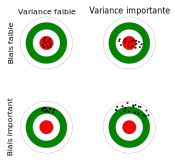

!!! info "Remarque"

    La décomposition biais-variance fait normalement intervernir un troisisème terme, qui correspond à un terme d'erreur. Par simplicité, nous avons choisi de ne pas le faire apparaître.

Le but, dans l'évaluation d'une régression linéaire, est d'essayer de se placer dans le cas idéal où le biais et la variance sont faibles. Cependant il y a nécessairement un compromis à faire entre les deux. De façon générale, si la variance baisse au cours du temps, le biais lui augmente.


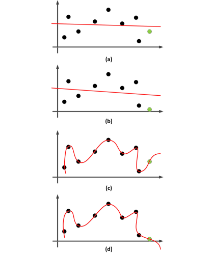

La combinaison du biais et de la variance permet de quantifier **la compléxité du modèle**.


!!! example "Exemple de sous-apprentissage, apprentissage correct, sur-apprentissage."

    


!!! info "Remarque"

    1. Un modèle avec une **variance faible**, mais un **biais élevé** est en **sous-apprentissage**, que l'on appelle aussi parfois sur-généralisation.
    2. Un modèle avec une **variance élevé**, mais un **biais faible**, est en **sur-apprentissage**.


### Le cas de la classification

Si l'on ne se place pas dans le cadre d'une régression, mais dans le cadre d'un problème de classification. La question de l'existence d'une décomposition biais-variance pour une fonction de perte $\mathcal{L}_{\vartheta}$ quelconque reste compliquée. Nous avons toutefois les résultats suivants.

!!! Note "Théorème (Domingos)"

    Dans un problème de classification binaire, si la fonction de perte $\mathcal{L}_{\vartheta}$ vérifie

    1. $\mathcal{L}_{\vartheta}(y,y)=0, \, \forall y$
    2. $\mathcal{L}_{\vartheta}(y_{1},y_{2}) \neq 0, \, \forall y_{1} \neq y_{2}$

    Alors

    \[
        \mathbf{E}(\mathcal{L}_{\vartheta}(\hat{y}))
    \]

    Admet une décompoistion biais-variance.

!!! question "Pour une classification multiclasse ?"

    Si l'on se place dans le cadre d'un problème de classification multiclasse, la question reste ouverte.

## EarlyStopping, régularisation, Dropout et BatchNorm


A chaque fois, le but de ces méthodes est d'atténuer les problèmes de sur-apprentissage, afin que notre modèle soit capable de généraliser correctement. De façon usuelle, on y parvient en réduisant la compléxité du modèle, ou en réduisant la variance de la prédiction. Dans le cadre des réseaux de neurones c'est le plus souvent obtenu en rajoutant de l'information, ou en modifiant la fonction de perte.

!!! danger "Attention"

    Avant de passer aux méthodes de régularisation des réseaux de neurones à proprement parler, listons ici les différentes options disponibles pour éviter le surapprentissage.

    1. Collecter plus de données (pas toujours faisable, par exemple en médecine), faire de l'augmtentation de données (attention à la faire de façon correcte, par exemple les rotations et symetries en Computer Vision).

    2. Choisir une architecture de modèle plus petite.

    3. Ajouter du bruit.

    4. Séparer en **3 datasets distincts** votre jeu de données : un dataset d'entraînement, un dataset de validation, et un dataset de test.

        1. Le dataset de validation sera utilisé pour mesurer les performances du modèle, et le tuning des hyperparamètres.

        2. Le dataset de test lui donnera une estimation non biaisée des performances de généralisation du modèle.


### EarlyStopping

Lorsque d'un modèle s'entraîne trop longtemps, les performances générales du modèle sur le dataset de validation ont tendance à stagner, alors que celle sur le dataset d'entraînement peuvent très bien continuer à s'améliorer. On est alors dans un cas de sur-apprentissage.

L'idée est alors de surveiller l'écart entre les performances du modèle sur le dataset d'entraînement et celles sur le dataset de validation. La plupart du temps, la métrique observée est la valeur de la fonction de perte sur le dataset de validation. Une fois que l'écart devient "trop important" ou que la métrique de validation ne s'améliore plus pendant un certain nombre d'époques, on arêtte l'entraînement.

Sur Tensorflow, cela se gère via l'API keras avec le callback EarlyStopping.

```python
tf.keras.callbacks.EarlyStopping(monitor='val_loss',
                                 min_delta=0,
                                 patience=0,
                                 verbose=0,
                                 mode='auto',
                                 baseline=None,
                                 restore_best_weights=False
                                )
```

Cette méthode n'est plus très utilisée actuellement, les versions modernes de Tensorflow (tout comme Pytorch), nous permettent de sauvegarder les meilleurs modèles sans avoir à stoper l'entraînement.


### Régularisations $L_{1}$ , $L_{2}$ { ### L1L2 data-toc-label='<script type="math/tex">Régularisations L1 , L2</script>' }

Les méthodes de régularisation $L_{1}$ , $L_{2}$ sont des méthodes provenant de l'apprentissage statistique et du Machine Learning classique. On peut trouver la régularisation $L_{1}$ sous le terme de **régression LASSO**, et la régularisation $L_{2}$ sous le terme de **régression Ridge** (voire même **régularisation de Thikonov**).


Ici, l'idée est de contraindre les poids "à être petits", on peut y penser comme l'ajout d'une pénalité contre la compléxité.


#### Régularisation $L_{2}$ { #### L2 data-toc-label='<script type="math/tex">Régularisation L2</script>' }


Plaçons nous dans le cas d'un modèle linéaire, tel qu'un Perceptron simple, avec ici une entrée de dimension 8 et un seul neurone donnant une prédiction $\hat{y}$, la fonction d'activations $\sigma$ est ici quelconque, de même que la fonction de perte $\mathcal{L}_{\vartheta}$, qui peut être une MSE, la log-vraissemblance négative, l'entropie croisée.

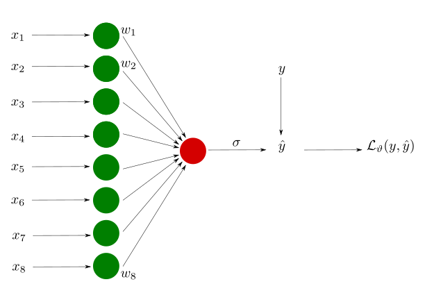

**Sans régularisation**, la fonction de perte que l'on cherche à minimiser est alors définie par

\[
        \mathcal{L}_{\vartheta} := \frac{1}{N} \sum_{i=1}^{N} \mathcal{L}_{\vartheta}(y_{i}, \hat{y_{i}})
\]

Ajouter une régularisation $L_{2}$ revient à ajouter une pénalité à la fonction de perte, la nouvelle fonction de perte considérée est alors la suivante.

\[
    \begin{align}
        \mathcal{L}_{\vartheta} & := \frac{1}{N} \sum_{i=1}^{N} \mathcal{L}_{\vartheta}(y_{i}, \hat{y_{i}}) + \frac{\lambda}{N}  \sum_{j=1}^{8} w_{j}^{2} \\
                            & = \frac{1}{N} \sum_{i=1}^{N} \mathcal{L}_{\vartheta}(y_{i}, \hat{y_{i}}) + \frac{\lambda}{N}  ||w||^{2}_{2}
    \end{align}
\]

Ce que l'on a fait ici consiste à rajouter dans la fonction de perte **la sommes des poids du réseau au carré**, d'où le terme de régularisation $L_{2}$ puisque ce que l'on a fait ici est de **calculer la norme euclidienne** (norme $L_{2}$) **du vecteur de poids du réseau**.

Pour minimiser la fonction de perte, il est donc nécessaire pour le réseau de minimiser ses poids, sans pour autant qu'il soient tous nuls. Si la norme euclidienne du vecteur de poids est nulle, alors tous les poids sont nuls, et donc $\hat{y}$ ne dépendra entièrement que du biais, ce qui implique une prédiction relativement mauvaise.

Ici, $\lambda$ est un hyperparamètre apprenable et $N$ correspond à la taille du minibatch dans la descente du gradient stochastique.


Dans le cas d'un réseau avec plusieurs couches, comme un Perceptron multicouches, on somme d'abord les neurones d'une couche, puis on réitère cette somme sur chaque couche.

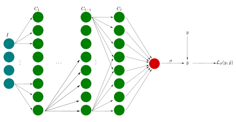


On obtient alors la formules de régularisation suivante,

\[
    \mathcal{L}_{\vartheta} := \frac{1}{N} \sum_{i=1}^{N} \mathcal{L}_{\vartheta}(y_{i}, \hat{y_{i}}) + \frac{\lambda}{N} \sum_{s = 1}^{\ell} ||\mathbf{W}_{s}||^{2}_{F}
\]

où $||\mathbf{W}_{s}||^{2}_{F}$ est **la norme de Frobenius** de la matrice des poids de la couche $s$, $\mathbf{W}_{s}$, ie la somme du carré de ses éléments.

\[
    ||\mathbf{W}_{s}||^{2}_{F} := \sum_{i} \sum_{j} (w_{i,j}^{s})^{2}
\]

#### Régularisation $L_{1}$ { #### L1 data-toc-label='<script type="math/tex">Régularisation L1</script>' }

Dans le cas d'une régularisation $L_{1}$, la norme euclidienne est alors remplacée par **la somme des valeurs absolues des poids du réseau**.

\[
    \begin{align}
    \mathcal{L}_{\vartheta} & := \frac{1}{N} \sum_{i=1}^{N} \mathcal{L}_{\vartheta}(y_{i}, \hat{y_{i}}) + \frac{\lambda}{N}  \sum_{j=1}^{8} |w_{j}| \\
                            & = \frac{1}{N} \sum_{i=1}^{N} \mathcal{L}_{\vartheta}(y_{i}, \hat{y_{i}}) + \frac{\lambda}{N}  ||w||_{1}
    \end{align}
\]

Dans le cas d'un réseau avec plusieurs couches, comme un Perceptron multicouches, on somme d'abord les neurones d'une couche, puis on réitère cette somme sur chaque couche.

On obtient alors la formules de régularisation suivante,

\[
    \mathcal{L}_{\vartheta} := \frac{1}{N} \sum_{i=1}^{N} \mathcal{L}_{\vartheta}(y_{i}, \hat{y_{i}}) + \frac{\lambda}{N} \sum_{s = 1}^{\ell} ||\mathbf{W}_{s}||_{1}
\]

où $||\mathbf{W}_{s}||_{1}$ est la somme des valeurs absolues de ses éléments.

\[
    ||\mathbf{W}_{s}||_{1} := \sum_{i} \sum_{j} |w_{i,j}^{s}|
\]

La régularisation $L_{1}$ encourage les matrices de poids à etre creuse, c'est à dire à avoir beaucoup de zéros dans leurs éléments. En pratique cette méthode est peu utilisée, du fait que la norme $L_{1}$ n'est pas différentiable, les réseaux régularisés avec cette méthode sont plus dur à optimiser.


#### Interprétation géométrique

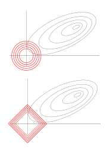

### Dropout

#### Phase d'entraînement


Le dropout fait partie de l'état de l'art en ce qui concerne les techniques de régularisation des réseaux de neurones. Proposé par Geoffrey Hinton en 2012 (*Improving neural networks by preventing co-adaptation of feature detectors*, https://arxiv.org/pdf/1207.0580.pdf) et plus détaillé en 2014 par Nitish Srivastava et al. (*Dropout: A Simple Way to Prevent Neural Networks from Overfitting*, http://jmlr.org/papers/v15/srivastava14a.html).

La technique de dropout c'est avérée très puissante, elle a permis d'améliorer la précision des réseaux de neurones faisant partie de l'état de l'art de $1-2 \%$ simplement en l'ajoutant à ces réseaux.

!!! info "Remarque"

    Une amélioration de $2\%$ peut sembler peu, mais si un modèle est dejà à $95\%$ de précision, alors une augmentation de $2\%$ signifie que l'on a réduit le taux d'erreur de $40\%$ (en allant de $5\%$ d'erreur à $3\%$) !

    Si votre modèle classifiait mal $20000$ images, cela veut dire que $8000$ nouvelles images sont maintenant correctement classifiées.

L'idée est simple, à chaque étape d'entraînement, tous les neurones (hormis les neurones de sortie) ont une probabilité $p$ d'être temporairement désactivé, ie ils seront complètement ignoré durant cette étape, mais ils peuvent très bien être de nouveau actif à la prochaine étape.


!!! note "Détail de la méthode du dropout"

    Le dropout est basé sur les techniques d'échantillonage de Bernoulli.

    Choisissons une couche de neurones $\ell$, que l'on fixe, et notons $y_{i}^{\ell}$ la $i$-ième sortie de cette couche. Dans le cadre classe classique d'un réseau de neurones, l'étape de feedforward pour cette couche est définie par les formules suivantes.

    \[
        \begin{align}
        z_{i}^{\ell} & := \mathbf{y}^{\ell - 1 } \mathbf{w}_{i}^{\ell} + \mathbf{b}^{\ell} \\
        y_{i}^{\ell} & := \sigma(z_{i}^{\ell})
        \end{align}
    \]

    Dans le cadre où l'on rajoute un dropout l'étape est modifiée comme suit.

    1. On fixe $p$ probabiblité de drop.

    2. A chaque élément $y_{i}^{\ell}$ du vecteur $\mathbf{y}^{\ell}$, ie les éléments de sortie de cette couche, on associe une probabilité $v_{i}$ tiré suivant une loi uniforme sur l'intervalle $[0,1]$.

    3. Si pour $y_{i}^{\ell}$, on a $v_{i} < p$ alors, $y_{i}^{\ell}=0$. Sinon $y_{i}^{\ell}$ est laissée tel quel.


!!! example "Ensemble des sous réseaux possibles via Dropout"

    

    Dans l'exemple ici, on peut appliquer deux couches de dropout, une sur la couche d'entrée, et une sur la couche cachée. Pour l'exemple, fixons $p=0,5$ pour ces deux couches.

    Dans le premier cas (coin supérieur droit), aucun neurone n'est désactivé, ce qui revient à dire la probabilité $v_{i}$ à chaque fois a été supérieur ou égale à $p=0,5$.

    Dans le second cas, seul le neurone correspondant à l'entrée $x_{1}$ a été désactivé, ce qui veut donc dire que sa probabilité $v_{i}$ devait être inférieure strictement à $0,5$.

Cela revient donc à chaque étape d'entraînement à choisir un nouveau sous réseau. Pour un entraînement via SGD avec un minibatch de taille $N$, cela revient donc à rajouter une étape dans la partie feedforward.

1. Sélection d'un Minibatch $M$.
2. **Désactivation des neurones par Dropout, ie sélection d'un sous réseau.**
3. Pour chaque observation $\mathbf{x}_{i} \in \mathbf{R}^{m}$ dans le minibatch $M$.

    1. Calcul de la prédiction $\hat{y}_{i}$.
    2. Calcul de la fonction de perte $\mathcal{L}_{\vartheta}(\hat{y}_{i})$.

4. Calcul de la perte moyenne $\mathcal{L}_{\vartheta} = \frac{1}{N}\sum_{i=1}^{N}\mathcal{L}_{\vartheta}(\hat{y}_{i})$.
5. Calcul de $\nabla \mathcal{L}_{\vartheta}$.
6. Mise à jour des poids et biais **du sous réseau** par rétropropagation.

#### Phase de test

Durant la phase de test, **le dropout est désactivé**, ie on considère le réseau complet. Il y a cependant une modification apportée. Supposons que la probabilité de dropout est de $p=0,5$ pour une couche donnée $\ell$. A cause du dropou, durant la phase d'entraînement les neurones de la couche suivante $\ell +1$ n'ont été connectés en moyenne qu'à la moitiée des neurones de la couche $\ell$. Or durant la phase de test ils seront connectés à 2 fois de neurones que ce que les poids n'ont été optimisés pour. Pour compenser cela, on multiplie par $0,5$ les valeurs de sortie de la couche $\ell$, après l'entraînement.

De façon générale, pour une probabilité de dropout de $p$ sur la donnée $\ell$, on multiplie par $1-p$ les valeurs de sortie de la couche $\ell$, après l'entraînement.

Dans le cadre de Tensorflow (et Pytorch), la méthode d'implémentation choisie est celle dite de **l'inverted Dropout**, les valeurs de sortie sont multipliées par $\frac{1}{1-p}$ durant la phase d'entraînement, et non durant la période de test. Ce qui est moins coûteux au niveau de la puissance de calcul sur le long terme, si le modèle est fortement utilisé en production.

#### Pourquoi ça marche.

Comme un nouveau sous réseau à chaque nouvelle étape d'entraînement, cela force le réseau à ne pas se reposer sur un nombre limité de connexions. Le réseau considérera un nombre plus importants de connexions et par conséquent les poids seront moins concentré sur un petit nombre de neurones.

Si l'on désigne par $D$ le nombre de neurones qui peuvent être susceptibles de dropout dans un réseau de neurones, c'est à dire le nombre de neurones présents dans les couche cachées, on a alors un total de $2^{D}$ sous réseau possibles.

Par exemple si le dropout n'est activé que sur une seule couche avec 32 neurones denses, on a quand même un nombre de

\[
        2^{32} - 1 = 4294967295
\]

sous réseaux possibles. Ce qui fait qu'il est virtuellement impossible pour le même sous réseau d'être sélectionné deux fois. Si l'entraînement s'arrête au bout de $10000$ étapes, cela veut dire que l'on a entraîné $10000$ sous réseaux différents. Ces sous réseaux ne sont pas complètement indépendants car ils partagent beaucoup de leur poids et biais, mais ils sont quand même différents. Le réseau de neurones obtenu peut être vu comme une moyenne de tous ces sous réseaux plus petits.

La commande Tensorflow pour rajouter une couche de dropout est la suivante.

```python
tf.keras.layers.Dropout(p)
```

!!! info "Remarque"

    1. La probabilité dans l'article d'origine était de $p=0,5$, il est courant qu'elle soit comprise dans l'intervalle $[0,2; 0,8]$ aujourd'hui.
    2. Si le modèle n'est pas sujet au sur-apprentissage, le dropout peut avoir l'effet inverse que celui recherché.
    3. Dans ce cas là, il est conseillé d'augmenter la compléxité du modèle pour le faire rentrer en sur-apprentissage, puis de le ré-entraîner en ayant ajouter des couches de dropout.
    4. Dans le cas où l'on utilise un modèle préentraîné pour faire du transfert d'apprentissage. il n'est pas possible de rajouter des couches de dropout dans la partie entraînée, mais seulement dans la partie classifiante avec les réseaux de neurones denses.
    5. Dans le cas des CNN, les pixels adjacents sont généralement fortement corrélés, par conséquent l'idée que le dropout permet de se débarasser de la dépendances de certains poids ne marche pas ici. Dans le cadre là, l'idée est alors de désactiver entièrement une feature map, via un 'SpatialDropout'

    ```python
    tf.keras.layers.SpatialDropout2D(p)
    ```
### BatchNorm

Il est difficile d'entraîner des réseaux de neurones avec des observations ayant un ordre de magnitude important. Pour homogénéiser notre dataset avant l'entraînement, il est possible de standardiser nos entrées en utilisant la transformation suivante.

\[
    \tilde{x}_{i,j} := \frac{x_{i,j} - \mu_{j}}{\sigma_{j}^{2}}
\]

où

1. $x_{i,j}$ correspond à la $j$-ième feature de l'observation $\mathbf{x}_{i} \in \mathbf{R}^{m}$.
2. $\mu_{j}$ correspond à la moyenne de la $j$-ième feature prise sur l'ensemble du dataset.
3. $\sigma_{j}$ correspond à l'écart type de la $j$-ième feature prise sur l'ensemble du dataset.

Dans ce cas là, toutes nos features auront une moyenne de $0$ et un écart-type de $1$, ie pour chaque feature, $95\%$ des valeurs seront comprises dans l'intervalle $[-2,2]$. Les poids seront alors eux aussi "normalisés" pour moins refléter l'influence des valeurs importantes.

Cependant standardiser les entrées du réseau ne va affecter que les poids de la première couche cachée. Qu'en est il des autres couches, et de la distribution de leur features ?

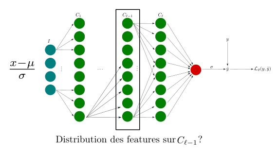

De par l'algorithme de SGD et le procédé de mise à jour des poids et des biais, la distribution des features dans une même couche cachée peut changer d'une étape d'entraînement à l'autre. Ce qui n'est pas optimal pour l'apprentissage du réseau.

On sait, grâce aux articles de LeCun & al., 1998 (*Neural Networks : Tricks of the trade, Springer*) et Wiesler & Ney, 2011 (*A convergence analysis of log-linera training, Advances in Neural Information Processing Systems*), que l'entraînement d'un réseau de neurones converge plus rapidement si les entrées du réseau sont standardisées (moyenne nulle et variance de $1$), et décorrélées. Cependant le processus de décorrélation demande demande d'inverser une matrice ce qui est coûteux en temps de calcul.

L'idée développée en 2015 dans un article de Ioffe & Szegedy (*Batch Normalization: Accelerating Deep Network Training by Reducing Internal Covariate Shift*, https://arxiv.org/abs/1502.03167) est alors de pratiquer l'opération dite de **Batch Normalization**, ou seule l'opération de standardisation sera appliquée, mais cette fois ci à toutes les couches cachées du réseau.

#### Phase d'entraînement

Pour un entraînement via SGD avec un minibatch de taille $N$, l'opération de Batch Normalization se déroule ainsi

Pour chaque feature $j \in \lbrace 1, \dots, m \rbrace$ dans le minibatch $M$.

1. Calcul de la moyenne de la $j$-ième feature du batch $M$,

    \[
        \mu_{j} := \frac{1}{N} \sum_{i=1}^{N} x_{i,j}
    \]

2. Calcul de la variance de la $j$-ième feature du batch $M$,

    \[
        \sigma_{j}^{2} := \frac{1}{N} \sum_{i=1}^{N} (x_{i,j} - \mu_{j})^{2}
    \]

3. Standardisation,

    \[
        \tilde{x}_{i,j} := \frac{x_{i,j} - \mu_{j}}{\sqrt{\sigma_{j}^{2}+ \varepsilon}} \quad \forall i
    \]

$\varepsilon$ étant là pour éviter que l'on divise par zéro, en pratique il est de l'ordre de $10^{-5}$.

1. Ajout des paramètres,

    \[
        z_{i,j} := \gamma_{j} \tilde{x}_{i,j} + \beta_{j}
    \]

Où $\gamma_{j}$ et $\beta_{j}$ sont des paramètres qui sont apprenables par le réseau. Ainsi, si la distribution des valeurs était déjà optimale, la mise à jour des poids fera en sorte que l'on obtienne les paramètres suivants,

\[
    \begin{cases}
    \gamma_{j} & = \sqrt{\mathrm{Var}(x_{.,j})} \\
    \beta_{j} & = \mu_{j}
    \end{cases}
\]

afin de retrouver la distribution initiale.

On a donc une paire de paramètres $\gamma, \beta$ pour chaque features

\[
    \lbrace (\gamma_{1}, \beta_{1}), (\gamma_{2}, \beta_{2}), \dots, (\gamma_{m}, \beta_{m}) \rbrace.
\]

!!! danger "Attention"

    Rappelons ici que seuls les paramètres $\gamma, \beta$ sont apprenables par le réseau. La moyenne et la variance $\mu, \sigma$ sont des statistiques calculées sur le minibatch, donc fixes, leur valeurs peut cependant changer à chaque nouveau minibatch.


#### Phase de test

Durant la phase d'entraînement, la moyenne et la variance sont calculées sur les minibatchs. Or lors de la phase de test ou de production, il est hautement improbable que vous ayez à votre disposition un minibatch pour calculer ces statistiques. On souhaite que la prédiction ne dépende que de l'entrée et non pas de statistiques calculées ailleurs.

Pour cela, les moyennes et variances calculées sur les minibatch sont sotckées en mémoire afin d'avoir une **estimation précise de la moyenne et de la variance de chaque features sur le dataset complet**.

La moyenne et la variance sont calculées via des **moyennes et variances mouvantes exponentielles pondérées**, en temps réel durant la phase d'entraînement pour pouvoir être utilisées durant la phase de test.

Pour l'étape $t$ d'entraînement, la moyenne et la variance mouvante $\hat{\mu}_{j}[t]$, $\hat{\sigma}_{j}^{2}[t]$

\[
    \begin{cases}
    \hat{\mu}_{j}(t) & = \hat{\mu}_{j}(t-1)\cdot \mathrm{moment} + (1- \mathrm{moment})\cdot \mu_{j}(t)   \\
    \hat{\sigma}_{j}^{2}(t) & = \hat{\sigma}_{j}^{2}(t-1)\cdot \mathrm{moment} + (1- \mathrm{moment})\cdot \sigma_{j}^{2}(t)
    \end{cases}
\]

Le moment est un nombre réel qui permet de contrôler la mise à jour des ces statistiques, généralement on a $\mathrm{moment} \simeq 0,1$.

Dans les cas des CNN, le principe est le même, sauf qu'ici les features sont remplacées par les features maps. Les statistiques moyennes et variances calculées sur le minibatch et les statistiques mouvantes prennent donc ça en compte.

!!! info "BacthNorm dans les CNN"

    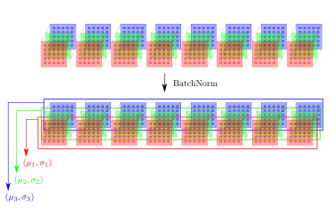


Pour chaque feature map $c \in \lbrace 1, \dots, r \rbrace$ de hauteur $H$ et de largeur $W$, dans le minibatch $M$, on a

1. Calcul de la moyenne de la $c$-ième feature du batch $M$,

    \[
        \mu_{c} = \frac{1}{NHW} \sum_{i=1}^{N} \sum_{j=1}^{H} \sum_{k=1}^{W} x_{i,j,k,c}
    \]

2. Calcul de la variance de la $c$-ième feature du batch $M$,

    \[
        \sigma_{c}^2 = \frac{1}{NHW} \sum_{i=1}^{N} \sum_{j=1}^{H} \sum_{k=1}^{W} (x_{i,j,k,c} - \mu_{c})^2
    \]

3. Standardisation,

    \[
        \tilde{x}_{i,j,k,c} = \frac{x_{i,j,k,c}-\mu_{c}}{\sqrt{\sigma_{c}^2 + \epsilon}}
    \]

4. Ajout des paramètres,

    \[
        z_{i,:,:,c} = \gamma_c \tilde{x}_{i,:,:,c} + \beta_c
    \]

#### Pourquoi ça marche ?

On ne sait pas trop !

Le papier d'origine émmettait l'hypothèse que le principe de Batch Normalization permettait de réduire le décalage interne covarié (ICS : Internal Covariate Shift), ie le fait qu'il y ait un changement de distribution entre l'entrée et la sortie d'une couche cachée. Hors, aucune preuve formelle ou empirique forte n'a été publiée.

Un nouvel article, 2019 (*How Does Batch Normalization Help Optimization?*, https://arxiv.org/pdf/1805.11604.pdf) montre que la Batch Normalization permet de lisser la surface de la fonction de perte, ce qui permet une convergence plus rapide, avec des taux d'apprentissage plus élevé.

Ce dont l'on est sûr, c'est que la Batch Normalization aide par rapport aux problèmes d'explosion ou de disparition du gradient, qu'il améliore la stabilité de l'entraînement et permet d'augmenter le taux d'apprentissage, et donc de faire converger le modèle en moins d'époques.


## Les méthodes d'initialisation des poids (Xavier, He)


Maintenant que la distribution de nos features en sortie de chaque couche est optimisée grâce à l'opération de Batch Normlization, on peut se poser la question de savoir comment optimiser l'initialisation des poids et biais dans nos couches ? On a deux raisons de vouloir optimiser ce départ.

1. **Briser la symétrie** : si l'on initialise tous les poids et biais à la même constante $\alpha$, alors tous les neurones d'une même couche seront parfaitement identiques, et la mise à jour via rétropropagation sera la même pour tous. Ce qui fait même si votre réseau de neurones à plusieurs couches avec des centaines de neurones dans chaque, une initialisation identique le fera se comporter comme une réseau avec un seul neurone par couches.

!!! info "Remarque"

    Si les poids doivent être initialisés de manière aléatoire pour briser la symétrie, il est parfaitement correct d'initialiser tous les biais à zéro, c'est ce que fait Tensorflow.

2. **Diminuer les problèmes d'explosion ou de disparition du gradient** : Regardons le réseau suivant.


Si l'on souhaite mettre à jour le poids $w_{1,1}^{1}$, on doit calculer la dérivée partielle suivante.

\[
    \frac{\partial \mathcal{L}_{\vartheta}}{ \partial w_{1,1}^{1}}
\]

Les poids et neurones intervenant dans cette dérivée partielle sont ici en rouge, on a alors :

\[
    \begin{align}
    \frac{\partial \mathcal{L}_{\vartheta}}{ \partial w_{1,1}^{1}} =  & \frac{\partial \mathcal{L}_{\vartheta}}{\partial s} \cdot \frac{\partial s}{\partial h_{1}^{2}} \cdot \frac{\partial h_{1}^{2}}{\partial h_{1}^{1}} \cdot \frac{\partial h_{1}^{1}}{\partial w_{1,1}^{1}} \\
                                                                    + & \frac{\partial \mathcal{L}_{\vartheta}}{\partial s} \cdot \frac{\partial s}{\partial h_{2}^{2}}
    \cdot \frac{\partial h_{2}^{2}}{\partial h_{1}^{1}} \cdot \frac{\partial h_{1}^{1}}{\partial w_{1,1}^{1}}
    \end{align}
\]

Chacune de ses dérivés implique la dérivation d'une fonction d'activation, si la fonction d'activation des couches cachées et de la sortie est la sigmoïde

\[
    \sigma(z) := \frac{1}{1 + \mathrm{e}^{-z}}
\]

alors sa dérivée est $\sigma'(z) := \sigma(z)(1-\sigma(z))$ et son maximum est en zéro avec $\sigma'(0) = 0,25$. Ce qui veut dire que la valeur de la mise a jour du gradient ne sera pas plus grande que :

\[
    (0.25)^{3} \cdot 2u = 0,015625\cdot (2u)
\]

Où $2u$ correspond ici au reste des calculs dans l'addition des dérivées. Le problème s'aggrave si l'on a un réseau de $10$ couches, dans ce cas là :

\[
    (0.25)^{10} \simeq 10^{-6}
\]

Traditionnellement, les poids sont initialisés soit en effectuant un échantillonnage suivant une distribution uniforme $\mathrm{Unif}([0,1])$, ou $\mathrm{Unif}([-\frac{1}{2},\frac{1}{2}])$, soit en effectuant un échantillonnage suivant une distribution normale $\mathcal{N}(0, \sigma^{2} = 0,01)$. Cependant ces initilisations ne sont pas optimales. Pour compenser cela on a principalement deux méthodes, le choix dépendant des fonctions d'activations que vous allez choisir.

### Terminologie


Pour la matrice de poids de la couche $\ell$, le nombre de neurones dans le couche est noté $\mathrm{Fan}_{out}$, et le nombre de neurones de la couche précédente est noté $\mathrm{Fan}_{in}$. La moyenne des deux se note $\mathrm{Fan}_{avg}$.

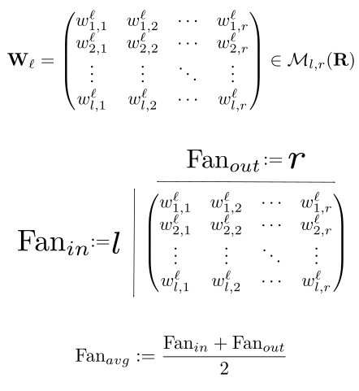


### Initilisation de Xavier


L'initialisation de Xavier, (*Understanding the difficulty of training deep feedforward neural networks*, http://proceedings.mlr.press/v9/glorot10a/glorot10a.pdf), est une initilisation spécialisée pour la fonction d'activation tangente hyperbolique.

\[
        \tanh(z) := 2 \sigma(2z) - 1
\]

Le fait est que la fonction $\tanh$ est légèrement plus robuste que la fonction sigmoïde en ce qui concerne les problèmes de disparition du gradient. Cependant, elle a les mêmes problèmes de saturation : la fonction étant bornée, le graident est proche de zéro pour des valeurs grande en valeur absolue. Le but de l'initialisation de Xavier est alors de modifier la génération initale des poids pour qu'ils restent dans la partie linéaire de la fonction $\tanh$.

La méthode d'initialisation se fait en deux étapes.

 1. On initialise les poids via un échantillonnage depuis une distribution Normale ou Uniforme.
 2. On corrige la valeur des poids par un facteur pour qu'elle soit proportionnelle au nombre d'inputs de la couche.

**Si l'on initialise les poids via un échantillonnage depuis une distribution Normale**, alors les 2 étapes sont les suivantes :

 1. Pour la couche $\ell$, on initialise $\mathbf{W}_{\ell, \mathrm{init}}$  en échantillonnant depuis une distribution Normale $\mathcal{N}(0, \sigma^{2} = 1)$.
 2. On multiplie $\mathbf{W}_{\ell, \mathrm{init}}$ par le facteur $\sqrt{\frac{1}{\mathrm{Fan}_{avg}}}$.

!!! info "Remarque"

    Cela revient à faire directement un échantillonnage depuis une distribution Normale

    \[
        \mathcal{N}(0, \sigma = \sqrt{\frac{1}{\mathrm{Fan}_{avg}}})
    \]

**Si l'on initialise les poids via un échantillonnage depuis une distribution Uniforme**, alors les 2 étapes sont les suivantes :

 1. Pour la couche $\ell$, on initialise $\mathbf{W}_{\ell, \mathrm{init}}$ en échantillonnant depuis une distribution Uniforme $\mathrm{Unif}([-\sqrt{3},\sqrt{3}])$.
 2. On multiplie $\mathbf{W}_{\ell, \mathrm{init}}$ par le facteur $\sqrt{\frac{1}{\mathrm{Fan}_{avg}}}$.

!!! info "Remarque"

    Cela revient à faire directement un échantillonnage depuis une distribution Uniforme

    \[
        \mathrm{Unif}([-\sqrt{\frac{3}{\mathrm{Fan}_{avg}}} , \sqrt{\frac{3}{\mathrm{Fan}_{avg}}}])
    \]

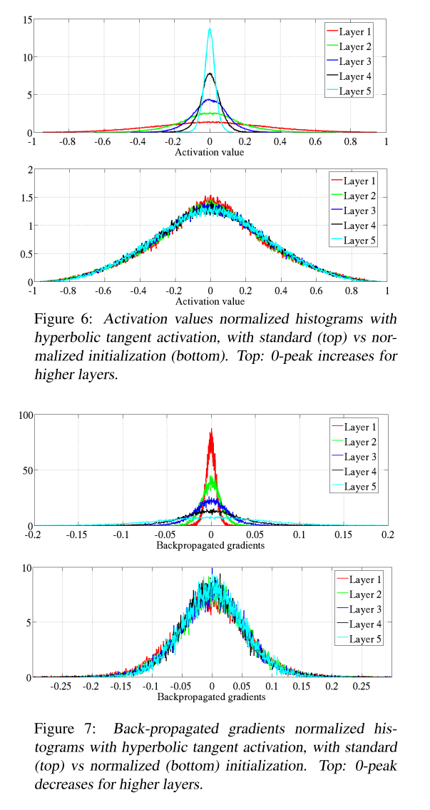

Les graphes ci dessus sont tirés de l'article d'origine, montrant la différence au niveau des valeurs que peuvent peuvent prendre la fonction $\tanh$, en tant que fonction d'activation, puis les valeurs du gradient lors de la rétropropagation.


### Initilisation de He


L'initialisation de Xavier suppose que les fonctions d'activations aient une dérivée égale à $1$, et que les sorties de chaque couches sont de moyenne nulle, ce sont des hypothèses raisonnables pour $\tanh$, mais pas si l'on souhaite utiliser la fonction d'activation $\mathrm{ReLU}$. De plus, l'initialisation de Xavier n'est pas adaptée aux CNN dont l'architecture est très profonde, comme les architectures faisant parti de l'état de l'art actuel.

L'initialisation de He (*Delving Deep into Rectifiers: Surpassing Human-Level Performance on ImageNet Classification*, https://arxiv.org/abs/1502.01852)prend ce changement en compte et est optimisée pour la fonction d'activation $\mathrm{ReLU}$.

La méthode d'initialisation se fait en deux étapes.

1. On initialise les poids via un échantillonnage depuis une distribution Normale ou Uniforme.
2. On corrige la valeur des poids par un facteur pour qu'elle soit proportionnelle au nombre d'inputs de la couche.

**Si l'on initialise les poids via un échantillonnage depuis une distribution Normale**, alors les 2 étapes sont les suivantes :

1. Pour la couche $\ell$, on initialise $\mathbf{W}_{\ell, \mathrm{init}}$  en échantillonnant depuis une distribution Normale $\mathcal{N}(0, \sigma^{2} = 1)$.
2. On multiplie $\mathbf{W}_{\ell, \mathrm{init}}$ par le facteur $\sqrt{\frac{2}{\mathrm{Fan}_{in}}}$.

!!! info "Remarque"

    Cela revient à faire directement un échantillonnage depuis une distribution Normale

    \[
        \mathcal{N}(0, \sigma = \sqrt{\frac{2}{\mathrm{Fan}_{in}}})
    \]


**Si l'on initialise les poids via un échantillonnage depuis une distribution Uniforme**, alors les 2 étapes sont les suivantes :

 1. Pour la couche $\ell$, on initialise $\mathbf{W}_{\ell, \mathrm{init}}$ en échantillonnant depuis une distribution Uniforme $\mathrm{Unif}([-\sqrt{3},\sqrt{3}])$.
 2. On multiplie $\mathbf{W}_{\ell, \mathrm{init}}$ par le facteur $\sqrt{\frac{2}{\mathrm{Fan}_{in}}}$.

!!! info "Remarque"

    Cela revient à faire directement un échantillonnage depuis une distribution Uniforme

    \[
        \mathrm{Unif}([-\sqrt{\frac{6}{\mathrm{Fan}_{in}}} , \sqrt{\frac{6}{\mathrm{Fan}_{in}}}])
    \]

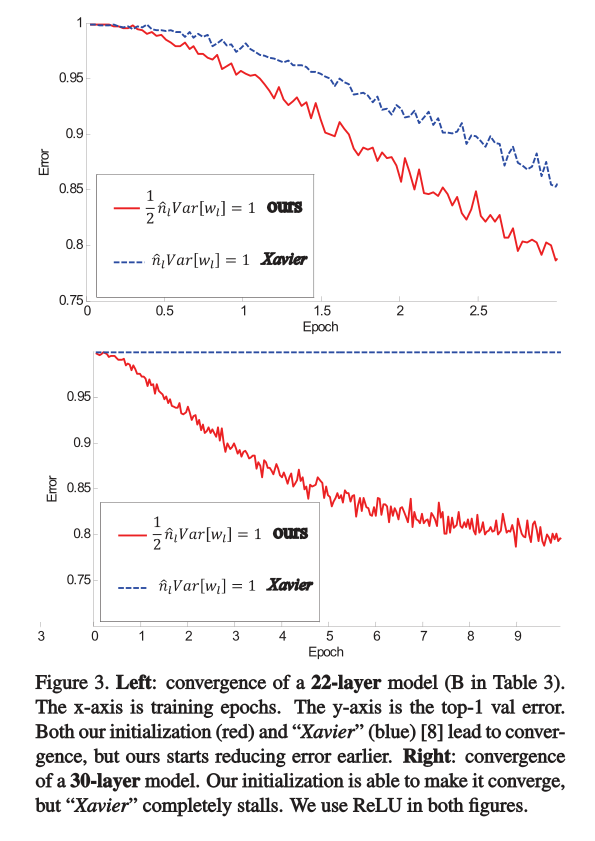

Graphes tirés de l'article d'origine, montrant la différence au niveau des valeurs de la Top-1 erreur de validation. On voit aussi le fait que l'initilisation de He est spécialisée pour les CNN, pour un CNN de 30 couches l'initialisation de Xavier ne le fait pas converger.

### Le cas des CNN

Le cas de l'initialisation pour les couches convolutives est particuliers, en effet il n'est pas forcément clair de parler de $\mathrm{Fan}_{in}$ et de $\mathrm{Fan}_{out}$ dans une couche convolutive, qui n'est pas du tout structurée comme une couche dense.

Dans une couche convolutive, les poids que l'on cherche à initialiser sont ceux des filtres (kernel), si l'on regarde comment on implémente une couche convolutive en Tensorflow, on a le code suivant.

```python
Conv2D(d, (k, k))
```

Ici, $d$ correspond au nombre de filtre (qui correspondra aussi au nombre feature maps en sortie de la couche), ses filtres sont de dimension $(k,k)$. On a donc $k^{2}d$ poids à initialiser, par convention $\mathrm{Fan}_{in}$ est alors défini comme cela dans le cas d'une couche convolutive pour l'initialisation de He.

\[
    \mathrm{Fan}_{in} := k^{2}d
\]

Pour "He Normal", on a :

\[
    \mathcal{N}(0, \sigma = \sqrt{\frac{2}{k^{2}d}}).
\]

Pour "He Uniforme", on a :

\[
    \mathrm{Unif}([-\sqrt{\frac{6}{k^{2}d}} , \sqrt{\frac{6}{k^{2}d}}]).
\]

Par défaut Tensorflow utilise l'initialisation de Xavier Uniforme (nommé 'glorot_uniform' de par son nom de famille), pour les couches denses comme pour les couches convolutive.

```python

tf.keras.layers.Dense(kernel_initializer='glorot_uniform', bias_initializer='zeros')
tf.keras.layers.Conv2D(kernel_initializer='glorot_uniform', bias_initializer='zeros')
```

Pour modifier cela, il suffit de changer la valeur de kernel_initializer.

```python
tf.keras.layers.Dense(kernel_initializer='glorot_normal', bias_initializer='zeros')
tf.keras.layers.Conv2D(kernel_initializer='glorot_normal', bias_initializer='zeros')

tf.keras.layers.Dense(kernel_initializer='he_uniform', bias_initializer='zeros')
tf.keras.layers.Conv2D(kernel_initializer='he_uniform', bias_initializer='zeros')

tf.keras.layers.Dense(kernel_initializer='he_normal', bias_initializer='zeros')
tf.keras.layers.Conv2D(kernel_initializer='he_normal', bias_initializer='zeros')
```

## Optimisation de la descente du gradient stochastique

Les techniques que l'on va voir ici ont été développées pour accélerer le processus de SGD, ie accélerer sa convergence, et sa précision. On se concentrera uniquement sur des techniques du premier ordre ici, qui ne prennent en compte que le gradient. Considérer des techniques d'optimisation du second ordre en considération les dérivées secondes et la Hessienne de la fonction de perte n'est pas efficace en Deep Learning du fait de la non convexité de la fonction de perte.

### Learning rate Decay

Dans le cas du Deep Learning, la méthode de descente du gradient la plus commune est la descente du gradient stochastique pas minibatch (MB-SGD). Chaque minibacth peut être considéré comme un échantillon du dataset, qui est lui même un échantillon de la population totale.

Par conséquent, le gradient calculé lors de la MB-SGD

\[
    \begin{align}
            \nabla  \mathcal{L}_{\vartheta} & := \nabla ( \frac{1}{N} \sum_{i=1}^{N} \mathcal{L}_{\vartheta}(\hat{y}_{i})) \\
                                     & = \frac{1}{N} \sum_{i=1}^{N} \nabla \mathcal{L}_{\vartheta}(\hat{y}_{i})
    \end{align}
\]

est une approximation du gradient

\[
    \begin{align}
        \nabla  \mathcal{L}_{\vartheta}^{\mathrm{tot}} & := \nabla ( \frac{1}{n} \sum_{i=1}^{n} \mathcal{L}_{\vartheta}(\hat{y}_{i})) \\
                                     & = \frac{1}{n} \sum_{i=1}^{n} \nabla \mathcal{L}_{\vartheta}(\hat{y}_{i})
    \end{align}
\]

prenant en compte le dataset complet. En d'autres termes, on a

\[
    \nabla  \mathcal{L}_{\vartheta} \simeq  \nabla \mathcal{L}_{\vartheta}^{\mathrm{tot}} + \varepsilon.
\]

Ce qui au premier abord peut sembler poser un problème est en fait bénéfique. La fonction de perte étant non convexe, l'ajout du bruit peut nous permettre de sortir de minima locaux sous-optimaux.

Un des inconvénients est néanmoins l'existence d'oscillations plus importantes de par la présence de bruit.

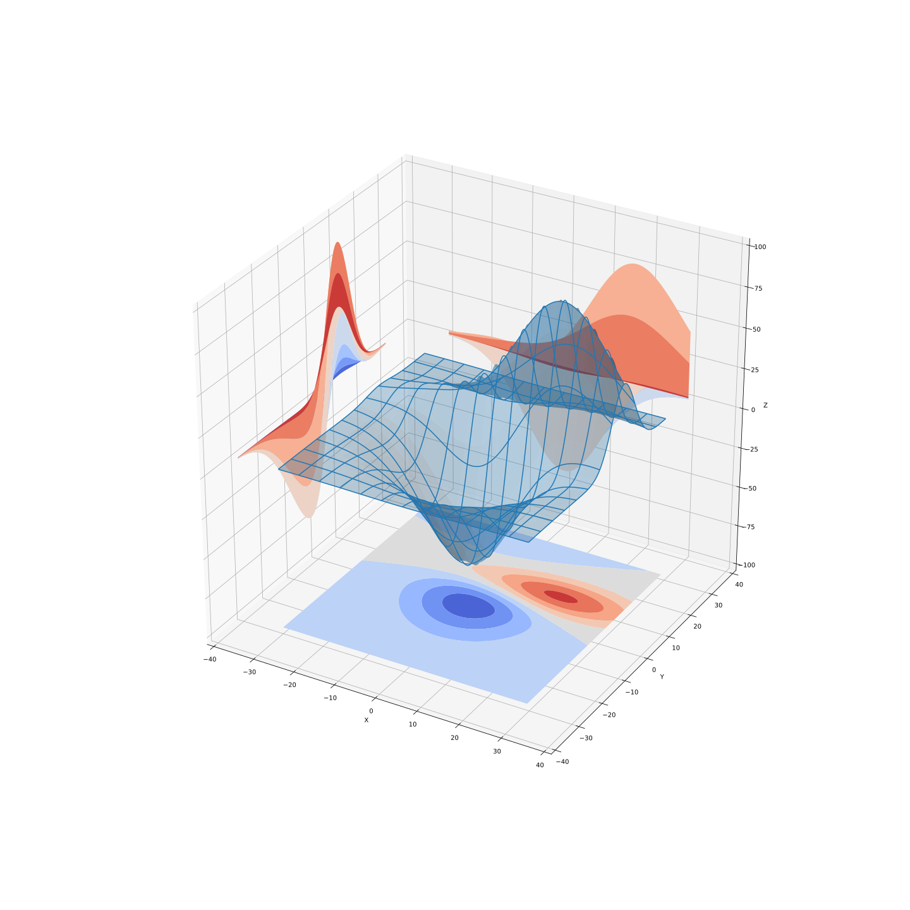

!!! example "Exemple"

    Haut : Sans bruit, on resterait bloquer dans le premier minimal local observé, car le gradient serait nul. La présence du bruit nous permet de garder "une certaine inertie pour continuer d'avancer". Bas : Différence entre descente du gradient classique (flêches vertes), et MB-SGD (flêches rouges).

    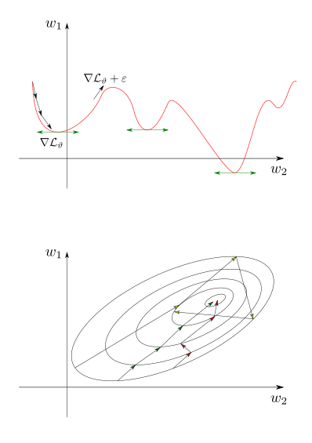

!!! info "Remarque"

    Un autre avantage de la MB-SGD est sa vitesse de convergence car elle permet de la parallélisme.

Pour réduire l'effet des oscillations à la fin de l'entraînement, on réduit alors le taux d'apprentissage. C'est le principe du **Learning Rate Decay**.

!!! danger "Attention"

    Dangers du LRD : baisse trop rapide, trop tôt, qui impacterait la convergence du modèle.

    **Bonne pratique** : Entraîner le modèle sans, puis réentraîner avec un LRD.

Les types de LRD les plus connus sont les suivants.

Dans chacune des formules suivantes,

1. $\eta_{0}$ est le taux d'apprentissage initial,
2. $t$ est l'époque,
3. et $k$ est le taux de décroissance (hyperparamètre).

#### LRD exponentiel

\[
    \eta_{t} := \eta_{0}\mathrm{e}^{(-kt)}
\]

#### LRD inverse

\[
    \eta_{t} := \frac{\eta_{0}}{1+kt}
\]

#### LRD divisé

\[
    \eta_{t} := \frac{\eta_{t-1}}{2}
\]

En pratique, il est compliqué de savoir lequel utiliser, l'expérimentation est nécéssaire.

La technique évoquée à l'instant ne fait que modifier le taux d'apprentissage. Pour les suivantes, on modifie directement la méthode de mise à jour des poids.

### Momentum

La MB-SGD ne fait que des mises à jours locales ne prenant pas en compte les mises à jours précédentes : si $||\nabla  \mathcal{L}_{\vartheta}||$ est petit, alors la mise à jour des poids sera petite. Il serait intéressant de faire une mise à jour "ayant un spectre un peu plus global".

La méthode suivante, proposée par Boris Polyak en 1964, et d'utiliser la notion de momentum, connue en physique. L'idée est la suivante : on ne souhaite plus uniquement bougée dans la direction oppposée au gradient, mais aussi bouger dans la direction moyenne des dernières mises à jours. Cela permet d'amoindrir les oscillations mais aussi d'échapper des minima locaux plus facilement.

On rappelle que la méthode classique de mise à jours des poids, de l'étape $t$ à $t+1$ est donnée par la formule suivante.

\[
    w_{i,j}^{\ell}(t+1) := w_{i,j}^{\ell}(t) - \eta \frac{\partial \mathcal{L}_{\vartheta}}{\partial w_{i,j}^{\ell}(t)}(\vartheta)
\]

Dans le cas de l'ajout du momentum, la modification est la suivante, on définit la vélocité $\Delta w_{i,j}^{\ell}(t)$ par


\[
    \begin{align}
    \Delta w_{i,j}^{\ell}(0) & = 0 \\
    \Delta w_{i,j}^{\ell}(t) & := \alpha \Delta w_{i,j}^{\ell}(t-1) - \eta \frac{\partial \mathcal{L}_{\vartheta}}{\partial w_{i,j}^{\ell}(t)}(\vartheta)
    \end{align}
\]

$\alpha \Delta w_{i,j}^{\ell}(t-1)$ est alors le **momentum** ajouté. La mise à jour des poids est alors définie par la formule suivante.

\[
    w_{i,j}^{\ell}(t+1) := w_{i,j}^{\ell}(t) + \Delta w_{i,j}^{\ell}(t)
\]

Si $\alpha \in \mathbf{R}$ est nul, alors on retombe sur la mise à jour classique des poids, $\alpha$ est un hyperparamètre qui est généralement compris entre $0,9 \leq \alpha \leq 0,999$.

Dans Tensorflow, ajouté le momentum dans la MB-SGD se fait de la façon suivante.

```python
tf.keras.optimizers.SGD(lr = 0.001, momentum=0.9)
```

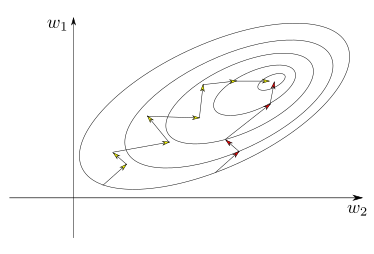

### Nesterov

Une modification du momentum a été proposée par Yurii Nesterov en 1983, la modification est bénigne mais est pourtant presque toujours plus rapide à converger que le momentum classique.

L'idée est qu'au lieu de mesurer le gradient $\nabla  \mathcal{L}_{\vartheta}$ à la position actuelle des poids $\vartheta$, mais un peu en avance, dans la direction du moment, à $\vartheta + \alpha \Delta w_{i,j}^{\ell}(t)$.


\[
    \Delta w_{i,j}^{\ell}(t) := \alpha \Delta w_{i,j}^{\ell}(t-1) - \eta \frac{\partial \mathcal{L}_{\vartheta}}{\partial w_{i,j}^{\ell}(t)}(\vartheta + \alpha \Delta w_{i,j}^{\ell}(t-1))
\]

La mise à jour des poids est alors définie par la formule suivante.

\[
    w_{i,j}^{\ell}(t+1) := w_{i,j}^{\ell}(t) + \Delta w_{i,j}^{\ell}(t)
\]

Cette modification marche parce qu'en général, le vecteur moment pointe dans la bonne direction, ie vers l'optimum.

Dans Tensorflow, activer Nesterov dans la MB-SGD se fait de la façon suivante.

```
    tf.keras.optimizers.SGD(lr = 0.001, momentum=0.9, nesterov=True)
```

## Taux d'apprentissage adaptatif

Les deux méthodes les plus populaires de Taux d'apprentissage adaptatif sont les suivantes.

### RMSProp

Dans le cas de RMSProp (Root Mean Squared (Back)Propgation) proposé par Geoffrey Hinton en 2012, le taux d'apprentissage adaptatif est modélisé en gardant en mémoire le carré des gradients précédents. Pour chaque poids, on a la moyenne mouvante exponentielle suivante :

\[
    \begin{align}
    \mathrm{MS}(w_{i,j}^{\ell})(0) & = 1 \\
    \mathrm{MS}(w_{i,j}^{\ell})(t) &:= \beta \mathrm{MS}(w_{i,j}^{\ell})(t-1) - (1-\beta) \left( \frac{\partial \mathcal{L}_{\vartheta}}{\partial w_{i,j}^{\ell}(t)} (\vartheta) \right)^{2}
    \end{align}
\]

La mise à jour des poids est alors donnée par la formule suivante.

\[
    w_{i,j}^{\ell}(t+1) := w_{i,j}^{\ell}(t) - \frac{\eta}{\sqrt{\mathrm{MS}(w_{i,j}^{\ell})(t)}+\varepsilon} \frac{\partial \mathcal{L}_{\vartheta}}{\partial w_{i,j}^{\ell}(t)}(\vartheta)
\]

Le taux d'apprentissage adaptatif pour chaque poids est alors donné par :

\[
    \frac{\eta}{\sqrt{\mathrm{MS}(w_{i,j}^{\ell})(t)}+\varepsilon}
\]

Le coefficient $\beta$ est ici un hyperparamètre, par défaut il est fixé à 0.9 (Valeur proposée par Hinton lors de sa présentation).

```python
tf.keras.optimizers.RMSProp(lr = 0.001, rho=0.9)
```

### Adam

Adam (ADAptative Moment estimation), proposé par Kingma, D. P., & Ba, J. L. (2015), combine les idées du momentum et de RMSProp.

En plus de garder en mémoire une moyenne exponentielle mouvante du carré des gradients précédents pour chaque poids, comme RMSProp, Adam garde aussi en mémoire une moyenne exponentielle mouvante des gradients précédents, comme Momentum.

**Momentum-like** terme :

\[
    \begin{align}
    m_{i,j}^{\ell}(0) & = 0 \\
    m_{i,j}^{\ell}(t) & := \beta_{1} m_{i,j}^{\ell}(t-1) - (1-\beta_{1}) \frac{\partial \mathcal{L}_{\vartheta}}{\partial w_{i,j}^{\ell}(t)}(\vartheta)
    \end{align}
\]

**RMSProp-like** terme :

\[
    \begin{align}
    r_{i,j}^{\ell}(0) & = 0 \\
    r_{i,j}^{\ell}(t) &:= \beta_{2} r_{i,j}^{\ell}(t-1) - (1-\beta_{2}) \left( \frac{\partial \mathcal{L}_{\vartheta}}{\partial w_{i,j}^{\ell}(t)}(\vartheta) \right)^{2}
    \end{align}
\]

Commes les deux initialisation sont égales à 0, les auteurs ont observés que cela pouvait impliqué un biais, pour contrer ce biais, ils normalisent ces valeurs de la façon suivante.

\[
    \begin{align}
    \hat{m}_{i,j}^{\ell}(t)  & := \frac{m_{i,j}^{\ell}(t)}{1- \beta_{1}^{t}} \\
    \hat{r}_{i,j}^{\ell}(t) &:= \frac{r_{i,j}^{\ell}(t)}{1- \beta_{2}^{t}}
    \end{align}
\]

La mise à jour des poids est alors donnée par la formule suivante.

\[
    w_{i,j}^{\ell}(t+1) := w_{i,j}^{\ell}(t) - \eta \frac{\hat{m}_{i,j}^{\ell}(t)}{\sqrt{\hat{r}_{i,j}^{\ell}(t)}+\varepsilon}
\]

## Comparaison

En 2019 est paru une comparaison de certains des optimiseurs les plus populaires (*On Empirical Comparisons of Optimizers for Deep Learning*, https://arxiv.org/abs/1910.05446). Les auteurs en ont déduit le principe de relations d'inclusion suivante.

!!! Note "Définition"

    Etant données 2 règles de mises à jours des poids $\mathcal{M, N}$ pour une utilisation en tant que méthode d'optimisation du premier ordre. On dit que $\mathcal{M}$ est une sous spécialisation de $\mathcal{N}$ si, après un temps d'entraînement assez long, $\mathcal{N}$ est capable d'approximer les résultats de $\mathcal{M}$, quitte à modifier les hyperparamètres de $\mathcal{N}$.

    On note alors $\mathcal{M} \subseteq \mathcal{N}$.

On laisse au lecteur le soin de lire l'article pour obtenir la définition exacte. La chose à retenir est la suivante. La méthode d'optimisation du premier ordre utilisée ici correspond au fait de calculer le gradient de la fonction de perte pour mettre à jour les poids, les règles de mises à jour elles sont toutes les méthodes listées plus haut.

!!! info "Remarque"

    Si 2 règles de mises à jours des poids sont en relation d'inclusion, alors **la méthode la plus générale ne peut jamais être la plus mauvaise, peu importe la métrique de comparaison utilisée**, tant que les hyperparamètressont suffisemment tunés. De plus, cette relation est valable sur :

    * Le jeu de test,
    * Le jeu de validation,
    * La vitesse d'éxécution.

On a alors les inclusions suivantes :

\[
    \begin{align}
    (1) &\quad \mathrm{SGD} \subseteq \mathrm{Momentum} \subseteq \mathrm{RMSProp} \\
    (2)& \quad \mathrm{SGD} \subseteq \mathrm{Momentum} \subseteq \mathrm{Adam} \\
    (3) &\quad \mathrm{SGD} \subseteq \mathrm{Nesterov}
    \end{align}
\]

En d'autres termes, RMSProp ne peut jamais être moins performant que Momentum, qui lui même ne peut jamais être moins performant que SGD.

!!! danger "Attention"

    Cela ne veut absolument pas dire que SGD ne peut jamais être meilleur que RMSProp.

Pour la première liste d'inclusions, cela peut se voir via Tensorflow.

```python
tf.keras.optimizers.SGD(lr = 0.001, momentum = 0.0) = tf.keras.optimizers.SGD(lr = 0.001)

tf.keras.optimizers.RMSProp(lr = 0.001, rho=1, momentum = 0.9, epsilon = 0.0) = tf.keras.optimizers.SGD(lr = 0.001, momentum = 0.9)
```

De cette article, les auteurs en ressortent alors la bonne pratique suivante.

**Si l'on peut se permettre plusieurs dizaines de runs différents pour l'entraînement, il peut être bénéfique de tuner tous les hyperparamètres des méthodes d'optimisation populaires.**
