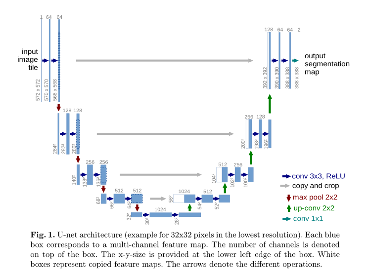

# Module 6 : La segmentation d'images

La segmentation est une composante essentielle de nombreux systèmes de compréhension visuelle.  Elle consiste à partitionner les images (ou les trames vidéo) en plusieurs segments ou objets. La segmentation joue un rôle central dans un large éventail d'applications, notamment l'analyse d'images médicales (par exemple, l'extraction des limites d'une tumeur et la mesure des volumes de tissus), les véhicules autonomes (par exemple, la détection des surfaces navigables et des piétons), la vidéosurveillance et la réalité augmentée pour n'en citer que quelques-unes.

La segmentation des images peut être formulée comme un problème de classification des pixels avec des étiquettes sémantiques (segmentation sémantique) ou de partitionnement des objets individuels (segmentation d'instance). La segmentation sémantique effectue un étiquetage au niveau du pixel avec un ensemble de catégories d'objets (homme, voiture, arbre, ciel) pour tous les pixels de l'image, donc c'est généralement une entreprise plus difficile que la classification d'image, qui prévoit un seul label pour l'image entière. La segmentation d'instance étend encore la portée de la segmentation sémantique en détectant et en délimitant chaque objet d'intérêt dans l'image (par exemple, le partitionnement de personnes individuelles).

Le label $y$ est alors *un masque* ou chaque pour chaque pixel de l'observation on associe une classe.

(a) : l'observation $x$, (b) : le label/masque $y$, (c) : le masque prédit $\hat{y}$.
*U-Net: Convolutional Networks for Biomedical Image Segmentation*

## Les nouvelles opérations associées

### La convolution transposée

La convolution transposée a pour but de restaurer les dimensions d'une feature map obtenue après une convolution. On ne récupère pas l'information d'origine, uniquement les dimensions.

Les convolutions transposées sont utilisées dans le cadre de la segmentation d'image pour augmenter la taille des features maps. Dans le cadre classique d'un CNN, l'opération de MaxPooling ou AvgPooling est là pour réduire la taille des features maps, mais l'opération inverse dite de UpSampling n'est pas directement utilsée. On lui préfère l'opération de convolution transposée qui elle possède des paramètres apprenables.

### L'entropie croisée par pixels

La segmentation étant définie comme un problème de classification particuliers la fonction de perte utilisée est l'entropie croisée. La différence avec une classification usuelle est que cette fois ci l'entropie croisée se fait au niveau du pixel même, puisque le label est directement donné au niveau du pixel.

Chaque pixel du masque $y$ possède une classe spécifique, la sortie d'un modèle de segmentation est alors une couche de convolution ayant autant de filtres qu'il y a de classes dans $y$. Ici par exemple nous avons 5 classes, donc 5 feature maps en sortie.

On obtient alors le masque de prédiction en appliquant la fonction argmax par rapport aux feature maps.

## Les métriques de segmentation

### Dice

le coefficient Dice, est essentiellement une mesure du chevauchement entre deux masques. Cette mesure varie de 0 à 1, un coefficient Dice de 1 indiquant un chevauchement parfait et complet. Le coefficient Dice a été développé à l'origine pour des données binaires, et peut être calculé comme :

\[
    \text{Dice}(y, \hat{y}) = \frac{{2\left| {y \cap \hat{y}} \right|}}{{\left| y \right| + \left| \hat{y} \right|}}
\]

### Intersection over Union

La mesure "Intersection over Union" (IoU), également appelée indice Jaccard, est essentiellement une méthode permettant de quantifier le pourcentage de chevauchement entre le masque cible et nos résultats de prédiction.

\[
    \text{IoU}(y, \hat{y}) = \frac{{\left| {y \cap \hat{y}} \right|}}{{\left| y \cup \hat{y} \right|}}
\]

La métrique IoU mesure simplement le nombre de pixels communs entre le masque cible et le masque de prédiction, divisé par le nombre total de pixels présents sur les deux masques.

Pour une segmentation binaire (deux classes) ou multi-classes, la valeur moyenne de l'IoU de l'image est calculée en prenant la valeur de l'IoU de chaque classe et en en faisant la moyenne.

### Les relations entre ces deux métriques

Si l'on se concentre sur le cas d'une seule classe à chaque fois, on peut réexprimer ces métriques en terme de matrice de confusion.

|       | $\hat{y}=1$ | $\hat{y}=0$ |
| :---: | :---------: | ----------: |
| $y=1$ |     TP      |          FN |
| $y=0$ |     FP      |          TN |

On obtient alors les formules suivantes.

\[
    \mathrm{Dice}(y, \hat{y}) = \frac{2TP}{2TP+FP+FN}
\]

\[
    \mathrm{IoU}(y, \hat{y}) = \frac{TP}{TP+FP+FN}
\]

Ainsi, ces deux métriques vérifient l'inégalité suivante.

\[
    \frac{\text{Dice}}{2} \leq \text{IoU} \leq \text{Dice}
\]

On a l'égalité dans deux cas : si le masque $y$ et la prédiction $\hat{y}$ on une parfaite concordance, alors $\text{Dice}=\text{IoU}=1$, et si le masque $y$ et la prédiction $\hat{y}$ sont complètement disjoints, on a alors $\text{Dice}=\text{IoU}=0$.

On a en fait une relation plus profonde entre ces deux métriques. Pour un masque $y$ fixé, ces 2 métriques sont toujours positivement corrélées. En d'autres termes, si le classifieur A est meilleur que le classifieur B pour $y$ par rapport à l'une des deux métriques, alors il est aussi meilleur pour $y$ pour l'autre métrique.

Doit-on pour autant en conclure que ces 2 métriques sont équivalentes ? Pas nécessairemnet.

**La question est de savoir comment se comporte ces métriques lorsque l'on prend en compte la moyenne sur un ensemble d'observations (typiquement un minibatch)**. La différence émerge lorsque l'on essaye de quantifier à quel point le classifieur B est moins bon que le classifieur A pour tout observation donnée.

En général, $\text{IoU}$ pénalise plus les observations mal classifiées que $\text{Dice}$.

!!! info "Remarque"

    Si une image ne comporte qu'un seul pixel d'une certaine classe, que le classifieur le détecte ainsi qu'un autre pixel, alors

    \[
        \mathrm{Dice} = \frac{2}{3}
    \]

    \[
        \mathrm{IoU} = \frac{1}{2}
    \]

    Ainsi, même si la précision n'est que de $50 \%$ le score $\text{Dice}$ est plus élevé.

Sur le long terme, les deux métriques peuvent se résumer sous la forme suivante. La métrique $\text{Dice}$ donne la performance moyenne d'un classifieur, alors que la métrique $\text{IoU}$ donne la performance dans le pire des cas.

Cependant, les deux métriques surestiment l'importance des régions avec peu ou pas de pixels d'une classe détectable. On verra dans la partie TP, il est relativement facile d'avoir une métrique $\text{IoU} \geq 0,9$ alors que le modèle n'a toujours pas appris les régions du masques $y$.

## Les architectures considérées

### Unet

*U-Net: Convolutional Networks for Biomedical Image Segmentation*

### Tiramisu

