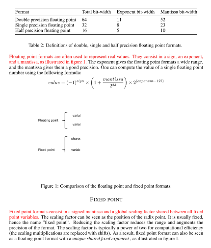
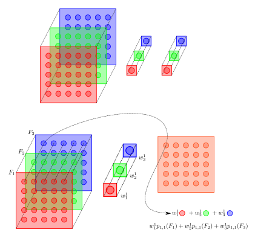
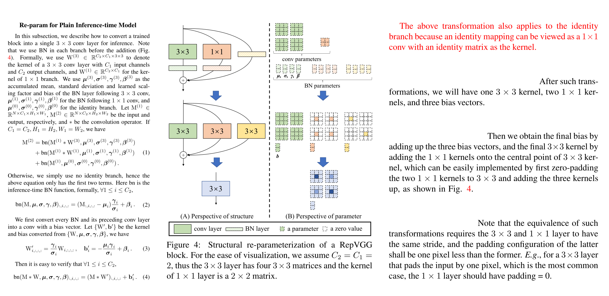

# Module9 : Déployer son réseau de neurones sur de l'embarqué

But de l'optimisation des modèles :

- Réduire la taille du modèle.
- Accélérer le temps d'inférence.
- Réduire la consommation énergétique du modèle.

Quelles sont les différentes façon d'optimiser une modèle ?

- Tous les paramètres contribuent ils à la performance du modèle ? **Pruning**
- Réduire sa précision numérique : les paramètres et fonctions d'activations d'un modèle sont le plus souvent représentées en `float32`. Est-ce nécessaire ? **Quantification**
- Toutes les opérations du graphe d'un modèle sont elles nécéssaires durant l'inférence ? **Fusion des couches**
- Améliorer les allers-retours entre GPU et CPU.
## Elagage

!!! info "TLDR"

    Une des première alternatives lors de l'optimisation des modèles et de se poser la question des paramètres (ie poids & biais). Tous les paramètres n'ont pas la même importance.

    L'idée ici est qu'un réseau entraîné peut être réduit à un réseau plus petit en supprimant les poids inutiles. En pratique, cela signifie que les pondérations "inutiles" sont fixées à zéro. En mettant les pondérations inutiles à zéro, l'inférence ou la prédiction peut être accélérée.

    De plus, les modèles élagués peuvent être compressés en modèles de taille plus petite, car des pondérations peu nombreuses entraînent des taux de compression plus élevés.

    Dans le cas de modèles créés via Tensoflow, cela se fait via la librairie **Tensorflow model optimization**.


La dernière décennie a montré qu'en général, les grands réseaux de neurones donnent de meilleurs résultats (avec par exemple l'arrivée des architetcures de type ResNet & les connexions résiduelles, qui ont complètement changé les méthodes de création des modèles). Mais les grands modèles d'apprentissage profond ont un coût énorme. Par exemple, pour entraîner le modèle GPT-3 d'OpenAI, qui compte 175 milliards de paramètres (700Go pour des poids en Float32), il faut avoir accès à d'énormes grappes de serveurs dotés de cartes graphiques très puissantes, et les coûts peuvent atteindre plusieurs millions de dollars. En outre, vous avez besoin de centaines de gigaoctets de VRAM et d'un serveur puissant pour exécuter le modèle.

https://blog.dataiku.com/making-neural-networks-smaller-for-better-deployment-solving-the-size-problem-of-cnns-using-network-pruning-with-keras

L'élagage des réseaux de neurones est une vieille idée qui remonte à 1990 (avec les travaux de Yan LeCun sur les lésions cérébrales optimales) et avant. L'idée est que parmi les nombreux paramètres du réseau, certains sont redondants et ne contribuent pas beaucoup à la sortie.

!!! info "Optimal Brain Damage"

    [Article](http://yann.lecun.com/exdb/publis/pdf/lecun-90b.pdf)

    We have used information-theoretic ideas to derive a  class of practical and nearly optimal schemes for adapting the size of a  neural network. By removing unimportant weights from a  network, several improvements can be expected: better generalization, fewer training examples required, and improved speed of learning and/or classification. The basic idea is to use second-derivative information to make a  tradeoff between network complexity and training set error. Experiments confirm the usefulness of the methods on a real-world application.

Si vous pouviez classer les neurones du réseau en fonction de leur contribution, vous pourriez alors supprimer les neurones de rang inférieur du réseau, ce qui permettrait d'obtenir un réseau plus petit et plus rapide.

**L'obtention de réseaux plus rapides/petits est importante pour l'exécution de ces réseaux d'apprentissage profond sur les appareils mobiles.**

Le classement peut être effectué en fonction de la moyenne $L_1$/$L_2$ des poids des neurones, de leurs activations moyennes, du nombre de fois où un neurone n'était pas nul sur un ensemble de validation, et d'autres méthodes créatives. Après l'élagage, la précision diminue (pas trop, espérons-le, si le classement est intelligent) et le réseau est généralement entraîné davantage pour récupérer.


!!! question "Question"

    Eh bien on n'a qu'à élaguer GPT-3 après son entraînement et il tournera sur un smartphone non ?


Le problème de l'élagage des réseaux de neurones après l'entraînement est qu'il ne réduit pas les coûts de réglage de tous les paramètres excessifs. Même si vous parvenez à comprimer un réseau neuronal formé en une fraction de sa taille d'origine, vous devrez toujours payer les coûts complets de son entraînement.

La question est de savoir si vous pouvez trouver le sous-réseau optimal sans former le réseau neuronal complet.

En 2018, Jonathan Frankle et Michael Carbin, deux chercheurs en IA au MIT CSAIL et coauteurs, ont publié un article intitulé ["The Lottery Ticket Hypothesis"](https://arxiv.org/pdf/1803.03635.pdf), qui prouve que pour de nombreux modèles d'apprentissage profond, il existe de petits sous-ensembles qui peuvent être formés avec une précision totale.

Un autre article [To prune, or not to prune: exploring the efficacy of pruning for model compression](https://arxiv.org/abs/1710.01878) montre alors qu'élaguer les réseaux de neurones est généralement pertinent.

L'éfficacité de l'élagage suggère que la plupart des modèles sont sur-paramétrés et que seul un petit nombre de paramètres possède un impact sur lmes performances du modèle. Les autres paramètres ne faisant que *prendre de la place*.


!!! quote "Citation"

    **we find large-sparse models to consistently outperform small-dense models and achieve up to 10x reduction in number of non-zero parameters with minimal loss in accuracy.**

Les modèles de deep learning sont de plus en plus gros et gourmands en ressources. Si cela ne pose pas de problèmes lorsque que le modèle est hébergé dans des datacenters, cela peut poser un problème lorsque que l'on souhaite le déployer sur des environnements contraints en ressource : IoT, smartphone, MCU.

!!! quote "Citation"

    **Within the realm of model  compression techniques, pruning away (forcing to zero) the less salient connections (parameters) in the neural network has been shown to reduce the number of nonzero parameters in the model with little to no loss in the final model quality.**

### Idée

Transformer les matrices utilisées dans les opérations de produit matriciel ou de convolution en matrice creuse.

Une matrice creuse est une matrice qui possède beaucoup de zéros.

\[
    \begin{pmatrix}0 & 2 & 3 & 0 & 0 & 6\\ 0 & -1 & 3 & 0 & 0 & 6 \\ 0 & 4 & 3 & 0 & 0 & 8 \\ 0 & 2 & 6 & 9 & 0 & 0\end{pmatrix}
\]

L'article cherche à répondre à la qestion suivante :

- Du point de vue de l'inférence, étant donnée une borne maximale pour l'empreinte mémoire du modèle, comment obtenir le plus précis ?

Deux méthodes sont testées :

  - large-sparse : commencer avec un modèle large classique (Inception, ResNet...), mais élagué de façon à obtenir un modèle creux (sparse model) avec un petit nombre de paramètres non-nuls.
  - small-dense : entraîner de façon classique un petit modèle avec une taille similaire au modèle large-sparse.

!!! quote "Citation"

    **While pruning focuses on reducing the number of non-zero parameters, in principle, model pruning can be used in conjunction with other techniques to further reduce model size. Quantization techniques aim to reduce the number of bits required to represent each parameter from 32-bit floats to 8 bits or fewer**


### Méthode

\[
\begin{align}
W &=
\begin{bmatrix}
    W_{1,1} & W_{1,2} & \cdots & W_{1,n}\\
    W_{2,1} & W_{2,2} & \cdots & W_{2,n}\\
    \vdots & \vdots & \ddots & \vdots \\
    W_{m,1} & W_{m,2} & \cdots & W_{m,n}\\
\end{bmatrix} \nonumber\\
\end{align}
\]

Pour chaque couche choisie pour être élaguée, un masque binaire est construit de la même dimension que le tenseur de poids de la couche et il détermine quels poids participent à l'étape de feedforward.

Les poids sont ordonnés suivant leur valeurs absolues et l'on masque les poids de plus petite valeur absolue jusqu'à ce qu'un certain seuil $0 < s <1$ de valeurs masquées soit atteint.

i.e, au lieu d'avoir l'équation suivante

\[
\mathbf{x}_{2, i} = \sum_{j = 1}^{m} \mathbf{W}_{i, j} \mathbf{x}_{1, j} + \mathbf{b}_{i}
\]

durant l'étape de feeforward, on a l'équation suivante

\[
\mathbf{x}_{2, i} = \left( \sum_{j = 1}^{m} (\mathbf{W}_{i, j} \mathbf{M}_{i, j}) \mathbf{x}_{1, j} \right) + (\mathbf{b}_{i} \odot \mathbf{m}_{i}) \\
\]

où $\mathbf{M}$ et $\mathbf{m}$ sont des masques binaires :

\[
\begin{align}
\mathbf{M}_{i, j} =
  \begin{cases}
  0 & \text{if $|\mathbf{W}_{i, j}| < \lambda$} \\
  1 & \text{sinon} \\
  \end{cases}
\end{align}
\]

et

\[
\begin{align}
\mathbf{m}_{i} =
  \begin{cases}
  0 & \text{if $|\mathbf{b}_{i}| < \lambda$} \\
  1 & \text{sinon.} \\
  \end{cases}
\end{align}
\]

Lors de l'étape de rétropropagation, le gradient passant par les masque binaires seuls les poids non masquées sont mis à jour.

### Remarques

Au fur et à mesure que le taux d'apprentissage baisse, il a été observé que les poids élaguées alors que ce dernier est très petit sont difficilement compensés par les autres. Il est donc important de choisir le bon LRD et de ne pas élaguer tout le long de l'entraînement.

!!! quote "Citation"

    **Also note that since the weights are initialized randomly, the sparsity in the weight tensors does not exhibit any specific structure. Furthermore, the pruning method described here does not depend on any specific property of the network or the constituent layers, and can be extended directly to a wide-range of neural network architectures**.

## Travailler en basse précision

**Les ordinateurs ne peuvent utiliser qu'un nombre fini de bits pour représenter des nombres réels infinis.**

La précision avec laquelle nous pouvons les représenter dépend du nombre de bits que nous utilisons - la virgule flottante 32 bits étant la valeur par défaut pour la plupart des applications, y compris le deep learning. Il s'avère que les DNN peuvent travailler avec des types de données plus petits, avec moins de précision, comme les entiers de 8 bits. En gros, nous essayons de travailler avec une ligne de nombres qui se rapproche de la ligne éparse du bas. Les nombres sont quantifiés, c'est-à-dire discrétisés à certaines valeurs spécifiques, que nous pouvons ensuite représenter en utilisant des entiers au lieu de nombres à virgule flottante.

### Pourquoi ça nous intéresse


- L'arithmétique avec une profondeur de bit inférieure est plus rapide, en supposant que le matériel le supporte : sans pousser la réduction de précision trop long, les nouvelles architectures de GPU Nvidia permettent de faire un entraînement mixte des modèles en FP32-FP16. Même si le calcul en virgule flottante n'est pas "plus lent" que le calcul en entier sur les processeurs modernes, les opérations en virgule flottante 32 bits seront presque toujours plus lentes que, par exemple, les entiers 8 bits.
- En passant de 32 bits à 8 bits, nous obtenons (presque) 4x la réduction de la mémoire immédiatement. Des modèles de déploiement plus légers signifient qu'ils accaparent moins d'espace de stockage, qu'ils sont plus faciles à partager sur des bandes passantes plus petites, plus faciles à mettre à jour, etc.
- Des largeurs de bits plus faibles signifient également que nous pouvons condenser plus de données dans les mêmes caches/registres. Cela signifie que nous pouvons réduire la fréquence à laquelle nous accédons aux choses à partir de la RAM, qui consomme généralement beaucoup de temps et d'énergie.
- L'arithmétique à virgule flottante est difficile - c'est pourquoi elle n'est pas toujours prise en charge sur les microcontrôleurs de certains appareils embarqués à très faible puissance, comme les drones, les montres ou les appareils IoT. Le support des nombres entiers, en revanche, est facilement disponible.

### Pourquoi ça marche ?

1. Les réseaux neuronaux sont connus pour être assez robustes au bruit et aux autres petites perturbations une fois formés. Cela signifie que même si nous arrondissons subtilement les chiffres, nous pouvons nous attendre à une réponse raisonnablement précise.
2. Les poids et les activations d'une couche particulière ont souvent tendance à se situer dans une petite fourchette, qui peut être estimée à l'avance. Cela signifie que nous n'avons pas besoin de la capacité de stocker des poids allant de $10^6$ à $10^{-6}$ dans le même type de données, ce qui nous permet de concentrer nos précautions sur moins de bits dans une plage plus petite, disons -3 à +3. Par exemple, une des fonctions d'activations utilisées dans les architecture dédiés est la fonction

\[
    \mathrm{ReLU}6(x) := \min(\max(0,x),6).
\]

!!! info "L'arithmétique en virgule flottante"

    

    Source : [Training deep neural networks with low precision multiplications.](https://arxiv.org/pdf/1412.7024.pdf)
## La quantification

!!! info "Quantification"

    

    Source :[Quantization and Training of Neural Networks for Efficient Integer-Arithmetic-Only Inference](https://arxiv.org/pdf/1712.05877.pdf)

    Lorsque l'on utilise les méthodes de "Quantization aware training" avec TensorFlow, c'est ce schéma là qui est utilisé.


Contrairement aux nombres à virgule flottante, il n'y a pas de standards pour représenter des nombres à virgules fixes. Le schéma de quantification standard utilisé en deep learning requiert les conditions suivantes.

1. La transformation doit être affine, ainsi on a une bijection et on peut retrouver directment les nombres réels en faisant la transformation inverse.
2. On doit pouvoir représenter $0$, `0.f`,  précisément. Si l'on fait une quantification, puis la transformation inverse, et que l'on travaille en 8-bits, **alors $2^8 = 256$ nombres retrouveront leur valeur de façon exacte**. Si l'on s'arrange pour que `0.f` soit une de ces 256 valeurs, alors les auteurs de [Quantization and Training of Neural Networks for EfficientInteger-Arithmetic-Only Inference](https://arxiv.org/pdf/1712.05877.pdf) montrent que les DNN ont une précision améliorée par rapport aux autres schémas de quantification. Le `0.f` ayant une signification précise en Deep Learning : par exemple pour l'enjambement ("padding").

La quantification en entier 8 bits n'est qu'un des schémas d'optimisation, TensorFlow permet de convertir par exemple en :

- float16
- int16
- int8
- int16 activations et int8 pour les poids.

|                Technique                 |        Data requirements         | Size reduction |          Accuracy           |            Supported hardware            |
| :--------------------------------------: | :------------------------------: | :------------: | :-------------------------: | :--------------------------------------: |
|    Post-training float16 quantization    |             No data              |   Up to 50%    | Insignificant accuracy loss |                 CPU, GPU                 |
| Post-training dynamic range quantization |             No data              |   Up to 75%    |        Accuracy loss        |            CPU, GPU (Android)            |
|    Post-training integer quantization    | Unlabelled representative sample |   Up to 75%    |    Smaller accuracy loss    | CPU, GPU (Android), EdgeTPU, Hexagon DSP |
|       Quantization-aware training        |      Labelled training data      |   Up to 75%    |   Smallest accuracy loss    | CPU, GPU (Android), EdgeTPU, Hexagon DSP |

[Source](https://www.tensorflow.org/lite/performance/model_optimization#types_of_optimization)


## ONNX

Il existe de nombreux frameworks pour entraîner un modèle d'apprentissage profond. Les plus populaires sont Tensorflow et PyTorch. Cependant, un modèle entraîné par Tensorflow ne peut pas être utilisé avec PyTorch et vice-versa.

Fruit d’une collaboration entre AWS, Facebook et Microsoft, ONNX permet le transfert des modèles de deep learning entre différents frameworks.

ONNX est l'abréviation de Open Neural Network Exchange.


!!! quote "Citation"

    [ONNX](https://onnx.ai/) est un format ouvert conçu pour représenter les modèles d'apprentissage automatique. ONNX définit un ensemble commun d'opérateurs - les éléments constitutifs des modèles d'apprentissage automatique et d'apprentissage profond - et un format de fichier commun pour permettre aux développeurs d'IA d'utiliser les modèles avec une variété de cadres, d'outils, de moteurs d'exécution et de compilateurs.

Vous pouvez entraîner votre modèle dans le framework de votre choix, puis le convertir au format ONNX.

L'énorme avantage d'avoir un format commun est que le logiciel ou le matériel qui charge votre modèle au moment de l'exécution n'a besoin que d'être compatible avec ONNX.


L'intérêt d'ONNX est l'inter-opérabilité : ONNX supporte un nombre impressionnant de frameworks. L'ensemble des frameworks listés ci-dessous peuvent être utilisés pour entrainer un modèle de machine learning de façon transparente, et ONNX se chargera de convertir ce modèle au format `.onnx`, qui lui permettra d'être utilisé sur un grand nombre de plate-forme.


!!! info "Ce qu'il faut retenir"

    ONNX est aux modèles d'apprentissage automatique ce que JPEG est aux images ou MPEG aux vidéos.
### tf2ONNX

[Repo Github de tf2onnx](https://github.com/onnx/tensorflow-onnx)

## TensorRT

TensorRT de NVIDIA est un SDK pour l'inférence d'apprentissage profond de haute performance.

Il fournit des API pour effectuer l'inférence de modèles pré-entraînés et génère des moteurs d'exécution optimisés pour votre plateforme.

Cette optimisation s'effectue de différentes manières. Par exemple, TensorRT nous permet d'utiliser l'arithmétique INT8 (entier de 8 bits) ou FP16 (virgule flottante de 16 bits) au lieu de l'habituelle FP32. Cette diminution de la précision arithmétique peut accélérer de manière significative l'inférence avec une diminution minime de la précision du modèle.

## Les architectures dédiées

### MobileNet

MobileNet est une série d'architectures de CNN, démarrée en 2017 :

- [MobileNets: Efficient Convolutional Neural Networks for Mobile Vision Applications](https://arxiv.org/abs/1704.04861)
- [MobileNetV2: Inverted Residuals and Linear Bottlenecks](https://arxiv.org/abs/1801.04381)
- [Searching for MobileNetV3](https://arxiv.org/abs/1905.02244)

Alors que MobileNetV3 utilise les méthodes de "recherche architecturale neuronale" (NAS : Neural Architecture Search), ie un algorithme de deep learning cherche des architectures de deep learning optimale (votre serviteur ici présent n'en connait pas encore assez pour expliquer ça de façon plus claire); les modèles MobileNetV1 et MobileNetV2 reposent principalement sur les couches que l'on appelle les **Separable DepthWise Convolutions**. Ce sont ces nouvelles couches là qui nous intéressent.

Pour comprendre l'intérêt de ces dernières, il faut se replonger d'abord dans les convolutions classiques.
#### Separable DepthWise Convolutions

Lorsque l'on fait de l'analyse numérique, ou de l'algorithmie, une notion très importante est la "compléxité algorithmique" qui détermine un ordre de grandeur du nombre d'opérations (additions et multiplications) nécéssaires pour arriver au résultat voulu. De façon plus général, le coût calculatoire peut être important à prendre en compte.

Supposons que l'on a en entrée une feature map de dimensions $(h_{\mathrm{in}}, w_{\mathrm{in}},c_{\mathrm{in}})$, selon la convention (Height, Width, Channels). Appliquer alors un noyau de convolution de dimensions $(k,k,c_{\mathrm{in}},c_{\mathrm{out}})$ pour produire une feature map en sortie de dimensions $(h_{\mathrm{in}}, w_{\mathrm{in}},c_{\mathrm{out}})$ demande le nombre d'opérations suivant.

\[
h_{\mathrm{in}} \cdot w_{\mathrm{in}} \cdot c_{\mathrm{in}} \cdot k^{2} \cdot c_{\mathrm{out}}
\]

Chaque pixel de la feature map d'entrée est le centre d'un filtre de convolution de taille $(k,k)$, comme on a $h_{\mathrm{in}} \cdot w_{\mathrm{in}} \cdot c_{\mathrm{in}}$ pixels en tout en entrée on a $h_{\mathrm{in}} \cdot w_{\mathrm{in}} \cdot c_{\mathrm{in}} \cdot k^{2}$ opérations pour **une** feature map en sortie. On souhaite $c_{\mathrm{out}}$ feature maps en sortie, donc le coût total est bien le dernier cité.


!!! info "Remarque"

    Comme vous le voyez ici, les dimensions spatiales des feature maps (hauteur, largeur) n'ont pas changées. On est donc dans le cas où la convolution ne réduit pas les dimensions spatiales, par exemple dans TensorFlow on a fixé le paramêtre `padding="same"`.

La différence majeure avec une convolution 2d classique, est qu'une separable depthWise convolution est divisée en deux opérations.

1. Une première opération, qui produit une nombre de fature map identique au nombre de feature maps d'entrées.
2. Une convolution $1\times1$, qui elle est responsable de générer le nombre de feature maps nécéssaires en sortie.


!!! example "Application d'une convolution $1\times1$"

    

    Notons $p_{i,j}(F_{k})$ le pixel à la coordonée $(i,j)$ dans la feature map $F_{k}$.

    Chacun des pixels obtenus dans la feature map en sortie est alors une combinaison linéaire des pixels aux mêmes coordonnées dans les features maps d'entrée. Les coefficients de la combinaison linéaire étant **appris** par le réseau et les mêmes pour tous les pixels de la feature map de sorite, ce sont les coefficients $(w_{1}^{1}, w_{2}^{1}, w_{3}^{1})$ du filtre de la convolution $1\times1$.


On se retrouve donc avec le nombre d'opérations suivant.

\[
h_{\mathrm{in}} \cdot w_{\mathrm{in}} \cdot c_{\mathrm{in}} (k^{2} + c_{\mathrm{out}}).
\]

Si l'on fait le rapport du nombre d'opérations nécessaires pour ces deux couches, on obtient :

\[
\frac{h_{\mathrm{in}} \cdot w_{\mathrm{in}} \cdot c_{\mathrm{in}} (k^{2} + c_{\mathrm{out}})}{h_{\mathrm{in}} \cdot w_{\mathrm{in}} \cdot c_{\mathrm{in}} \cdot k^{2} \cdot c_{\mathrm{out}}} = \frac{1}{k^{2}}+\frac{1}{c_{\mathrm{out}}}
\]

Généralement, on a $k \geq 3$ et $c_{\mathrm{out}} >> 1$, ce qui nous donne $\frac{1}{k^{2}}+\frac{1}{c_{\mathrm{out}}} < 1$. Ce qui veut dire que pour produire le même nombre de feature maps en sortie, une separable depthwise convolution est beaucoup plus efficace noveau nombre d'opérations.
### RepVGG

[RepVGG: Making VGG-style ConvNets Great Again](https://arxiv.org/abs/2101.03697) est un article sorti en Mars 2021 arguant que si les connexions résiduelles des architectures de type ResNet sont très efficaces pour l'entraînement des modèles en leur permettant d'atteindre de très hautes performances, c'est en frein lorsque l'on doit déployer de telles architectures sur de l'embarqué, car les connexions résiduelles consomment de la mémoire inutile lors de l'inférence, et réduisent donc la vitesse d'inférence.

L'idée de l'article est alors la suivante : **avoir deux topologies de modèles différentes**.

1. Une topologie avec des connexions résiduelles et des architectures de types ResNet.
2. Une topologie linéaire avec une architecture du style VGG de lors du déploiement du modèle.

!!! question "Question"

    Comment passer d'une architetcure à une autre ?

L'article s'appuie sur une des techniques classiques d'optimisation des modèles : la fusion Convolution-Batchnormalization.

!!! quote "Abstract"

    We present a simple but powerful architecture of convolutional neural network, which has a VGG-like inference-time body composed of nothing but a stack of $3\times3$ convolution and ReLU, while the training-time model has a multi-branch topology. Such decoupling of the training-time and inference-time architecture is realized by a structural re-parameterization technique so that the model is named RepVGG. On ImageNet, RepVGG reaches over $80\%$ top-1 accuracy, which is the first time for a plain model, to the best of our knowledge. On NVIDIA 1080Ti GPU, RepVGG models run $83\%$ faster than ResNet-$50$ or $101\%$ faster than ResNet-$101$ with higher accuracy and show favorable accuracy-speed trade-off compared to the state-of-the-art models like EfficientNet and RegNet.



#### La fusion Convolution-Batchnorm

La fusion d'une couche de convolution avec une couche de batchnorm ressort les poids et biais d'une nouvelle couche de convolution avec les noyaux de convolutions de même dimension.

Etant donné le tenseur $W$ de poids des noyaux de convolution d'une couche convolutive et le tenseur de $4$ paramètres $B=(\gamma, \beta, \mu, \sigma)$ d'une couche de batchnormalization, on obtient les nouveaux poids et poids de la nouvelle couche convolutive via les formules suivantes.


\[
\widehat{W}_{:,:,:,j} := \frac{\gamma_{j} \cdot W_{:,:,:,j}}{\sqrt{\sigma_{j} + \epsilon}}
\]


\[
b_{j} = \beta_{j} - \frac{\mu_{j}\cdot\gamma_{j}}{\sqrt{\sigma_{j} + \epsilon}}
\]

On remarque ici que le biais de la nouvelle couche de convolution ne dépend que des paramètres de la couche de batchnorm. **Ce qui est cohérent avec la pratique de ne jamais mettre de biais dans une couche de convolution lorsqu'elle est suivie par une couche de batchnorm**.


!!! info "Remarque"

    Le $\epsilon$ présent ici est pour s'assurer que l'on ne divise jamais pas zéro, dans la pratique il est fixé à $0,001$.

Ce qui nous donne, dans la pratique la fonction suivante.

!!! python "Fusion Conv-BN"

    ```python
    # https://scortex.io/batch-norm-folding-an-easy-way-to-improve-your-network-speed/
    # https://github.com/DingXiaoH/RepVGG/blob/4da799e33c890c624bfb484b2c35abafd327ba40/repvgg.py#L68

    def fuse_bn_conv(weights_conv, weights_bn, eps=0.001):
        gamma = np.reshape(weights_bn[0], (1,1,1,weights_bn[0].shape[0]))
        beta = weights_bn[1]
        mean = weights_bn[2]
        variance = np.reshape(weights_bn[3], (1,1,1,weights_bn[3].shape[0]))

        new_weights = (weights_conv[0]*gamma) / np.sqrt(variance + eps)
        new_bias = beta - mean*gamma/np.sqrt(variance+eps)

        new_bias = np.reshape(new_bias, weights_bn[3].shape[0])

        return new_weights, new_bias
    # In the code above, the reshaping is necessary to prevent a mistake if the dimension of the output O was the same as the dimension of the input I.
    ```

Détaillons.

Pour cela, définissons un modèle dummy qui nous servira pour nos explications.

!!! tf "Modèle dummy"

    ```python
    img_shape = 32, 32, 3
    input = Input(img_shape)
    x= Conv2D(filters = 16,
              kernel_size=3,
              padding='same',
              use_bias=True,
              kernel_initializer='he_uniform',
              name='testing_conv_init')(input)
    x= BatchNormalization(name=f'testing_bn_init')(x)
    model = Model(input, x)
    model.summary()
    ```

##### Etude de la couche convolutive

!!! tf "Modèle dummy"

    ```python
    weights_conv = model.get_layer("testing_conv_init").get_weights()
    ```
    ```python
    type(weights_conv)
    ```
    list

    ```python
    len(weights_conv)
    ```
    2

Les poids dans une couche convolutive sont une liste de deux éléments :

- `weights[0]` correspond aux poids des noyaux de convolution,
- `weights[1]` correspond aux biais.


```python
type(weights_conv[0])
```
numpy.ndarray

```python
weights_conv[0].shape
```
(3, 3, 3, 16)

Les axes du tenseur de poids suivent les dimensions suivantes :

- kernel_size1 : hauteur du kernel,
- kernel_size2 : largeur du kernel,
- channels_in : nombre des feature maps en entrée,
- channels_out : nombres de features maps (filters) en sortie.

`channels_out` est définie dans la couche convolutive via le paramètres `filters`, alors que la valeur `channels_in` est elle directement déterminée par le tenseur en entrée. C'est une différence de TensorFlow par rapport à Pytorch où `channels_in` et `channels_out` sont tous les deux des paramètres des couches convolutives.

Ainsi, si l'on veut voir les poids du noyau de convolution par rapport au canal $0$ en la feature map de sortie $5$, on les obtient en regardant :

```python
weights_conv[0][:,:,0,5]
```

Par défaut, les biais des couches de convolutions sont tous initialisés à zéro.

##### Etude de la batchnorm

!!! tf "Modèle dummy"

    ```python
    weights_bn = model.get_layer('testing_bn_init').get_weights()
    ```
    ```python
    type(weights_bn)
    ```
    list

    ```python
    len(weights_bn)
    ```
    4

Dans une couche de BatchNormalization, on a 4 types de poids.

- Les deux paramètres de scaling $\gamma$ et de biais $\beta$.
- Les deux paramètres correspondant à la moyenne $\mu$ et la variance $\sigma$.

Tous ces paramètres ne sont pas entraînables, comme on peut le voir dans la liste suivante.

```python
[(var.name, var.trainable) for var in model.get_layer('testing_bn_init').variables]
```

```bash
[('testing_bn_init/gamma:0', True),
 ('testing_bn_init/beta:0', True),
 ('testing_bn_init/moving_mean:0', False),
 ('testing_bn_init/moving_variance:0', False)]
```

```python
backend.shape(model.get_layer('testing_bn_init').get_weights())
```
Les $4$ paramètres sont tous des vecteurs de dimension $16$, ce qui correspond au nombre de feature maps en sortie de la couche convolutive.
##### Nouveau tenseur de poids

Discutons premièrement de la formulation du nouveau tenseur de poids, et voyons pourquoi on modifie la forme de vecteurs $\gamma$ et $\sigma$.

$W_{:,:,:,j}$ correspond dans la formule au noyau de convolution complet de la $j$-ième feature map de sortie.

```python
weights_conv = model.get_layer("testing_conv_init").get_weights()
weights_conv[0].shape
```

```bash
(3, 3, 3, 16)
```

On a $16$ noyaux de convolution, chacun de dimensions $(3,3,3)$. Par exemple, pour $j=1$.

```python
weights_conv[0][:,:,:,1].shape
```

```bash
(3, 3, 3)
```
Les vecteur $\gamma$ et $\sigma$ étant des vecteurs de dimension $16$, on va les "transformer en tenseur" de dimensions $(1,1,1,16)$ pour bien faire correspondre le produit suivant chaque axe.

```python
variance = np.reshape(weights_bn[3], (1,1,1,weights_bn[3].shape[0]))
variance.shape
```

```bash
(1, 1, 1, 16)
```
```python
gamma = np.reshape(weights_bn[0], (1,1,1,weights_bn[0].shape[0]))
gamma.shape
```

```bash
(1, 1, 1, 16)
```


Au final, la formule

```python
new_weights = (weights_conv[0]*gamma) / np.sqrt(variance + eps)
```

résume tout cela, tous les tenseurs ayant le mêmbre nombre d'axes, les opérations sont vectorisées et se font axe par axe.
##### Nouveau tenseur de biais

Le opérations de `reshape` n'ont pas ajouter de nouveaux scalaires, juste des axes, le calcul du biais se fait alors élément par élément pour tout $j$.


##### Vérification via les développements limités

Créons un tenseur de poids $W$ repéresentatif du noyau d'une convolution et un tenseur de poids $B=(\gamma, \beta, \mu, \sigma)$ représentatif des coefficients d'une batchnormalization.

Pour vérifier si tout marche bien, fixons volontairement le tenseur poids comme un tenseur de dimensions $(3,3,4,5)$, la dimension du noyau est toujours fixé à $(3,3)$ dans RepVGG, seules les dimensions `channels_in` et `channels_out` peuvent changer.

Tous les coefficients du tenseur de poids seront fixés à $1$.

```python
conv_weights = np.ones(3*3*4*5).reshape((3,3,4,5))
conv_weights.shape
```

```bash
(3,3,4,5)
```
La dimension `channels_out` ayant été fixée à $5$, les vecteurs de la batchnormalization seront tous des vecteurs de dimension $5$. Fixons les coefficients suivants.

```python
def batchnorm_variables(gamma_coef: float, beta_coef: float, mu_coef: float, sigma_coef: float, channels: int):
    gamma = gamma_coef*np.ones(channels)
    beta = beta_coef*np.ones(channels)
    mu = mu_coef*np.ones(channels)
    sigma = sigma_coef*np.ones(channels)

    return [gamma, beta, mu, sigma]
```

```python
conv, bn = fuse_bn_conv([conv_weights], batchnorm_variables(1,2,1,4,5))
```

Par définition, le nouveau tenseur de poids $\widehat{W}$ de la convolution résultant de la fusion de l'ancienne convolution et de la batchnorm est donné par formule suivante.

\[
\widehat{W}_{:,:,:,j} := \frac{\gamma_{j} \cdot W_{:,:,:,j}}{\sqrt{\sigma_{j} + \epsilon}}
\]

De façon générale, pour $\gamma_{j}, \sigma_{j}$, on a le développement limité suivant.

\[
\widehat{W}_{:,:,:,j} := \frac{\gamma_{j} \cdot W_{:,:,:,j}}{\sqrt{\sigma_{j} + \epsilon}} = \frac{\gamma_{j}}{\sqrt{\sigma_{j}}}\left[1- \frac{1}{2\sigma_{j}}\epsilon + o(\epsilon^{2})\right]W_{:,:,:,j}
\]

Dans notre cas, $\forall j, \gamma_{j} = 1, \sigma_{j} = 4$ d'où

\[
\widehat{W}_{:,:,:,j} := \frac{W_{:,:,:,j}}{\sqrt{4 + \epsilon}} = \left[\frac{1}{2}- \frac{1}{16}\epsilon + o(\epsilon^{2})\right]W_{:,:,:,j} \simeq \left[\frac{1}{2}- \frac{1}{16}\epsilon\right]W_{:,:,:,j}
\]


```python
def compute_scaling_weight_factor(gamma, sigma):
    return gamma/np.sqrt(sigma)*(1-0.001/(2*sigma))

scale = compute_scaling_weight_factor(1,4)
scale
```

```python
conv[:,:,:,4]
```

```bash
array([[[0.49993751, 0.49993751, 0.49993751, 0.49993751],
        [0.49993751, 0.49993751, 0.49993751, 0.49993751],
        [0.49993751, 0.49993751, 0.49993751, 0.49993751]],

       [[0.49993751, 0.49993751, 0.49993751, 0.49993751],
        [0.49993751, 0.49993751, 0.49993751, 0.49993751],
        [0.49993751, 0.49993751, 0.49993751, 0.49993751]],

       [[0.49993751, 0.49993751, 0.49993751, 0.49993751],
        [0.49993751, 0.49993751, 0.49993751, 0.49993751],
        [0.49993751, 0.49993751, 0.49993751, 0.49993751]]])
```

Ce qui correspond bien à l'approximation obtenue par développement limité. On peut par exemple vérifier si $\widehat{W}$ est approximativement égal à `conv` à $10^{-3}$ avec la commande `np.isclose`. Si `np.mean(...)` $< 1$ alors le calcul est faux.

```python
conv_weights_real = scale*np.ones(3*3*4*5).reshape((3,3,4,5))
np.mean(np.isclose(conv, conv_weights_real, rtol=1e-3))
```

```bash
1.0
```

Pour le biais, on a la formule suivante.

\[
b_{j} = \beta_{j} - \frac{\mu_{j}\cdot\gamma_{j}}{\sqrt{\sigma_{j} + \epsilon}} = \beta_{j} - \frac{\mu_{j}\cdot\gamma_{j}}{\sqrt{\sigma_{j}}}\left[1- \frac{1}{2\sigma_{j}}\epsilon + o(\epsilon^{2})\right]
\]

dans notre cas, on a :

- $\beta_{j} = 2$,
- $\gamma_{j} = 1$,
- $\mu_{j} = 1$,
- $\sigma_{j} = 4$.

\[
b_{j} = 2 - \frac{1}{2}\left[1- \frac{1}{8}\epsilon + o(\epsilon^{2})\right] \simeq 2 - \frac{1}{2} - \frac{1}{16}\epsilon
\]

```python
def compute_scaling_bias_factor(gamma, beta, mu, sigma):
    a = (mu*gamma)/np.sqrt(sigma)
    b = 1 - 0.001/(2*sigma)

    return beta-a*b
```

```python
bias_scale = compute_scaling_bias_factor(1,2,1,4)
bn_real = bias_scale*np.ones(5)
np.mean(np.isclose(bn_real, bn, rtol=1e-3))
```


- https://bdtechtalks.com/2020/10/12/deep-learning-neural-network-pruning/
- https://github.com/BenWhetton/keras-surgeon
- https://jacobgil.github.io/deeplearning/pruning-deep-learning
- https://heartbeat.fritz.ai/research-guide-pruning-techniques-for-neural-networks-d9b8440ab10d
- https://blog.dataiku.com/making-neural-networks-smaller-for-better-deployment-solving-the-size-problem-of-cnns-using-network-pruning-with-keras
