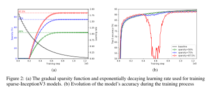

# TP Module 9 : Optimisation des modèles, élagage

## Import des librairies, création du dataset

Importons d'abord les librairies qui nous serons nécessaires.

!!! tf "TensorFlow"

    ```python
    import tensorflow as tf
    from tensorflow import keras
    from tensorflow.keras.models import load_model

    from typing import List, Tuple

    import numpy as np
    import pandas as pd
    import tensorflow as tf
    from loguru import logger
    import os
    import random
    import datetime
    import time

    # freeze de l'aléatoire, pour avoir des expériences reproductibles.
    RANDOM_SEED = 42

    os.environ['PYTHONHASHSEED'] = str(RANDOM_SEED)
    random.seed(RANDOM_SEED)
    np.random.seed(RANDOM_SEED)
    os.environ['TF_DETERMINISTIC_OPS'] = '1'
    tf.random.set_seed(RANDOM_SEED)
    ```


Comme nous aurons besoin de créer de nouveaux des datasets pour l'entrainement, décrivons une classe qui nous permettra de le faire.

!!! tf "Tensorize"

    ```python
    class Tensorize(object):
        """Class used to create tensor datasets for TensorFlow.

        Args:
            object (object): The base class of the class hierarchy, used only to enforce
                WPS306. See https://wemake-python-stylegui.de/en/latest/pages/usage/
                violations/consistency.html#consistency.
        """

        def __init__(
            self, n_classes: int, img_shape: Tuple[int, int, int], random_seed: int
        ) -> None:
            """Initialization of the class Featurize.

            Initialize the class the number of classes in the datasets, the shape of the
            images and the random seed.

            Args:
                n_classes (int): Number of classes in the dataset.
                img_shape (Tuple[int, int, int]): Dimension of the image, format is (H,W,C).
                random_seed (int): Fixed random seed for reproducibility.
            """
            self.n_classes = n_classes
            self.img_shape = img_shape
            self.random_seed = random_seed
            self.AUTOTUNE = tf.data.experimental.AUTOTUNE

        def load_images(self, data_frame: pd.DataFrame, column_name: str) -> List[str]:
            """Load the images as a list.

            Take the dataframe containing the observations and the labels and the return the
            column containing the observations as a list.

            Args:
                data_frame (pd.DataFrame): Dataframe containing the dataset.
                column_name (str): The name of the column containing the observations.

            Returns:
                The list of observations deduced from the dataframe.
            """
            return data_frame[column_name].tolist()

        def load_labels(self, data_frame: pd.DataFrame, column_name: str) -> List[int]:
            """Load the labels as a list and encode them.

            Take the dataframe containing the observations and the labels and the return the
            column containing the labels as an encoded list.

            The encoding is done by taking the set of labels, alphabetically sorted, and
            then transforming them as integers starting from 0.

            `from sklearn.preprocessing import LabelEncoder` works well to encode labels,
            but if the dataset is huge, the time it takes to encode all the labels is
            growing fast. We use anumpy and vectorization to speed up the time.

            See the StackOverflow question :
            [Question](https://stackoverflow.com/questions/45321999/
            how-can-i-optimize-label-encoding-for-large-data-sets-sci-kit-learn)

            Args:
                data_frame (pd.DataFrame): Dataframe containing the dataset.
                column_name (str): The name of the column containing the labels.

            Returns:
                The list of encoded labels deduced from the dataframe.
            """
            label_list = data_frame[column_name].tolist()
            classes = sorted(set(label_list))
            logger.info(f"Found following labels {classes}")

            labels = np.unique(label_list, return_inverse=True)[1]
            dic = dict(zip(label_list, labels))
            logger.info(f"Dictionnary creation {dic}")
            vectorized_get = np.vectorize(dic.get)

            return vectorized_get(label_list)

        def parse_image_and_label(
            self, filename: str, label: int
        ) -> Tuple[np.ndarray, int]:
            """Transform image and label.

            Parse image to go from path to a resized np.ndarray, and parse the labels to
            one-hot encode them.

            Args:
                filename (str): The path of the image to parse.
                label (int): The label of the image, as an int, to one-hot encode.

            Returns:
                A np.ndarray corresponding to the image and the corresponding one-hot label.
            """
            resized_dims = [self.img_shape[0], self.img_shape[1]]
            # convert the label to one-hot encoding
            label = tf.one_hot(label, self.n_classes)
            # decode image
            image = tf.io.read_file(filename)
            # Don't use tf.image.decode_image,
            # or the output shape will be undefined
            image = tf.image.decode_jpeg(image)
            # This will convert to float values in [0, 1]
            image = tf.image.convert_image_dtype(image, tf.float32)
            image = tf.image.resize(image, resized_dims)

            return image, label

        def train_preprocess(
            self, image: np.ndarray, label: List[int]
        ) -> Tuple[np.ndarray, List[int]]:
            """Augmentation preprocess, if needed.

            Args:
                image (np.ndarray): The image to augment.
                label (List[int]): The corresponding label.

            Returns:
                The augmented pair.
            """
            image = tf.image.random_flip_left_right(image)
            image = tf.image.random_flip_up_down(image)

            return image, label

        def create_dataset(
            self,
            data_path: str,
            batch: int,
            repet: int,
            prefetch: int,
            augment: bool,
        ) -> tf.data.Dataset:
            """Creation of a tensor dataset for TensorFlow.

            Args:
                data_path (str): Path where the csv file containing the dataframe is
                    located.
                batch (int): Batch size, usually 32.
                repet (int): How many times the dataset has to be repeated.
                prefetch (int): How many batch the CPU has to prepare in advance for the
                    GPU.
                augment (bool): Does the dataset has to be augmented or no.

            Returns:
                A batch of observations and labels.
            """
            df = pd.read_csv(data_path)
            features = self.load_images(data_frame=df, column_name="filename")
            labels = self.load_labels(data_frame=df, column_name="label")

            dataset = tf.data.Dataset.from_tensor_slices((features, labels))
            dataset = dataset.shuffle(len(features), seed=self.random_seed)
            dataset = dataset.repeat(repet)
            dataset = dataset.map(
                self.parse_image_and_label, num_parallel_calls=self.AUTOTUNE
            )
            if augment:
                dataset = dataset.map(
                    self.train_preprocess, num_parallel_calls=self.AUTOTUNE
                )
            dataset = dataset.batch(batch)
            dataset = dataset.cache()
            return dataset.prefetch(prefetch)
    ```

et créons nos 3 datasets classiques.

!!! warning "Attention"

    Bien vérifier sur où pointent les adresses dans les csv.

!!! tf "ds, ds_val, ds_train"

    ```python
    ts = Tensorize(
                n_classes=2,
                img_shape=[224,224,3],
                random_seed=42,
            )

    ds = ts.create_dataset(
        "prepared_dataset/train.csv",
        32,
        1,
        1,
        True,
    )

    ds_val = ts.create_dataset(
        "prepared_dataset/val.csv",
        32,
        1,
        1,
        True,
    )

    ds_test = ts.create_dataset(
        "prepared_dataset/test.csv",
        32,
        1,
        1,
        True,
    )
    ```

Une fois que l'on est là, on peut charger notre modèle de base, entraîné sans optimisations particulières.

```python
model_vanilla = load_model("../facemask_detector.h5")
model_vanilla.evaluate(ds_test)
```

!!! ubuntu "Remarque"

    Si l'on voit voir la taille du modèle, on peut utiliser la commande shell suivante :

    ```bash
    # Check size
    du --all -h ../facemask_detector.h5
    ```

    Ne pas oublier le "!" avant si vous le faites dans un notebbok jupyter.

    ```bash
    # Check size
    !du --all -h ../facemask_detector.h5
    ```

## Pruning/Elagage

Comme dit précédemment, pour pouvoir appliquer l'élagage pour optimiser le modèle, on va avoir besoin de la librairie **tensorflow-model-optimization**.

!!! tf "TFMOT"

    ```python
    !pip install -q tensorflow-model-optimization
    import tensorflow_model_optimization as tfmot
    ```

Pour chaque couche choisie pour être élaguée, un masque binaire est construit de la même dimension que le tenseur de poids de la couche et il détermine quels poids participent à l'étape de feedforward.

Les poids sont ordonnés suivant leur valeurs absolues et l'on masque les poids de plus petite valeur absolue jusqu'à ce qu'un certain seuil $s \in ]0,1[$ de valeurs masquées soit atteint.

Lors de l'étape de rétropropagation, le gradient passant par le masque binaire seuls les poids non masquées sont mis à jour.

Au fur et à mesure que le taux d'apprentissage baisse, il a été observé que les poids élagués alors que ce dernier est très petit sont difficilement compensés par les autres. Il est donc important de choisir le bon LRD et de ne pas élaguer tout le long de l'entraînement.

Dans TFMOT, on a en particuliers deux méthodes pour élaguer les modèles, l'élagage constant, et l'élagage avec décroissance polynomiale.

### Elagage constant

!!! tf "ConstantSparsity"

    ```python
        target_sparsity = 0.5 # A scalar float representing the target sparsity value.
        begin_step = 0 # Step at which to begin pruning.
        end_step =  -1 # Step at which to end pruning. -1 by default. -1 implies continuing to prune till the end of training.
        frequency = 1 # Only apply pruning every frequency steps.
        epochs = 4 # Number of epochs we'll fine tune with pruning

        # Define pruning schedule
        pruning_params = {
            'pruning_schedule': tfmot.sparsity.keras.ConstantSparsity(
                target_sparsity=target_sparsity,
                begin_step=begin_step,
                end_step=end_step,
                frequency=frequency
            )
        }
    ```

Détaillons.

- Elaguer signifie que nous souhaitons avoir uniquement un certain nombre/pourcentage de poids non nuls, ce pourcentage est défini par notre variable `target_sparsity`, ici fixée à $0.5$. A la fin de l'entraînement, nous aurons donc $50\%$ des poids des couches élaguées (couches denses, convolutives) qui seront nuls.

- De par l'observation donnée au dessus, nous n'allons pas élaguer sur toute la durée de l'entraînement, mais seulement sur les `epochs = 4` premières époques de l'entraînement. Notre dataset étant relativement petit, nous allons élaguer à chaque étape (`frequency`) des ces époques, de la première étape (`begin_step`), à la dernière de l'époque $4$ (`end_step`).

- Chacune de ces variables sert de paramètre à la fonction `tfmot.sparsity.keras.ConstantSparsity`, qui définit comment va se faire l'élagage. Ici on a choisi un élagage constant (`ConstantSparsity`) sur les étapes et époques, ce qui signifie qu'à chaque étape on choisira la moitié haute des poids : **ceux de plus haute magnitude**, et que les autres seront mis à zéro.


### Décroissance polynomiale

!!! quote

    We introduce a new automated gradual pruning algorithm in which the sparsity is increased from an initial sparsity value $s_i$ (usually $0$) to a final sparsity value $s_f$ over a span of $n$ pruning steps, starting at training step $t_0$ and with pruning frequency $\Delta t$, [Source](https://arxiv.org/pdf/1710.01878.pdf).


\[
s_t  = s_f  + (s_i - s_f) \cdot \left(1-\frac{t - t_0}{n\Delta t} \right) ^{3} \quad t \in \{ t_{0}, t_{0}+\Delta t, \dots, t_{0}+n\Delta t\}
\]

[Le code source de la fonction sur le github de TFMOT définit la fonction d'élagague de la façon suivante](https://github.com/tensorflow/model-optimization/blob/v0.5.0/tensorflow_model_optimization/python/core/sparsity/keras/pruning_schedule.py#L183-L262) :

```
Initializes a Pruning schedule with a PolynomialDecay function.

Pruning rate grows rapidly in the beginning from initial_sparsity,
but then plateaus slowly to the target sparsity. The function applied is

    current_sparsity = final_sparsity + (initial_sparsity - final_sparsity) *
    (1 - (step - begin_step)/(end_step - begin_step)) ^ exponent
```

!!! info "Note"

    Pour avoir le nombre total d'étapes durant l'entraînement, on peut utiliser la fonction suivante :

    ```python
    end_step = np.ceil(num_images / batch_size).astype(np.int32) * epochs
    ```


!!! tf "PolynomialDecay"

    ```python
    initial_sparsity = 0.5 # Sparsity (%) at which pruning begins.
    final_sparsity = 0.8 # Sparsity (%) at which pruning ends.
    begin_step = 0 # Step at which to begin pruning.
    end_step =  10 # Step at which to end pruning.
    frequency = 1 # Only apply pruning every frequency steps.

    # Define pruning schedule
    pruning_params = {
        'pruning_schedule': tfmot.sparsity.keras.PolynomialDecay(
            initial_sparsity = initial_sparsity,
            final_sparsity = final_sparsity,
            begin_step = begin_step,
            end_step = end_step,
            power = 3,
            frequency = frequency,
        )
    }
    ```

Tout concorde avec la définition de l'article, sauf $n\Delta t$ et `end_step - begin_step`. On a

- initial_sparsity = $s_i$,
- final_sparsity = $s_f$,
- begin_step = $t_0$,
- power = $3$,

Reste à déterminer

- end_step = $t_f$,
- frequency = $\Delta t$,

Regardons le code source, les lignes intéressantes sont les lignes $247-248$, où l'on a le code :

```python
self._should_prune_in_step(step, self.begin_step, self.end_step, self.frequency),
```
La fonction [PolynomialDecay](https://github.com/tensorflow/model-optimization/blob/v0.5.0/tensorflow_model_optimization/python/core/sparsity/keras/pruning_schedule.py#L183-L262) demande en fait à une autre fonction de contrôle si elle doit pratiquer un élagage ou non. Cette fonction, `self._should_prune_in_step`, est définie [ici](https://github.com/tensorflow/model-optimization/blob/973f5b394a99b0a775e3b9f7178c865509a7d559/tensorflow_model_optimization/python/core/sparsity/keras/pruning_schedule.py#L41).

Les lignes intéressantes sont les lignes $62-65$ :

```python
is_pruning_turn = tf.math.equal(
    tf.math.floormod(tf.math.subtract(step, begin_step), frequency), 0)

return tf.math.logical_and(is_in_pruning_range, is_pruning_turn)
```
Les deux premières lignes demandent si $t-t_{0} \equiv 0 \, \mathrm{mod} \Delta t$, en d'autres termes si $t-t_{0}$ est un multiple du paramètre $\Delta t$, `frequency`, et retroune un booléen. De plus la fonction vérifie que l'on est bien dans l'intervalle $[$`begin_step`, `end_step`$]$ pour élaguer.

Ce qui veut dire que **durant la période d'entraînement $[$`begin_step`, `end_step`$]$, on ne peut élaguer que si $t-t_{0}$ est un multiple de la fréquence**, ce qui concorde avec la formule de l'article.

!!! info "Comportement de l'élagage"

    

    Le comportement de l'élagage polynomial au cours de l'entraînement. [Source](https://arxiv.org/pdf/1710.01878.pdf).

### Mise en place

!!! tf "Compilation du modèle"

    ```python
    model_for_pruning = tfmot.sparsity.keras.prune_low_magnitude(model_vanilla,
                                                             **pruning_params)

    # prune_low_magnitude requires a recompile.
    model_for_pruning.compile(optimizer='sgd',
                            loss='categorical_crossentropy',
                            metrics=['accuracy'])

    # Train the model.
    logdir = tempfile.mkdtemp()
    callbacks = [tfmot.sparsity.keras.UpdatePruningStep(),
                tfmot.sparsity.keras.PruningSummaries(log_dir=logdir)]
    ```

Une fois que la méthode d'élagage a été correctement définie, le modèle est alors envoyé dans la fonction `tfmot.sparsity.keras.prune_low_magnitude(original_model, **pruning_params)` afin de créer les masques binaires qui serviront à l'élagage.

Des couches ayant été rajoutées (les masques binaires), il est nécéssaire de recompiler le modèle

```python
# prune_low_magnitude requires a recompile.
model_for_pruning.compile(optimizer='sgd',
                          loss='categorical_crossentropy',
                          metrics=['accuracy'])
```

On peut alors maintenant lancer un nouvel entraînement pour élaguer notre modèle.

!!! tf "Entraînement"

    ```python
    start = time.time()
    history = model_for_pruning.fit(ds,
                                    validation_data=ds_val,
                                    epochs=15,
                                    callbacks=callbacks)
    print("Total training time: ",time.time()-start)
    ```

Une fois l'entraînement terminé, on peut vérifier que toutes les couches pouvant être élaguées ont bien $50\%$ des leur poids qui sont nuls avec l'aide de la fonction suivante.

!!! tf "Sanity Check"

    ```python
        #Sanity check to see if the sparsity threshold is reached
    from tensorflow_model_optimization.python.core.sparsity.keras import pruning_wrapper

    def get_sparsity(weights):
        return 1.0 - np.count_nonzero(weights) / float(weights.size)

    def test_sparsity(model, target_sparsity):
        for layer in model.layers:
            if isinstance(layer, pruning_wrapper.PruneLowMagnitude):
                for weight in layer.layer.get_prunable_weights():
                    print(np.allclose(
                        target_sparsity, get_sparsity(tf.keras.backend.get_value(weight)),
                        rtol=1e-3, atol=1e-6))
    ```

    ```python
    test_sparsity(model_for_pruning, target_sparsity=0.5)
    ```

!!! attention "Attention"

    On a rajouté des couches (les masques binaires) lors du lancement de l'entraînement, il est nécéssaire des les retirer pour pouvoir profiter du modèle par la suite.

!!! tf "Stripping"

    ```python
    # Once a model has been pruned to required sparsity, this method can be used to restore the original model with the sparse weights.

    pruned_model_for_export = tfmot.sparsity.keras.strip_pruning(model_for_pruning)
    ```

Une fois que le modèle a été élagué avec les critères voulus, il est nécéssaire de le recompiler pour pouvoir l'utiliser.

!!! tf "Dernière compilation"

    ```python
    pruned_model_for_export.compile(optimizer='adam',
                          loss='categorical_crossentropy',
                          metrics=['accuracy'])

    pruned_model_for_export.evaluate(ds_test)
    ```

```python
pruned_model_for_export.save('pruned_model.h5')
model_pruned = load_model("pruned_model.h5")
```

On peut alors voir que le modèle a bien $50\%$ de ses poids qui sont nuls, sur les couches qui sont les plus impactantes : les noyaux de convolution et les couches denses.

```python
for i, w in enumerate(model_pruned.get_weights()):
    print(
        f"{model_pruned.weights[i].name} -- Total: {w.size}, Zeros: {np.sum(w == 0) / w.size * 100:.2f}%"
        )
```

Pour voir la taille finale du modèle optimisé, on peut alors utiliser la fonction suivante.

```python
def get_gzipped_model_size(file):
    # Returns size of gzipped model, in bytes.
    import os
    import zipfile

    _, zipped_file = tempfile.mkstemp('.zip')
    with zipfile.ZipFile(zipped_file, 'w', compression=zipfile.ZIP_DEFLATED) as f:
        f.write(file)

    return os.path.getsize(zipped_file)

print(f"Size of gzipped pruned model trained from scratch: {get_gzipped_model_size('pruned_model.h5'):.2f} octets")
```