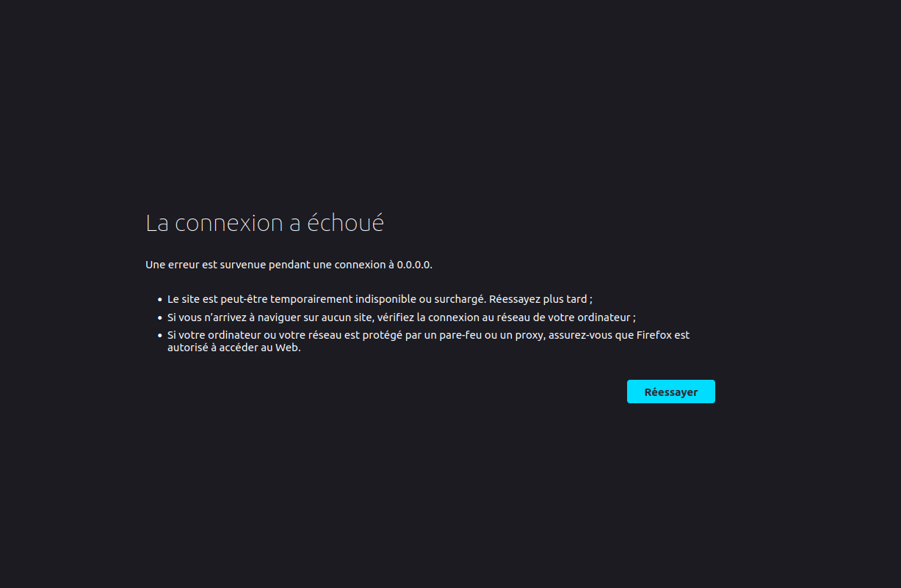
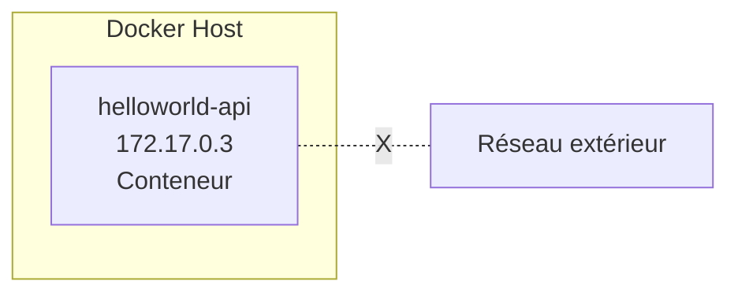
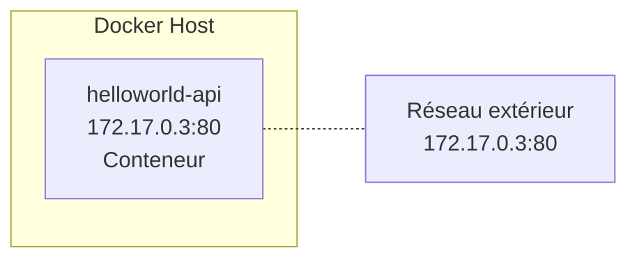
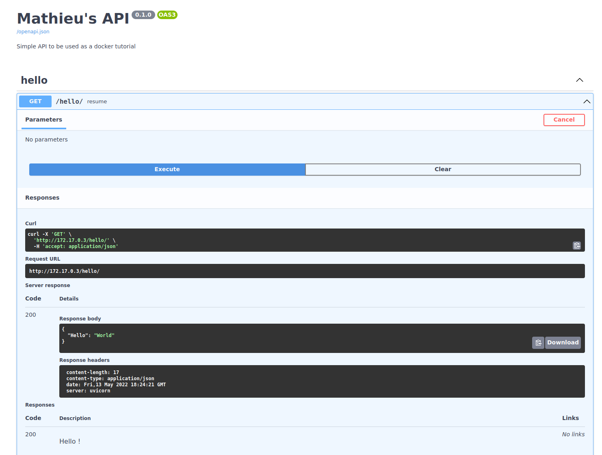
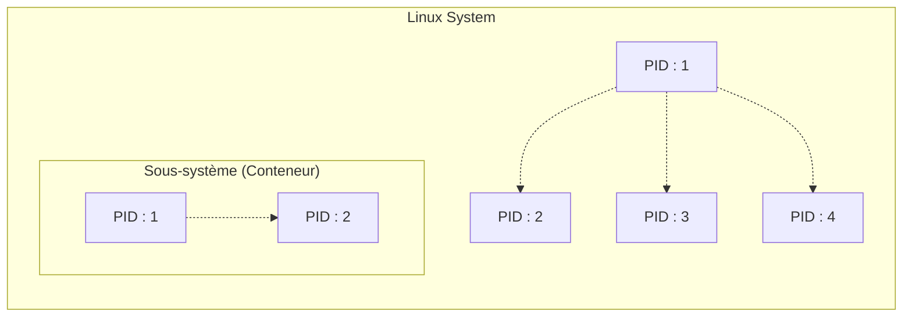
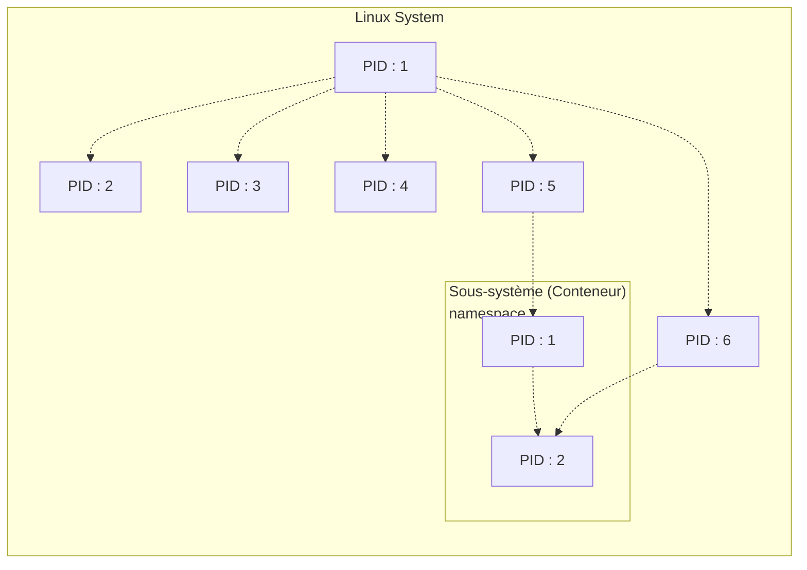
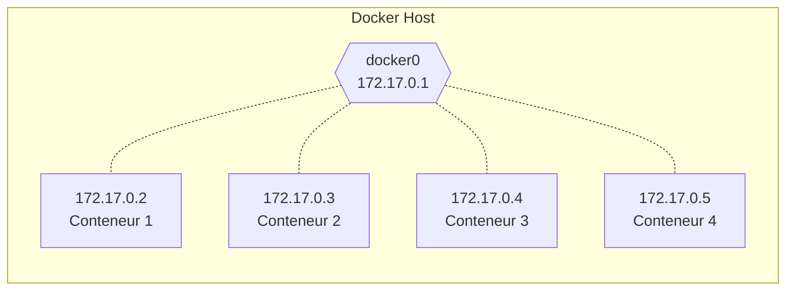
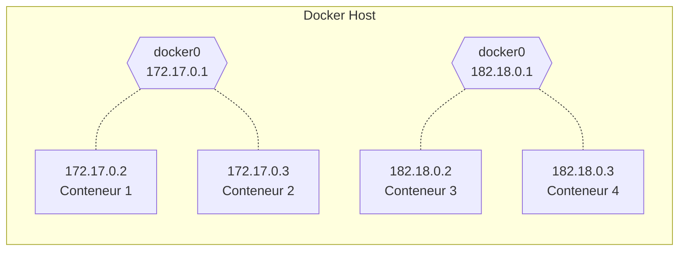

# Docker for the absolute beginner

## Survol

Qu'est ce que les conteneurs Docker ? Un conteneur est un environnement informatique complètement isolé :

* il a son propre réseau,
* il a ses propres processus,
* il a ses propres volumes montés,

tout comme des machines virtuelles. Vraiment ? Pas vraiment, la différence majeure avec une machine virtuelle est que l'ensemble des conteneurs partageront le même kernel.

Les OS Linux (Ubuntu, Fedora, CentOS, etc) sont tous basés sur le même socle : ils possède un noyau (kernel) Linux qui est responsables de l'interaction avec le hardware, et un ensemble de softwares.

Le noyau reste le même peu importe la distribution, c'est la collection de softwares présents qui rend Ubuntu différent de Fedora, CentOS, etc.

Donc lorsque l'on dit que l'ensemble des conteneurs partagent le même kernel, on veut dire par là que Docker se réfère directement à nouyau de l'hôte sur lequel il tourne en faisant abstraction de la couche software. Les conteneurs peuvent donc faire tourner n'importe quel software ou OS tant qu'il est basé sur le même noyau Linux.

!!! attention "Attention"

    Quel OS n'est pas basé sur un noyau Linux ? Windows.

    Cela veut donc dire que Docker ne pourra pas faire tourner des conteneurs avec un OS/software Windows sur un hôte Linux, et inversement.

!!! attention "Attention"

    Si vous connaissez Docker, vous allez surement surement dire que c'est faux. Vous pouvez très bien installer Docker sur Windows, lancer un conteneur conteneur Ubuntu se travailler dedans sans soucis.

    La différence est que le conteneur Ubuntu ne tourne pas directement via l'OS, comme sur un OS Linux classique, windows lance d'abord une VM Linux et ce conteneur tourner à l'intérieur de la VM Linux, ce qui rajoute une couche supplémentaire par rapport à Docker sur un OS Linux classique.

## Les environnements "conteneurisés"

Un conteneur Docker a la même idée qu'un conteneur physique : pensez-y comme à une boîte contenant une application.

À l'intérieur de la boîte, l'application semble avoir un ordinateur à elle toute seule : elle a son propre nom de machine et sa propre adresse IP, et elle a aussi son propre disque (les conteneurs Windows ont aussi leur propre registre Windows).

Ces éléments sont tous des ressources virtuelles :

- le nom d'hôte,
- l'adresse IP,
- le système de fichiers sont créés par Docker.

Ce sont des objets logiques qui sont gérés par Docker, et ils sont tous réunis pour créer un environnement dans lequel une application peut s'exécuter. C'est la "boîte" du conteneur.

L'application à l'intérieur du conteneur ne peut rien voir à l'extérieur du conteneur, mais la boîte est exécutée sur un ordinateur, et cet ordinateur peut également exécuter de nombreux autres conteneurs. Les applications dans ces conteneurs ont leurs propres environnements distincts (gérés par Docker), mais elles partagent toutes le CPU, GPU, et la mémoire de l'ordinateur, et elles partagent toutes le système d'exploitation de l'ordinateur.

!!! info "Remarque"

    Notez ici que les conteneurs sont différents des machines virtuelles.

    * Les machines virtuelles nécessitent que l'hyperviseur virtualise une pile matérielle complète. Il y a également plusieurs systèmes d'exploitation invités, ce qui les rend plus grands et plus étendus à démarrer. C'est ce que sont les instances de cloud AWS / GCP / Azure.

    * Les conteneurs, quant à eux, ne nécessitent aucune virtualisation de l'hyperviseur ou du matériel. Tous les conteneurs partagent le même noyau hôte. Il existe des environnements d'espace utilisateur isolés et dédiés, ce qui les rend beaucoup plus petits en taille et plus rapides à démarrer.


Les conteneurs font tourner des instances "d'images" définies chacunes par un `Dockerfile`.

!!! info "TLDR"

    1. Un Dockerfile définit comment construire une image.
    2. Une image est un environnement packagé contruit par un Dockerfile.
    3. Le conteneur Docker est l'endroit où l'image est lancée.


## Les commandes de base

|                            Commande                            |                                                    Résultat                                                     |                          Exemple                          |
| :------------------------------------------------------------: | :-------------------------------------------------------------------------------------------------------------: | :-------------------------------------------------------: |
|                    `docker run image_name`                     |                                 lance un conteneur portant le nom `image_name`                                  |                    `docker run ubuntu`                    |
|                          `docker ps`                           |                                     liste l'ensemble des conteneurs lancés                                      |                                                           |
|                         `docker ps -a`                         |                liste l'ensemble des conteneurs présents sur l'hôte, qu'ils soient lancés ou non.                |                                                           |
|   `docker stop container_id` ou `docker stop container_name`   |                                stoppe le conteneur avec l'id ou le nom associé.                                 | `docker stop 57ff613a495d`  `docker stop blissful_leakey` |
|                   `docker rm container_name`                   |                                        supprime un conteneur **stoppé**                                         |                `docker rm blissful_leakey`                |
|                        `docker images`                         |                                liste l'ensemble des images présentes sur l'hôte                                 |         move `new_file.txt` to `sample_file.txt`          |
|                    `docker rmi image_name`                     |                                           supprime localement l'image                                           |                    `docker rmi ubuntu`                    |
|                    `docker pull image_name`                    |                          télécharge l'image depuis le registre associé sans la lancer                           |                   `docker pull ubuntu`                    |
|              `docker exec container_name command`              |                           exécute une commande à l'intérieur d'un **conteneur lancé**                           |        `docker exec pedantic_boyd cat /etc/hosts`         |
|                   `docker run image_name -d`                   | lance un conteneur portant le nom `image_name` en mode détaché (ou démon), permet de ne pas bloquer le terminal |                  `docker run ubuntu -d`                   |
| `docker attach container_id` ou `docker attach container_name` |                                se rattache à un conteneur lancé en mode détaché                                 |                                                           |
|                    `docker pull image_name`                    |                          télécharge l'image depuis le registre associé sans la lancer                           |                   `docker pull ubuntu`                    |
|                    `docker pull image_name`                    |                          télécharge l'image depuis le registre associé sans la lancer                           |                   `docker pull ubuntu`                    |


* `docker run` : si l'image permettant de l'ancer le conteneur n'est pas disponible localement, Docker se chargera de la télécharger via le **registre de conteneur (container registry)** auquel il est assigné. Le téléchargement n'est fait qu'une seule fois, tant que l'image n'est pas supprimée localement.

* `docker ps` : chanque conteneur se voit attribuer une id et un nom uniques par Docker au moment où ils sont lancés.

```shell
❯ docker ps

CONTAINER ID   IMAGE                                                           COMMAND                  CREATED       STATUS       PORTS                                         NAMES
57ff613a495d   vsc-formation-deep-mlops-9214107b363d7791a4e04f86ccc94a41-uid   "/bin/sh -c 'echo Co…"   2 hours ago   Up 2 hours   0.0.0.0:49153->8000/tcp, :::49153->8000/tcp   funny_volhard
```

```shell
❯ docker ps -a
CONTAINER ID   IMAGE                                                           COMMAND                  CREATED       STATUS                  PORTS                                         NAMES
57ff613a495d   vsc-formation-deep-mlops-9214107b363d7791a4e04f86ccc94a41-uid   "/bin/sh -c 'echo Co…"   2 hours ago   Up 2 hours              0.0.0.0:49153->8000/tcp, :::49153->8000/tcp   funny_volhard
4c65fccd22d6   swaggerapi/swagger-ui                                           "/docker-entrypoint.…"   7 days ago    Exited (0) 7 days ago                                                 beautiful_faraday
7a3bbac61d2a   swaggerapi/swagger-ui                                           "/docker-entrypoint.…"   7 days ago    Exited (0) 7 days ago                                                 elated_lamarr
016e85e65d32   swaggerapi/swagger-ui                                           "/docker-entrypoint.…"   7 days ago    Exited (0) 7 days ago                                                 distracted_perlman
a504962076cd   swaggerapi/swagger-ui                                           "/docker-entrypoint.…"   7 days ago    Exited (0) 7 days ago                                                 blissful_leakey
```

* `docker rmi` : l'ensemble des conteneurs dépendants de cette image doivent être stoppés avant de pouvoir supprimer l'image.

!!! attention "Attention"

    Un conteneur ne "vit" que tant que le processus qui est censé être lancé à l'intérieur tourne. Lancer `docker run ubuntu`, ne lancera pas un conteneur avec ubuntu, **car on a définit aucun processus que ce conteneur devrait héberger** ! Comme on le voir dans les lignes suivantes, notre conteneur ubuntu s'est stoppé tout de suite.

    ```shell
    ❯ docker run ubuntu

    Unable to find image 'ubuntu:latest' locally
    latest: Pulling from library/ubuntu
    125a6e411906: Pull complete
    Digest: sha256:26c68657ccce2cb0a31b330cb0be2b5e108d467f641c62e13ab40cbec258c68d
    Status: Downloaded newer image for ubuntu:latest

    ❯ docker ps

    CONTAINER ID   IMAGE                                                           COMMAND                  CREATED       STATUS       PORTS                                         NAMES
    57ff613a495d   vsc-formation-deep-mlops-9214107b363d7791a4e04f86ccc94a41-uid   "/bin/sh -c 'echo Co…"   2 hours ago   Up 2 hours   0.0.0.0:49153->8000/tcp, :::49153->8000/tcp   funny_volhard

    ❯ docker ps -a

    CONTAINER ID   IMAGE                                                           COMMAND                  CREATED         STATUS                     PORTS                                         NAMES
    9a74f900a9ef   ubuntu                                                          "bash"                   7 seconds ago   Exited (0) 6 seconds ago                                                 pedantic_boyd
    57ff613a495d   vsc-formation-deep-mlops-9214107b363d7791a4e04f86ccc94a41-uid   "/bin/sh -c 'echo Co…"   2 hours ago     Up 2 hours                 0.0.0.0:49153->8000/tcp, :::49153->8000/tcp   funny_volhard
    ```

    Si le processus lancé à l'intérieur du conteneur crash ou s'arrête, le conteneur s'arrêtera aussi.

* `docker exec`

```shell
❯ docker ps

CONTAINER ID   IMAGE                                                           COMMAND                  CREATED          STATUS          PORTS                                         NAMES
5c1204184739   ubuntu                                                          "sleep 50"               11 seconds ago   Up 10 seconds                                                 suspicious_almeida
57ff613a495d   vsc-formation-deep-mlops-9214107b363d7791a4e04f86ccc94a41-uid   "/bin/sh -c 'echo Co…"   2 hours ago      Up 2 hours      0.0.0.0:49153->8000/tcp, :::49153->8000/tcp   funny_volhard

❯ docker exec suspicious_almeida cat /etc/hosts

127.0.0.1	localhost
::1	localhost ip6-localhost ip6-loopback
fe00::0	ip6-localnet
ff00::0	ip6-mcastprefix
ff02::1	ip6-allnodes
ff02::2	ip6-allrouters
172.17.0.3	5c1204184739
```

Un conteneur lancé comme `ubuntu` s'arrêtera tout de suite car il n'y a aucun processus de lancer dedans, cependant on peut quand même lancer ce conteneur et travaillant dedans en le rendant interactif via la commande suivante.

```shell title="it pour interactif"
❯ docker run -it ubuntu

root@767920134d27:/#  cat /etc/os-release

PRETTY_NAME="Ubuntu 22.04 LTS"
NAME="Ubuntu"
VERSION_ID="22.04"
VERSION="22.04 LTS (Jammy Jellyfish)"
VERSION_CODENAME=jammy
ID=ubuntu
ID_LIKE=debian
HOME_URL="https://www.ubuntu.com/"
SUPPORT_URL="https://help.ubuntu.com/"
BUG_REPORT_URL="https://bugs.launchpad.net/ubuntu/"
PRIVACY_POLICY_URL="https://www.ubuntu.com/legal/terms-and-policies/privacy-policy"
UBUNTU_CODENAME=jammy

root@767920134d27:/# exit
exit
```

* `docker rmi $(docker images -aq)` : supprime toutes les images présentes sur l'hôte.

* `docker container rm $(docker ps -aq)` : supprime tous les conteneurs présents sur l'hôte.

## `docker run`

Voyons maintenant d'autres commandes de la famille `docker run`.

### `-it`

Par défaut, le conteneur docker n'écoute pas `stdin`, il n'a pas de terminal depuis lequel le lire. Il faut le lancer en mode interactif avec le paramètre `-i`, pour faire apparaitre le prompteur du terminal il faut rajouter le paramètre `-t`, comme dans la commande `-it` vue un peu plus haut.

!!! info "Remarque"

    La plupart du temps on ne fait pas la différence entre `-i` pour interactif et `-it` pour interactif avec prompteur du terminal, on dit juste `-it` pour interactif par abus de langage.

### Mapping des ports

Supposons que j'ai pull `vorphus/helloworld-api:1.0` en local, qui est une API très simple que j'ai codé et push sur dockerhub pour l'exemple, voir [dockerhub](https://hub.docker.com/repository/docker/vorphus/helloworld-api) et [github](https://github.com/Klimorg/helloworld-api) pour le code.


```shell
❯ docker pull vorphus/helloworld-api:1.0

1.0: Pulling from vorphus/helloworld-api
Digest: sha256:e8d49d5c9fc1924f1702d7b4bc3a28bb42c639fc9f87c6c2031a45859ca2d463
Status: Image is up to date for vorphus/helloworld-api:1.0
docker.io/vorphus/helloworld-api:1.0

❯ docker run vorphus/helloworld-api:1.0

INFO:     Started server process [1]
INFO:     Waiting for application startup.
INFO:     Application startup complete.
INFO:     Uvicorn running on http://0.0.0.0:80 (Press CTRL+C to quit)
```
Si j'essaye de me connecter `http://0.0.0.0:80` pour essayer d'aller voir par exemple la documentation de l'api, la seule chose sur laquelle je vais tomber est la chose suivante.



Pourquoi ? Comme dis plus haut, un conteneur docker est par définition totalement isolé du reste de l'environnement dans lequel il tourne. Si on veut qu'un sonteneur communique avec l'extérieur, il faut le dire explicitement.




Une combinaison de `docker inspect` et de `jq` permet de trouver l'adresse IP du conteneur.

```shell
❯ docker inspect helloworld | jq ".[0].NetworkSettings.Networks.bridge.IPAddress"

"172.17.0.3:80"
```

Sauf que cette adresse IP est une adresse IP interne au docker host, et que donc on ne peut pas l'utiliser de l'extérieur. De même pour le port 80 défini plus haut lorsque l'on a lancé le conteneur : on ne peut pas accéder à `172.17.0.3:80` depuis l'extérieur du docker host.

La solution est alors de définir un point de passage en joignant un port du réseau extérieur au port du docker host concerné, cela se fait via la commande suivante.

`-p oustide_port:inside_docker_host_port`

En lançant la commande suivante.

```shell
docker run -d --name helloworld -p 80:80 vorphus/helloworld-api:1.0
```
Il est alors possible d'accéder au conteneur docker depuis le réseau externe au docker host. La passerelle faisant le routage nécessaire.



```shell
❯ http 172.17.0.3:80/hello/

HTTP/1.1 200 OK
content-length: 17
content-type: application/json
date: Fri, 13 May 2022 18:32:55 GMT
server: uvicorn

{
    "Hello": "World"
}


❯ curl 172.17.0.3:80/hello/

{"Hello":"World"}%
```


### Volumes

`-v outside_path:inside_container_path`

### Inspection

* `docker inspect container_id`,
* `docker inspect container_name`.

### logs

Pour voir les logs qu'un conteneur sort sur `stdout`, on peut utiliser l'un des deux commandes suivantes.

* `docker logs container_id`,
* `docker logs container_name`.

Ces commandes ne fournirons les logs qu'à l'instant t, si l'on souhaite voir les logs en continu, il faut rajouter l'argument `-f`

* `docker logs -f container_id`,
* `docker logs -f container_name`.

## Les images Docker

### Pourquoi conteneuriser ?

Une étape pour atteindre la reproductibilité consiste à déployer le code et les artefacts versionnés dans un environnement reproductible. Cela va bien au-delà de l'environnement virtuel que l'on peut configurer pour les applications Python, car il existe des spécifications au niveau du système (système d'exploitation, paquets requis, etc.) qui ne sont pa saisis par un simple environnement virtuel. Nous voulons être en mesure d'encapsuler toutes les exigences dont nous avons besoin afin qu'il n'y ait pas de dépendances externes qui empêcheraient quelqu'un d'autre de reproduire l'application de façon exacte.

### Comment créer sa propre image ?

Dans docker, tout commence par la rédaction d'un `Dockerfile`, c'est un simple script que vous écrivez pour dire comment vous allez monter et faire fonctionner votre conteneur docker.

Le langage docker est simple à comprendre, les tâches les plus communes ont leur propres commandes, et pour tout le reste vous pouvez utiliser les commandes shell standards (Bash sur Linux, ou PowerShell sur Windows par exemple).

Pour voir comment s'écrit un `Dockerfile`, comment construire l'image et lancer le conteneur, prenons l'exemple suivant. C'est le `Dockerfile` standard que j'utilise pour entraîner des modèles de deep learning.

!!! docker "Dockerfile"

    ```docker
    FROM nvcr.io/nvidia/tensorflow:21.02-tf2-py3

    COPY requirements.txt .
    COPY requirements-dev.txt .

    ARG USERNAME=vorph
    ARG USER_UID=1000
    ARG USER_GID=1000

    RUN groupadd -g $USER_GID -o $USERNAME
    RUN useradd -m -u $USER_UID -g $USER_GID -o -s /bin/bash $USERNAME

    USER $USERNAME

    ENV PATH "$PATH:/home/vorph/.local/bin"

    RUN /bin/bash -c "pip install -r requirements.txt"

    RUN /bin/bash -c "pip install -r requirements-dev.txt"

    EXPOSE 5000
    EXPOSE 8001
    ```

Un `Dockerfile` est une suite d'instructions suivies de l'argument correspondant, chaque instruction étant une couche (layer) du `Dockerfile`.

La toute première instruction est toujours la même, **elle détermine quelle sera la base de votre conteneur**, est-ce que votre conteneur sera construit sur une base d'OS Ubuntu 18.02, 20.04, sur une base Python 3.8, etc. Chaque image doit commencer d'une autre image. Ici l'image en question est `nvcr.io/nvidia/tensorflow:21.02-tf2-py3` une image de TensorFlow 2.4 faite par NVidia, ce qui permet de ne pas avoir à se soucier des problèmes d'installation ou de dépendances.

!!! note "La première couche"

    Cette première couche commence toujours par un `FROM`, pour dire à partir de quelle image de base vous allez construire votre Dockerfile.

    Pourquoi `FROM` ? Il existe ce que l'on appelle des "registres dockers" (docker registry), où de manière similaire à github, gitlab, etc sont recensés les images docker de façon la plupart du temps open source, le plus connu étant [docker hub](https://hub.docker.com/). Pour récupérer une image, la commande similaire au "git clone *adresse*" est "docker pull *adresse*", et donc d'où vient votre image de base pour votre Dockerfile ? En anglais, "it has been pulled FROM *address*".

`COPY` est la commande permettant de copier des dossiers depuis votre machine locale vers votre conteneur Docker. Ici `COPY requirements.txt .` copie le fichier `requirements.txt` vers `.`, ie à la racine définie dans l'image `nvcr.io/nvidia/tensorflow:21.02-tf2-py3`.

!!! note "Syntaxe"

    La syntaxe est `COPY dossier_source dossier_cible`.


Par défaut, toutes les instructions lancées dans un conteneur docker se font en mode super-admin. Certaines application ayant besoin d'un répertoire `/home/`, il est souvent nécessaire de créer un utilisateur, ce qui est fait dans les lignes suivantes.

!!! docker "Création d'un utilisateur"

    ```docker
    ARG USERNAME=vorph
    ARG USER_UID=1000
    ARG USER_GID=1000

    RUN groupadd -g $USER_GID -o $USERNAME
    RUN useradd -m -u $USER_UID -g $USER_GID -o -s /bin/bash $USERNAME

    USER $USERNAME
    ```
### Construction de l'image

Maintenant que votre Dockerfile est rédigé, vous pouvez construire votre image. Le départ est toujours le même : `sudo docker build`, suivi d'argument.

!!! note "Remarque"

    les commandes docker dans le terminal ont besoin d'être passé en super-admin, si vous souhaitez ne plus avoir à taper `sudo docker build` mais simplement `docker build`, `docker run`, etc vous devez créer un groupe docker et vous ajouter en tant qu'utilisateur dedans. Pour cela, suivez les instructions de la doc officielle. [Manage Docker as a non-root user](https://docs.docker.com/engine/install/linux-postinstall/#manage-docker-as-a-non-root-user)

!!! docker "docker build"

    ```docker
    docker build \
    --build-arg USER_UID=$(id -u) \
    --build-arg USER_GID=$(id -g) \
    --rm \
    -f Dockerfile \
    -t project_ai .
    ```
Les deux arguments `--build-arg` correspondent aux mêmes arguments `ARG` dans le Dockerfile, `ARG USER_UID=1000` signifiant que la valeur par défaut de USER_ID est 1000, `--build-arg` permet de réécrire au dessus pour être sur d'avoir les bonnes valeurs correspondant au couple `uid:gid` de votre machine locale.

`--rm` permet de supprimer les conteneurs intermédiaires utilisés uniquement durant la construction.

`-f Dockerfile` spécifie quel Dockerfile doit être utilisé pour la construction, ici celui nommé simplement `Dockerfile`. Le nommage des Dockerfile se fait de la façon suivante : `Dockerfile.suffixe`, par exemple vous pourriez avoir deux Dockerfiles différents

- `Dockerfile.cpu`,
- `Dockerfile.gpu`,

où les instructions de construction à l'intérieur du Dockerfile seraient différentes que vous utilisiez le gpu ou non. Dans ce cas vous pourriez avoir les commandes suivantes.

!!! docker "docker build"

    ```docker
    docker build \
    --build-arg USER_UID=$(id -u) \
    --build-arg USER_GID=$(id -g) \
    --rm \
    -f Dockerfile.cpu \
    -t project_ai .
    ```
    ou

    ```docker
    docker build \
    --build-arg USER_UID=$(id -u) \
    --build-arg USER_GID=$(id -g) \
    --rm \
    -f Dockerfile.gpu \
    -t project_ai .
    ```

Enfin, `-t project_ai` définit le nom que prendra l'image, ici "project_ai".

Le point `.` à la fin de la commande docker build signifie à docker qu'il doit chercher le Dockerfile dans le répertoire actuel.

!!! note "Remarque"

    Beaucoup d'autres options sont disponibles, n'hésitez pas à regarder la [documentation sur les options de construction](https://docs.docker.com/engine/reference/commandline/build/#options).

### Une architecture en couches

```python
from fastapi import FastAPI, status
from fastapi.middleware.cors import CORSMiddleware
import uvicorn
from typing import Optional

app = FastAPI(
    title="Mathieu's API",
    description="Simple API to be used as a docker tutorial",
    version="0.1.0",
)

app.add_middleware(
    CORSMiddleware,
    allow_origins=["*"],
    allow_credentials=True,
    allow_methods=["*"],
    allow_headers=["*"],
)

@app.get(
    "/hello/",
    tags=["hello"],
    status_code=status.HTTP_200_OK,
    response_description="Hello !",
    summary="resume",
)
async def get_hello():
    return {"Hello": "World"}
```

```docker
FROM python:3.9

WORKDIR /code

COPY ./requirements.txt /code/requirements.txt

RUN pip install --no-cache-dir --upgrade -r /code/requirements.txt

COPY ./app /code/app

CMD ["uvicorn", "app.main:app", "--host", "0.0.0.0", "--port", "80"]
```

### Les variables d'environnement

La commande `ARG` permet de définir des variables d'environnement qui ne seront disponibles que durant la construction de l'image, ici les identifiants d'un utilisateur. On a ensuite besoin d'ajouter cet utilisateur et ce groupe dans les utilisateurs du conteneur, ce qui ce fait via la commande `RUN` qui permet de lancer des commandes shell.

Enfin on spécifie qui sera l'utilisateur de ce conteneur, que sera l'utilisateur que l'on vient de créer. Cela se fait via la commande `USER`.

A la différence de `ARG`, `ENV` définit lui des variables d'environnements qui seront toujours disponibles après la construction de l'image, et donc lorsque le conteneur sera lancé. Ici on définit un chemin `PATH "$PATH:/home/vorph/.local/bin"` qui est nécessaire pour certaines librairies python dans les fichiers `requirements.txt` et `requirements-dev.txt`.

`docker run -p 38282:8080 --name blue-app -e APP_COLOR=blue -d kodekloud/simple-webapp`

To know the env field from within a webapp container, run `docker exec -it webapp env`

Deploy a mysql database using the mysql image and name it mysql-db.

Set the database password to use db_pass123. Lookup the mysql image on Docker Hub and identify the correct environment variable to use for setting the root password.

Run the command: docker run -d -e MYSQL_ROOT_PASSWORD=db_pass123 --name mysql-db mysql
To know the env field from within a mysql-db container, run docker exec -it mysql-db env

### CMD versus ENTRYPOINT

`ENTRYPOINT` et `CMD` permettent de spécifier une commande qui sera éxécutée lorsque l'image sera lancée en tant que conteneur.

La différence provient dans comment les arguments dans les commandes peuvent être surchargées.

```docker
FROM Ubuntu

CMD ["sleep", "5"]
```

`docker run ubuntu-sleeper sleep 10`

```docker
FROM Ubuntu

ENTRYPOINT ["sleep"]
```
`docker run ubuntu-sleeper sleep 5`

```docker
FROM Ubuntu

ENTRYPOINT ["sleep"]

CMD ["5"] #argument par défaut pour l'entrypoint
```

## docker compose

Compose est un outil permettant de définir et d'exécuter des applications Docker multi-conteneurs.

Avec Compose, vous utilisez un fichier YAML pour configurer les services de votre application. Ensuite, avec une seule commande, vous créez et démarrez tous les services à partir de votre configuration. Pour en savoir plus sur toutes les fonctionnalités de Compose, consultez la liste des fonctionnalités.

Compose fonctionne dans tous les environnements : production, staging, développement, test, ainsi que dans les flux de travail CI. Vous pouvez en savoir plus sur chaque cas dans Cas d'utilisation communs.

L'utilisation de Compose se résume à un processus en trois étapes :

1. Définissez l'environnement de votre application à l'aide d'un `Dockerfile` afin qu'il puisse être reproduit partout.

2. Définissez les services qui composent votre application dans `docker-compose.yml` afin qu'ils puissent être exécutés ensemble dans un environnement isolé.

3. Exécutez docker compose up et la commande Docker compose démarre et exécute votre application entière. Vous pouvez également exécuter docker-compose up en utilisant le binaire docker-compose.

Un `docker-compose.yml` ressemble à ceci :

```yaml
version: "3.9"  # optional since v1.27.0

services:
  web:
    build: .
    ports:
      - "8000:5000"
    volumes:
      - .:/code
      - logvolume01:/var/log
    links:
      - redis
  redis:
    image: redis

volumes:
  logvolume01: {}
```

### Surcharger le `docker-compose.yaml` pour gérer plusieur environnements

## Docker engine, stockage

Le Docker Engine est composé de 3 parties :

* le docker daemon, qui gère le service Docker, et gère les images, conteneurs, volumes etc,
* l'API REST, qui fait la liaison entre le docker daemon et les autres programmes,
* la cli Dcoker (`docker build`, `docker run`, etc).

Comment Docker gère l'isolation d'un conteneur ?

Chaque conteneur se voit fournir son propre namespace (espace de nom). Un namespace est un contexte qui permet d'identifier et grouper un ensemble logique d'éléments utilisés par un programme. Dans un même contexte et une même portée (scope), un identifiant doit identifier une entité de manière unique.

Ainsi chaque conteneur, au sein de son namespace, se voit attribuer les caractéristiques suivantes uniques :

* Process ID, [Identifiant de processus](https://fr.wikipedia.org/wiki/Identifiant_de_processus),
* Réseau,
* InterProcess, [communication inter-processus](https://fr.wikipedia.org/wiki/Communication_inter-processus),
* Système de montage,
* UNIX timesharing.

Développons le PID. Lorsqu'un système Linux démarre, il commence avec un seul processus, avec un identifiant de processus PID : 1, c'est le processus racine qui lance tous les autres processus.


Une fois que le système est complpètement démarré, on a tout une famille de processus qui ont chacun un PID unique. On peut obtenir la liste des processus tournant à l'instant t sur une machine Linux via la commande `ps`.

```shell
❯ ps

    PID TTY          TIME CMD
  58674 pts/1    00:00:08 zsh
  58678 pts/1    00:00:00 zsh
  58724 pts/1    00:00:00 zsh
  58726 pts/1    00:00:00 zsh
  58727 pts/1    00:00:00 gitstatusd-linu
  64791 pts/1    00:00:00 bash
  64958 pts/1    00:00:00 make
  64959 pts/1    00:04:51 mkdocs
 113746 pts/1    00:00:00 ps
```
Maintenant, lorsque l'on lance un conteneur, que l'on peut considérer comme un sous-système, le sous-système a besoin de se considérer comme un système indépendant isolé du reste, et qu'il a ses propres processus, provenant d'un processus root de PID 1.

Docker partageant l'OS de l'hôte, une isolation complète comme cela n'est pas possible, et les processus du sous-système ne sont des des autres processus du processus root du système Linux.

Mais à l'intérieur du conteneur, le fait d'avoir son propre namesapce permet de faire en sorte que les processus sont vu



Les `cgroups` (control groups) permettent de limiter l'utilisation cpu et mémoire des conteneurs, qui par défaut est illimitée.

* `docker run --cpus=0.5 ubuntu`
* `docker run --memory=100m ubuntu`

## Réseau

Lorsque Docker est installé, il crée automatiquement 3 réseaux :

* `bridge`,
* `none`,
* `host`.

`bridge` est le réseau par défaut auquel est relié un conteneur. Pour l'associer à l'un des deux autres, on utilise le paramètre `--network`.

* `docker run ubuntu --network=none`
* `docker run ubuntu --network=host`

`bridge` est une réseau privé isolé dans le docker host, chaque conteneur tournant se voit alors attribué une adresse ip sur ce réseau.



Les conteneurs peuvent alors communiquer entre eux via leur ip interne. Pour accéder à un conteneur depuis l'extérieur, il faut alors associer les ports correspondant correctement, comme vu dans la partie [Mapping des ports](#mapping-des-ports).

Une autre façon d'avoir accès à un conteneur depuis l'extérieur est de l'associer au réseau `host`, toute isolation réseau est alors supprimée et le conteneur est directemnt accessible.

Comme son nom l'indique `none` isole complètement un conteneur de tout réseau, et n'est pas accessible de l'extérieur ou par un autre conteneur.

Pour créer un second réseau dans le docker host, pour par exemple isoler les conteneurs 3 et 4, on peut utiliser la commande `docker network create`.

```shell
docker network create \
    --driver bridge \
    --subnet 182.18.0.1/16 \
    --gateway 182.18.0.1 \
    custom-isolated-network
```

!!! example "Exemple"

    1. `docker run -d -e MYSQL_ROOT_PASSWORD=db_pass123 --name mysql-db --network custom-isolated-network mysql:5.6`
    2. `docker run --network=wp-mysql-network -e DB_Host=mysql-db -e DB_Password=db_pass123 -p 38080:8080 --name webapp --link mysql-db:mysql-db -d kodekloud/simple-webapp-mysql`




La configuration réseau de chaque conteneur peut être vue via la commande `docker inspect`.

```shell
❯ docker network ls

NETWORK ID     NAME      DRIVER    SCOPE
ff42c61ad8f6   bridge    bridge    local
eb710fdaaadf   host      host      local
1fc8a049c70c   none      null      local
```

```shell
❯ docker pull vorphus/helloworld-api:1.0-slim

1.0-slim: Pulling from vorphus/helloworld-api
Digest: sha256:7688dd17f1287bba526902186e7677d2ec872ca01dead95801b454b76ed49258
Status: Image is up to date for vorphus/helloworld-api:1.0-slim
docker.io/vorphus/helloworld-api:1.0-slim

❯ docker run -it --rm -d --name helloworld vorphus/helloworld-api:1.0-slim
e321acdf171ff17d731e789120d9f2c366aa75a08b7305b11adbdffc6c653cdf

❯ docker inspect helloworld | jq ".[0].NetworkSettings"

{
  "Bridge": "",
  "SandboxID": "9df6d42959f98cfa17790f69bc8b30e0cbec2fe2c54b9289f538e7dc98f1003a",
  "HairpinMode": false,
  "LinkLocalIPv6Address": "",
  "LinkLocalIPv6PrefixLen": 0,
  "Ports": {},
  "SandboxKey": "/var/run/docker/netns/9df6d42959f9",
  "SecondaryIPAddresses": null,
  "SecondaryIPv6Addresses": null,
  "EndpointID": "f6ca6b0b04d44343627d938ba99ebec0598cfce606fcf8eb887ba5424ff526d3",
  "Gateway": "172.17.0.1",
  "GlobalIPv6Address": "",
  "GlobalIPv6PrefixLen": 0,
  "IPAddress": "172.17.0.3",
  "IPPrefixLen": 16,
  "IPv6Gateway": "",
  "MacAddress": "02:42:ac:11:00:03",
  "Networks": {
    "bridge": {
      "IPAMConfig": null,
      "Links": null,
      "Aliases": null,
      "NetworkID": "ff42c61ad8f68c356bdfea4c7f0c04dc1d134c8e543080ec7dd9515eb5b0bb1a",
      "EndpointID": "f6ca6b0b04d44343627d938ba99ebec0598cfce606fcf8eb887ba5424ff526d3",
      "Gateway": "172.17.0.1",
      "IPAddress": "172.17.0.3",
      "IPPrefixLen": 16,
      "IPv6Gateway": "",
      "GlobalIPv6Address": "",
      "GlobalIPv6PrefixLen": 0,
      "MacAddress": "02:42:ac:11:00:03",
      "DriverOpts": null
    }
  }
}
```

Remarquons que la commande `docker inspect` ne marche pas uniquement sur les conteneurs, mais aussi sur les réseaux.

```shell
❯ docker inspect bridge | jq .

[
  {
    "Name": "bridge",
    "Id": "ff42c61ad8f68c356bdfea4c7f0c04dc1d134c8e543080ec7dd9515eb5b0bb1a",
    "Created": "2022-05-14T10:50:27.795717043+02:00",
    "Scope": "local",
    "Driver": "bridge",
    "EnableIPv6": false,
    "IPAM": {
      "Driver": "default",
      "Options": null,
      "Config": [
        {
          "Subnet": "172.17.0.0/16",
          "Gateway": "172.17.0.1"
        }
      ]
    },
    "Internal": false,
    "Attachable": false,
    "Ingress": false,
    "ConfigFrom": {
      "Network": ""
    },
    "ConfigOnly": false,
    "Containers": {
      "2cfe62c9e0c3a57a234f52774333af00155e11a67c04f255e3bb6b2e53614649": {
        "Name": "boring_wiles",
        "EndpointID": "528b6c7e4a71a71455218a980dcaa3a1b627b25c1f638cad8b58984e71454b21",
        "MacAddress": "02:42:ac:11:00:02",
        "IPv4Address": "172.17.0.2/16",
        "IPv6Address": ""
      }
    },
    "Options": {
      "com.docker.network.bridge.default_bridge": "true",
      "com.docker.network.bridge.enable_icc": "true",
      "com.docker.network.bridge.enable_ip_masquerade": "true",
      "com.docker.network.bridge.host_binding_ipv4": "0.0.0.0",
      "com.docker.network.bridge.name": "docker0",
      "com.docker.network.driver.mtu": "1500"
    },
    "Labels": {}
  }
]
```


Le docker host possède aussi un serveur DNS embarqué pour la résolution des noms. Il est donc possible de se connecter à un conteneur uniquement via son nom.

## Docker registry

Un registre Docker est l'équivalent de github, gitlab, etc pour les conteneurs docker. C'est un endroit où sont stockées et centralisées les différentes images disponibles sur le web.

il est possible d'avoir un registre docker personnel sur par exemple [docker hub](https://hub.docker.com/).

!!! example "Déployer un registre privé"

    ```shell
    docker run -d -p 5000:5000 --restart=always --name my-registry registry:2
    ```

    ```shell
    $ docker pull nginx:latest
    latest: Pulling from library/nginx
    214ca5fb9032: Pull complete
    f0156b83954c: Pull complete
    5c4340f87b72: Pull complete
    9de84a6a72f5: Pull complete
    63f91b232fe3: Pull complete
    860d24db679a: Pull complete
    Digest: sha256:2c72b42c3679c1c819d46296c4e79e69b2616fa28bea92e61d358980e18c9751
    Status: Downloaded newer image for nginx:latest
    docker.io/library/nginx:latest

    $ docker image tag nginx:latest localhost:5000/nginx:latest

    $ docker push localhost:5000/nginx:latest
    ```
    The push refers to repository `localhost:5000/nginx`


    ```shell
    curl -X GET localhost:5000/v2/_catalog
    ```

## Orchestration

Avec une commande `docker run`, on est capable de déployer une instance d'un conteneur, par exemple une api.

Mais que se passe-t-il si le nombre de requêtes envoyées à cette api et trop important ? On aimerait déployer une seconde instance de cette api pour gérer le flux supplémentaire.

On pourrait le faire en relançant une commande `docker run`, mais cela demande de le faire de façon manuelle et de surveiller à chaque fois comment cela se passe.

Si on conteneur crashe, on devrait pouvoir le détecter et relancer une image automatiquement.

Si le docker host crashe, tous les conteneurs lancés s'arrêterons aussi.

Pour gérer ces problèmes dans un environnement de production, on fait alors appel à des systèmes d'orchestrations des conteneurs :

* docker-swarm,
* kubernetes,
* MESOS.

## Docker et VS Code : le fichier `.devcontainer`

## Softwares

* [Container Management and Kubernetes on the Desktop](https://rancherdesktop.io/)
* [The super duper Podman Desktop Companion](https://iongion.github.io/podman-desktop-companion/)
* [Kompose](https://kompose.io/)
* [nerdctl: Docker-compatible CLI for containerd](https://github.com/containerd/nerdctl)

* [Namespaces : La brique de base des conteneurs](https://linuxembedded.fr/2020/11/namespaces-la-brique-de-base-des-conteneurs)
* [Securing containers using Docker isolation](https://resources.infosecinstitute.com/topic/securing-containers-using-docker-isolation/)