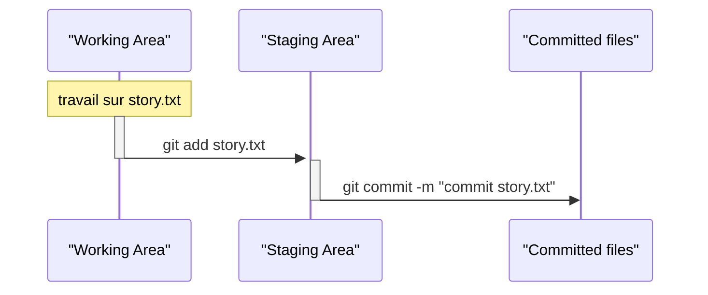
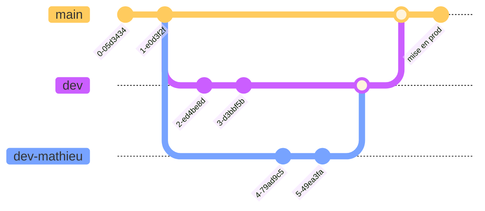
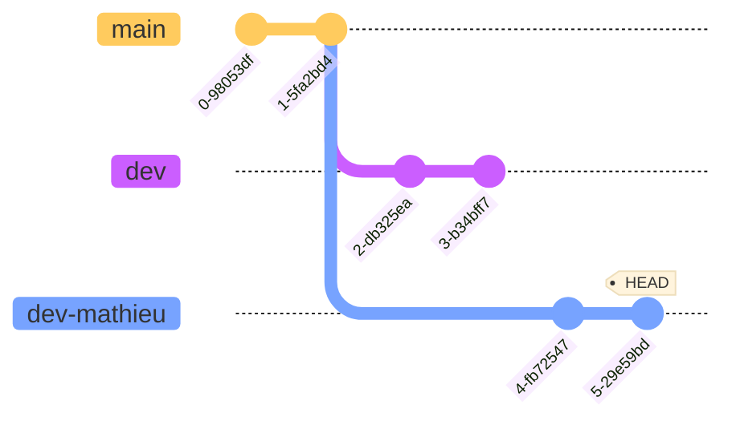
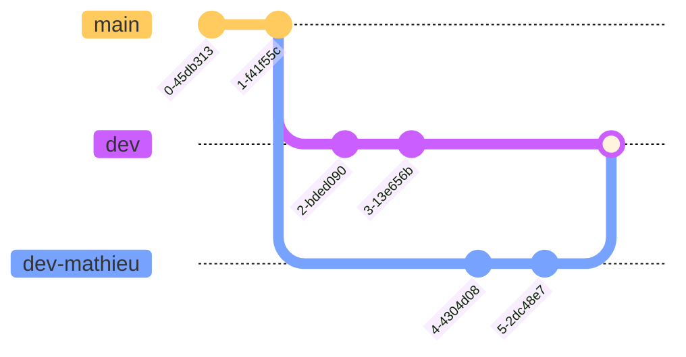
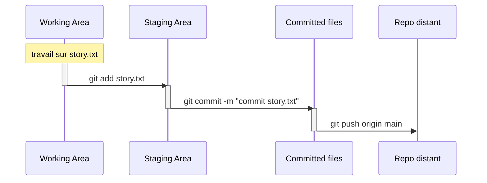
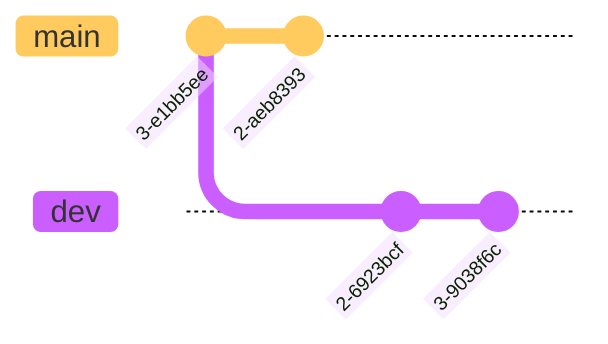
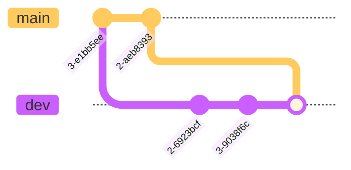
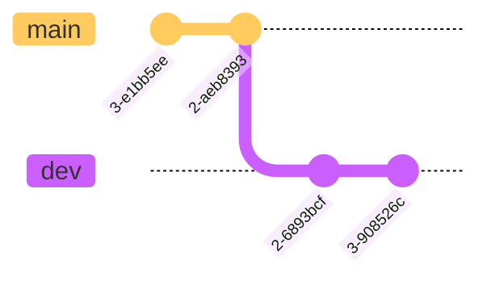
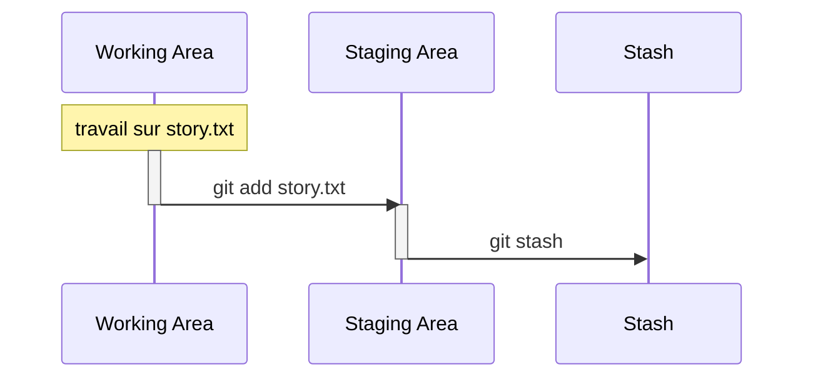

# GIT Gud


## Introduction

Git est un système de contrôle de version distribué et open source qui permet aux développeurs et aux équipes d'exploitation de collaborer et de suivre les modifications apportées à un projet.

En tant qu'outil DevOps, Git favorise la collaboration et l'accélération des cycles de publication. Toute personne désireuse de démarrer sa carrière DevOps ou de passer à un niveau supérieur doit commencer par les bases, et Git est l'exigence la plus fondamentale de toutes.

Bon nombre des projets open source les plus populaires aujourd'hui sont développés sur Github - Kubernetes, Ansible, TensorFlow, Rust, Node.js, Go, Terraform, Helm Charts étant quelques-uns des plus importants parmi les 100 millions de dépôts.


## Repos locaux et distants

Git a 2 type de repos :

* **Le repo local**, qui se trouve sur votre machine, et auquel vous avez un accès direct,
* **Le repo distant**, qui se trouve généralement sur un serveur centralisé, et qui est optionnel.

Le repo distant est pensé comme un back-up de votre repo local.

Le repo local est divisé en 3 sections.

1. **La zone de travail** où sont les fichiers sur lesquels vous travaillez, git ne fait rien avec ces fichiers, il sait juste que ces fichiers sont en train d'être modifiés.
2. **La zone de transit (staging area)**, contient les nouveaux changements qui seront bientôt versionnés.
3. **Les fichiers versionnés** (committed files).

## Installer git sur ubuntu

```shell
sudo apt update
sudo apt install git -y

git config user.email "max@example.com"
git config user.name "max"
```

## Initialiser un repo git

Pour initialiser un repo, placez vous, dans le terminal, dans le dossier dans lequel vous voulez versionner les changements et taper simplement `git init` dans le terminal.

```shell
❯ cd helloworld-git

❯ git init

Dépôt Git vide initialisé dans /media/vorph/datas/perso/helloworld/helloworld-git/.git/
```

Maintenant que le repo est initialisé, Git surveille ce dossier et vois les changements qui y sont fait. On peut utiliser la commande `git status` pour les voir.

```shell
❯ touch story.txt
❯ echo "ceci n'est pas un texte" >> story.txt
❯ git status
Sur la branche master

Aucun commit

Fichiers non suivis:
  (utilisez "git add <fichier>..." pour inclure dans ce qui sera validé)
	story.txt

aucune modification ajoutée à la validation mais des fichiers non suivis sont présents (utilisez "git add" pour les suivre)
```

Aucun fichiers n'est dans la zone des fichiers versionnés, pour versionner notre travail, on le fait en deux étapes.

1. On envoie `story.txt` en zone de transit via `git add`,
2. On versionne `story.txt` avec `git commit`.




Le `-m` dans `git commit -m "commit story.txt"` est l'argument pour ajouter un message au commit.

## Revenir en arrière

Il est possible, lorsque l'on code, de vouloir revenir en arrière, soit parce que ce que l'on a écrit ne veut rien dire, ou alors parce que l'on a fait une erreur, ou autre.

Pour revenir en arrière il est possible d'utiliser la commande [`git restore`](https://git-scm.com/docs/git-restore).

Il est possible de restaurer à deux moments :

* soit en zone de travail,
* soit en zone de transit.

### Préliminaires

Définissons un répertoire suivi par git avec au moins un fichier dedans.

```shell
❯ mkdir helloworld-git
❯ cd helloworld-git
❯ git init
Initialized empty Git repository in /home/vorph/work/perso/helloworld-git/.git/
❯ touch poeme.txt
❯ git add .
❯ git status
On branch master

No commits yet

Changes to be committed:
  (use "git rm --cached <file>..." to unstage)
        new file:   poeme.txt

❯ git commit -m "feat: ajout poeme.txt"
[master (root-commit) 34ac1ba] feat: ajout poeme.txt
 1 file changed, 0 insertions(+), 0 deletions(-)
 create mode 100644 poeme.txt
```

!!! info "Question"

    Pourquoi au moins un fichier dedans ? Tout simplement par ce que git **ne peut pas supprimer des fichiers** d'un répertoire, la seule chose qu'il puisse faire est restaurer des fichiers à un état précedent, pourvu que ce fichier existe à l'état précédent.

Maintenant que l'on a un dossier suivi, voyons comment l'on peut restaurer.

#### En zone de travail

Ecrivons un poême.

```
❯ echo "c'est un très joli poême n'est-ce pas ?">> poeme.txt
❯ git status
On branch master
Changes not staged for commit:
  (use "git add <file>..." to update what will be committed)
  (use "git restore <file>..." to discard changes in working directory)
        modified:   poeme.txt

no changes added to commit (use "git add" and/or "git commit -a")
```

Lorsque l'on tape la commande `git status`, on peut voir alors la phrase `(use "git restore <file>..." to discard changes in working directory)`.

Lorsque les fichiers modifiés sont encore en zone de travail, il est alors possible d'utiliser la commande `git restore nom_du_fichier` pour **annuler toutes les modifications faites à ce fichier depuis le dernier commit**.

```shell
❯ cat poeme.txt
c'est un très joli poême n'est-ca pas ?
❯ git restore poeme.txt
❯ cat poeme.txt
❯
```

❯ echo "c'est un très joli poême n'est-ca pas ? C'est le premier commit">> poeme.txt
❯ git add .
❯ git commit -m "feat: ajout du prmier commit"
[master eff1c35] feat: ajout du prmier commit
 1 file changed, 1 insertion(+)
❯ echo "c'est un très joli poême n'est-ca pas ? C'est le deuxième commit">> poeme.txt
❯ git status
On branch master
Changes not staged for commit:
  (use "git add <file>..." to update what will be committed)
  (use "git restore <file>..." to discard changes in working directory)
        modified:   poeme.txt

no changes added to commit (use "git add" and/or "git commit -a")
❯ git restore poeme.txt
❯ cat poeme.txt
c'est un très joli poême n'est-ca pas ? C'est le premier commit


* `git restore`
* `git rm --cached`

## Ignorer


* `.gitignore`

## Les logs

Pour voir l'ensemble des commits d'un repo git, vous pouvez taper la commande suivante.

```shell
git log
```

```shell
git log

commit 83153b74fbedfde6c7bb6d6845ed56149829f86a (HEAD -> master)
Author: vorph <klimczak.mathieu@pm.me>
Date:   Mon May 16 15:35:19 2022 +0200

    feat: add story.txt
```

Un élément de log dans Git est constitué des éléments suivants :

* le hash du commit, qui est un identifiant akphanumérique unique au commit,
* l'auteur du commit,
* la date du commit,
* le texte écrit après l'argument `-m`.

`git log --oneline` permet de voir l'ensemble des ce infos au format une seule ligne.

Les fichiers versionnés n'apparaissent pas lorsque l'on utilise la commande `git log`, pour les faire apparaître on peut utiliser la commande `git log --name-only`

```shell
git log

commit 83153b74fbedfde6c7bb6d6845ed56149829f86a (HEAD -> master)
Author: vorph <klimczak.mathieu@pm.me>
Date:   Mon May 16 15:35:19 2022 +0200

    feat: add story.txt

story.txt
```

* `git log -n k` limite l'affichage des logs aux k derniers commits.

## Les branches Git

Da façon basique, une branche est un pointeur vers un certain commit.

```shell title="Crée une branche nommé dev"
git branch dev
```

```shell title="Switcher sur la branche nommé dev"
git checkout dev
```

```shell title="Crée une branche nommé dev et switch dessus directement"
git checkout -b dev
```

```shell title="Supprime une branche nommé dev"
git branch -d dev
```

```shell title="Liste toutes les branches"
git branch
```



### Qu'est ce que HEAD ?

Ce terme apparaît dans chaque commit que vous faites, par exemple dans l'exemple du dessus avec `git log`, on a `commit 83153b74fbedfde6c7bb6d6845ed56149829f86a (HEAD -> master)`.

`HEAD` désigne votre position actuelle dans le graphe git. En prenant le graphe ce-dessus, si vous êtes positionné au dernier commit de la branche `dev`, alors `HEAD` sera `3-e2cf2c8`.

Poure voir sur quel commit est positionné `HEAD`, [vous pouvez taper la commande suivante](https://stackoverflow.com/questions/1967967/git-command-to-display-head-commit-id).

```shell title="Montre le commit où est HEAD"
git rev-parse HEAD
```

`HEAD -> master` désigne donc la branche dans le repo sur laquelle vous faites un `git commit`. `HEAD` pointe toujours vers le dernier commit sur la branche actuellement extraite.

`git log --graph --decorate` permet d'avoir un graphe des différents commits, branch et merge de l'historique.

### `git merge`

Pour fusionner deux branches, la marche à suivre est la suivante :

1. se positionner sur la branche **vers laquelle** on veut fusionner,
2. taper la commande `git merge branche_a_fusionner`.

Par exemple, supposons que je suis sur la branche `dev-mathieu`, et que je souhaite fusionner mon travail vers la branche `dev`.


La marche à suivre est alors :

1. `git checkout dev`,
2. `git merge dev-mathieu`



On a deux type de `merge` différents :

1. fast-forward,
2. no-fast-forward


Un `fast-forward merge` se fait lorsque la branche vers laquelle on souhaite fusionner n'a pas de commits en dehors de celui créant la branche. Dans ce cas là, la fusion ne crée pas de nouveau commit mais fusionne les commits des deux branches.

!!! example "fast-forward merge de dev-mathieu vers dev"

    ```mermaid
    %%{init: { 'logLevel': 'debug', 'theme': 'base', 'gitGraph': {'showBranches': true, 'showCommitLabel':true,'mainBranchName': 'main'}} }%%
    gitGraph
      commit
      commit
      branch dev
      branch dev-mathieu
      commit id:"2-6923bcf"
      commit id:"3-9038f6c"
    ```

    ```mermaid
    %%{init: { 'logLevel': 'debug', 'theme': 'base', 'gitGraph': {'showBranches': true, 'showCommitLabel':true,'mainBranchName': 'main'}} }%%
    gitGraph
      commit
      commit
      branch dev
      commit id:"2-6923bcf"
      commit id:"3-9038f6c"
    ```

Un `no-fast-forward merge` se fait lorsque la branche vers laquelle on souhaite fusionner a au moins un commits en dehors de ceux présents sur la branche à fusionner. Dans ce cas là, la fusion créera un nouveau commit (un merge commit) en fusionnant les commits des deux branches.

!!! example "no-fast-forward merge de dev-mathieu vers dev"

    ```mermaid
    %%{init: { 'logLevel': 'debug', 'theme': 'base', 'gitGraph': {'showBranches': true, 'showCommitLabel':true,'mainBranchName': 'main'}} }%%
    gitGraph
      commit
      commit
      branch dev
      commit id:"2-aeb8393"
      branch dev-mathieu
      checkout dev
      commit id:"3-e1bb5ee"
      checkout dev-mathieu
      commit id:"2-6923bcf"
      commit id:"3-9038f6c"
    ```

    ```mermaid
    %%{init: { 'logLevel': 'debug', 'theme': 'base', 'gitGraph': {'showBranches': true, 'showCommitLabel':true,'mainBranchName': 'main'}} }%%
    gitGraph
      commit
      commit
      branch dev
      commit id:"2-aeb8393"
      commit id:"3-e1bb5ee"
      commit id:"2-6923bcf"
      commit id:"3-9038f6c"
      commit id:"Merge"
    ```

## Initialiser et travailler avec un repo distant

Les solutions les plus connues pour héberger des repos distants sont les suivantes :

* GitHub,
* GitLab,
* Bitbucket,

Chacune des solutions ci-dessus, une fois un repo distant initialisé sur leur plateforme, founit une url de la forme :

* `https://github.com/my_organization/my_repo.git`,
* `https://gitlab.com/my_organization/my_repo.git`,
* `https://bitbucket.org/my_organization/my_repo.git`.

Pour ajouter ce repo distant à un projet local, on utilise la commande suivante.

```shell title="Connexion repo local vers repo distant (github par exemple)"
git remote add origin https://github.com/my_organization/my_repo.git
```

Il est possibble de connecter plusieurs repos distants au même repo local.

Pour voir l'ensemble des repos distants connectés au repo local, on utlise `git remote -v`.

Envoyer les commits vers le repo distant se fait via la commande `git push origin main`.



* `git clone`
* `git fetch origin main`
* `git pull origin main`

`git pull = git fetch + git merge`

* `git fork`

### Différence `git push` et `git push origin main`

```shell
$ git push

fatal: The current branch master has no upstream branch.
To push the current branch and set the remote as upstream, use

    git push --set-upstream origin master

$ git push origin master

Username for 'http://git.example.com': vorphus
Password for 'http://vorphus@git.example.com':
Enumerating objects: 14, done.
Counting objects: 100% (14/14), done.
Delta compression using up to 36 threads
Compressing objects: 100% (12/12), done.
Writing objects: 100% (14/14), 2.05 KiB | 2.05 MiB/s, done.
Total 14 (delta 4), reused 0 (delta 0), pack-reused 0
remote: . Processing 1 references
remote: Processed 1 references in total
To http://git.example.com/vorphus/story-blog.git
 * [new branch]      master -> master
```

## Rebasing

Lorsque l'on travaille sur une branche distincte de la branche `main` et que l'on souhaite mettre à jour sa branche avec les modifications apportées sur la branche `main`, on a deux solutions.

1. Faire un `merge` de la branche `main` vers la notre branche



* `git checkout dev`
* `git merge main`


2. Utiliser la commande `rebase`


* `git checkout dev`
* `git rebase main`


qui va modifier base de la `dev` pour la positionner au dernier commit de la branche `main`, et donc mettre à jour les fichiers, sans pour autant modifier la position de la branche `main`.

Une différence principale est que lors d'un `merge`, les hash des commits ne changent pas. Lors d'un rebase, comme l'on copie les fichiers à une nouvelle place, cela compte comme une opération et les hash se mettent à jour.

En d'autres termes, faire un `rebase` modifie l'historique Git, alors que ce n'est pas le cas pour un `merge`.

`git rebase -i HEAD~k`, permet de faire un rebase interactif des k derniers commits, pour par exemple faire du "[squash commit](https://stackoverflow.com/questions/5189560/squash-my-last-x-commits-together-using-git)".

`git cherry-pick hash`

## Reset et revert

Les commandes `git reset` et `git revert` sont toutes les deux des commandes permettant de revenir en arrière dans le graphe git. Mais leurs utilisations changent.

### `git revert hash`

La commande `git revert` permet de supprimer toutes les modifications faites lors du commit désigné par son hash (généralement le commit précédent).

En d'autres termes, si un fichier à était ajouté lors du commit précédent, appliquer `git revert` sur ce commit supprimera ce fichier.

La commande `git revert` crée un nouveau commit, ce qui permet de suivre les modifications.

```shell title="git revert"
❯ cd helloworld-git

❯ git status
Sur la branche master
Fichiers non suivis:
  (utilisez "git add <fichier>..." pour inclure dans ce qui sera validé)
	note.txt

aucune modification ajoutée à la validation mais des fichiers non suivis sont présents (utilisez "git add" pour les suivre)

❯ git add .

❯ git commit -m "feat: add note.txt"
[master 4f10f7d] feat: add note.txt
 1 file changed, 1 insertion(+)
 create mode 100644 note.txt

❯ git revert 4f10f7d
Suppression de note.txt
[master 22dc824] Revert "feat: add note.txt"
 1 file changed, 1 deletion(-)
 delete mode 100644 note.txt

❯ git status
Sur la branche master
rien à valider, la copie de travail est propre

❯ git log

commit 22dc824b7693ac8fc053bc0e1c8d2c23d8e8a981 (HEAD -> master)
Author: vorph <klimczak.mathieu@pm.me>
Date:   Tue May 17 11:03:44 2022 +0200

    Revert "feat: add note.txt"

    This reverts commit 4f10f7d660aa7ce4c54afb2634062733053616c6.

    Test de la commande git revert

commit 4f10f7d660aa7ce4c54afb2634062733053616c6
Author: vorph <klimczak.mathieu@pm.me>
Date:   Tue May 17 11:03:25 2022 +0200

    feat: add note.txt
```

!!! info "Remarque"

    Pour faire un revert sur le commit le plus récent, on peut aussi utliser la commande `git revert HEAD~0`.

### `git reset`

La commande `git reset` permet elle de supprimer directemnts des commit du graphe git. Selon l'argument qu'on lui assignera `--soft` ou `--hard` les modifications qui étaient présentes dans ces commits :

* retourneront en zone de transit (staging area), avec l'argument `--soft`,
* seront purement et simplement supprimées, avec l'argument `--hard`.

`HEAD~k` permet de déterminer sur combien de commits on doit revenir en arrière, à partir du pointeur `HEAD`, ici on revient en arrière sur k commits.

* `git reset --soft HEAD~k`

```shell
❯ cd /media/vorph/datas/perso/helloworld/helloworld-git

❯ echo "test" > note.txt

❯ git status
Sur la branche master
Fichiers non suivis:
  (utilisez "git add <fichier>..." pour inclure dans ce qui sera validé)
	note.txt

aucune modification ajoutée à la validation mais des fichiers non suivis sont présents (utilisez "git add" pour les suivre)

❯ git add note.txt

❯ git commit -m "feat: add note.txt"
[master be87880] feat: add note.txt
 1 file changed, 1 insertion(+)
 create mode 100644 note.txt

❯ git reset --soft HEAD~1

❯ git log
commit 22dc824b7693ac8fc053bc0e1c8d2c23d8e8a981 (HEAD -> master)
Author: vorph <klimczak.mathieu@pm.me>
Date:   Tue May 17 11:03:44 2022 +0200

    Revert "feat: add note.txt"

    This reverts commit 4f10f7d660aa7ce4c54afb2634062733053616c6.

    Test de la commande git revert

commit 4f10f7d660aa7ce4c54afb2634062733053616c6
Author: vorph <klimczak.mathieu@pm.me>
Date:   Tue May 17 11:03:25 2022 +0200

    feat: add note.txt

commit 83153b74fbedfde6c7bb6d6845ed56149829f86a
Author: vorph <klimczak.mathieu@pm.me>
Date:   Mon May 16 15:35:19 2022 +0200

    feat: add story.txt
```

Remarquez que le commit `be87880`, avant `git reset --soft HEAD~1`, n'apparaît pas dans les logs.

```shell title="note.txt est retourné en staging area"
❯ git status

Sur la branche master
Modifications qui seront validées :
  (utilisez "git restore --staged <fichier>..." pour désindexer)
	nouveau fichier : note.txt
```

* `git reset --hard HEAD~k`

```shell title="note.txt est supprimé avec --hard"
❯ git status

Sur la branche master
Modifications qui seront validées :
  (utilisez "git restore --staged <fichier>..." pour désindexer)
	nouveau fichier : note.txt

❯ git add note.txt

❯ git commit -m "feat: add note.txt"
[master c92b48a] feat: add note.txt
 1 file changed, 1 insertion(+)
 create mode 100644 note.txt

❯ git reset --hard HEAD~1
HEAD est maintenant à 22dc824 Revert "feat: add note.txt"

❯ git status
Sur la branche master
rien à valider, la copie de travail est propre
```

### `git stash`

Permet de mettre en cache des documents qui sont dans la staging area pour par exemple eviter de les commit de façon accidentelle.

* `git stash`
* `git stash pop`
* `git stash pop stash_id`
* `git stash show stash_id`



```shell title="stash met en cache les fichiers de la staging area"
❯ cd helloworld-git

❯ git status
Sur la branche master
Fichiers non suivis:
  (utilisez "git add <fichier>..." pour inclure dans ce qui sera validé)
	note.txt
	note2.txt

aucune modification ajoutée à la validation mais des fichiers non suivis sont présents (utilisez "git add" pour les suivre)

❯ git add note.txt

❯ git stash
Arbre de travail et état de l index sauvegardés dans WIP on master: 22dc824 Revert "feat: add note.txt"

❯ git add note2.txt

❯ git stash
Arbre de travail et état de l index sauvegardés dans WIP on master: 22dc824 Revert "feat: add note.txt"

❯ git status
Sur la branche master
rien à valider, la copie de travail est propre
```

```shell title="Les deux fichiers sans visibles dans stash"
git stash list

stash@{0}: WIP on master: 22dc824 Revert "feat: add note.txt"
stash@{1}: WIP on master: 22dc824 Revert "feat: add note.txt"
```
Pour voir quels éléments sont stockés dans un des éléments du stash, on peut utiliser la commande `git stash show`.

```shell
❯ git stash show stash@{0}
note.txt | 1 +
1 file changed, 1 insertion(+)
```

On peut lancer plusieurs commandes à ma suite :

`git stash show stash@{0} ; git stash show stash@{1}; git stash show stash@{2}`

`stash` marche comme une pile, on est en mode **LIFO** : **Last In First Out**.

```shell title="LIFO"
❯ git stash pop
Sur la branche master
Modifications qui seront validées :
  (utilisez "git restore --staged <fichier>..." pour désindexer)
	nouveau fichier : note2.txt

refs/stash@{0} supprimé (f3642afe7ca5869fbc6498e693bb6745a5087db3)


❯ git stash pop
Sur la branche master
Modifications qui seront validées :
  (utilisez "git restore --staged <fichier>..." pour désindexer)
	nouveau fichier : note.txt
	nouveau fichier : note2.txt

refs/stash@{0} supprimé (1f490abc174ac6b5089f8329ac116b6db285b0eb)
```
### `git reflog`

```shell
❯ git status
Sur la branche master
Modifications qui seront validées :
  (utilisez "git restore --staged <fichier>..." pour désindexer)
	nouveau fichier : note.txt

Fichiers non suivis:
  (utilisez "git add <fichier>..." pour inclure dans ce qui sera validé)
	note2.txt

❯ git commit -m "feat: add note.txt"
[master d77fcf6] feat: add note.txt
 1 file changed, 1 insertion(+)
 create mode 100644 note.txt

❯ git add note2.txt

❯ git commit -m "feat: add note2.txt"
[master 0f502d5] feat: add note2.txt
 1 file changed, 1 insertion(+)
 create mode 100644 note2.txt

❯ git reflog

0f502d5 (HEAD -> master) HEAD@{0}: commit: feat: add note2.txt
d77fcf6 HEAD@{1}: commit: feat: add note.txt
22dc824 HEAD@{2}: reset: moving to HEAD
22dc824 HEAD@{3}: reset: moving to HEAD
22dc824 HEAD@{4}: reset: moving to HEAD
22dc824 HEAD@{5}: reset: moving to HEAD
22dc824 HEAD@{6}: reset: moving to HEAD
22dc824 HEAD@{7}: reset: moving to HEAD
22dc824 HEAD@{8}: reset: moving to HEAD
22dc824 HEAD@{9}: reset: moving to HEAD~1
c92b48a HEAD@{10}: commit: feat: add note.txt
22dc824 HEAD@{11}: reset: moving to HEAD~1
be87880 HEAD@{12}: commit: feat: add note.txt
22dc824 HEAD@{13}: revert: Revert "feat: add note.txt"
4f10f7d HEAD@{14}: commit: feat: add note.txt
83153b7 HEAD@{15}: commit (initial): feat: add story.txt

❯ git reset --hard HEAD~1
HEAD est maintenant à d77fcf6 feat: add note.txt

❯ git reflog
d77fcf6 HEAD@{1}: reset: moving to HEAD~1
0f502d5 (HEAD -> master) HEAD@{2}: commit: feat: add note2.txt
d77fcf6 HEAD@{3}: commit: feat: add note.txt
22dc824 HEAD@{4}: reset: moving to HEAD
22dc824 HEAD@{5}: reset: moving to HEAD
22dc824 HEAD@{6}: reset: moving to HEAD
22dc824 HEAD@{7}: reset: moving to HEAD
22dc824 HEAD@{8}: reset: moving to HEAD
22dc824 HEAD@{9}: reset: moving to HEAD
22dc824 HEAD@{10}: reset: moving to HEAD
22dc824 HEAD@{11}: reset: moving to HEAD~1
c92b48a HEAD@{12}: commit: feat: add note.txt
22dc824 HEAD@{13}: reset: moving to HEAD~1
be87880 HEAD@{14}: commit: feat: add note.txt
22dc824 HEAD@{15}: revert: Revert "feat: add note.txt"
4f10f7d HEAD@{16}: commit: feat: add note.txt
83153b7 HEAD@{17}: commit (initial): feat: add story.txt

❯ git reset --hard 0f502d5
HEAD est maintenant à 0f502d5 feat: add note2.txt

❯ git reflog
0f502d5 (HEAD -> master) HEAD@{0}: reset: moving to 0f502d5
d77fcf6 HEAD@{1}: reset: moving to HEAD~1
0f502d5 (HEAD -> master) HEAD@{2}: commit: feat: add note2.txt
d77fcf6 HEAD@{3}: commit: feat: add note.txt
22dc824 HEAD@{4}: reset: moving to HEAD
22dc824 HEAD@{5}: reset: moving to HEAD
22dc824 HEAD@{6}: reset: moving to HEAD
22dc824 HEAD@{7}: reset: moving to HEAD
22dc824 HEAD@{8}: reset: moving to HEAD
22dc824 HEAD@{9}: reset: moving to HEAD
22dc824 HEAD@{10}: reset: moving to HEAD
22dc824 HEAD@{11}: reset: moving to HEAD~1
c92b48a HEAD@{12}: commit: feat: add note.txt
22dc824 HEAD@{13}: reset: moving to HEAD~1
be87880 HEAD@{14}: commit: feat: add note.txt
22dc824 HEAD@{15}: revert: Revert "feat: add note.txt"
4f10f7d HEAD@{16}: commit: feat: add note.txt
83153b7 HEAD@{17}: commit (initial): feat: add story.txt

❯ ls
 note.txt   note2.txt   story.txt
```
* [What's the difference between git reflog and log?](https://stackoverflow.com/questions/17857723/whats-the-difference-between-git-reflog-and-log)

## tags et release

## Commits Conventionnels

[Voir la documentation](https://www.conventionalcommits.org/fr/v1.0.0/)

Le commit contient les éléments structurels suivants, permettant de communiquer à l’intention des consommateurs de votre bibliothèque:

1. `fix`: un commit de type `fix` corrige un bogue dans le code (cela est en corrélation avec `PATCH` en versioning sémantique).
2. `feat`: un commit de type `feat` introduit une nouvelle fonctionnalité dans le code (cela est en corrélation avec `MINOR` en versioning sémantique).
3. `BREAKING CHANGE`: un commit qui a dans le pied de page le mot clef `BREAKING CHANGE`:, ou ajoute un `!` après le type/scope, introduit un changement cassant l’API (cela est en corrélation avec `MAJOR` en versioning sémantique). Un `BREAKING CHANGE` peut faire partie des commits de n’importe quel type.
4. Les types autre que `fix:` et `feat:` sont autorisés, par exemple [@commitlint/config-conventional](https://github.com/conventional-changelog/commitlint/tree/master/%40commitlint/config-conventional) (basé sur [the Angular convention](https://github.com/angular/angular/blob/22b96b9/CONTRIBUTING.md#-commit-message-guidelines)) recommande `build:`, `chore:`, `ci:`, `docs:`, `style:`, `refactor:`, `perf:`, `test:`, etc.
5. Les pieds de pages autre que `BREAKING CHANGE: <description>` peuvent être fourni et suivre une convention similaire à [git trailer format.](https://git-scm.com/docs/git-interpret-trailers)
