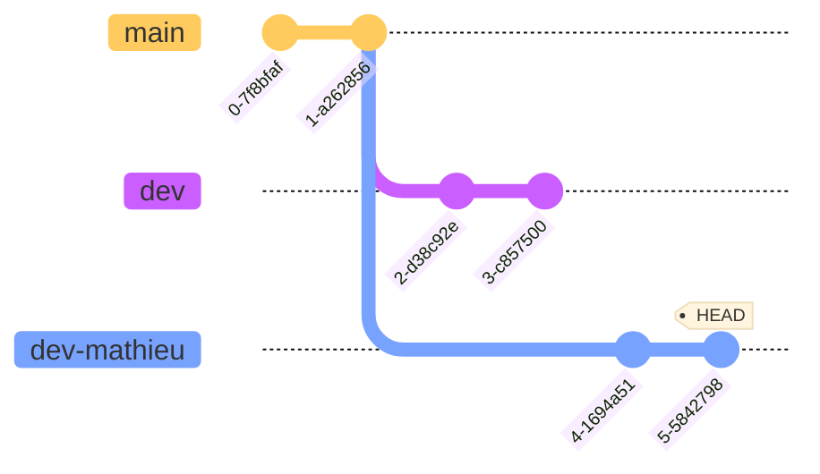

# GIT Gud


## Introduction

Git est un système de contrôle de version distribué et open source qui permet aux développeurs et aux équipes d'exploitation de collaborer et de suivre les modifications apportées à un projet.

En tant qu'outil DevOps, GIT favorise la collaboration et l'accélération des cycles de publication. Toute personne désireuse de démarrer sa carrière DevOps ou de passer à un niveau supérieur doit commencer par les bases, et GIT est l'exigence la plus fondamentale de toutes.

Bon nombre des projets open source les plus populaires aujourd'hui sont développés sur Github - Kubernetes, Ansible, TensorFlow, Rust, Node.js, Go, Terraform, Helm Charts étant quelques-uns des plus importants parmi les 100 millions de dépôts.


## Repos locaux et distants

Git a 2 type de repos :

* Le repo local, qui se trouve sur votre machine, et auquel vous avez un accès direct,
* Le repo distant, qui se trouve généralement sur un serveur centralisé, et qui est optionnel.

Le repo distant est pensé comme un back-up de votre repo local.

Le repo local est divisé en 3 sections.

1. La zone de travail où sont les fichiers sur lesquels vous travaillez, git ne fait rien avec ces fichiers, il sait juste que ces fichiers sont en train d'être modifiés.
2. La zone de transit (staging area), contient les nouveaux changements qui seront bientôt versionnés.
3. Les fichiers versionnés (committed files).

## Installer git sur ubuntu

```shell
sudo apt update
sudo apt install git -y

git config user.email "max@example.com"
git config user.name "max"
```

## Initialiser un repo git

Pour initialiser un repo, placez vous, dans le terminal, dans le dossier dans lequel vous voulez versionner les changements et taper simplement `git init` dans le terminal.

```shell
❯ cd helloworld-git

❯ git init

Dépôt Git vide initialisé dans /media/vorph/datas/perso/helloworld/helloworld-git/.git/
```

Maintenant que le repo est initialisé, Git surveille ce dossier et vois les changements qui y sont fait. On peut utiliser la commande `git status` pour les voir.

```shell
❯ touch story.txt
❯ echo "ceci n'est pas un texte" >> story.txt
❯ git status
Sur la branche master

Aucun commit

Fichiers non suivis:
  (utilisez "git add <fichier>..." pour inclure dans ce qui sera validé)
	story.txt

aucune modification ajoutée à la validation mais des fichiers non suivis sont présents (utilisez "git add" pour les suivre)
```

Aucun fichiers n'est dans la zone des fichiers versionnés, pour versionner notre travail, on le fait en deux étapes.

1. On envoie `story.txt` en zone de transit via `git add`,
2. On versionne `story.txt` avec `git commit`.


Le `-m` dans `git commit -m "commit story.txt"` et l'argument pour ajouter un message au commit.

* `git restore`
* `git rm --cached`
* `.gitignore`

Pour voir l'ensemble des commits d'un repo git, vous pouvez taper la commande suivante.

```shell
git log
```


```shell
git log

commit 83153b74fbedfde6c7bb6d6845ed56149829f86a (HEAD -> master)
Author: vorph <klimczak.mathieu@pm.me>
Date:   Mon May 16 15:35:19 2022 +0200

    feat: add story.txt
```

Un élément de log dans Git est constitué des éléments suivants :

* le hash du commit, qui est un identifiant akphanumérique unique au commit,
* l'auteur du commit,
* la date du commit,
* le texte écrit après l'argument `-m`.

`git log --oneline` permet de voir l'ensemble des ce infos au format une seule ligne.

Les fichiers versionnés n'apparaissent pas lorsque l'on utilise la commande `git log`, pour les faire apparaître on peut utiliser la commande `git log --name-only`

```shell
git log

commit 83153b74fbedfde6c7bb6d6845ed56149829f86a (HEAD -> master)
Author: vorph <klimczak.mathieu@pm.me>
Date:   Mon May 16 15:35:19 2022 +0200

    feat: add story.txt

story.txt
```

* `git log -n k` limite l'affichage des logs aux k derniers commits.

## Les branches Git

Da façon basique, une branche est un pointeur vers un certain commit.

```shell title="Crée une branche nommé dev"
git branch dev
```

```shell title="Switcher sur la branche nommé dev"
git checkout dev
```

```shell title="Crée une branche nommé dev et switch dessus directement"
git checkout -b dev
```

```shell title="Supprime une branche nommé dev"
git branch -d dev
```

```shell title="Liste toutes les branches"
git branch
```


### Qu'est ce que HEAD ?

Ce terme apparaît dans chaque commit que vous faites, par exemple dans l'exemple du dessus avec `git log`, on a `commit 83153b74fbedfde6c7bb6d6845ed56149829f86a (HEAD -> master)`.

`HEAD` désigne votre position actuelle dans le graphe git. En prenant le graphe ce-dessus, si vous êtes positionné au dernier commit de la branche `dev`, alors `HEAD` sera `3-e2cf2c8`.

Poure voir sur quel commit est positionné `HEAD`, [vous pouvez taper la commande suivante](https://stackoverflow.com/questions/1967967/git-command-to-display-head-commit-id).

```shell title="Montre le commit où est HEAD"
git rev-parse HEAD
```

`HEAD -> master` désigne donc la branche dans le repo sur laquelle vous faites un `git commit`. `HEAD` pointe toujours vers le dernier commit sur la branche actuellement extraite.

`git log --graph --decorate` permet d'avoir un graphe des différents commits, branch et merge de l'historique.

### `git merge`

Pour fusionner deux branches, la marche à suivre est la suivante :

1. se positionner sur la branche **vers laquelle** on veut fusionner,
2. taper la commande `git merge branche_a_fusionner`.

Par exemple, supposons que je suis sur la branche `dev-mathieu`, et que je souhaite fusionner mon travail vers la branche `dev`.


La marche à suivre est alors :

1. `git checkout dev`,
2. `git merge dev-mathieu`


On a deux type de `merge` différents :

1. fast-forward,
2. no-fast-forward


Un `fast-forward merge` se fait lorsque la branche vers laquelle on souhaite fusionner n'a pas de commits en dehors de celui créant la branche. Dans ce cas là, la fusion ne crée pas de nouveau commit mais fusionne les commits des deux branches.

!!! example "fast-forward merge de dev-mathieu vers dev"

    ```mermaid
    %%{init: { 'logLevel': 'debug', 'theme': 'base', 'gitGraph': {'showBranches': true, 'showCommitLabel':true,'mainBranchName': 'main'}} }%%
    gitGraph
      commit
      commit
      branch dev
      branch dev-mathieu
      commit id:"2-6923bcf"
      commit id:"3-9038f6c"
    ```

    ```mermaid
    %%{init: { 'logLevel': 'debug', 'theme': 'base', 'gitGraph': {'showBranches': true, 'showCommitLabel':true,'mainBranchName': 'main'}} }%%
    gitGraph
      commit
      commit
      branch dev
      commit id:"2-6923bcf"
      commit id:"3-9038f6c"
    ```

Un `no-fast-forward merge` se fait lorsque la branche vers laquelle on souhaite fusionner a au moins un commits en dehors de ceux présents sur la branche à fusionner. Dans ce cas là, la fusion créera un nouveau commit (un merge commit) en fusionnant les commits des deux branches.

!!! example "no-fast-forward merge de dev-mathieu vers dev"

    ```mermaid
    %%{init: { 'logLevel': 'debug', 'theme': 'base', 'gitGraph': {'showBranches': true, 'showCommitLabel':true,'mainBranchName': 'main'}} }%%
    gitGraph
      commit
      commit
      branch dev
      commit id:"2-aeb8393"
      commit id:"3-e1bb5ee"
      branch dev-mathieu
      commit id:"2-6923bcf"
      commit id:"3-9038f6c"
    ```

    ```mermaid
    %%{init: { 'logLevel': 'debug', 'theme': 'base', 'gitGraph': {'showBranches': true, 'showCommitLabel':true,'mainBranchName': 'main'}} }%%
    gitGraph
      commit
      commit
      branch dev
      commit id:"2-aeb8393"
      commit id:"3-e1bb5ee"
      commit id:"2-6923bcf"
      commit id:"3-9038f6c"
      commit id:"Merge"
    ```

## Initialiser et travailler avec un repo distant

Les solutions les plus connues pour héberger des repos distants sont les suivantes :

* GitHub,
* GitLab,
* Bitbucket,

Chacune des solutions ci-dessus, une fois un repo distant initialisé sur leur plateforme, founit une url de la forme :

* `https://github.com/my_organization/my_repo.git`,
* `https://gitlab.com/my_organization/my_repo.git`,
* `https://bitbucket.org/my_organization/my_repo.git`.

Pour ajouter ce repo distant à un projet local, on utilise la commande suivante.

```shell title="Connexion repo local vers repo distant (github par exemple)"
git remote add origin https://github.com/my_organization/my_repo.git
```

Il est possibble de connecter plusieurs repos distants au même repo local.

Pour voir l'ensemble des repos distants connectés au repo local, on utlise `git remote -v`.

Envoyer les commits vers le repo distant se fait via la commande `git push origin main`.


* `git clone`
* `git fetch origin main`
* `git pull origin main`

`git pull = git fetch + git merge`

* `git fork`

### Différence `git push` et `git push origin main`

```shell
$ git push

fatal: The current branch master has no upstream branch.
To push the current branch and set the remote as upstream, use

    git push --set-upstream origin master

$ git push origin master

Username for 'http://git.example.com': vorphus
Password for 'http://vorphus@git.example.com':
Enumerating objects: 14, done.
Counting objects: 100% (14/14), done.
Delta compression using up to 36 threads
Compressing objects: 100% (12/12), done.
Writing objects: 100% (14/14), 2.05 KiB | 2.05 MiB/s, done.
Total 14 (delta 4), reused 0 (delta 0), pack-reused 0
remote: . Processing 1 references
remote: Processed 1 references in total
To http://git.example.com/vorphus/story-blog.git
 * [new branch]      master -> master
```

## Rebasing

Lorsque l'on travaille sur une branche distincte de la branche `main` et que l'on souhaite mettre à jour sa branche avec les modifications apportées sur la branche `main`, on a deux solutions.

1. Faire un `merge` de la branche `main` vers la notre branche


* `git checkout dev`
* `git merge main`


2. Utiliser la commande `rebase`


* `git checkout dev`
* `git rebase main`


qui va modifier base de la `dev` pour la positionner au dernier commit de la branche `main`, et donc mettre à jour les fichiers, sans pour autant modifier la position de la branche `main`.

Une différence principale est que lors d'un `merge`, les hash des commits ne changent pas. Lors d'un rebase, comme l'on copie les fichiers à une nouvelle place, cela compte comme une opération et les hash se mettent à jour.

En d'autres termes, faire un `rebase` modifie l'historique Git, alors que ce n'est pas le cas pour un `merge`.

`git rebase -i HEAD~k`, permet de faire un rebase interactif des k derniers commits, pour par exemple faire du "[squash commit](https://stackoverflow.com/questions/5189560/squash-my-last-x-commits-together-using-git)".

`git cherry-pick hash`

## Reset et revert

* `git revert hash`
* `git reset --soft HEAD~k`
* `git reset --hard HEAD~k`