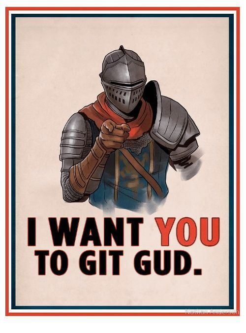

# GIT Gud



## Introduction

Git est un système de contrôle de version distribué et open source qui permet aux développeurs et aux équipes d'exploitation de collaborer et de suivre les modifications apportées à un projet.

En tant qu'outil DevOps, GIT favorise la collaboration et l'accélération des cycles de publication. Toute personne désireuse de démarrer sa carrière DevOps ou de passer à un niveau supérieur doit commencer par les bases, et GIT est l'exigence la plus fondamentale de toutes.

Bon nombre des projets open source les plus populaires aujourd'hui sont développés sur Github - Kubernetes, Ansible, TensorFlow, Rust, Node.js, Go, Terraform, Helm Charts étant quelques-uns des plus importants parmi les 100 millions de dépôts.


## Repos locaux et distants

Git a 2 type de repos :

* Le repo local, qui se trouve sur votre machine, et auquel vous avez un accès direct,
* Le repo distant, qui se trouve généralement sur un serveur centralisé, et qui est optionnel.

Le repo distant est pensé comme un back-up de votre repo local.

Le repo local est divisé en 3 sections.

1. La zone de travail où sont les fichiers sur lesquels vous travaillez, git ne fait rien avec ces fichiers, il sait juste que ces fichiers sont en train d'être modifiés.
2. La zone de transit (staging area), contient les nouveaux changements qui seront bientôt versionnés.
3. Les fichiers versionnés (committed files).

## Installer git sur ubuntu

```shell
sudo apt update
sudo apt install git -y
```

## Initialiser un repo git

Pour initialiser un repo, placez vous, dans le terminal, dans le dossier dans lequel vous voulez versionner les changements et taper simplement `git init` dans le terminal.

```shell
❯ cd helloworld-git

❯ git init

Dépôt Git vide initialisé dans /media/vorph/datas/perso/helloworld/helloworld-git/.git/
```

Maintenant que le repo est initialisé, Git surveille ce dossier et vois les changements qui y sont fait. On peut utiliser la commande `git status` pour les voir.

```shell
❯ touch story.txt
❯ echo "ceci n'est pas un texte" >> story.txt
❯ git status
Sur la branche master

Aucun commit

Fichiers non suivis:
  (utilisez "git add <fichier>..." pour inclure dans ce qui sera validé)
	story.txt

aucune modification ajoutée à la validation mais des fichiers non suivis sont présents (utilisez "git add" pour les suivre)
```

Aucun fichiers n'est dans la zone des fichiers versionnés, pour versionner notre travail, on le fait en deux étapes.

1. On envoie `story.txt` en zone de transit via `git add`,
2. On versionne `story.txt` avec `git commit`.


Le `-m` dans `git commit -m "commit story.txt"` et l'argument pour ajouter un message au commit.

* `git restore`
* `git rm --cached`
* `.gitignore`

Pour voir l'ensemble des commits d'un repo git, vous pouvez taper la commande suivante.

```shell
git log
```


```shell
git log

commit 83153b74fbedfde6c7bb6d6845ed56149829f86a (HEAD -> master)
Author: vorph <klimczak.mathieu@pm.me>
Date:   Mon May 16 15:35:19 2022 +0200

    feat: add story.txt
```

Un élément de log dans Git est constitué des éléments suivants :

* le hash du commit, qui est un identifiant akphanumérique unique au commit,
* l'auteur du commit,
* la date du commit,
* le texte écrit après l'argument `-m`.

`git log --oneline` permet de voir l'ensemble des ce infos au format une seule ligne.

Les fichiers versionnés n'apparaissent pas lorsque l'on utilise la commande `git log`, pour les faire apparaître on peut utiliser la commande `git log --name-only`

```shell
git log

commit 83153b74fbedfde6c7bb6d6845ed56149829f86a (HEAD -> master)
Author: vorph <klimczak.mathieu@pm.me>
Date:   Mon May 16 15:35:19 2022 +0200

    feat: add story.txt

story.txt
```

* `git log -n k` limite l'affichage des logs aux k derniers commits.

## Les branches Git

Da façon basique, une branche est un pointeur vers un certain commit.

```shell title="Crée une branche nommé dev"
git branch dev
```

```shell title="Switcher sur la branche nommé dev"
git checkout dev
```

```shell title="Crée une branche nommé dev et switch dessus directement"
git checkout -b dev
```

```shell title="Supprime une branche nommé dev"
git branch -d dev
```

```shell title="Liste toutes les branches"
git branch
```


## Initialiser un repo distant

## Rebasing

## Reset et revert