# Les bases du réseau

## Networking 101

### Switching

Qu'est ce qu'un réseau ?

Supposons que nous ayons deux ordinateurs, VM, Cloud Center, etc A et B.

Comment A communique-t-il avec B ?


On les connecte tous les deux à un switch commun, et ce switch crée un réseau contenant A et B.


Pour pouvoir les connecter, on a besoin d'une interface, qu'elle soit physique ou virtuelle.

Pour connaître cette interface, on peut taper la commande `ip link`.

!!! example "Exemple"

    Sur mon pc, cela donne le résulat suivant.

    ```shell

    ❯ ip link
    2: enp3s0: <BROADCAST,MULTICAST,UP,LOWER_UP> mtu 1500 qdisc fq_codel state UP mode DEFAULT group default qlen 1000
        link/ether 2c:f0:5d:d4:db:e6 brd ff:ff:ff:ff:ff:ff
    3: wlo1: <NO-CARRIER,BROADCAST,MULTICAST,UP> mtu 1500 qdisc noqueue state DOWN mode DORMANT group default qlen 1000
        link/ether 9c:29:76:75:3f:aa brd ff:ff:ff:ff:ff:ff
        altname wlp0s20f3
    5: docker0: <BROADCAST,MULTICAST,UP,LOWER_UP> mtu 1500 qdisc noqueue state UP mode DEFAULT group default
        link/ether 02:42:3a:62:5a:b9 brd ff:ff:ff:ff:ff:ff
    ```

[Dans la nomenclature Linux](https://www.linuxtricks.fr/wiki/nomenclature-des-interfaces-reseau-sous-linux-enp0s3-wlo1), `en` est le préfixe pour une interface ethernet, et `wl` pour une interface wifi.

Remarquons que Docker à sa propre interface `docker0` pour faire le lien entre les conteneurs et le reste du réseau.

!!! attention "Attention"

    Les nomenclatures peuvent quelque peu varier suivant les distributions, il n'est pas rare de voir `eth0` pour une interface ethernet.

Supposons que le réseau créé possède l'adresse $192.168.1.0$ et que A et B on deux interface ethernet nommé `enp3s0` et `enp3s1`.


Pour ajouter les deux ordinateurs A et B, on leur assigne alors une adresse ip sur ce réseau, via la commande suivante.

* `ip addr add 192.168.1.10/24 dev enp3s0` pour A,
* `ip addr add 192.168.1.11/24 dev enp3s1` pour B.

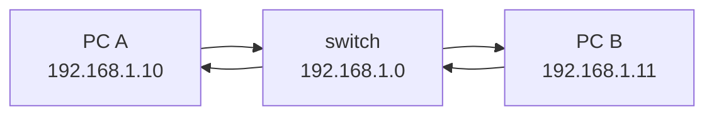

Chacun des deux pc possède alors une adresse sur ce réseau et peut communiquer avec l'autre. Il est pas exemple possible depuis A de faire un `ping` vers B en tapant `ping 192.168.1.11`.

Les communications ici entre A et B se font via le switch. Le switch ne peut recevoir et envoyer des informations que depuis des interfaces faisant parties du réseau défini.

Mettons maintenant deux réseaux définis par deux switchs avec deux adresses ip différentes. Comment A peut-il communiquer avec C ?

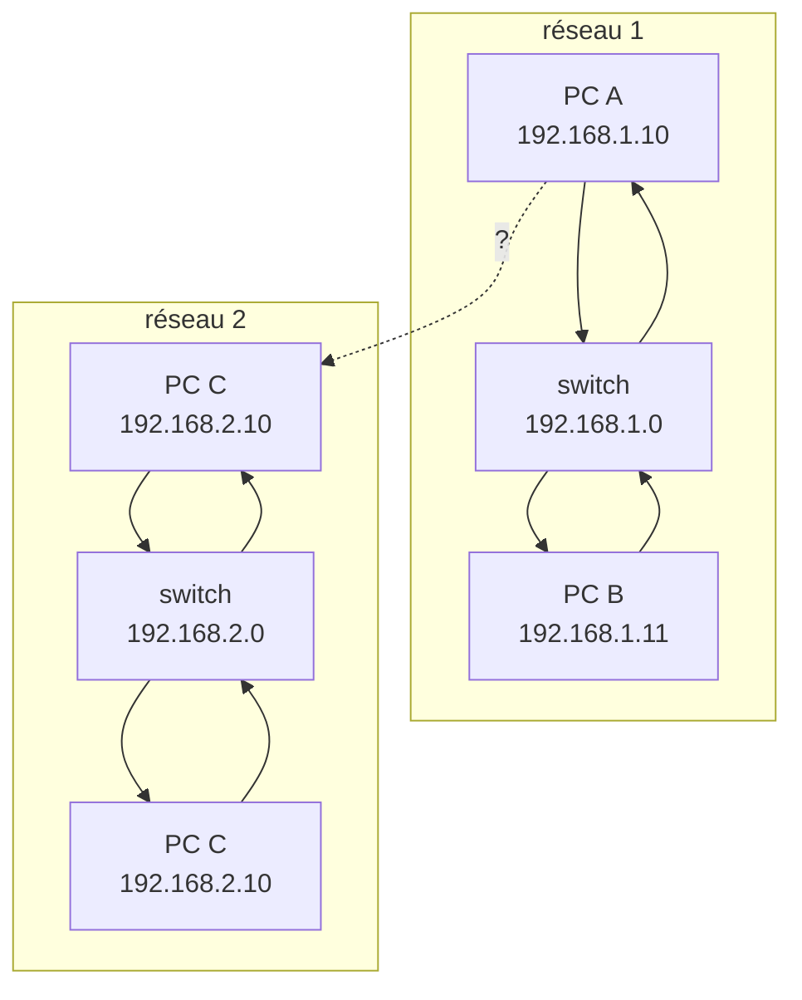

### Routing

C'est là qu'intervient le routeur. Un routeur permet de connecter deux réseaux ensembles. On peut le penser comme un serveur avec de multiples ports réseaux.

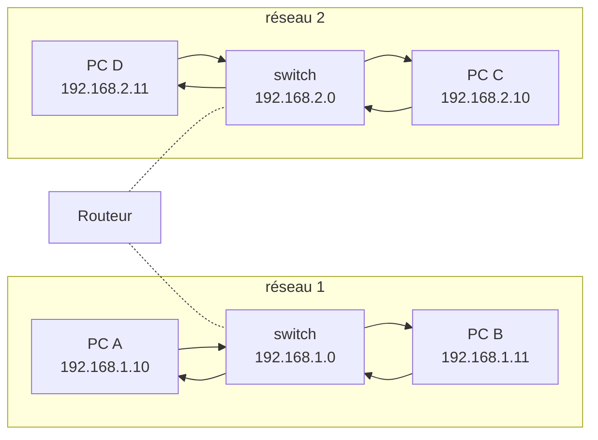
Puisque le routeur connecte deux réseaux, il a deux adresses qui lui sont assignées : une pour l'identifier sur chaque réseau.


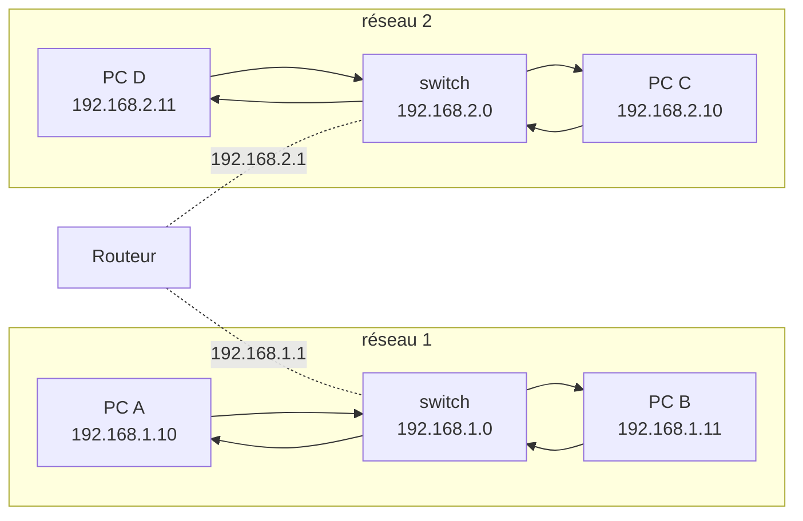


Maintenant que le routeur relie les deux réseaux, chacun des 4 pc peut communiquer l'un avec l'autre.

Quand le PC A veut envoyer un paquet au PC C, comment sait-il où est le routeur sur le réseau, pour envoyer le paquet via lui ? Le routeur n'est qu'un système supplémentaire sur le réseau, il peut y en avoir des centaines.

### Default Gateway

C'est là que l'on configure les systèmes avec une *gateway*, ou *passerelle*. Si un réseau est une chambre, alors la gateway est une porte pour communiquer vers l'extérieur.

Les systèmes ont besoin de savoir où est cette gateway pour pouvoir communiquer entre réseaux.

Pour voir les différentes **configuration de route**, ou **table de routage** d'un système, on peut alors taper la commande suivante.

`route`

!!! example "Exemple"

    Sur mon pc, cela donne le résultat suivant.

    ```shell
    ❯ route

    Table de routage IP du noyau
    Destination     Passerelle      Genmask         Indic Metric Ref    Use Iface
    default         livebox.home    0.0.0.0         UG    100    0        0 enp3s0
    link-local      0.0.0.0         255.255.0.0     U     1000   0        0 enp3s0
    172.17.0.0      0.0.0.0         255.255.0.0     U     0      0        0 docker0
    192.168.1.0     0.0.0.0         255.255.255.0   U     100    0        0 enp3s0
    ```

Dans notre exemple, si l'on tape cette commande, comme aucune passerelle n'a encore été définie, on obtiendra une table de routage vide.


```shell
❯ route

Table de routage IP du noyau
Destination     Passerelle      Genmask         Indic Metric Ref    Use Iface
```

Pour configurer une passerelle du PC B vers des systèmes du réseau 2, on tape alors la commande suivante.

`ip route add 192.168.2.0/24 via 192.168.1.1`

`via 192.168.1.1` définit la passerelle qui sera utilisée par le réseau 1 pour communiquer vers le réseau 2.

La table de routage du réseau 1 se mettra alors à jour.

```shell
❯ route

Table de routage IP du noyau
Destination     Passerelle      Genmask         Indic Metric Ref    Use Iface
192.168.2.0     192.168.1.1     255.255.255.0   U     100    0        0 eth0
```

!!! attention "Attention"

    Si l'on s'arette là, la communication ne va que dans un sens, du réseau 1 vers le réseau 2. Il faut aussi définir la passerelle pour aller dans l'autre sens.

cela se fait via `ip route add 192.168.1.0/24 via 192.168.2.1`.

Mais si maintenant le réseau 2 a besoin d'accéder à internet ? Par exemple à l'ip internet 172.217.194.0, qui est celle de Google (ça peut être utile) ?


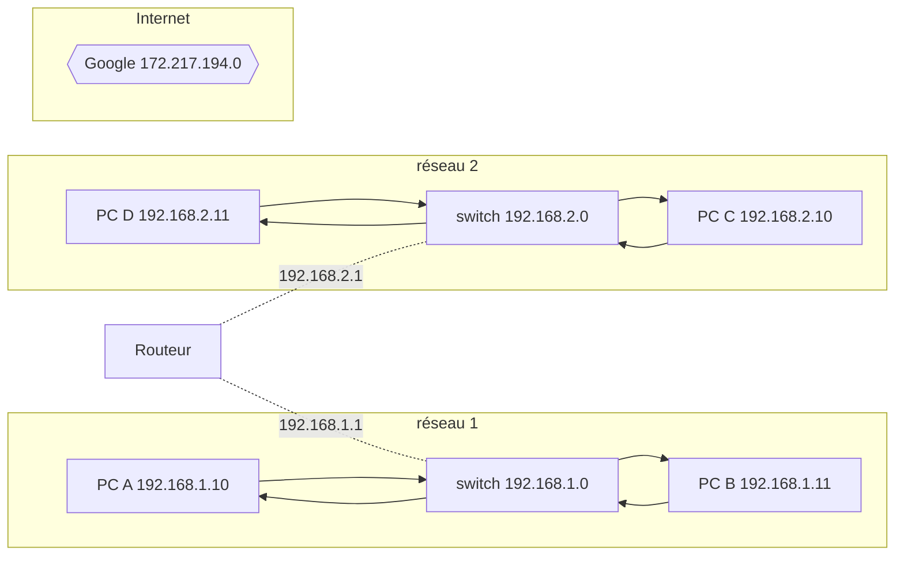
Et bien on rajoute une nouvelle passerelle.

`ip route add 172.217.194.0/24 via 192.168.2.1`

La table de routage aura alors une nouvelle route.

```shell
❯ route

Table de routage IP du noyau
Destination     Passerelle      Genmask         Indic Metric Ref    Use Iface
192.168.2.0     192.168.1.1     255.255.255.0   U     100    0        0 eth0
172.217.194.0   192.168.2.1     255.255.255.0   U     0      0        0 eth0
```

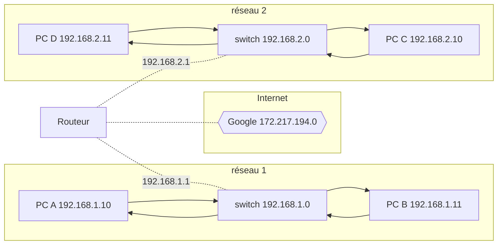

Mais il y a des milliards de sites, on ne va quand même pas faire ça pour tous ?

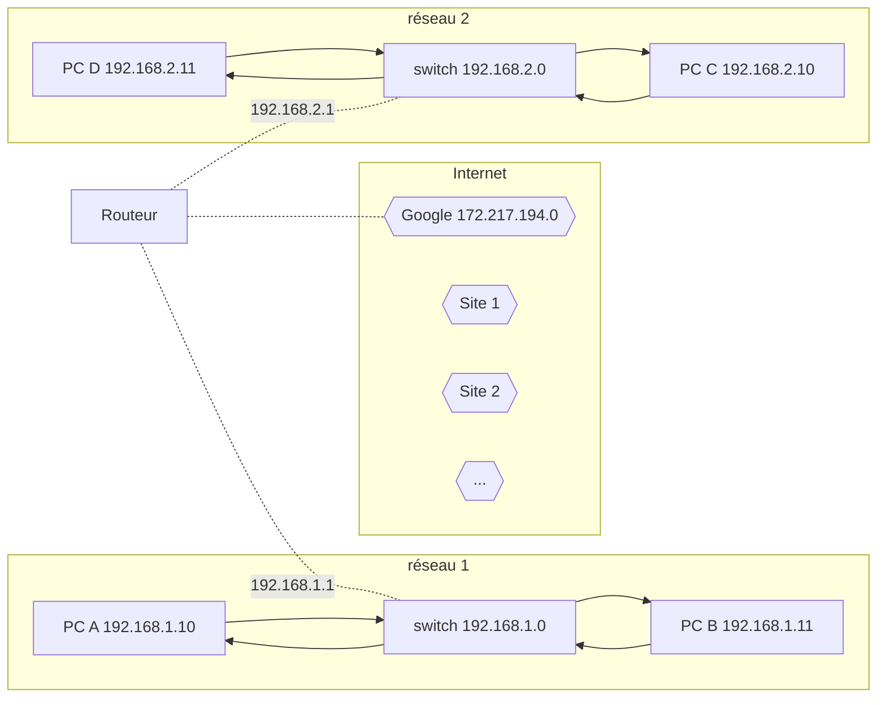

Plutôt que d'ajouter une nouvelle route pour chaque adresse ip, on peut simplement dire "pour chaque réseau dont je ne connais pas la route, utilise ce routeur comme passerelle par défaut".

`ip route add default via 192.168.2.1`

Ainsi, toute requête alors vers un réseau inconnu passe par ce routeur particuliers.


!!! example "Exemple"

    Sur mon pc, la passerelle par défaut est `livebox.home`, qui est ma box internet, ce qui est cohérent car c'est elle qui fait la jonction entre mon réseau local et internet.

    ```shell
    ❯ route

    Table de routage IP du noyau
    Destination     Passerelle      Genmask         Indic Metric Ref    Use Iface
    default         livebox.home    0.0.0.0         UG    100    0        0 enp3s0
    link-local      0.0.0.0         255.255.0.0     U     1000   0        0 enp3s0
    172.17.0.0      0.0.0.0         255.255.0.0     U     0      0        0 docker0
    192.168.1.0     0.0.0.0         255.255.255.0   U     100    0        0 enp3s0
    ```

    Notons qu'à la place de `default` comme destination, on aurait pu avoir `0.0.0.0`, ce qui revient au même puisque `0.0.0.0` signifie "n'importe quelle adresse ip".

    Lorsque l'on voit `0.0.0.0` dans la section passerelle, cela signifie simplement que l'on a pas besoin de passerelle pour accéder à ce réseau.

Comment définir un system Linux comme routeur ? Prenons la situation suivante.

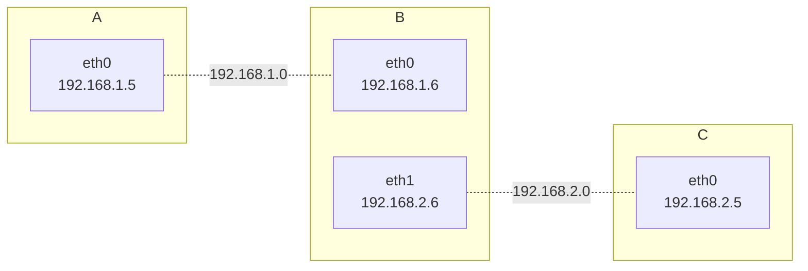

On a un système Linux B avec deux interfaces, chacune connectant un autre système Linux. Donc B est connecté aux 2 réseaux, et a donc une ip sur chaque réseau.

!!! question "Question"

    Comment A peut-il communiquer avec C ?

Si l'on essaye naïvement de faire un `ping 192.168.2.5` depuis le réseau A, on aura le message suivant `Connect: Network is unreachable`. Maintenant on sait pourquoi, A n'a aucune idée de comment joindre 192.168.2.0 car il n'y a pas de passerelle. On doit lui dire que la passerelle passe par B.

On fait ça via `ip route add 192.168.2.0/24 via 192.168.1.6`, et la même chose dans l'autre sens : `ip route add 192.168.1.0/24 via 192.168.2.6`.

Si l'on réesaye `ping 192.168.2.5` maintenant, nous n'aurons plus le message d'erreur, mais nous pas non plus de réponses. **Par défaut et pour des raisons de sécurité, dans Linux, les paquets ne sont pas transmis d'une interface à l'autre**, ie il n'y a aucune communication entre `eth0` et `eth1` dans le réseau B.

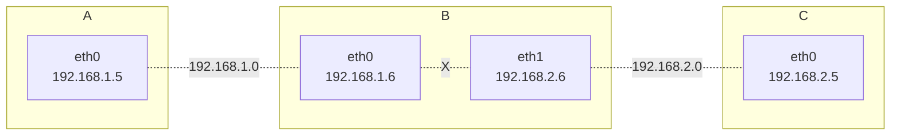

Pour autoriser B à transmettre les paquets d'une interface à l'autre, on doit aller voir dans `/proc/sys/net/ipv4/ip_forward`.

!!! example "Exemple"

    Sur mon pc, cela donne :

    ```shell
    ❯ cat /proc/sys/net/ipv4/ip_forward
    1
    ```

    La valeur est sur 1, donc le transfert d'une interface à l'autre est autorisé, sinon elle serait à 0.

!!! danger "Attention"

    Jusqu'à présent, toutes les commandes que l'on a expliquer ne persisterons pas au redémarrage du système ! Il faudrait les refaire à chaque fois.

Pour que les changements soient persistents, il faut modifier la valeur du paramètre `net.ipv4.ip_forward` dans `/etc/sysctl.conf` en la mettant à 1.

!!! example "Exemple"


    ```shell
    ❯ cat /etc/sysctl.conf
    #
    # /etc/sysctl.conf - Configuration file for setting system variables
    # See /etc/sysctl.d/ for additional system variables.
    # See sysctl.conf (5) for information.
    #

    #kernel.domainname = example.com

    # Uncomment the following to stop low-level messages on console
    #kernel.printk = 3 4 1 3

    ##############################################################3
    # Functions previously found in netbase
    #

    # Uncomment the next two lines to enable Spoof protection (reverse-path filter)
    # Turn on Source Address Verification in all interfaces to
    # prevent some spoofing attacks
    #net.ipv4.conf.default.rp_filter=1
    #net.ipv4.conf.all.rp_filter=1

    # Uncomment the next line to enable TCP/IP SYN cookies
    # See http://lwn.net/Articles/277146/
    # Note: This may impact IPv6 TCP sessions too
    #net.ipv4.tcp_syncookies=1

    # Uncomment the next line to enable packet forwarding for IPv4
    #net.ipv4.ip_forward=1

    # Uncomment the next line to enable packet forwarding for IPv6
    #  Enabling this option disables Stateless Address Autoconfiguration
    #  based on Router Advertisements for this host
    #net.ipv6.conf.all.forwarding=1


    ###################################################################
    # Additional settings - these settings can improve the network
    # security of the host and prevent against some network attacks
    # including spoofing attacks and man in the middle attacks through
    # redirection. Some network environments, however, require that these
    # settings are disabled so review and enable them as needed.
    #
    # Do not accept ICMP redirects (prevent MITM attacks)
    #net.ipv4.conf.all.accept_redirects = 0
    #net.ipv6.conf.all.accept_redirects = 0
    # _or_
    # Accept ICMP redirects only for gateways listed in our default
    # gateway list (enabled by default)
    # net.ipv4.conf.all.secure_redirects = 1
    #
    # Do not send ICMP redirects (we are not a router)
    #net.ipv4.conf.all.send_redirects = 0
    #
    # Do not accept IP source route packets (we are not a router)
    #net.ipv4.conf.all.accept_source_route = 0
    #net.ipv6.conf.all.accept_source_route = 0
    #
    # Log Martian Packets
    #net.ipv4.conf.all.log_martians = 1
    #

    ###################################################################
    # Magic system request Key
    # 0=disable, 1=enable all, >1 bitmask of sysrq functions
    # See https://www.kernel.org/doc/html/latest/admin-guide/sysrq.html
    # for what other values do
    #kernel.sysrq=438
    ```

### DNS sous Linux

On considère deux pc A et B reliés au même réseau, avec des adresse ip qui ont été assignées. Il sont capables de communiquer entre eux, ie `ping 192.168.1.11` depuis A fonctionne.

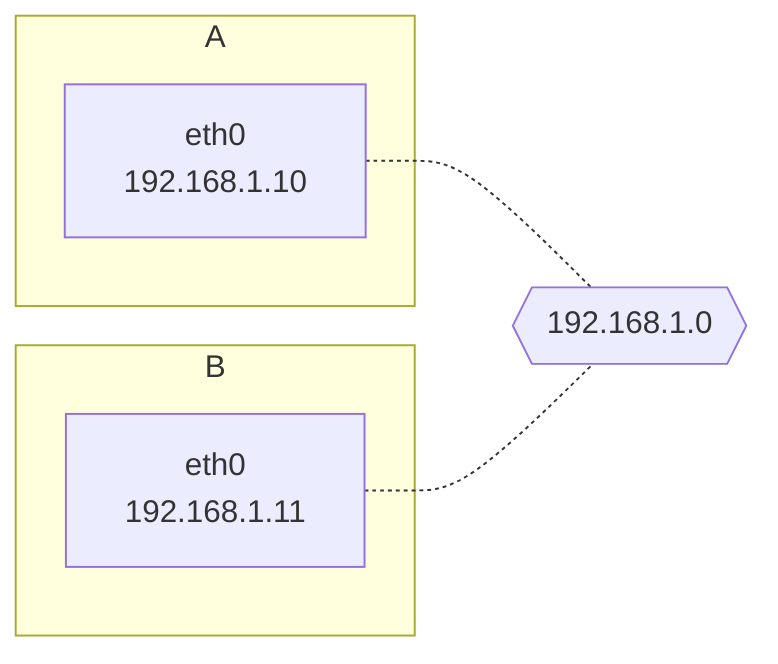

Le système B possède des bases de données, donc plutôt que de se souvenir de son adresse ip, on souhaite lui associer le nom `db`. Ainsi on souhaiterait que la commande `ping db` fonctionne, pour l'instant ce n'est pas le cas.

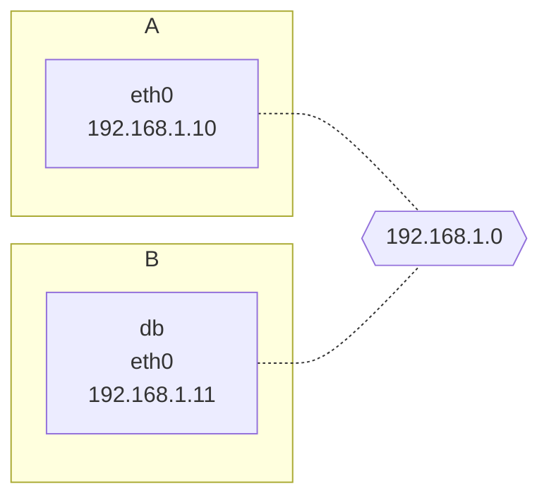

En d'autres termes, on souhaiterait dire au système A que lorsque l'on utilise le nom `db`, on veut en fait parler de l'adresse ip `192.168.1.11`.

En encore d'autres termes, on devrait créer un **dictionnaire sur le système A disant que la clé `db` a pour valeur l'adresse ip `192.168.1.11`**. **C'est exactement ce que fait le fichier `/etc/hosts` sous Linux.** Il suffit alors de rajouter la ligne `192.168.1.11          db` dans ce fichier pour que le poing depuis A sur B fonctionne.

!!! example "Exemple"

    Avec mon laptop sous WSL2, j'ai le fichier suivant.

    ```shell
    ❯ cat /etc/hosts

    # This file was automatically generated by WSL. To stop automatic generation of this file, add the following entry to /etc/wsl.conf:
    # [network]
    # generateHosts = false
    127.0.0.1       localhost
    127.0.1.1       Laptop3080.localdomain  Laptop3080
    
    192.168.1.21    host.docker.internal
    192.168.1.21    gateway.docker.internal
    127.0.0.1       kubernetes.docker.internal

    # The following lines are desirable for IPv6 capable hosts
    ::1     ip6-localhost ip6-loopback
    fe00::0 ip6-localnet
    ff00::0 ip6-mcastprefix
    ff02::1 ip6-allnodes
    ff02::2 ip6-allrouters
    ```

Un point important à noter, nous avons dit au système A que le système B s'appelait `db`, il va prendre ça pour acquis, **peut importe le nom que vous mettrez dans `/etc/hosts` il sera considéré comme vrai par A**.

On peut même assigner deux noms différents pointant sur la même ip cela ne pose aucun soucis, par exemple on peut faire la chose suivante.


```shell
❯ cat /etc/hosts

192.168.1.11    db
192.168.1.11    www.google.com
```

et les deux `ping` fonctionneront !

!!! example "Exemple"

    En faisant `cat /etc/hosts` sur mon laptop, on a vu que l'adresse `127.0.1.1` était répertoriée sous 3 clées différentes : `localhost`, `Laptop3080` et `Laptop3080.localdomain`, un `ping` sur chacun des " fonctionne sans soucis et appelle la même adresse ip.

    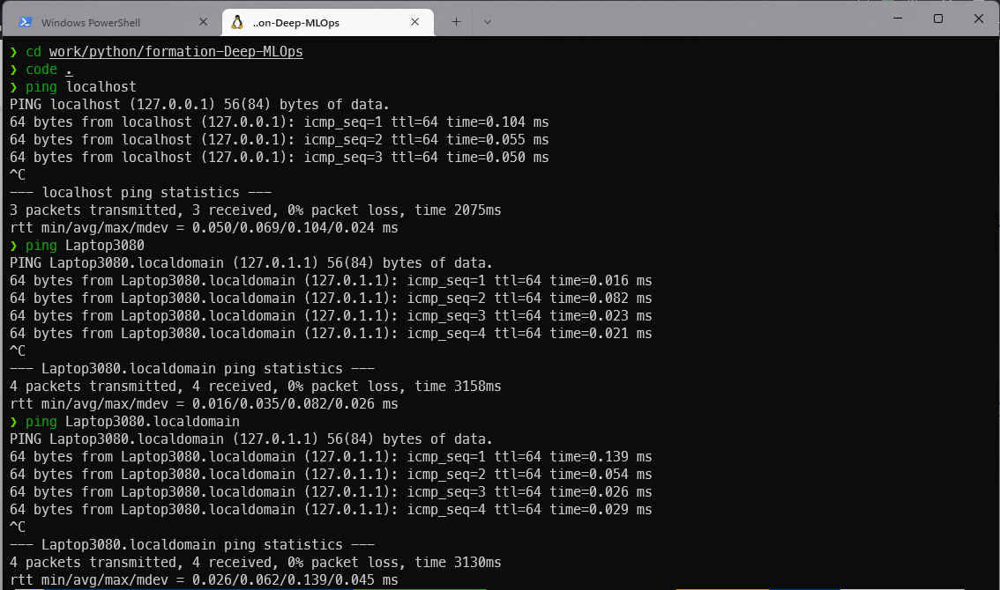

En d'autres termes, A ne vérifie pas si le vrai nom de B est `db`, pour voir le vrai nom du sysème B, il faut taper la commande suivante dans le sysème B : `hostname`.

```shell
❯ hostname

Laptop3080
```

A s'en fiche, il utilisera le nom qui est dans le fichier `/etc/hosts`.

La traduction du nom défini dans `/etc/hosts` en une adresse ip valide s'appelle la **résolution du nom**.

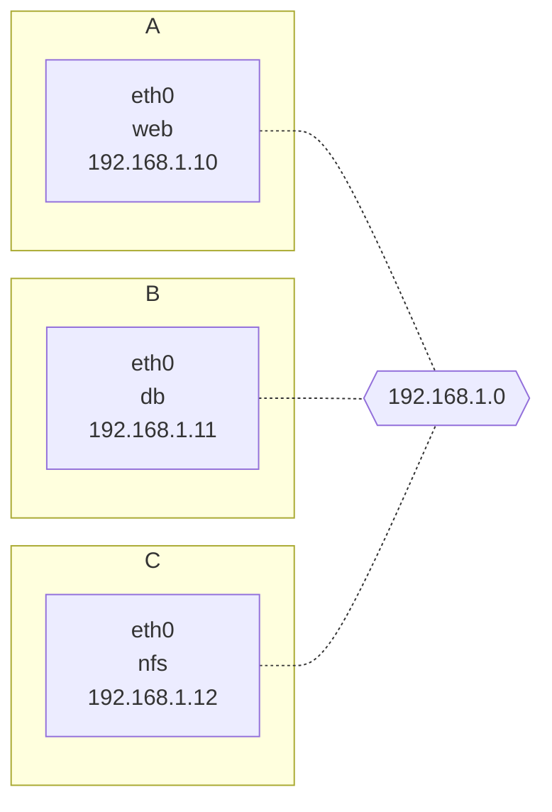

Avec des sysèmes relativement simples comme celui au dessus, on peut encore s'en sortir en définissant un même fichier `/etc/hosts` pour les 3 systèmes A, B et C.

```shell
❯ cat /etc/hosts

192.168.1.10    web
192.168.1.11    db
192.168.1.12    nfs
```

Pour les sysèmes modernes avec plusieurs milliers d'intefaces connectéss entre elles, ce n'est plus faisables. Si une seule ip change, il est alors nécessaire de changer l'ensemble des fichier `/etc/hosts` de toutes les machines, ce qui devient rapidement impossible.

L'idéee est alors de centraliser ce dictionnaire en un unique serveur, lorsque le système A aura alors besoin de faire une résolution de nom, il enverra une requête à ce serveur, qui se chargera de faire la résolution de nom et de lui renvoyer le résultat.

Ce serveur est ce que l'on appelle le **serveur DNS**.

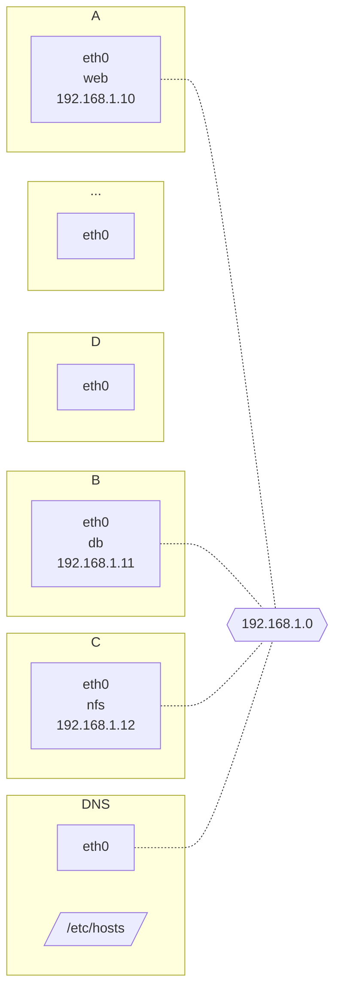

Comment faire en sorte que chaque système de réseau pointe correctement vers le serveur DNS quand il a besoin de faire une résolution de nom ?

Le serveur DNS est relié au réseau, il a donc une adresse ip, ici `192.168.1.100`. **Chaque sysrème Linux possède une fichier de configuration DNS `/etc/resolv.conf`**. Il suffit alors de le renseigner comme l'on renseignerait le fichier `/etc/hosts`.

```shell
cat /etc/resolv.conf

nameserver    192.168.1.100
```

!!! example "Exemple"

    Sur mon laptop, l'adresse du serveur DNS auquel je suis relié est la suivante.

    ```shell
    ❯ cat /etc/resolv.conf
    # This file was automatically generated by WSL. To stop automatic generation of this file, add the following entry to /etc/wsl.conf:
    # [network]
    # generateResolvConf = false
    nameserver 172.27.80.1
    ```

Si un nom ou une adresse ip change, il suffit alors de mettre à jour le registre du serveur DNS. Actuellement, avec les principes de réplications des données, la mise à jour d'un nom de domaine ou d'une adresse ip peut prendre entre 30 minutes et plusieurs heures, le temps que le changement soit pris en compte par l'ensemble des serveurs DNS présents sur internet.

Avoir un serveur DNS ne veut pas dire que le fichier `/etc/hosts` devient inutile. Si l'on souhaite provisioner un serveur de tests, en souhaitant que seuls les sytèmes de notre réseau, voire même uniquement notre système puissent y accéder, on peut renseigner unqiement le fichier `/etc/hosts` afin d'avoir une résolution locale.

Le fichier `/etc/hosts` est toujours prioritaire sur le serveur DNS, pour faire une résolution, un système cherchera d'abord dans `/etc/hosts`, et s'il ne trouve pas la solution, il fera ensuite une requête DNS.

Pour changer l'ordre de priorité, cela se fait dans le fichier de configuration `/etc/nsswitch.conf` en modifiant l'ordre des valeurs pour le paramètre `hosts`.

!!! example "Exemple"

    ```shell
    ❯ cat /etc/nsswitch.conf


    # /etc/nsswitch.conf
    #
    # Example configuration of GNU Name Service Switch functionality.
    # If you have the `glibc-doc-reference' and `info' packages installed, try:
    # `info libc "Name Service Switch"' for information about this file.

    passwd:         files systemd
    group:          files systemd
    shadow:         files
    gshadow:        files

    hosts:          files dns
    networks:       files

    protocols:      db files
    services:       db files
    ethers:         db files
    rpc:            db files

    netgroup:       nis
    ```

Si votre serveur DNS est sur un réseau privé, par exemple un serveur DNS sur un réseau bancaire, il est possible que votre DNS ne puisse pas résoudre tous les noms, par exemple `ping wwww.facebook.com` peut ne pas fonctionner, et donc dans ce cas vous serez dans l'impossibilité d'y accéder.

Il est possible de rajouter d'autres serveurs DNS, par exemple le serveru DNS de Google situé à l'adresse `8.8.8.8`. Pour faire cela il suffit de modifier le fichier `/etc/resolv.conf` en ajoutant la ligne `Forward All to 8.8.8.8`, les noms non résolus par votre serveru DNS, seront alors transmises au serveur DNS de Google.

Un nom de la forme `wwww.facebook.com` avec `www.` au début et `.com` à la fin est ce que l'on appelle un **nom de domaine**.

Pourquoi cette synthaxe ?

L'idée est de grouper les choses ensembles. La dernière partie est ce que l'on appelle le **nom de domaine de plus haut niveau** (top level domain name), il en existe peu, on peut par exemple citer `.com`, `.fr`, `.net`, `.edu`, `.org`, `.io`, etc. Ils sont censés représenter le but du site, `.com` pour les sites commerciaux, `.fr` pour les sites français, `.net` pour network, `.edu` pour les écoles/universités, `.org` pour les organisations à but non lucratif, etc.

Pour une adresse comme `google.com`, on peut alors hiérarchiser de la façon suivante. On a la racine le `.` suivi du nom de domaine de plus haut niveau, `google` est le **nom de domaine assigné** à google, et en desous nous avons les sous-domaines, si l'on veut utiliser google maps on ira sur `maps.google.com`, pour se connecter à son drive on ira sur `drive.google.com` etc.

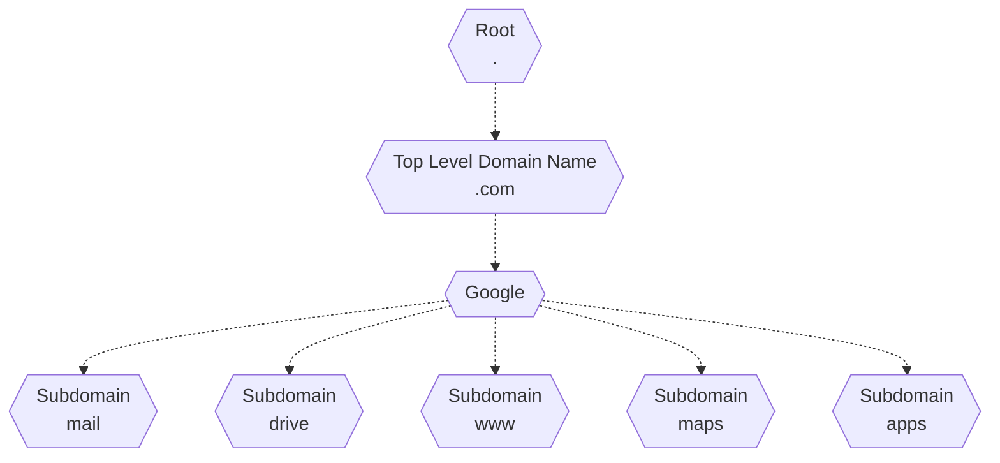


`nslookup`

`dig`

`search domain.com` dans `/etc/resolv.conf`