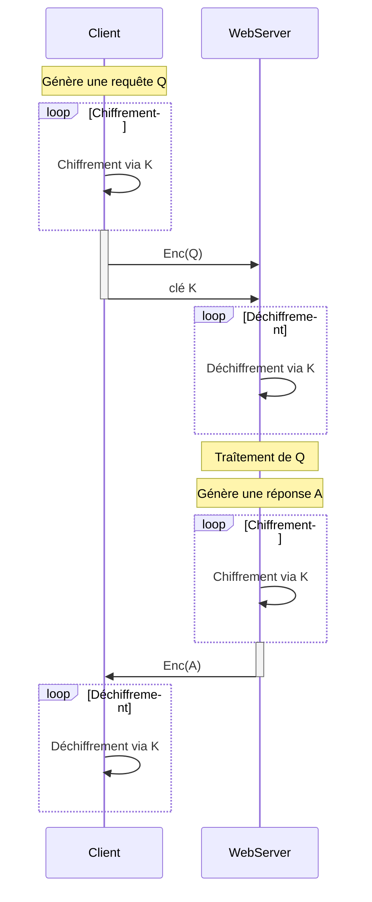

# Just enough SSL TLS certificates

Un certificat est utilisé pour garantif la confiance entre deux devices pendant une transaction.

Par exemple, lorsqu'un utilisateur souhaite se connecter à un serveur web, les certificats TLs sont là pour assurer que la communication entre les deux est correctement chiffrée et que le serveur est là où il prétend être.

Il existe plusieurs méthodes de chiffrements.

## Chiffrement symétrique

Le problème du chiffrement symétrique est que le client et le webserver utilise la même clé pour chiffrer et déchiffrer les messages, de plus comme la clé doit voyager (au moins un fois lors de la connexion initiale), ce type de chiffrement est susceptible à des attaques du type "man in the middle".

## Chiffrement asymétrique

Plutôt que d'utiliser une seule clé, le chiffrement asymétrique utilise une paire de clés: une clé **publique** et une clé **privée**. Pour la suite de l'explication, **on peut penser à la clé publique comme un cadenas publique**.

Le chiffrement asymétrique est également connu sous le nom de cryptographie à clé publique. Il utilise deux clés pour chiffrer un texte en clair. Une clé publique est mise gratuitement à la disposition de toute personne susceptible de vouloir crypter le message. La seconde clé privée est gardée secrète afin que seul l'utilisateur initial puisse la connaître. Un message crypté à l'aide d'une clé publique ne peut être décrypté qu'à l'aide d'une clé privée, tandis qu'un message crypté à l'aide d'une clé privée peut être décrypté à l'aide d'une clé publique.
