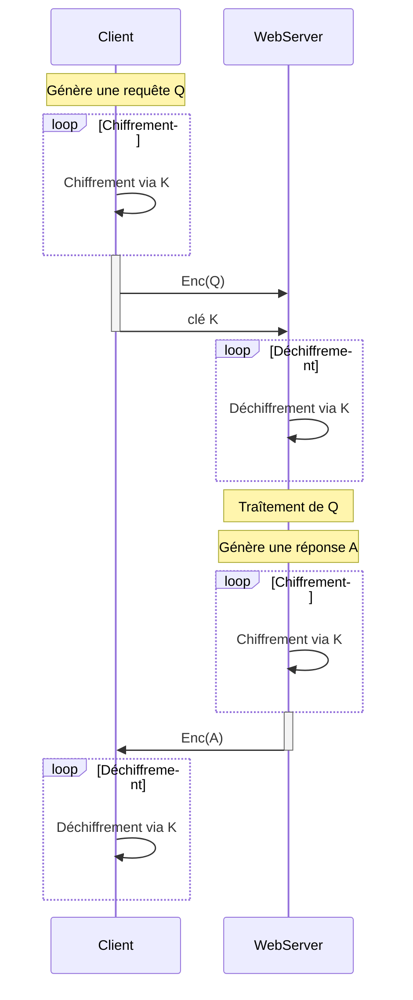
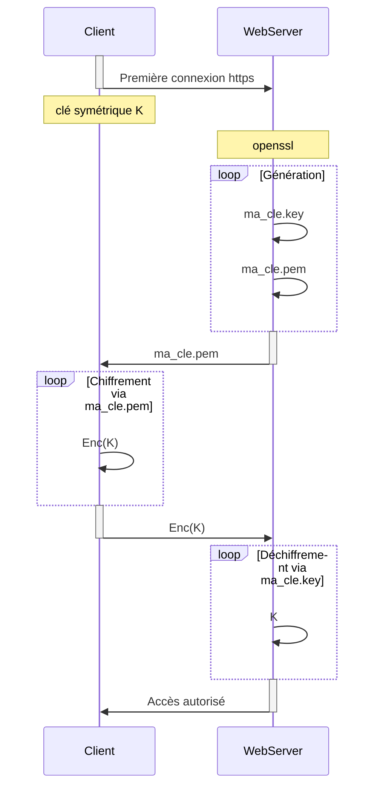

# Just enough SSL TLS certificates

Un certificat est utilisé pour garantir la confiance entre deux devices pendant une transaction.

Par exemple, lorsqu'un utilisateur souhaite se connecter à un serveur web, les certificats TLS sont là pour assurer que la communication entre les deux est correctement chiffrée et que le serveur est là où il prétend être.

Il existe plusieurs méthodes de chiffrements.

## Chiffrement symétrique

La méthode la plus simple pour chiffrer et accéder à des données est via un couple login/password.


Le problème du chiffrement symétrique est que le client et le webserver utilise la même clé pour chiffrer et déchiffrer les messages, de plus comme la clé doit voyager (au moins un fois lors de la connexion initiale), ce type de chiffrement est susceptible à des attaques du type "man in the middle".

## Chiffrement asymétrique

Plutôt que d'utiliser une seule clé, le chiffrement asymétrique utilise une paire de clés: une clé **publique** et une clé **privée**. Pour la suite de l'explication, **on peut penser à la clé publique comme un cadenas publique**.

Le chiffrement asymétrique est également connu sous le nom de cryptographie à clé publique.

Un cadenas publique est mise gratuitement à la disposition de toute personne susceptible de vouloir chiffrer le message.

La seconde clé privée est gardée secrète afin que seul l'utilisateur initial puisse la connaître.

Un message crypté à l'aide d'un cadenas publique ne peut être déchiffré qu'à l'aide d'une clé privée, tandis qu'un message chiffré à l'aide d'une clé privée peut être déchiffré à l'aide d'un cadenas publique.

Seul le cadenas publique transite vers le serveur, et l'unique clé pouvant débloquer l'accès est alors la clé privée contenue sur le device du Client.

Une commande du type `ssh -i id_rsa user1@server1` permet alors de se connecter en ssh au serveur.

L'ensemble des clés

!!! example "Exemple"

    Dans le cas où l'on souhaite sécuriser l'accès à un WebServer via SSH. On peut alors générer la clé privée et le cadenas via la commande `ssh-keygen`. On a alors la clé privée `id_rsa` et le cadenas `id_rsa.pub`.

    La liste des entrées possibles sur le serveur, ie les clés/cadenas publiques permettant de s'y connecter sont listées dans `~/.ssh/authorized_keys`.

    ```mermaid
    sequenceDiagram
        participant Client
        participant WebServer

        loop ssh-keygen
            Client->>Client: Clé privée généré K
            Client->>Client: Cadenas publique <br/> généré L
        end

        activate Client
        Client->>WebServer: L
        deactivate Client

        Note over WebServer : Réception de L
        Note over WebServer : Sécurisation
    ```

Une seule clé/cadenas publique peut être utilisée pour sécuriser l'accès à plusieurs serveurs, tant que la clé privée ne fuite pas cela ne pose pas de soucis.

Dans le cas où un autre Client souhaite accéder aux serveurs, il n'a alors qu'a générer une nouvelle paire de clés pour lui via `ssh-keygen` et vous fournir sa clé publique. Vous ayant accès au serveur pourra alors la rajouter à la liste des clés publiques autorisées dans `~/.ssh/authorized_keys`.

### openssl et https

!!! question "Question"

    Est-il possible de sécuriser le transfert de la clé K lors d'un chiffrement symétrique ?

    Oui, avec du chiffrement asymétrique.

Supposons que nous sommes dans le cas d'un chiffrement symétrique, comme au dessus, et que l'on souhaite transférer de façon sure la clé de chiffrement.

Une solution est alors de créer une paire de clé **côté serveur** via `openssl`.

```shell title="Génération de la clé publique"
openssl genrsa -out ma_cle.key 1024
```

```shell title="Génération de la clé/cadenas publique associée"
openssl rsa -in ma_cle.key -pubout > ma_cle.pem
```

* [pem file difference - ssh-keygen vs openssl](https://unix.stackexchange.com/questions/257010/pem-file-difference-ssh-keygen-vs-openssl)
* [What are the differences between ssh generated keys(ssh-keygen) and OpenSSL keys (PEM)and what is more secure for ssh remote login?](https://security.stackexchange.com/questions/29876/what-are-the-differences-between-ssh-generated-keysssh-keygen-and-openssl-keys)
* [How to get a .pem file from ssh key pair?](https://serverfault.com/questions/706336/how-to-get-a-pem-file-from-ssh-key-pair)
* [OpenSSL Quick Reference Guide](https://www.digicert.com/kb/ssl-support/openssl-quick-reference-guide.htm)
* [6 OpenSSL command options that every sysadmin should know](https://www.redhat.com/sysadmin/6-openssl-commands)

La première fois que le Client se connecte en **https** au serveur, il devine la clé publique générée `ma_cle.pem` lui ai transmise.

Le browser du Client chiffre alors la clé symétrique via la `ma_cle.pem` qui vient de lui être transmise.

Le couple (clé symétrique chiffrée, `ma_cle.pem`) fait alors le chemin inverse vers le serveur, où la clé symétrique est déchiffrée avec `ma_cle.key`.



Afin d'éviter les problèmes, y-a-t'il un moyen de vérifier que les clés/cadenas du style `ma_cle.pem` que l'on reçoit du serveur sont authentiques, et non pas des clés qu'un hacker aurait pu générer en reroutant votre connexion vers son serveur ?

En réalité, le serveur n'envoie pas que la clé `ma_cle.pem`, il envoie aussi un certificat, qui ne contient pas uniquement la clé, mais aussi l'adresse DNS du serveur ainsi que toutes les adresse DNS alternatives par lesquelles il peut être connu.

Pour vérifier la légitimité d'un certificat, **il est nécessaire qu'il soit signé**, cela se fait par **des autorités de certifications** (CA) publiques tierces. Il est aussi possible d'avoir des autorités des certifications privées, par exemple pour chiffer le réseau interne d'une entreprise.

PKI : Public Key Infrastructure.

Certificats générés pour une clé publique :

* `server.crt`
* `server.pem`
* `client.crt`
* `client.pem`

Certificats générés pour une clé privée :

* `server.key`
* `server-key.pem`
* `client.key`
* `client-key.pem`


## Exemple

Create a CSR (certificate signing request) `/etc/httpd/csr/app01.csr` (key name should be `app01.key`). Below are the required details which should be used while creating CSR.

1. Country Name = SG
2. State or Province Name = Capital Tower
3. Locality Name = CT
4. Organization Name = KodeKloud
5. Organizational Unit Name = Education
6. Common Name = app01.com
7. Email Address = admin@kodekloud.com
8. Keep challenge password blank.
9. Keep optional company name blank.

cd into `/etc/httpd/csr` directory and run command `sudo openssl req -new -newkey rsa:2048 -nodes -keyout app01.key -out app01.csr` to generate a CSR file.

To verify the entries we used to create a CSR, run the command:

`openssl req -noout -text -in app01.csr`

```shell
$ openssl req -noout -text -in app01.csr


Certificate Request:
    Data:
        Version: 0 (0x0)
        Subject: C=SG, ST=Capital Tower, L=CT, O=KodeKloud, OU=Education, CN=app01.com/emailAddress=admin@kodekloud.com
        Subject Public Key Info:
            Public Key Algorithm: rsaEncryption
                Public-Key: (2048 bit)
                Modulus:
                    00:c8:65:79:1c:48:f8:be:7e:1e:12:ed:ff:12:3f:
                    67:f1:76:a9:09:6e:95:25:17:bd:3a:95:e9:e0:5b:
                    2c:e7:82:07:60:80:88:74:93:ea:d5:49:90:28:33:
                    98:a4:f5:a7:fa:48:d9:89:5c:17:c5:75:73:ee:ea:
                    9a:c1:1e:47:25:9a:29:a5:de:4f:fe:49:8a:21:19:
                    8b:bb:a9:d6:93:1e:de:f6:30:d3:fe:d9:db:fb:6f:
                    83:f7:4e:68:f2:b2:ab:3e:22:8b:03:38:64:9c:32:
                    53:9f:36:07:4e:12:6a:47:28:fd:35:41:4f:2a:d5:
                    07:37:89:8a:a6:e7:5e:11:ba:0e:90:6f:3e:53:7b:
                    fb:ef:0f:88:b2:a7:28:d4:ce:01:5b:79:40:f5:35:
                    1a:ef:70:94:db:99:94:90:e9:3b:9a:6d:26:2c:b0:
                    0a:b4:d8:bf:a8:31:4c:14:bd:93:0b:c8:0c:a6:1d:
                    98:10:45:41:9f:8e:35:b5:bc:90:24:c8:b5:9e:00:
                    e6:39:58:50:f6:b9:bc:11:02:fd:96:ff:47:f0:da:
                    eb:d9:91:ec:1a:09:e6:7d:ca:41:ba:a6:b8:71:6a:
                    e8:33:c6:8b:c3:b9:9a:ff:c7:b6:a4:86:9a:cb:e5:
                    13:cd:5d:59:31:c4:3f:89:f4:99:cc:f9:37:89:40:
                    9b:49
                Exponent: 65537 (0x10001)
        Attributes:
            a0:00
    Signature Algorithm: sha256WithRSAEncryption
         18:d2:9a:97:66:e3:79:a8:f2:a2:98:0c:2d:66:26:3e:c2:8c:
         57:8c:1f:7c:6a:e7:e6:df:fe:d6:16:b4:e6:0e:3f:e0:8d:bc:
         ab:c4:46:73:a7:eb:e2:29:cb:06:da:6f:a9:39:1c:68:8f:86:
         26:2f:3a:a6:da:40:2c:a1:e8:87:5e:3a:c0:b5:d6:e8:bf:79:
         a4:62:07:fa:db:b7:dc:0e:45:33:0a:96:be:9b:2d:02:55:f0:
         2a:ff:fd:5c:b2:45:41:b5:e5:76:b6:6c:35:52:be:a9:4e:d1:
         c1:46:2a:a4:b0:35:e4:3a:46:69:f1:bf:1e:13:8a:b4:20:22:
         fe:66:d4:ef:cd:21:52:31:11:e0:43:59:45:4a:ad:2e:47:4c:
         be:42:58:fa:58:58:6e:e8:30:dc:27:4b:6b:3b:98:3c:d2:ff:
         4b:4d:d5:d4:96:91:f6:de:74:8d:53:b9:53:7b:38:ce:3b:4f:
         ee:0f:f6:b8:2b:32:a1:c3:43:a1:a0:29:ec:13:ab:36:f4:16:
         93:d6:0a:5d:19:40:ab:b7:81:66:07:5e:c1:8f:62:b9:0e:67:
         07:a5:f1:2b:ec:a1:ab:bb:83:81:f7:d8:aa:a7:e6:78:e5:f3:
         f6:98:6b:70:e4:75:b1:bf:7f:d3:b2:37:1f:86:dd:30:e9:b1:
         3b:ab:d7:9e
```

Great! We have now generated the CSR. We must now send it to a CA to get it signed. However there is no CA available, so **we will create our own self signed certificate**.

On app01 create a self signed certificate `/etc/httpd/certs/app01.crt` (key name should `app01.key`). Below are the required details which should be used while creating the certificate.

1. Country Name = SG
2. State or Province Name = Capital Tower
3. Locality Name = CT
4. Organization Name = KodeKloud
5. Organizational Unit Name = Education
6. Common Name = app01.com
7. Email Address = admin@kodekloud.com


cd into `/etc/httpd/certs` directory and run command `sudo openssl req -x509 -nodes -days 365 -newkey rsa:2048 -keyout app01.key -out app01.crt` and then pass in the details given above.

On app01 server we have an Apache web server already installed and configured and ssl mode is already enabled. In the `/etc/httpd/conf.d/ssl.conf` file update the SSL certificate and key to use your `app01.crt` and `app01.key` files. After making changes remember to restart Apache config.

For your reference the certificate you created in the previous steps is at `/etc/httpd/certs/app01.crt` and the key is at `/etc/httpd/certs/app01.key`. The properties in the file are SSLCertificateFile and SSLCertificateKeyFile. To test if server is using correct certificate or not run this command and check if it returns your certificate:

`echo | openssl s_client -showcerts -servername app01.com -connect app01:443 2>/dev/null | openssl x509 -inform pem`

Modify the settings in the file `/etc/httpd/conf.d/ssl.conf` to point to the self signed cert and key you created. Then restart httpd service using the command `sudo service httpd restart`.

```
Listen 443 https

SSLPassPhraseDialog exec:/usr/libexec/httpd-ssl-pass-dialog
SSLSessionCache         shmcb:/run/httpd/sslcache(512000)
SSLSessionCacheTimeout  300

SSLRandomSeed startup file:/dev/urandom  256
SSLRandomSeed connect builtin
#SSLRandomSeed startup file:/dev/random  512
#SSLRandomSeed connect file:/dev/random  512
#SSLRandomSeed connect file:/dev/urandom 512

SSLCryptoDevice builtin
#SSLCryptoDevice ubsec

##
## SSL Virtual Host Context
##

<VirtualHost _default_:443>

DocumentRoot "/var/www/html"
ServerName app01.com:443

ErrorLog logs/app01_ssl_error_log
TransferLog logs/app01_ssl_access_log
LogLevel warn

#   SSL Engine Switch:
#   Enable/Disable SSL for this virtual host.
SSLEngine on

#   SSL Protocol support:
# List the enable protocol levels with which clients will be able to
# connect.  Disable SSLv2 access by default:
SSLProtocol all -SSLv2 -SSLv3

#   SSL Cipher Suite:
#   List the ciphers that the client is permitted to negotiate.
#   See the mod_ssl documentation for a complete list.
SSLCipherSuite HIGH:3DES:!aNULL:!MD5:!SEED:!IDEA

#   Server Certificate:
# Point SSLCertificateFile at a PEM encoded certificate.  If
# the certificate is encrypted, then you will be prompted for a
# pass phrase.  Note that a kill -HUP will prompt again.  A new
# certificate can be generated using the genkey(1) command.
SSLCertificateFile /etc/httpd/certs/app01.crt

#   Server Private Key:
#   If the key is not combined with the certificate, use this
#   directive to point at the key file.  Keep in mind that if
#   you've both a RSA and a DSA private key you can configure
#   both in parallel (to also allow the use of DSA ciphers, etc.)
SSLCertificateKeyFile /etc/httpd/certs/app01.key

#SSLOptions +FakeBasicAuth +ExportCertData +StrictRequire
<Files ~ "\.(cgi|shtml|phtml|php3?)$">
    SSLOptions +StdEnvVars
</Files>
<Directory "/var/www/cgi-bin">
    SSLOptions +StdEnvVars
</Directory>

BrowserMatch "MSIE [2-5]" \
         nokeepalive ssl-unclean-shutdown \
         downgrade-1.0 force-response-1.0

#   Per-Server Logging:
#   The home of a custom SSL log file. Use this when you want a
#   compact non-error SSL logfile on a virtual host basis.
CustomLog logs/ssl_request_log \
          "%t %h %{SSL_PROTOCOL}x %{SSL_CIPHER}x \"%r\" %b"

</VirtualHost>
```

```
[thor@app01 certs]$ sudo service httpd restart
Redirecting to /bin/systemctl restart httpd.service
[thor@app01 certs]$ echo | openssl s_client -showcerts -servername app01.com -connect app01:443 2>/dev/null | openssl x509 -inform pem
-----BEGIN CERTIFICATE-----
MIID+TCCAuGgAwIBAgIJAL+q3TOi/zk/MA0GCSqGSIb3DQEBCwUAMIGSMQswCQYD
VQQGEwJTRzEWMBQGA1UECAwNQ2FwaXRhbCBUb3dlcjELMAkGA1UEBwwCQ1QxEjAQ
BgNVBAoMCUtvZGVLbG91ZDESMBAGA1UECwwJRWR1Y2F0aW9uMRIwEAYDVQQDDAlh
cHAwMS5jb20xIjAgBgkqhkiG9w0BCQEWE2FkbWluQGtvZGVrbG91ZC5jb20wHhcN
MjIwNTEwMTk0NjM5WhcNMjMwNTEwMTk0NjM5WjCBkjELMAkGA1UEBhMCU0cxFjAU
BgNVBAgMDUNhcGl0YWwgVG93ZXIxCzAJBgNVBAcMAkNUMRIwEAYDVQQKDAlLb2Rl
S2xvdWQxEjAQBgNVBAsMCUVkdWNhdGlvbjESMBAGA1UEAwwJYXBwMDEuY29tMSIw
IAYJKoZIhvcNAQkBFhNhZG1pbkBrb2Rla2xvdWQuY29tMIIBIjANBgkqhkiG9w0B
AQEFAAOCAQ8AMIIBCgKCAQEAyxqRPJBP9sp18fEi4q9CGpHd3idAFheWy6sBoAbY
I7gKRlpKbMuZC3ezstrnOPVt3AeQJFDDZ5CLZ1FN2fXx3tEdz/U8FElxBK8FbwkY
+igDJpBfEMkbIF2cNMMA0fw5F7589ddx3aCB4okjuJOSho7L6GtBRdtZUTEJCvgV
s8JTncXfm6Ad6pQe0+XrNb5ZDNct71RCVwWA+g8jzAYkTBiJ1psl3OJW+YY6kcXK
/8NWB8SjgCEfRRxfnwx7K49dO7PlNM7CuRj0CwHz5gGkm3eIez6v/1WVZU2D6tSR
AbI61pXx3yMhLi/+Hywh8pysKMMJkA6gYA4m0PJ7kbnKrQIDAQABo1AwTjAdBgNV
HQ4EFgQULcWGO0WKuybjbnvP885eJGOMjS0wHwYDVR0jBBgwFoAULcWGO0WKuybj
bnvP885eJGOMjS0wDAYDVR0TBAUwAwEB/zANBgkqhkiG9w0BAQsFAAOCAQEAZJLP
oTQsWKyRNWN+pYOOwHRLe5+fFUH4/uSLFNq1oZ/3F0fE+6hftcJ6Izi9D/UR4n3P
lhGFtw5/gZGEeQWwf+NvSn+ZjN2nhsS//69giLkQkVv6HGMXoZbwl1RItTYhndp9
75pRPLrXQjhKrvRR5Q72bujutCUyZsR7K1spUbh7YMHdshwxrqal0Z/WsDZtko6c
4zNwGxwuhcni/Ld7i7mGDiKsuqNSaA8myv0q6t1jDLOQBU3KZYbyQJvYG5IGeekq
qtBgSMqPbiy67lTtP5qb8djoe6qI44++4b4LQhXI7x6v/hdKpW9btPisb0g+xSnq
W0THP/VibgL6TKNFYA==
-----END CERTIFICATE-----
```
