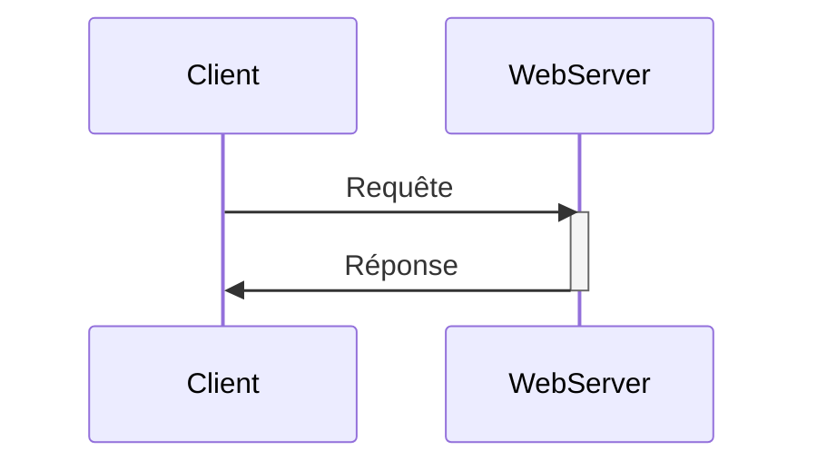
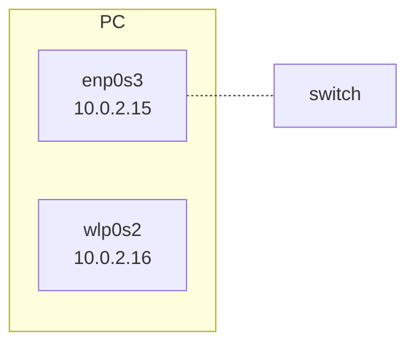
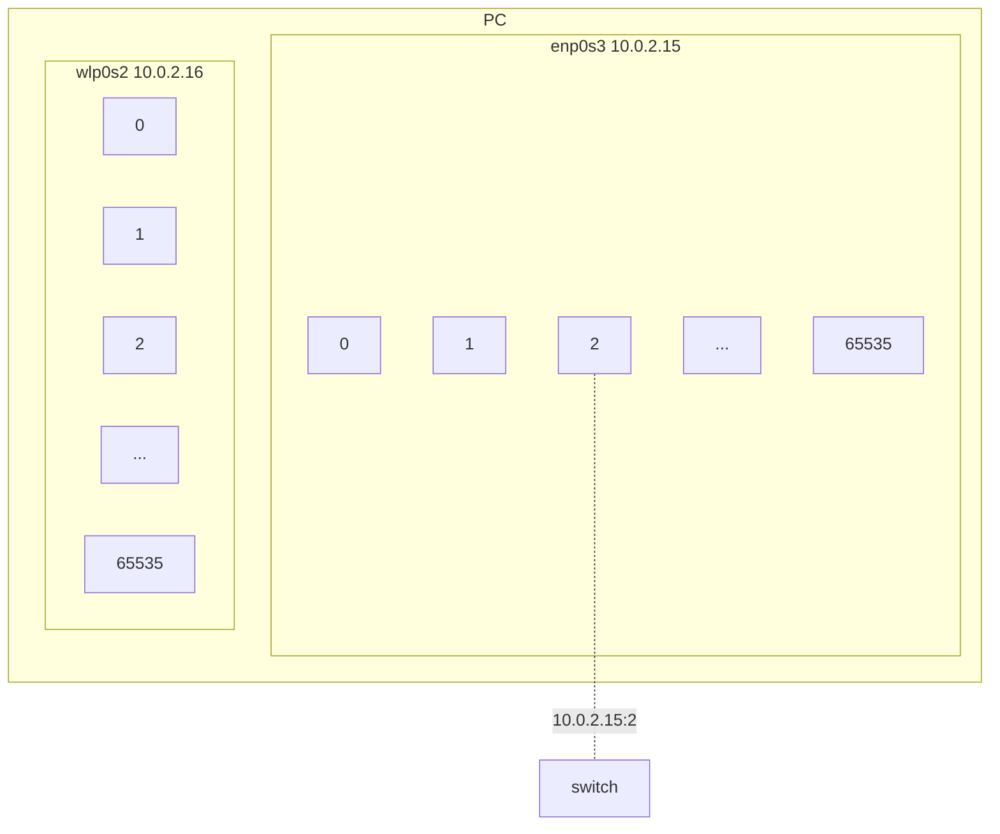
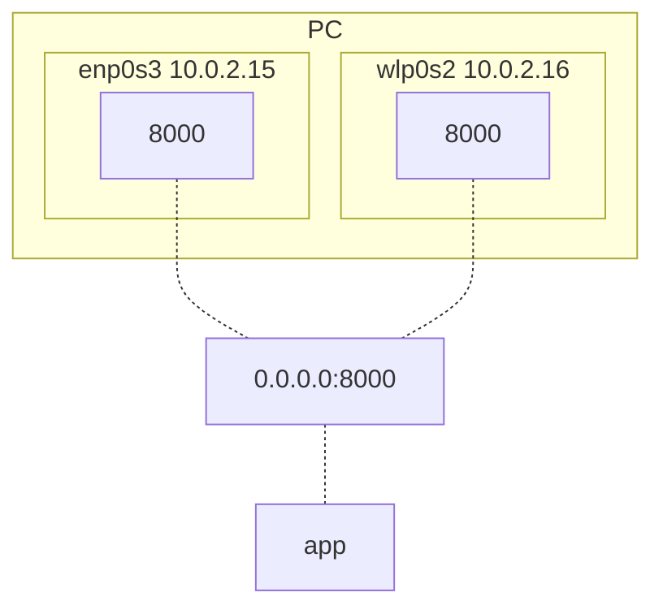
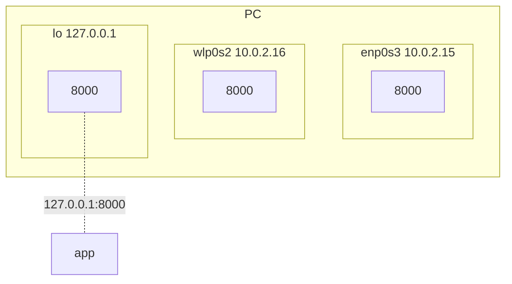

# Just enough Web Frameworks and Web Servers

## Backend web frameworks



Deux types de sites web :

* statiques : le contenu du site ne change pas. Une fois le contenu servi, il n'y a plus de contact avec le serveur,
* dynamiques.

## Apache Web Server

Open source HTTP serveur développé et maintenu par la fondation Apache. Plutôy utilisé comme serveur frontend.

```shell
yum install httpd
```

```shell
service httpd start
```

```shell
service httpd status
```

pour accéder aux logs, on utilise les commandes suivantes.

`cat /var/log/httpd/acces_log`

`cat /var/log/httpd/error_log`

Le fichier de configuration de httpd sur trouve dans `/etc/httpd/conf/httpd.conf`

## Apache Tomcat

Backend serveur utilisé pour déployer des applications java. Il est nécessaire d'avoir java d'installé pour pouvoir l'utiliser.

`yum install java-1.8.0-openjdk-devel`

Port par défaut de Apache Tomcat : `8080`.

`jar -cvf app.war *`

## Python web frameworks

Django, Flask.

Production grade serveurs pour Python :

* Gunicorn
* uWSGI
* Gevent
* Twisted Web

`gunicorn main:app`.

`gunicorn main:app -w 2` avec 2 workers.

How many total process of unicorn are now running in host01?

`ps -ef | grep gunicorn | grep -v grep`

Note that Gunicorn start new worker process so number of Gunicorn process is main process plus number of workers.

## NodeJS

Express.js is the main web server framework.

`npm install` pour installer l'ensemble des dépendances du projet.

```json title="package.json"
cat package.json
{
  "name": "example-contentful-theExampleApp-js",
  "version": "0.0.0",
  "private": true,
  "scripts": {
    "start:watch": "nodemon ./bin/www --ignore public/",
    "start:dev": "node ./bin/www",
    "debug": "node debug ./bin/www",
    "start": "NODE_ENV=production node ./bin/www",
    "start:production": "NODE_ENV=production node ./bin/www",
    "lint": "eslint ./app.js routes",
    "format": "eslint --fix . bin --ignore public node_modules",
    "pretest": "npm run lint",
    "test": "npm run test:unit && npm run test:integration && npm run test:e2e",
    "test:e2e": "node test/run-e2e-test.js",
    "test:e2e:dev": "node test/run-e2e-test.js --dev",
    "test:integration": "jest test/integration",
    "test:integration:watch": "jest test/integration --watch",
    "test:unit": "jest test/unit",
    "test:unit:watch": "jest test/unit --watch"
  },
  "engines": {
    "node": ">=8.9.3"
  },
  "dependencies": {
    "body-parser": "^1.18.2",
    "contentful": "^6.0.0",
    "cookie-parser": "~1.4.3",
    "dotenv": "^5.0.0",
    "execa": "^0.9.0",
    "express": "^4.16.2",
    "helmet": "^3.11.0",
    "lodash": "^4.17.5",
    "marked": "^0.3.16",
    "morgan": "^1.9.1",
    "pug": "~2.0.0-beta6"
  },
  "devDependencies": {
    "cheerio": "^1.0.0-rc.2",
    "cookie": "^0.3.1",
    "eslint": "^4.18.1",
    "eslint-config-standard": "^11.0.0",
    "eslint-plugin-import": "^2.8.0",
    "eslint-plugin-node": "^6.0.0",
    "eslint-plugin-promise": "^3.6.0",
    "eslint-plugin-standard": "^3.0.1",
    "jest": "^22.4.0",
    "nodemon": "^1.18.9",
    "supertest": "^3.0.0",
    "yargs": "^11.0.0"
  }
}
```

`npm run start`, `npm run debug`, ... pour lancer la valeur correspondante dans la partie `scripts` de `package.json`.

PM2 : Production Process Manager for Node.js applications with a built-in load balancer.

`pm2 start app.js`

`pm2 start app.js -i 4` avec 4 instances de l'application.

```shell
thor@host01 /opt/the-example-app.nodejs$ pm2 start app.js

                        -------------

__/\\\\\\\\\\\\\____/\\\\____________/\\\\____/\\\\\\\\\_____
 _\/\\\/////////\\\_\/\\\\\\________/\\\\\\__/\\\///////\\\___
  _\/\\\_______\/\\\_\/\\\//\\\____/\\\//\\\_\///______\//\\\__
   _\/\\\\\\\\\\\\\/__\/\\\\///\\\/\\\/_\/\\\___________/\\\/___
    _\/\\\/////////____\/\\\__\///\\\/___\/\\\________/\\\//_____
     _\/\\\_____________\/\\\____\///_____\/\\\_____/\\\//________
      _\/\\\_____________\/\\\_____________\/\\\___/\\\/___________
       _\/\\\_____________\/\\\_____________\/\\\__/\\\\\\\\\\\\\\\_
        _\///______________\///______________\///__\///////////////__


                          Runtime Edition

        PM2 is a Production Process Manager for Node.js applications
                     with a built-in Load Balancer.

                Start and Daemonize any application:
                $ pm2 start app.js

                Load Balance 4 instances of api.js:
                $ pm2 start api.js -i 4

                Monitor in production:
                $ pm2 monitor

                Make pm2 auto-boot at server restart:
                $ pm2 startup

                To go further checkout:
                http://pm2.io/


                        -------------

[PM2] Spawning PM2 daemon with pm2_home=/home/thor/.pm2
[PM2] PM2 Successfully daemonized
[PM2] Starting /opt/the-example-app.nodejs/app.js in fork_mode (1 instance)
[PM2] Done.
┌─────┬────────┬─────────────┬─────────┬─────────┬──────────┬────────┬──────┬───────────┬──────────┬──────────┬──────────┬──────────┐
│ id  │ name   │ namespace   │ version │ mode    │ pid      │ uptime │ ↺    │ status    │ cpu      │ mem      │ user     │ watching │
├─────┼────────┼─────────────┼─────────┼─────────┼──────────┼────────┼──────┼───────────┼──────────┼──────────┼──────────┼──────────┤
│ 0   │ app    │ default     │ 0.0.0   │ fork    │ 1023     │ 0s     │ 0    │ online    │ 0%       │ 29.3mb   │ thor     │ disabled │
└─────┴────────┴─────────────┴─────────┴─────────┴──────────┴────────┴──────┴───────────┴──────────┴──────────┴──────────┴──────────┘
thor@host01 /opt/the-example-app.nodejs$ ^C
thor@host01 /opt/the-example-app.nodejs$ pm2 start app.js -i 4
[PM2][ERROR] Script already launched, add -f option to force re-execution
thor@host01 /opt/the-example-app.nodejs$ pm2 start app.js -i 4 -f
[PM2] Starting /opt/the-example-app.nodejs/app.js in cluster_mode (4 instances)
[PM2] Done.
┌─────┬────────┬─────────────┬─────────┬─────────┬──────────┬────────┬──────┬───────────┬──────────┬──────────┬──────────┬──────────┐
│ id  │ name   │ namespace   │ version │ mode    │ pid      │ uptime │ ↺    │ status    │ cpu      │ mem      │ user     │ watching │
├─────┼────────┼─────────────┼─────────┼─────────┼──────────┼────────┼──────┼───────────┼──────────┼──────────┼──────────┼──────────┤
│ 0   │ app    │ default     │ 0.0.0   │ fork    │ 1225     │ 1s     │ 12   │ online    │ 0%       │ 50.3mb   │ thor     │ disabled │
│ 1   │ app    │ default     │ 0.0.0   │ cluster │ 1247     │ 0s     │ 0    │ online    │ 0%       │ 41.0mb   │ thor     │ disabled │
│ 2   │ app    │ default     │ 0.0.0   │ cluster │ 1254     │ 0s     │ 0    │ online    │ 0%       │ 38.0mb   │ thor     │ disabled │
│ 3   │ app    │ default     │ 0.0.0   │ cluster │ 1263     │ 0s     │ 0    │ online    │ 0%       │ 35.5mb   │ thor     │ disabled │
│ 4   │ app    │ default     │ 0.0.0   │ cluster │ 1276     │ 0s     │ 0    │ online    │ 0%       │ 29.8mb   │ thor     │ disabled │
└─────┴────────┴─────────────┴─────────┴─────────┴──────────┴────────┴──────┴───────────┴──────────┴──────────┴──────────┴──────────┘
```

## IPs et Ports

* Quelle adress IP et port utiliser ?
* localhost vs 127.0.0.1 cs IP adresse.
* Pourquoi est ce que je ne peux pas me connecter à mon serveur ?

Une adresse IP est assignée à une interface, pas à un device. Ainsi on peut très bien avoir une IP pour se connecter en filaire, et une IP wifi.



```shell
❯ ip addr show

1: lo: <LOOPBACK,UP,LOWER_UP> mtu 65536 qdisc noqueue state UNKNOWN group default qlen 1000
    link/loopback 00:00:00:00:00:00 brd 00:00:00:00:00:00
    inet 127.0.0.1/8 scope host lo
       valid_lft forever preferred_lft forever
    inet6 ::1/128 scope host
       valid_lft forever preferred_lft forever

2: enp3s0: <BROADCAST,MULTICAST,UP,LOWER_UP> mtu 1500 qdisc fq_codel state UP group default qlen 1000
    link/ether 2c:f0:5d:d4:db:e6 brd ff:ff:ff:ff:ff:ff
    inet 192.168.1.37/24 brd 192.168.1.255 scope global dynamic noprefixroute enp3s0
```

Chacune de ces adresses IP est divisée et composantes logiques appelées "ports", chanque port étant un point de communication possible vers l'extérieur.

Ainsi, un serveur attendra des requếtes d'une certaine interface sur un port bien précis.



Par exemple, une application python utilisant `Flask` écoute par défaut sur le port 5000. Mais sur quelle adresse ip ? Pour modifier l'adresse ip, il est nécessaire de spécifier sur quelle interface l'application doit écouter, sur quel `host`. Pour `Flask`, cela peut se faire via `app.run(port=8000, host="10.0.2.15")`. L'application écoute alors à l'adresse suivante `http://10.0.2.15:8000`.

Si l'on souhaite que l'application soit aussi disponible sur toutes les autres interfaces, il suffit alors de remplacer l'adresse de l'hôte par `0.0.0.0`.



Comment faire si nous ne sommes pas encore assez confiant concernant notre application ? On ne veut pas qu'elle soit disponible à l'extérieur, mais l'on souhaite quand même être capable de la tester.

Dans ce cas là, il ne faut spécifier aucune adresse pour `host`. Si c'est le cas, par défaut l'application écoute alors sur l'adresse `127.0.0.1`, qui est l'adresse désignée par `lo` dans la nomenclature et qui est ce que l'on apelle "l'adresse loopback".

Chaque device possède une interface virtuelle connue comme l'adresse loopback.



Dans ce cas là, l'application écoute à l'adresse `http://127.0.0.1:8000`. Au lieu de taper l'adresse à chaque fois, il est possible de taper `http://localhost:8000`.

**localhost est le nom assignée à l'adresse loopback 127.0.0.1**, les deux sont interchangeables.


nohup python app.py &

Note: Nohup stands for no hang up, which can be executed as shown below.

nohup command-with-options &

Adding "&" at the end will move the process to run in background. When you execute a Unix job in the background (using &) and logout from the session, your process will get killed. You can avoid this with nohup.