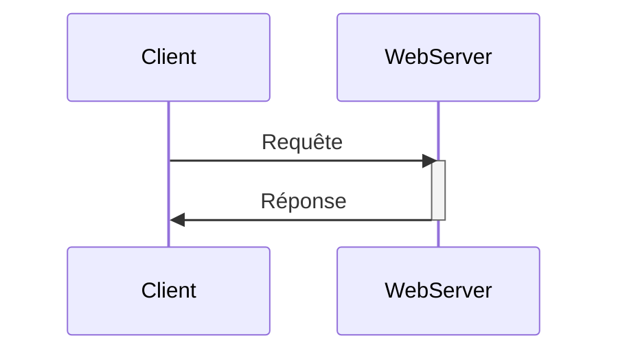

# Just enough Web Frameworks and Web Servers

## Backend web frameworks



Deux types de sites web :
* statiques : le contenu du site ne change pas. Une fois le contenu servi, il n'y a plus de contact avec le serveur,
* dynamiques.

## Apache Web Server

Open source HTTP serveur développé et maintenu par la fondation Apache. Plutôy utilisé comme serveur frontend.

```shell
yum install httpd
```

```shell
service httpd start
```

```shell
service httpd status
```

pour accéder aux logs, on utilise les commandes suivantes.

`cat /var/log/httpd/acces_log`

`cat /var/log/httpd/error_log`

Le fichier de configuration de httpd sur trouve dans `/etc/httpd/conf/httpd.conf`

## Apache Tomcat

Backend serveur utilisé pour déployer des applications java. Il est nécessaire d'avoir java d'installé pour pouvoir l'utiliser.

`yum install java-1.8.0-openjdk-devel`

Port par défaut de Apache Tomcat : `8080`.

`jar -cvf app.war *`

## Python web frameworks

Django, Flask.

Production grade serveurs pour Python :

* Gunicorn
* uWSGI
* Gevent
* Twisted Web

`gunicorn main:app`.

`gunicorn main:app -w 2` avec 2 workers.

How many total process of unicorn are now running in host01?

`ps -ef | grep gunicorn | grep -v grep`

Note that Gunicorn start new worker process so number of Gunicorn process is main process plus number of workers.

## NodeJS

Express.js is the main web server framework.

`npm install` pour installer l'ensemble des dépendances du projet.