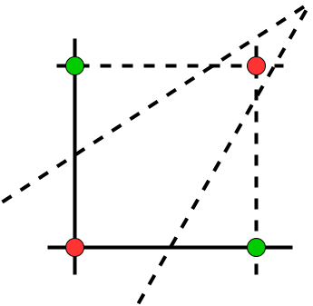
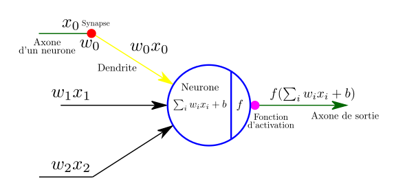

# Module 1 : Introduction au deep learning, prise en main de Tensorflow et Keras


## Préliminaires, notations et conventions

!!! python "Python"
    Lorem ipsum dolor sit amet, consectetur adipiscing elit. Nulla et euismod
    nulla. Curabitur feugiat, tortor non consequat finibus, justo purus auctor
    massa, nec semper lorem quam in massa.

??? tf "TensorFlow"
    test Lorem ipsum dolor sit amet, consectetur adipiscing elit. Nulla et euismod
    nulla. Curabitur feugiat, tortor non consequat finibus, justo purus auctor
    massa, nec semper lorem quam in massa.


Dans la suite de ces modules, on se place de le cadre d'un **apprentissage** dit **supervisé**, on considérera donc la problématique suivante :


!!! Note "Problématique"

    On note $\mathbf{R}^{j}$ l'espace vectoriel réel de dimension $j$. Etant donné le dataset (fini) suivant.

    $$
        \mathcal{X} = \lbrace (\mathbf{x}_{i}, \mathbf{y}_{i})\rbrace_{i \in I} \quad (\mathbf{x}_{i}, \mathbf{y}_{i}) \in \mathbf{R}^{m} \times \mathbf{R}^{k}
    $$

    On suppose que $\mathbf{x}_{i}$ et $\mathbf{y}_{i}$ sont reliés entre eux par une fonction **inconnue** $f : \mathbf{R}^{m} \rightarrow \mathbf{R}^{k}$ vérifiant la relation suivante.

    $$
        f(\mathbf{x}_{i}) = \mathbf{y}_{i} + \varepsilon
    $$

    Déterminer un algorithme estimant $f$, c'est à dire produisant une fonction

    $$
        \hat{f} : \mathbf{R}^{m} \rightarrow \mathbf{R}^{k}
    $$

    telle que $\hat{f}(\mathbf{x}_{i}) = \hat{\mathbf{y}}_{i}$ avec $\hat{\mathbf{y}}_{i}  \simeq \mathbf{y}_{i}$.


Pour déterminer $\hat{f}$, on se place alors dans le cadre des réseaux de neurones. On utilisera les conventions suivantes.

* $I = \lbrace 1, \dots, n \rbrace$ est un ensemble discret fini, son cardinal $|I| = n$ correspond au nombre d'**observations** dans le dataset.
* Le couple $(\mathbf{x}_{i}, \mathbf{y}_{i})$ est alors appelé la $i$-ième observation du dataset.
* $\mathbf{x}_{i} = (x_{i,1}, \dots, x_{i,m}) \in \mathbf{R}^{m}$ est l'ensemble des **features** (caractéristiques) de la $i$-ième observation du dataset et $\mathbf{y}_{i} = (y_{i,1}, \dots, y_{i,k}) \in \mathbf{R}^{k}$ est la **cible** de la $i$-ième observation du dataset.
* La fonction $\hat{f}$ est un **modèle** de $f$, et $\hat{f}(\mathbf{x}_{i}) = \hat{\mathbf{y}}_{i}$ est une **prédiction**.

## Le commencement du début : les neurosciences & le fonctionnement d'un neurone biologique

Avant de parler des neurones artificiels, jetons un coup d'œil rapide sur un neurone biologique.

Il s'agit d'une cellule d'apparence inhabituelle que l'on trouve surtout dans les cerveaux d'animaux. Elle est composée d'un corps cellulaire contenant le noyau et la plupart des éléments du complexe cellulaire, de nombreuses extensions de ramification appelées **dendrites**, plus une très longue extension appelée l'**axone**. La longueur de l'axone peut être juste quelques fois plus longue que la cellule, ou jusqu'à des dizaines de milliers de fois plus.

Près de son extrémité, l'axone se détache en de nombreuses branches appelées **télodendries**, et à l'extrémité de ces branches se trouvent de minuscules structures appelées **bornes synaptiques** (ou simplement **synapses**), qui sont connectées à la dendrite ou aux corps d'autres neurones. Les neurones biologiques produisent de courtes impulsions électrique appelées **potentiels d'action** (PA, ou simplement des signaux) qui se déplacent le long des axones et font en sorte que les synapses émettent des signaux chimiques appelés neurotransmetteurs. **Quand un neurone reçoit une quantité suffisante de ces neurotransmetteurs en quelques millisecondes, il envoie ses propres impulsions électriques** (en fait, cela dépend des neurotransmetteurs, car certains d'entre eux empêchent le neurone de s'activer).

!!! info "Anatomie d'un neurone"

    

    [source](https://en.wikipedia.org/wiki/Neuron#/media/File:Blausen_0657_MultipolarNeuron.png)

Ainsi, les neurones biologiques individuels semblent se comporter de manière assez simple, mais **ils sont organisés en un vaste réseau de plusieurs milliards**, chaque neurone étant généralement connecté à des milliers d'autres neurones. Des calculs très complexes peuvent être effectués par un réseau de neurones assez simples, de la même façon que d'une fourmilière peut émerger les efforts combinés de simples fourmis.

L'architecture des réseaux de neurones biologiques (BNN) fait toujours l'objet de recherches actives, mais certaines parties du cerveau ont été cartographiées et il semble que les neurones sont souvent organisés en couches consécutives, spécialement dans le **cortex cérébral** (la couche externe de votre cerveau).


## Le neurone de McCulloch-Pitts et le perceptron


L'idée première de laquelle découle l'invention des neurones artificiels est la volontée d'avoir un algorithme de classification binaire.

### Le neurone de McCulloch-Pitts

Le premier article scientifique modélisant de façon mathématique un neurone biologique a été rédigé en 1943 par le **neurobiologiste Warren McCulloch et le mathématicien Walter Pitts**.

!!! info "McCulloch (droite) et Pitts (gauche) en 1949"

    

    [source](https://www.semanticscholar.org/paper/On-the-legacy-of-W.S.-McCulloch-Moreno-D%C3%ADaz-Moreno-D%C3%ADaz/8056242a82ecc5e0064d4ff187fb07c5853fe8a6/figure/1)

    En 1943, le neurophysiologiste et cybernéticien américain Warren McCulloch, de l'université de l'Illinois à Chicago, et l'autodidacte Walter Pitts, logicien et psychologue cognitif, ont publié "[*A Logical Calculus of the ideas Imminent in Nervous Activity*](http://www.cse.chalmers.se/~coquand/AUTOMATA/mcp.pdf)", qui décrit le "neurone McCulloch-Pitts", premier modèle mathématique d'un réseau de neurones.

    S'appuyant sur les idées contenues dans l'ouvrage d'Alan Turing "[*On Computable Numbers*](https://www.historyofinformation.com/detail.php?entryid=735)", l'article de McCulloch et Pitts a permis de décrire les fonctions cérébrales en termes abstraits, et a montré que de simples éléments connectés dans un réseau neuronal peuvent avoir une immense puissance de calcul. Le document a reçu peu d'attention jusqu'à ce que ses idées soient appliquées par John von Neumann, Norbert Wiener et d'autres.


Le neurone de McCulloch-Pitts est simple : Le neurone correspond à une fonction ayant une ou plusieurs entrée binaires et une sortie binaire (0 ou 1). Le neurone ne s'active (produit une sortie) que si le nombre d'entrée active dépasse un certain seuil.

On rappelle que la fonction de Heaviside $H$ est définie par :

\[
    \begin{array}{ccccc} H & : & \mathbf{R} & \to & [0,1] \\ & & x & \mapsto & H(x) \\ \end{array}
\]

avec

\[
    H(x) = \begin{cases} 1 & x \geq 0, \\
                         0 & x < 0.\end{cases}
\]


!!! Note "Définition"

    Un neurone de McCulloch-Pitts est donné par :

    1. des entrées binaires $(x_{1}, \dots, x_{m})$,
    2. un réel $\vartheta \in \mathbf{R}$,
    3. une sortie $\hat{y}$, définie par l'équation suivante.

    \[
        \hat{y} = H(\sum_{i=1}^{m} x_{i} - \vartheta), \quad \forall i \in I, x_{i} \in \lbrace 0,1 \rbrace
    \]

    où $H$ est la fonction de Heaviside, et $\vartheta$ est le seuil.

    On dit que le neurone s'active si $\sum_{i=1}^{m} x_{i} - \vartheta \geq 0$.


Le neurone tel que défini par McCulloch et Pitts est considéré comme **une simple porte logique** : il n'y a pas d'algorithme associé afin de l'entraîner. Ils montrèrent cependant qu'un réseau constitué des neurones formels de leur invention a la même puissance de calcul qu'une machine de Turing, ie ce réseau est capable de calculer toutes les propositions logiques.

!!! example "Modélisons les portes logiques ET et OU via les neurones de McCulloch-Pitts."

    Quelle valeur de $\vartheta$ prendre ?

    

!!! Note "Définition"

    La fonction brisant la linéarité à la sortie du neurone, dans notre cas pour l'instant la fonction de Heaviside $H$, sera appelée **fonction d'activation** du neurone.

!!! danger "Attention"

    Le neurone de McCulloch Pitts possède les limites suivantes :

    1. Impossibilité de fournir des entrées non booléennes.
    2. Le seuil doit toujours être défini manuellement.
    3. Toutes les entrées sont également importante, on ne peut pas assigner une importance plus grande à certaines entrées.

### Le Perceptron


En 1958, puis 1962, Frank Rosenblatt généralise les travaux de McCulloch et Pitts en développant le **Perceptron**. Le Perceptron de Rosenblatt est essentiellement un neurone de McCulloch-Pitts, où les entrées $(x_{1}, \dots, x_{m})$ peuvent cette fois ci prendre des valeurs réelles. De plus, chaque entrée est maintenant pondérée, le poids $w_{i}$ étant lui aussi à valeur réelle. Un poids positif ($w_{i} > 0$) reflétant une synapse excitatrice, tandis qu'un poids négatif ($w_{i} < 0$) représente lui une synapse inhibitrice.

!!! info "Frank Rosenblatt"

    

    En novembre 1958, Frank Rosenblatt a inventé le Perceptron, ou Mark I, à l'université de Cornell. Achevé en 1960, c'était le premier ordinateur capable d'apprendre de nouvelles compétences par essais et erreurs, en utilisant une sorte de réseau neuronal qui simulait les processus de la pensée humaine.

    [source](https://www.historyofinformation.com/detail.php?id=770)

!!! Note "Définition"

    Un Perceptron est donné par :

    * des entrées $(x_{1}, \dots, x_{m}) \in \mathbf{R}^{m}$,
    * des poids $(w_{1}, \dots, w_{m}) \in \mathbf{R}^{m}$,
    * un réel $\vartheta \in \mathbf{R}$,
    * une sortie $\hat{y}$, définie par l'équation suivante.

    \[
        \hat{y} = H(\sum_{i=1}^{m} w_{i}x_{i} - \vartheta), \forall i \in I, (w_{i}, x_{i}) \in \mathbf{R}^{2}
    \]

    où $H$ est la fonction de Heavyside, et $\vartheta$ est le seuil.

    On dit que le neurone s'active si $\sum_{i=1}^{m} w_{i}x_{i} - \vartheta > 0$.


!!! example "Exemple"

    Modélisons la porte logique A et (non B) via le Perceptron.

    Quelle valeur de $\vartheta$ prendre ?

    


**Le Perceptron**, contrairement au neurone de McCulloch-Pitts, **est lui muni d'un algorithme d'entraînement** afin de trouver les poids optimaux pour la prédiction.

La règle d'apprentissage du Perceptron prend en compte l'erreur faite durant la prédiction, et modifie les poids du neurone afin de réduire l'erreur. Plus précisément, le Perceptron reçoit une observation à la fois (ie la batchsize = 1) et sort une prédiction $\hat{y}$. Pour chaque mauvaise prédiction, les poids sont changés en renforçant ceux qui auraient contribué le plus à une prédiction correcte.

Ainsi, pour passer de l'étape $k$ à l'étape $k+1$, on mets à jour les poids via la formule suivante.

\[
    w_{i}^{k+1} = w_{i}^{k} + \eta (y - \hat{y})x_{i}
\]

où :

* $w_{i}$ est le poids de la connexion $i$,
* $x_{i}$ est la valeur d'entrée de la connexion $i$,
* $\hat{y}$ est la prédiction obtenue par $H(\sum_{i=1}^{m} w_{i}x_{i} - \vartheta)$,
* $y$ est la cible de la prédiction,
* $\eta$ est le taux d'appentissage.

!!! info "Remarque"

    1. Pour le neurone de McCulloch-Pitts, comme pour le Perceptron, la sortie $\hat{y}$ est binaire.
    2. Un neurone de McCulloch-Pitts est un Perceptron où tous les poids sont égaux à 1.

    \[
        w_{1} = \cdots = w_{n} = 1
    \]


    

    Schéma général d'un neurone de McCulloch-Pitts (haut) et d'un Perceptron (bas)


Un des premiers résultats lié au Perceptron est qu'il est capable de modéliser et de résoudre des problèmes où les données sont **linéairement séparables**.

!!! Note "Définition"

    1. Une fonction binaire

    \[
    \hat{y} \, : \, \mathbf{R}^{n} \longrightarrow \lbrace 0,1 \rbrace
    \]

    est dite **Perceptron calculable** s'il existe un seuil $\vartheta$ et des poids $(w_{1}, \dots, w_{n}) \in \mathbf{R}^{n}$ tels que l'hyperplan d'équation

    \[
    \sum_{i=1}^{n} w_{i}x_{i} = \vartheta
    \]

    divise l'espace $\mathbf{R}^{n}$ en deux regions

    \[
    \mathbf{R}^{n} = R_{0} \bigcup R_{1} = \lbrace \hat{y} =0 \rbrace \bigcup \lbrace \hat{y}=1 \rbrace
    \]

    2. Un ensemble de points $(x_{1}, \dots, x_{n}) \in \mathbf{R}^{n}$ pouvant être séparés par une fonction Perceptron calculabe est dit **linéairement séparable**.

!!! example " Ensemble de points linéairement séparables"
    


!!! example "Ensemble de points non linéairement séparables"
    

!!! info "Remarque"

    1. Linéairement indépendant $\implies$ Linéairement séparable.

    2. La réciproque est fausse : les points $\lbrace (0,0), (1,0), (0,1) \rbrace$ sont linéairement séparables dans $\mathbf{R}^{2}$, mais ne sont pas linéairement indépendants.


Cette propriété de séparabilité linéaire permet au Perceptron de résoudre certains problèmes de classification binaire.


!!! Note "Théorème de convergence du Perceptron"

    Etant donné un problème de classification binaire avec des classes linéairement séparables, si une solution $(\vartheta^{\ast}, w_{1}^{\ast}, \dots, w_{n}^{\ast}) \in \mathbf{R}^{n+1}$ existe, alors l'algorithme du Perceptron trouvera cette solution en un nombre fini $h_{\mathrm{max}}$ d'itérations.

En d'autres termes, si on a un ensemble de points que l'on sait linéairement séparable, et qu'en plus on sait qu'une solution existe, alors le Perceptron la trouvera.

Conceptuellement c'est un résultat important. Cependant, ce résultat a deux difficultées :

1. Il est nécéssaire de savoir qu'ne  solution $(\vartheta^{\ast}, w_{1}^{\ast}, \dots, w_{n}^{\ast}) \in \mathbf{R}^{n+1}$ existe. En effet, il existe des problèmes pour lesquels aucune solution par le Perceptron n'existe.
2. La seconde diffcultée est que, même si l'on sait que le Perceptron trouvera une solution en un nombre fini d'itérations, il nous est impossible de calculer $h_{\mathrm{max}}$ car il dépend du vecteur de solution $(\vartheta^{\ast}, w_{1}^{\ast}, \dots, w_{n}^{\ast}) \in \mathbf{R}^{n+1}$, qui nous est inconnu.

!!! danger "Attention"

    La fonction XOR n'est pas Perceptron calculabe, sa table de vérité étant la suivante.

    {: align=left }


    | $x_{1}$ | $x_{2}$ | $x_{1} \oplus x_{2}$ | couleur |
    | :-----: | :-----: | :------------------: | :-----: |
    |   $0$   |   $0$   |         $0$          |  rouge  |
    |   $0$   |   $1$   |         $1$          |  vert   |
    |   $1$   |   $0$   |         $1$          |  vert   |
    |   $1$   |   $1$   |         $0$          |  rouge  |


Le problème de la fonction XOR a rapidement montré les limitations du Perceptron. Pour avoir plus de fléxibilité, l'idée est alors d'empiler de façon hiérarchique et en plusieurs couches des Perceptrons.

!!! question "Et les neurosciences dans tout ça ?"

    De nouvelles recherches en neuroscience ont démontrées que les dendrites des neurones pyramidaux du néocortex (**la couche de substance grise particulièrement développée chez les mammifères et qui forme la paroi des hémisphères cérébraux**) sont en fait capables de classifier des entrées non linéairement séparabes. En d'autres termes, **les dendrites sont capables de calculer la fonction XOR**, et le cerveau est (encore une fois) bien plus complexe que nous le pensions.

    Concernant la fonction XOR, il faut un réseau de neurones denses à 2 couches pour pouvoir la calculer.

    [*Dendritic action potentials and computation in human layer 2/3 cortical neurons*](https://science.sciencemag.org/content/367/6473/83), Albert Gidon, Timothy Adam Zolnik, Pawel Fidzinski, Felix Bolduan, Athanasia Papoutsi, Panayiota Poirazi, Martin Holtkamp, Imre Vida, Matthew Evan Larkum


!!! Note "Récaptulatif"

    Récapitulatif et suite

    


## Genéralisation : Les réseaux de neurones denses


On peut donc résumer la partie précédente dans le diagramme suivant.



avec $b = -\vartheta$ et la fonction de Heaviside $H$ étant ici la fonction d'activation $f$.

!!! danger "Attention"

    Le Perceptron ne peut faire que de la classification binaire.

Pour résoudre le problème de la fonction XOR, l'idée est d'empiler de façon hiérarchique en plusieurs couches des Perceptrons succéssifs. On parle alors de **Perceptron Multicouche** (**MLP**), premier exemple de **réseau de neurones artificiels** (**ANN**).

Pour avoir une notion plus intéréssante, il est nécéssaire de modifier la définition du Perceptron.

Avant toute modification, posons une définition générale, qui nous sera utile dans toute la suite de la formation. c'est celle de **graphe acyclique orienté**.

**Structurellement**, un MLP, et donc un ANN, est **un graphe orienté acyclique** (**D**irected **A**cyclic **G**raph : DAG).

!!! Note "Définition"

    1. Un **graphe**, est une collection $G = (S,A)$ où $S$ correspond à la collection des **sommets** et $A$ correspond à la collection des **arêtes**.
    2. Un graphe est dit **orienté** lorsque chacune des arêtes possède une orientation.
    3. Un graphe orienté est dit **acyclique** s'il n'y a aucune boucles.

    

!!! Note "Définition"

    Un Perceptron Multicouche est un DAG où chaque sommets est un Perceptron.

Les neurones correspondent aux sommets et les dendrites et axones correspondent aux arêtes du graphe.

Les neurones, ou sommets, sont organisés en couches successives reliées entres elles par les arêtes, les MLP possèdent un point de départ, la couche d'entrée, et un point d'arrivée, la couche de sortie, les couches intermédiaires sont elles appelées les couches cachées.


Généraliser la méthode d'aprentissage du Perceptron à un MLP à plusieurs couches cachées est compliquée, en partie dû au nombres importants de paramètres présents dans les réseaux de neurones.

Le travail révolutionnaire permettant d'entrainer des ANN avec un nombre quelconque de couches cachées en un temps fini, date de 1986. Dans l'article [*Learning internal representations by error propagations*](https://web.stanford.edu/class/psych209a/ReadingsByDate/02_06/PDPVolIChapter8.pdf), David Rumelhart, Geoffrey Hinton et Ronald Williams introduise **l'algorithme de rétropropagation** pour l'entraînement.

Cependant, pour que cette algorithme fonctionne, il est nécéssaire de faire des changements dans la définition du MLP. **Voyons les changements à éffectuer points par points**.

### Fonction d'activation et étape feedforward

Les fonctions d'activations utilisées dans le Perceptron sont des fonctions de Heaviside.

Cette fonction n'est pas adaptée à l'algorithme de rétropropagation, **le point clé de cette algorithme**, qui sera détaillé plus tard, **est l'utilisation de la descente du gradient**. La fonction de Heaviside étant **constante par morceaux** (et possède donc une dérivée nulle en tout point), une telle technique ne marche pas dessus.

Il est donc nécéssaire de remplacer ces fonctions de Heaviside par une autre fonction, la fonction d'activation choisie par Rumelhart, Hinton, et Williams pour la remplacer est la fonction sigmoïde (logistique).

!!! note "Définition : fonction logistique"

    \[
        \begin{array}{ccccc} \sigma & : & \mathbf{R} & \to & [0,1] \\ & & x & \mapsto & \sigma(x) \\ \end{array}
    \]

    \[
        \sigma(x) := \frac{1}{1 + \exp(-x)}
    \]

    

La fonction logistique possède, au contraire de la fonction de Heaviside, une dérivée bien définie et non nulle en tout point.

L'algorithme de rétropropagation fonctionne avec de nombreuses autres fonctions d'activations. Avant de définir les autres fonctions, il est utile de distinguer deux types de fonctions d'activations :

 1. Les fonctions d'activations uniquement présentes en sortie de couches cachées,
 2. Les fonctions d'activations pouvant être présentes aussi en en sortie du DAG.

Le deuxième type de fonction d'activation est très restreint et **dépend de la problématique que l'on souhaite résoudre**.

1. **Dans le cas d'un problème de régression linéaire**, aucune fonction d'activation en sortie n'est demandée.
2. **Dans le cas d'un problème de classification binaire**, la fonction d'activation en sortie sera la fonction logistique

!!! question "Et dans le cas d'une classification multinomiale ?"


    Pour une classification multinomiale, la fonction d'activation privilégiée en sortie du réseau est la fonction softmax

    \[
        \begin{array}{ccccc}
        \mathrm{softmax} & : & \mathbf{R}^{k} & \to     & [0,1]^{k} \\
                        &   & x              & \mapsto & \mathrm{softmax}(x) \\
        \end{array}
    \]

    $$\mathrm{softmax}(x) := (\frac{\exp(x_{1})}{\sum_{i=1}^{k}\exp(x_{i})}, \dots, \frac{\exp(x_{k})}{\sum_{i=1}^{k}\exp(x_{i})})$$

!!! info "Remarque"

    Dans le cas d'un problème de classification binaire, il est aussi possible d'utiliser en sortie la fonction softmax **à condition d'avoir modifier la cible** $\mathbf{y}_{i}$ **par un One-hot Encoding**, ce cas là sera traîté en TP.

Dans le cas des  fonctions d'activations uniquement présentes en sortie de couches cachées, on a un plus grand choix possibles. Dans la pratique cependant, 2 fonctions d'activations sont plus utilisées que les autres.

La fonction d'activation devenue un standard est la fonction $\mathrm{ReLU}$ : **Re**ctified **L**inear **U**nit, définie de la façon suivnate.

!!! note "Définition : fonction ReLU"

    \[
        \begin{array}{ccccc} \mathrm{ReLU} & : & \mathbf{R} & \to     & \mathbf{R} \\
                                        &   & x              & \mapsto & \mathrm{ReLU}(x) \\
        \end{array}
    \]

    $$\mathrm{ReLU}(x) := \max(0,x)$$

    

!!! info "Remarque"
    1. La fonction $\mathrm{ReLU}$ n'est utilisée qu'en sortie des couches cachées, et non pas en sortie du  réseau.

    2. La fonction $\mathrm{ReLU}$ n'est pas différentiable en 0, et sa dérivée est nulle pour $x<0$. Dans la pratique cependant, elle fonctionne très bien et surtout, sa dérivée est très rapide à calculer.

Un deuxième choix, aussi très courant, est la fonction tangente hyperbolique, $\tanh$.

!!! note "Définition : fonction $\tanh$"

    \[
        \begin{array}{ccccc} \tanh         & : & \mathbf{R} & \to     & [-1,1] \\
                                        &   & x          & \mapsto & \frac{\mathrm{e}^{x}-\mathrm{e}^{-x}}{\mathrm{e}^{x}+\mathrm{e}^{-x}} \\
        \end{array}
    \]

    

!!! info "Remarque"

    Les fonctions d'activations doivent posséder les caractéristiques suivantes.

    * La fonction doit être continue et définie partout,
    * La fonction doit être monotone,
    * La fonction ne doit pas être linéaire,
    * La fonction, et ses dérivées, doit être facilement calculable.

Le parcours complet d'une observation $\mathbf{x}_{i}$ à travers le DAG se nomme dans le jargon l'étape de feedforward. Pour que cela soit plus clair, voyons cela sur un exemple.


!!! example "Exemple d'étape feedforward"

    

    On a deux entrées $x_{1}, x_{2}$, et une sortie $\hat{y}$. On peut donc supposer que les observations du dataset sont de la forme $(x_{1}, x_{2}, y)$.

    1. **Etape 1** : Les features de l'observation $(x_{1}, x_{2})$ sont passées en entrée, chacune de ces features est envoyée à chaucn des neurones $h_{1}, h_{2}$ de l'unique couche cachée. Les connexions étant pondérées, **la règle des noeuds** s'applique et au niveau de la couche cachée on se retrouve avec les valeurs $z_{1}, z_{2}$ définiées par l'équation $(1)$, ou de façon équivalente par l'équation $(2)$ sous forme matricielle. La matrice $2 \times 2$ de l'équation $(2)$ est la matrice de poids de la couche cachée.

    2. **Etape 2** : En sortie de la couche cachée, la fonction d'activation $\sigma^{1}$ s'applique, on est alors à l'équation $(3)$ avec les valeurs $(y_{1}, y_{2})$.

    3. **Etape 3** : En arrivant au neurone de sortie, une nouvelle loi des noeuds s'applique à l'intérieur du neurone rouge, puis la fonction d'activation $\sigma^{2}$. D'où l'équation $(4)$.


Le vecteur $\hat{y}$ que l'on a en sortie de l'étape de feedforward pour l'observation $x_{1}, x_{2}$ est alors la cible prédite (**ou simplement prédiction**) par l'ANN. Comment alors mesurer l'erreur faite en prédisant $\hat{y}$ par rapport à la cible $y$ ?

!!! example "Exemple"

    

    Un réseau de neurones dense avec 3 couches cachées, 5 entrées et 3 sorties, on peut supposer que l'on est dans le cas d'un problème de classification avec 3 classes distinctes.


### Fonction de perte

La fonction de perte est là pour calculer l'erreur obtenue entre la prédiction et la cible. Elle est traditionnelement notée $\mathcal{L}_{\theta}$.

Suivant le but du réseau de neurone on a plusieurs fonctions de pertes standards.


|                      But                       |             Fonction de pertes              | Activation |
| :--------------------------------------------: | :-----------------------------------------: | :--------: |
|                   Régression                   |        Erreur Moyenne Absolue (MAE)         |   aucune   |
|                   Régression                   |      Erreur Moyenne Quadratique (MSE)       |   aucune   |
|            Classification Binomiale            |      Entropie Croisée Binomiale  (BCE)      |  sigmoïde  |
|  Classification Binomiale (One Hot Encoding)   |     Entropie Croisée Catégorielle (CCE)     |  softmax   |
|          Classification multinomiale           | Entropie Croisée Catégorielle Eparse (SCCE) |  softmax   |
| Classification multinomiale (One Hot Encoding) |     Entropie Croisée Catégorielle (CCE)     |  softmax   |

Dans le cadre des problèmes de classification, les noms des fonctions de pertes peut être différents mais la formule est fondamentalement la même. les modifications apportées ne sont là que pour prendre en compte la forme des prédictions et cibles : est ce que la classe est représentée par un vecteur ou simplement par un nombre ?

\[
    MAE := \frac{1}{N}\sum_{i=1}^{N} ||y_{i} - \hat{y}_{i}||_{1}
\]

\[
    MSE := \frac{1}{N}\sum_{i=1}^{N} ||y_{i} - \hat{y}_{i}||^{2}_{2}
\]

\[
    CE := -\frac{1}{N}\sum_{i=1}^{N} \langle y_{i}, \log(\hat{y}_{i}) \rangle
\]

Le nombre $N$ présent dans les formules ci dessus est la taille du minibatch d'observations, pour l'instant on peut supposer que $N=32$. Sa définition sera claire par la suite.

!!! info "Remarque"

    Dans le jargon, elle est appelée **loss function** et est traditionnelement notée $\mathcal{L}_{\theta}$, où $\theta$ représente les poids et biais du réseau.

On a fait une étape de feedforward, on a obtenu une prédiction $\hat{y}$ dont on a calculée l'erreur $\mathcal{L}_{\theta}(\hat{y})$ grâce à a fonction de perte $\mathcal{L}_{\theta}$. La question qui se pose maintenant est la suivante.

**Comment minimiser cette erreur ?**

### Descente du gradient stochastique

De façon succinte, on utilise la methode de la technique du gradient couplée à une méthode efficace pour calculer automatiquement le gradient.

!!! Note "Descente du gradient"

    La méthode de la descente du gradient est un algorithme d'optimisation permettant de trouver le minimum d'une fonction $f$. Pour simplifier l'explication, supposons que l'on considère la fonction d'une seule variable.

    \[
        \begin{array}{ccccc}
        C & : & \mathbf{R} & \to     & \mathbf{R} \\
          &   & w          & \mapsto & C(w) \\
        \end{array}
    \]

    La méthode pour trouver un minimum de $C$ est alors d'appliquer l'algorithme suivant :

    **Initialisation**

    1. Choisir un point de départ $w \in \mathrm{dom}(C)$.
    2. Choisir un pas $\eta$ "très petit", **et répéter :**
        1. Calculer $C'(w)$
        2. Mettre à jour $w := w - \eta C'(w)$

    Si $w$ est un minimum de $C$, alors $C'(w) = 0$ et l'étape 2 de la phase de répétition reste bloquée sur $w$.

    

    Exemple de descente du gradient (mlfromscratch)

La descente du gradient se généralise de la même façon à une fonction de plusieurs variables. Pour une fonction

$$f \, : \, \mathbf{R}^{k} \longrightarrow \mathbf{R}$$

Les étapes 2.a et 2.b ci dessus sont alors remplacées par les étapes suivantes.

1. Calculer $\nabla f := ( \frac{\partial f}{\partial w_{1}}, \dots, \frac{\partial f}{\partial w_{k}})$
2. Mettre à jour $w := w - \eta \nabla f$

Le but de la descente du gradient étant de déterminer le minimum d'une fonction, la question que l'on peut se poser de façon légitime est alors la suivante.

!!! question "Question"

    Si l'on utilise la descente du gradient ici, quelle fonction souhaite-t-on minimiser ?

Dans le cas du Deep Learning, la fonction que l'on cherche à minimiser est **la fonction de perte moyenne totale**.

\[
    \mathcal{L}_{\theta}^{\mathrm{tot}} := \frac{1}{n} \sum_{i=1}^{n} \mathcal{L}_{\theta}(\hat{y}_{i})
\]

On rappelle que $n$ est le cardinal de $\mathcal{X}$, ie le nombre total d'observations dans le dataset. On notera $\theta$ **l'ensemble des paramètres du réseau**, on pose $p$ son cardinal, (le nombre total de paramètres, poids et biais combinés) il peut aller d'une dizaine à plusieurs milliards pour les modèles les plus récents.

On a donc l'ensemble suivant,

\[
    \theta := \lbrace w_{1}, \dots, w_{\alpha}, b_{1}, \dots, b_{\beta} \rbrace \quad \alpha + \beta = p
\]

Reste alors à savoir par rapport à quelles variables l'on souhaite calculer le gradient.

Rapellons nous que dans la fonction de perte, pour une observation donnée $(\mathbf{x}_{i}, \mathbf{y}_{i})$, la prédiction $\hat{y}_{i}$ est une combinaison des éléments de $\mathbf{x}_{i}= (x_{i,1}, \dots, x_{i,m})$, des paramètres du réseau, et des fonctions d'activations. La valeur de $\mathbf{x}_{i}=(x_{i,1}, \dots, x_{i,m})$ étant fixe, **la seule chose qui peut varier dans la fonction de perte est la valeur des paramètres** $\theta$.

!!! info "Remarque"

    Le but de l'algorithme de rétropropagation du gradient est de trouver les paramètres $\theta$ optimaux pour minimiser la fonction de perte. Le gradient à calculer est donc le suivant.

    \[
        \nabla_{\theta} \mathcal{L}_{\theta}^{\mathrm{tot}} := \begin{pmatrix}
        \frac{\partial \mathcal{L}_{\theta}^{\mathrm{tot}}}{\partial w_{1}} \\
        \frac{\partial \mathcal{L}_{\theta}^{\mathrm{tot}}}{\partial w_{2}} \\
        \vdots  \\
        \frac{\partial \mathcal{L}_{\theta}^{\mathrm{tot}}}{\partial w_{\alpha}} \\
        \frac{\partial \mathcal{L}_{\theta}^{\mathrm{tot}}}{\partial b_{1}} \\
        \vdots \\
        \frac{\partial \mathcal{L}_{\theta}^{\mathrm{tot}}}{\partial b_{\beta}}
        \end{pmatrix}
    \]

Calculer ce gradient se fait alors via l'algorithme dit **d'auto-différentiation inverse**, c'est le choix fait par Tensorflow.

!!! example "Exemple : Graphe de calcul et auto-différentiation inverse"

    On prend l'exemple de la fonction suivante.

    \[
        f(x) := \log(x) + \sqrt{\log(x)}
    \]

    On souhaite calculer sa dérivé, son graphe de calcul est alors le suivant.

    

    L'algorithme d'auto-différentiation prend alors la forme suivante.

    \[
        \begin{align}
        (1) \quad \frac{\partial f}{\partial f} & = 1 \\
        (2) \quad \frac{\partial f}{\partial z} & = \frac{\partial f}{\partial f} \cdot \frac{\partial f}{\partial z} =\frac{\partial f}{\partial f}1 \\
        (3) \quad \frac{\partial f}{\partial y} & = \frac{\partial f}{\partial z} \cdot \frac{\partial z}{\partial y} + \frac{\partial f}{\partial f}\cdot \frac{\partial f}{\partial y} = \frac{\partial f}{\partial z}\cdot \frac{1}{2\sqrt{y}} + \frac{\partial f}{\partial f}1 \\
        (4) \quad \frac{\partial f}{\partial x} & = \frac{\partial f}{\partial y}\cdot \frac{\partial y}{\partial x} = \frac{\partial f}{\partial y} \cdot\frac{1}{x}
        \end{align}
    \]

Le but de la descente du gradient dans l'algorithme de rétropropagation est alors de minimiser cette fonction de perte, **et donc de minimiser l'erreur moyenne faite durant la prédiction**. Cependant pour un dataset comprenant plusieurs millions d'observations calculer le gradient **complet** $\nabla_{\theta}\mathcal{L}_{\theta}$ est prohibitf. L'idée est alors d'échanger ce gradient complet pour un gradient **approximatif mais plus simple à calculer**. C'est le principe du minibatch.

De façon plus détaillée, voici comment fonctionne l'algorithme :

!!! Note "Algorithme de rétropropagation"

    1. L'algorithme considère **un minibatch de taile** $N$ **à la fois** (par exemple, avec $N=32$ observations à chaque fois), lorsque l'on parle de mini-batch de taille $N$ il faut comprendre **sélection de** $N$ **observations par un tirage sans remise**. Chaque passage du dataset complet s'appelle **une époque**.

    2. Durant l'étape de feedforward, à chaque passage du mini-batch dans une couche du réseau le résultat obtenu est conservé en mémoire.

    3. Une fois le mini-batch passé complètement dans l'ANN, la prédiction est alors évaluée avec **la fonction de perte** pour en déduire l'erreur de prédiction faite par rapport par rapport à la cible.

    4. L'algorithme calcule alors la contribution de chacun des poids et biais dans le calcul de l'erreur obtenue par la fonction de perte.

    5. **Une descente du gradient sur la fonction de perte** est alors appliquée pour modifier les poids et les biais, et à terme minimiser la fonction de perte.

La mise à jour des paramètres de l'ANN se faisant suite au passage du mini-batch, la technique de descente du gradient utilisée ici est dite **descente du gradient stochastique**, stochastique faisant référence ici à la manière aléatoire par laquelle sont sélectionnées les observations composants le mini-batch.

!!! example "Exemple"

    La méthode du gradient est utilisé pour optimiser les paramètres du réseau de neurones. Les étapes sont les suivantes.

    1. Comme on travaille en mini-batch de taille $N$ (eg $N=32$) on a une valeur d'erreur pour chaque prédictions faite sur ce mini-batch.

    \[
        \mathcal{L}_{\theta}(\hat{y}_{1}), \mathcal{L}_{\theta}(\hat{y}_{2}), \dots, \mathcal{L}_{\theta}(\hat{y}_{N})
    \]

    2. La fonction que l'on va donc utiliser pour appliquer la méthode du gradient est **la fonction de perte moyenne** sur ce mini-batch.

    \[
        \mathcal{L}_{\theta} := \frac{1}{N} \sum_{i=1}^{N} \mathcal{L}_{\theta}(\hat{y}_{i})
    \]

    3. Le gradient de cette fonction est alors défini par :

    \[
        \nabla_{\theta} \mathcal{L}_{\theta} := \begin{pmatrix}
        \frac{\partial \mathcal{L}_{\theta}}{\partial w_{1}} \\
        \frac{\partial \mathcal{L}_{\theta}}{\partial w_{2}} \\
        \vdots  \\
        \frac{\partial \mathcal{L}_{\theta}}{\partial w_{\alpha}} \\
        \frac{\partial \mathcal{L}_{\theta}}{\partial b_{1}} \\
        \vdots \\
        \frac{\partial \mathcal{L}_{\theta}}{\partial b_{\beta}}
        \end{pmatrix}
    \]

    4. La mise à jour des paramètres se fait alors via la formule suivante :

    \[
       w_{i} \leftarrow w_{i} - \eta \frac{\partial \mathcal{L}_{\theta}}{\partial w_{i}}(\theta)
    \]

    \[
        b_{i} \leftarrow b_{i} - \eta \frac{\partial \mathcal{L}_{\theta}}{\partial b_{i}}(\theta)
    \]

    $\eta$ est ici un nombre réel que l'on appelle **le taux d'apprentissage**, il n'est pas appris par l'algorithme et doit être fixé à la main (**c'est un hyperparamètre**).

!!! question "Pourquoi choisir une méthode stochastique ?"

    Etant donnée une fonction différentiable, il est théoriquement possible de trouver son minimum de façon purement analytique : une fonction $f : \mathbf{R} \rightarrow \mathbf{R}$ possède un extremum en un point $x$ si sa dérivée $f'(x)$ est nulle. Une fois trouvé tous ces points on prend celui pour lequel $f(x)$ est la plus petite valeur.

    Dans le cadre des réseaux de neurones, cela revient à devoir résoudre $\nabla \mathcal{L}_{\theta} = 0$. C'est une équation polynomiale en $p$ variables, où $p$ est le cardinal de $\theta$ ensemble des paramètres du réseau.

    Premièrement, si cela est faisable pour $p=2$ ou $p=3$, c'est difficilement réalisable dans la pratique d'une réseau de neurones où $p$ dépasse facilement la centaine de milliers.

    Deuxièmement, effectuer une descente du gradient classique supposerait d'avoir calculé les prédictions sur l'ensemble du dataset, et de garder en mémoire ces valeurs afin de calculer $\nabla \mathcal{L}_{\theta}$.

    **Du point de vue de la complexité algorithmique, le coût de calcul de** $\nabla \mathcal{L}_{\theta}=0$ **croît alors de façon linéaire avec la taille du dataset**.

    Dans une méthode stochastique, la taille du mini-batch étant fixée (eg $N=32$) et relativement petite par rapport à la taille du dataset, la compléxité est moindre et constante tout au long de l'algorithme. Les mises à jour des paramètres étant plus fréquentes,
    l'algorithme converge plus rapidement vers un optimum.


!!! info "Remarque"

    La descente du gradient, stochastique ou non, est à la base une méthode d'**optimisation convexe**, hors **les fonctions de pertes utilisées dans la pratique ne sont pas convexes**. On se retrouve donc généralement uniquement avec des minima locaux pour la fonction de perte. Dans la pratique ce n'est pas un soucis, et de nombreuses techniques d'optimisation ont été introduites pour pouvoir converger vers un minimum global au lieu de "rester coincé dans un minimum local". Méthodes que l'on verra dans les modules suivants.

!!! info "Symétrie des poids"

    

    


La descente du gradient stochastique, n'est qu'une des méthodes d'optimisation afin de minimiser la fonction de perte. Il existe aujourd'hui de nombreux **optimiseurs** pour la descente du gradient.

!!! example "Exemple"

    Définissons un exemple de l'étape de rétropropagation du gradient.

    

    \[
    \begin{align}
        \frac{\partial \mathcal{L}_{\vartheta}}{ \partial w_{1,1}^{1}} =  & \frac{\partial \mathcal{L}_{\vartheta}}{\partial s} \cdot \frac{\partial s}{\partial h_{1}^{2}} \cdot \frac{\partial h_{1}^{2}}{\partial h_{1}^{1}} \cdot \frac{\partial h_{1}^{1}}{\partial w_{1,1}^{1}} \\
                                                                        + & \frac{\partial \mathcal{L}_{\vartheta}}{\partial s} \cdot \frac{\partial s}{\partial h_{2}^{2}}
        \cdot \frac{\partial h_{2}^{2}}{\partial h_{1}^{1}} \cdot \frac{\partial h_{1}^{1}}{\partial w_{1,1}^{1}}
    \end{align}
    \]

    \[
        w_{1,1}^{1} \leftarrow w_{1,1}^{1} - \eta \frac{\partial \mathcal{L}_{\vartheta}}{ \partial w_{1,1}^{1}}.
    \]

Les neurones denses sont une généralisation très puissante des MLP, car **ce sont des approximateurs universels**.

!!! Note "Théorème d'approximation universelle de Kolmogorov"

    Toute fonction continue définie sur un compact $K \subset \mathbf{R}^{r}$ peut être uniformément approximée par un réseau de neurones denses avec une couche cachée.

## Résumé

Mathématiquement, un MLP peut se représenter par la fonction suivante.

\[
    \begin{array}{ccccc} f_{NN} & : & \mathbf{R}^{m} & \to & \mathbf{R}^{k} \\ & & \mathbf{x} & \mapsto & f_{NN}(\mathbf{x}) \\ \end{array}
\]

\[
    \hat{\mathbf{y}} := f_{NN}(\mathbf{x}) = \sigma^{r} \circ \cdots \circ \sigma^{1} (\mathbf{x})
\]

L'entier $m$ dépend du nombre de features dans le dataset, l'entier $k$ dépend lui du problème considéré.

Le nombre de fonctions $\sigma^{i}$ dépend de l'architecture du réseau et correspond au nombre de couches cachées.

\[
    \mathbf{y}^{\ell} := \sigma^{\ell}(\mathbf{X}\mathbf{W}_{\ell} + \mathbf{b}_{\ell})
\]

Où $\mathbf{W}_{\ell}$ correspond à la matrice de poids de la couche $\ell$ et $\mathbf{b}_{\ell}$ au vecteur de biais correspondant. On a

1. Une ligne par features dans $\mathbf{X}$,
2. Une colonne par neurones dans la couche cachée,
3. Autant de biais que de neurones dans la couche cachée.

\[
    \begin{equation*}
    \mathbf{W}_{\ell} = \begin{pmatrix}
    w_{1,1}^{\ell} & w_{1,2}^{\ell} & \cdots & w_{1,r}^{\ell} \\
    w_{2,1}^{\ell} & w_{2,2}^{\ell} & \cdots & w_{2,r}^{\ell} \\
    \vdots  & \vdots  & \ddots & \vdots  \\
    w_{l,1}^{\ell} & w_{l,2}^{\ell} & \cdots & w_{l,r}^{\ell}
    \end{pmatrix}\end{equation*}
    \in \mathcal{M}_{l,r}(\mathbf{R}) \quad \mathbf{b}_{\ell} = \begin{pmatrix}b_{1}^{\ell} & b_{2}^{i} & \cdots & b_{r}^{\ell} \end{pmatrix}
\]


**La topologie du réseau** : Le nombres de neurones, de couches, de neurones par couches, et d'arrêtes dépendent du problème considéré. Il existe toutefois des architectures connues et spécialisées dans certains problèmes. Certaines couches de neurones sont ainsi spécialisées dans le traitement d'images, d'autres encore dans le traitement des séries temporelles.


!!! example "Exemple"

    

    Un réseau de neurones dense avec 3 couches cachées, 5 entrées et 3 sorties, on peut supposer que l'on est dans le cas d'un problème de classification avec 3 classes distinctes.

    1. La première couche cachée a pour matrice de poids une matrice de taille $5\times 10$,  $\mathbf{W}_{1} \in \mathcal{M}_{5,10}(\mathbf{R})$,
    2. La deuxième couche cachée a pour matrice de poids une matrice de taille $10\times 10$,  $\mathbf{W}_{2} \in \mathcal{M}_{10,10}(\mathbf{R})$,
    3. La troisème couche cachée a pour matrice de poids une matrice de taille $10\times 10$,  $\mathbf{W}_{3} \in \mathcal{M}_{10,10}(\mathbf{R})$,
    4. La couche de sortie a pour matrice de poids une matrice de taille $10\times 3$,  $\mathbf{W}_{4} \in \mathcal{M}_{10,3}(\mathbf{R})$.

    Concernant les biais on a des vecteurs :

    1. $\mathbf{b}_{1} \in \mathbf{R}^{10}$ pour la première couche cachée,
    2. $\mathbf{b}_{2} \in \mathbf{R}^{10}$ pour la deuxième couche cachée,
    3. $\mathbf{b}_{3} \in \mathbf{R}^{10}$ pour la troisième couche cachée,
    4. $\mathbf{b}_{4} \in \mathbf{R}^{3}$ pour la couche de sortie.

    Ce qui nous fait un nombre total de paramètres égal à

    $\dim( \mathcal{M}_{5,10}(\mathbf{R})) + \dim(\mathbf{R}^{10}) + \dim( \mathcal{M}_{10,10}(\mathbf{R})) + \dim(\mathbf{R}^{10}) +\dim( \mathcal{M}_{10,10}(\mathbf{R})) + \\ \dim(\mathbf{R}^{10}) + \dim( \mathcal{M}_{10,3}(\mathbf{R})) + \dim(\mathbf{R}^{3}) = 313$

    313 paramètres, ce qui est loin d'être énorme.

    En python, avec tensorflow, un tel réseau ce code de la manière suivante.

    ```python
    model = models.Sequential([
    Input(shape=(5,), name='Input'),
    Dense(10),
    Activation('relu'),
    Dense(10),
    Activation('relu'),
    Dense(10),
    Activation('relu'),
    Dense(3),
    Activation('softmax')
    ], name='SeqAPI')
    ```