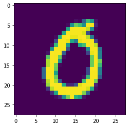
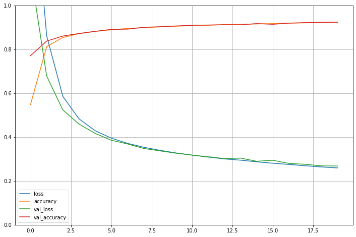
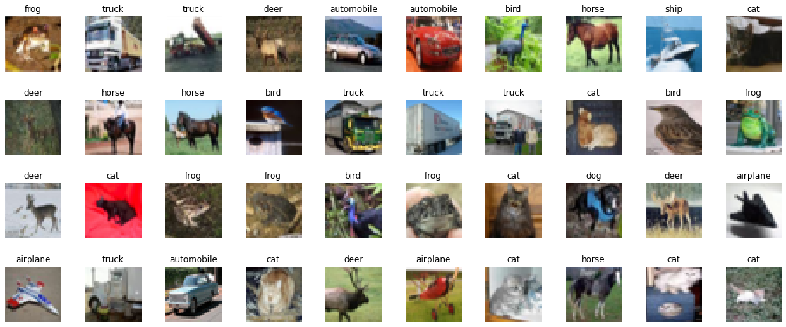
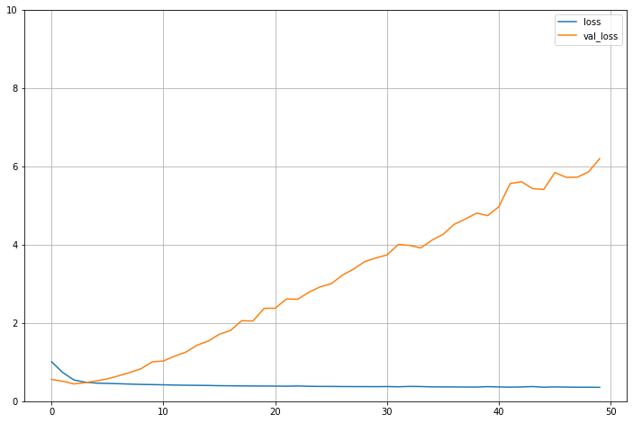

# TP Module 1 : Introduction au deep learning, prise en main de TensorFlow et Keras

Le but de ce tp est ici de se familiariser avec TensorFlow et son API haut niveau Keras. Le but étant de vous familiariser avec TensorFlow, Keras, et aussi l'outil de travail Colab, n'hésitez pas à modifier le code que vous écrirez sur Colab pour voir les changements.

```python
import Tensorflow as tf
from tensorflow import keras

print(tf.__version__)
print(keras.__version__)

import numpy as np
import random
import os

# freeze de l'aléatoire, pour avoir des expériences reproductibles.
RANDOM_SEED = 42

os.environ['PYTHONHASHSEED'] = str(RANDOM_SEED)
random.seed(RANDOM_SEED)
np.random.seed(RANDOM_SEED)
os.environ['TF_DETERMINISTIC_OPS'] = '1'
tf.random.set_seed(RANDOM_SEED)
```

!!! ubuntu "Bash"
    Google Colab est aussi capable de comprendre la plupart des commandes unix et shell que vous lui donnerez. Par exemple, comme Colab tourne avec des GPUs Nvidia, pour voir lequel vous est attribué, vous n'avez qu'à lancé la commande.


```shell
!nvidia-smi
```

**Avant de voir la création de modèles en tant que tel, discutons un peu de TensorFlow.**

## Tenseurs et opérations

L'objet de base dans TensorFlow est le tenseur. Si vous avez les connaissances de bases en algèbre linéaire, ça ne devrait pas être compliqué.

Un tenseur est un tableau multidimensionnel, tout comme l'équivalent Numpy avec ndarray.

* Un tenseur en dimension 0 correspond à un scalaire (un nombre),
* Un tenseur de dimension 1 correspond à un vecteur,
* Un tenseur de dimension 2 correspond à une matrice,
* Une fois que l'on commence à empiler des matrices ensemble dans un nouveau tableau, on obtient un tenseur en 3 dimensions, que l'on peut interpréter comme un cube de nombres.

Les opérations mathématiques possibles avec Numpy se font exactement de la même façon avec les tenseurs, et il se définissent exactement de la même manière. Il suffit principalement de remplacer `np.array` par `tf.constant`.

### Exemple


```python
a = np.array([1, 2, 3])

print(f'{a}, {a.dtype}')
```

On peut directement transformer un numpy array en tenseur TensorFlow.

```python
tf_a = tf.constant(a)
tf_a
```

```python
b = tf.constant([1,2,3])
b
```

!!! tf "Attention"

    Comme vous le verrez en tapant ces lignes de code, le type n'est pas le même, pour `tf_a` le type est hérité de Numpy, les entiers de `tf.constant` sont au type `int32`. Comme pour Numpy on peut changer le type des tenseurs.


```python
b = tf.constant([1,2,3], dtype = 'int64')
tf_a == b
```

### Exercice

Ecrire comme un tenseur la matrice $2 \times 3$ suivante :

\[
    \mathbf{W} = \begin{pmatrix} 1 & 2 & 3 \\ 4 & 5 & 6 \end{pmatrix}
\]

des 2 façons possibles :

* Ecrire sous la forme d'un ndarray Numpy puis le convertir,
* Directement via tf.constant

Via les commandes shape et dtype, afficher la forme et le data type de de chacun, puis faire sorte que les 2 façons coïncident.

* Via Numpy.

??? tf "TensorFlow"

    ```python
    a = np.array([[1,2,3],[4,5,6]])

    print(f'shape = {a.shape}, data type = {a.dtype}')
    ```

* Conversion vers `tf.constant`.

??? tf "TensorFlow"

    ```python
    tf_a = tf.constant(a)

    print(f'shape = {tf_a.shape}, data type = {tf_a.dtype}')
    ```

* Directement via TensorFlow.

??? tf "TensorFlow"

    ```python
    b = tf.constant([[1,2,3],[4,5,6]], dtype=tf.int64)

    print(f'shape = {b.shape}, data type = {b.dtype}')
    ```

* Vérification.

??? tf "TensorFlow"

    ```python
    tf_a == b
    ```

### Exercice

A l'aide de la commande [tf.reshape](https://www.Tensorflow.org/api_docs/python/tf/reshape), modifier

```python
b = tf.constant([[1,2,3],[4,5,6]], dtype=tf.int64)
```

en un tenseur de forme $(3,2)$.

??? tf "TensorFlow"

    ```python
    b = tf.reshape(b,(3,2))
    b
    ```

!!! tf "TensorFlow"

    D'autres opération classique dans Numpy existe aussi dans TensorFlow, comme la transposée.


```python
tf.transpose(b)
```

Le produit matriciel avec la commande `@`.

```python
tf.transpose(b)@b
```

!!! tf "TensorFlow"

    Une des options de la commande tf.reshape qui sera utile par la suite, et le fait de ne pouvoir que partiellement spécifier les dimensions. Mettre un $-1$ dans un des axes permet de le spécifier par rapport aux autres dimensions.

```python
b = tf.reshape(b,(1,-1))
b
```

```python
c = np.random.random_sample((100,))
c = tf.reshape(c,(-1,25,2))
c
```
## Anatomie d'un réseau de neurones

Keras est l'API de haut niveau de Tensorflow, elle facilite la contruction des réseaux de neurones en automatisant beaucoup de pratiques, comme la rétropropagation du gradient.

Entraîner un réseau de neurones dépend des paramètres suivants :

1. Les couches de neurones, qui se combinent en un réseau (ou modèle),
2. Les données : les observations et les cibles correspondantes,
3. La fonction de perte, qui définira le gradient à calculer,
4. la méthode d'optimisation, pour la descente du gradient.

L'ensemble des couches de neurones nécessaires à la constitution des réseaux se trouve dans la partie `tensorflow.keras.layers` de la librairie Tensorflow. Par exemple, appelons une couches de neurones denses avec 10 neurones dedans.

```python
from tensorflow.keras.layers import Dense

layer = Dense(10)
```

```python
from tensorflow import keras

layer = keras.layers.Dense(10)
```

```python
layer = tf.keras.layers.Dense(10)
```

Toutes ces méthodes, pour appeler la couche dense sont identiques :

* dans le premier cas on a importé les couches Dense depuis `from tensorflow.keras.layers import Dense`,
* dans le deuxième cas, on a importé keras via from `tensorflow import keras`,
* dans le dernier cas, on a importé Tensorflow via `import tensorflow as tf`.

Les couches que l'on utiliserons dans ce TP seront les couches :

* `Input`
* `Dense`
* `Activation`
* `Flatten`

On importe ces couches via les commandes suivantes.

```python
from tensorflow.keras import models
from tensorflow.keras.layers import Dense
from tensorflow.keras.layers import Flatten
from tensorflow.keras.layers import Input
from tensorflow.keras.layers import Activation
```

Il existe 3 façons de construire des modèles avec Tensorflow via Keras :

* L'API Séquentielle,
* L'API Fonctionelle,
* L'API Subclassing.

### API séquentielle

Pour construire un modèle à partir de l'API séquentielle, on procède la façon suivante :

```python
model = models.Sequential([
InputLayer(input_shape=(dim)),
Couche_1(params),
Couche_2(params),
Couche_3(params),
...
Couche_n(params)
], name='nom_du_modèle')
```

Décrivons plus en avant les parties de ce code.

1. `model = models.Sequential([....], name='nom_du_modèle')` instancie le modèle séquentiel, c'est à l'intérieur des crochets que l'on définit la topologie du modèle.

2. `InputLayer(input_shape=(dim))` est toujours la première couche d'entrée à mettre dans le cas d'un modèle séquentiel, c'est la couche qui va prendre en entrée les données pour ensuite les faire passer dans le modèle. Il est nécessaire de préciser les dimensions des données d'entrées via le paramètres input_shape.

3. `Couche_n(params)` correspond aux différentes couches que l'on peut mettre dans l'archtecture du neurones. Pour l'instant nous travaillerons avec les deux couches suivantes :

    * Les couches de neurones denses,
    * Les couches de fonction d'activations.

N'hésitez pas à vous reporter à la documentation de l'API Séquentielle de Tensorlfow, notamment sur les deux couches qui nous intéressent :

* [Couche dense](https://www.tensorflow.org/api_docs/python/tf/keras/layers/Dense)
* [Fonction d'activation comme couche](https://www.tensorflow.org/api_docs/python/tf/keras/layers/Activation)
* [Fonction d'activation](https://www.tensorflow.org/api_docs/python/tf/keras/activations)

#### Exemple : Perceptron

```python
model = models.Sequential([
    Input(shape=(10,), name='Input'),
    Dense(1),
    Activation('sigmoid')
    ], name='SeqAPI')

model.summary()
```

la commande `model.summary()` permet d'avoir un récapitulatif de l'architecture du réseau, en particuliers le nombre de paramètres du réseau, ici on en a 11. Voici ce que l'on obtient en appelant cette commande.

```
Model: "SeqAPI"
_________________________________________________________________
Layer (type)                 Output Shape              Param #
=================================================================
dense_4 (Dense)              (None, 1)                 11
_________________________________________________________________
activation_4 (Activation)    (None, 1)                 0
=================================================================
Total params: 11
Trainable params: 11
Non-trainable params: 0
_________________________________________________________________
```

Avec le code précedent, on a instancié un réseau contenant :

* 10 entrées,
* 1 neurone,
* 1 fonction d'activation sigmoïde à la fin.

**On a donc ici un modèle de Perceptron**.

### API fonctionnelle

Pour construire un modèle à partir de l'API fonctionnelle, on procède de la façon suivante :

```python
from tensorflow.keras import Model

inputs = Input(shape=(dim))
x = Couche_1(params)(inputs)
x = Couche_2(params)(x)
x = Couche_3(params)(x)
...
outputs = Couche_n(params)(x)
model = Model(inputs=inputs, outputs=output)
```

Ici comme le suppose le nom de l'API, chaque couche est alors considérée comme une fonction. On empile alors les couches comme l'on compose les fonctions.

\[
\text{sortie = Couche(params)(entrée)} \iff y =f(x)
\]

Les modèles créés via l'API séquentielle pouvant être bien plus complexes qu'un simple modèle séquentiel, avec par exemple plusieurs entrées et sorties. Pour instancier le modèle il est donc nécessaire de lui préciser quelles sont les entrées et sorties via la commande

`model = Model(inputs=inputs, outputs=output)`

Une fois que l'architecture du modèle est définie, qu'elle soit faite à partir de l'API séquentielle ou de l'API fonctionnelle ne change rien. Les méthodes pour compiler le modèle et l'entraîner sont les mêmes.


#### Exercice : Perceptron

Réécrivez le modèle du Perceptron via l'API fonctionnelle.

??? tf "TensorFlow"

    ```python
    inputs = Input(shape=(10,))
    hid = Dense(1)(inputs)
    out = Activation('sigmoid')(hid)

    model = tf.keras.Model(inputs = inputs, outputs = out, name='FuncAPI')
    model.summary()
    ```
    ```
    Model: "FuncAPI"
    _________________________________________________________________
    Layer (type)                 Output Shape              Param #
    =================================================================
    input_8 (InputLayer)         [(None, 10)]              0
    _________________________________________________________________
    dense (Dense)                (None, 1)                 11
    _________________________________________________________________
    activation_7 (Activation)    (None, 1)                 0
    =================================================================
    Total params: 11
    Trainable params: 11
    Non-trainable params: 0
    _________________________________________________________________
    ```

#### Exercice

1. Construire un modèle via l'API Séquentielle avec les couches suivantes :

```python
Input avec dim = (784,)
Dense(256)
Activation RELU
Dense(256)
Activation RELU
Dense(128)
Activation RELU
Dense(10)
Activation softmax
```

??? tf "TensorFlow"

    ```python
    model = models.Sequential([
        Input(shape=(784,)),
        Dense(256, name='dense1'),
        Activation('relu', name='relu1'),
        Dense(256, name='dense2'),
        Activation('relu', name='relu2'),
        Dense(128, name='dense3'),
        Activation('relu'),
        Dense(10, name='logits'),
        Activation('softmax', name='clf')
    ], name='SeqAPI')
    ```

2. Combien de paramètres ce modèles possède-t-il ?

??? tf "TensorFlow"

    ```python
    model.summary()
    ```

    ```
    Model: "SeqAPI"
    _________________________________________________________________
    Layer (type)                 Output Shape              Param #
    =================================================================
    dense1 (Dense)               (None, 256)               200960
    _________________________________________________________________
    relu1 (Activation)           (None, 256)               0
    _________________________________________________________________
    dense2 (Dense)               (None, 256)               65792
    _________________________________________________________________
    relu2 (Activation)           (None, 256)               0
    _________________________________________________________________
    dense3 (Dense)               (None, 128)               32896
    _________________________________________________________________
    activation_6 (Activation)    (None, 128)               0
    _________________________________________________________________
    logits (Dense)               (None, 10)                1290
    _________________________________________________________________
    clf (Activation)             (None, 10)                0
    =================================================================
    Total params: 300,938
    Trainable params: 300,938
    Non-trainable params: 0
    _________________________________________________________________
    ```

3. Refaire le même modèle avec l'API fonctionnelle.

??? tf "TensorFlow"

    ```python
    inputs = Input(shape=(784,), name='Input')
    dns1 = Dense(256, name='dense1')(inputs)
    act1 = Activation('relu', name='relu1')(dns1)
    dns2 = Dense(256, name='dense2')(act1)
    act2 = Activation('relu', name='relu2')(dns2)
    dns3 = Dense(128, name='dense3')(act2)
    act3 = Activation('relu', name='relu3')(dns3)
    dns4 = Dense(10, name='logits')(act3)
    clf = Activation('softmax', name='softmax')(dns4)

    model = tf.keras.Model(inputs=inputs, outputs=clf, name='FuncAPI')
    ```

### Weights & Biases

Il est possible de nommer les couches des réseaux, ainsi on peut les analyser de façon unique avec la commande `get_layer()`. Par exemple, pour observer la couche nommée 'dense1' dans le modèle, on peut faire comme suit :

```python
layer = model.get_layer('dense1')
weights, biases = layer.get_weights()
print(f"Poids : {weights.shape},\n"
      f"Nombre de neurones dans la couche : {weights.shape[1]},\n"
      f"Biais : {biases.shape[0]}")
```

On obtient un résultat comme suit.

```
Poids : (784, 256),
Nombre de neurones dans la couche : 256,
Biais : 256
```

Ou alors, on peut directement les appeler via leur numero de couche et l'attribut `model.layer`, la couche 0 étant la première en haut.

```python
layer = model.layers[3]
weights, biases = layer.get_weights()
print(f"Poids : {weights.shape},\n"
      f"Nombre de neurones dans la couche : {weights.shape[1]},\n"
      f"Biais : {biases.shape[0]}")
```

## Compilation du modèle, lancement de l'apprentissage : MNIST Dataset

Le dataset MNIST des chiffres manuscrits, comporte un ensemble d'entraînement de $60 000$ exemples, et un ensemble de test de $10 000$ exemples. Les chiffres ont été normalisés en taille et centrés dans une image de taille fixe.

C'est une bonne base de données pour les personnes qui veulent essayer des techniques d'apprentissage sur des données du monde réel tout en dépensant un minimum d'efforts en prétraitement et en formatage.

**C'est aussi et surtout l'un des datasets les plus utilisés au monde dans la recherche académique pour faire du benchmark de modèle.**

Importons cette base de données et regardons à quoi ressemble un exemple.

```python
# Importons cette librairie pour obtenir un jeu de validation
from sklearn.model_selection import train_test_split
```

```python
(X_train,y_train), (X_test,y_test) = tf.keras.datasets.mnist.load_data()

# reshape des données pour les faire correspondre au format de tensorflow
X_train = X_train.reshape(-1, 28, 28, 1).astype('float32')
X_test = X_test.reshape(-1, 28, 28, 1).astype('float32')
```

```
X_train.shape
```

```python
# par défaut, train_test_split prend 25% des données pour la validation, soit ici 15000 observations.
X_train, X_valid, y_train, y_valid = train_test_split(X_train, y_train, random_state=42)

X_test = (X_test - 127.5) / 127.5 # Normalize the images to [-1, 1]
X_train = (X_train - 127.5) / 127.5 # Normalize the images to [-1, 1]
X_valid = (X_valid - 127.5) / 127.5 # Normalize the images to [-1, 1]
```

```python
import matplotlib.pyplot as plt
class_names = ["zero", "un", "deux", "trois", "quatre",
               "cinq", "six", "sept", "huit", "neuf"]

n_rows = 4
n_cols = 10
plt.figure(figsize=(n_cols * 2, n_rows * 2))
for row in range(n_rows):
    for col in range(n_cols):
        index = n_cols * row + col
        plt.subplot(n_rows, n_cols, index + 1)
        plt.imshow(X_train[index, : , :,0], cmap="binary", interpolation="nearest")
        plt.axis('off')
        plt.title(class_names[y_train[index]], fontsize=12)
plt.subplots_adjust(wspace=0.2, hspace=0.5)
```


```python
# Vous pouvez mettre un chiffre quelconque entre 0 et 45000 dans la première variable de X_train[valeur_variable, :, :, 0] et y_train pour afficher l'observation que vous voulez
plt.imshow(X_train[2000, :, :, 0])
print(y_train[2000])
# Ici un zéro
```


Le dataset comprend donc des images des chiffres de $0$ à $9$, (des tenseurs 3D) de dimension $28 \times 28$ en niveau de gris (le dernier $1$ dans la valeur de `X_train.shape`).

Le but est ici de construire un classifieur, de telle sorte qu'il soit capable de nous prédire une fois entraîné la bonne valeur du chiffre qui lui sera présenté.

Ici, on triche un peu, les réseaux dense ne sont pas spécialisés dans le traîtement des images, c'est pour cela qu'une fois l'input passée, on ajoute la couche `Flatten()` qui va se charger d'applatir l'image en un vecteur de dimension $28\times28\times1 = 784$.

C'est une couche très importante que nous continuerons de rencontrer très fréquemment dans la suite des modules.

```python
model = models.Sequential([
    Input(shape=(28,28,1)),
    Flatten(),
    Dense(256, name='dense1'),
    Activation('relu', name='relu1'),
    Dense(256, name='dense2'),
    Activation('relu', name='relu2'),
    Dense(128, name='dense3'),
    Activation('relu'),
    Dense(10, name='logits'),
    Activation('softmax', name='clf')
], name='SeqAPI')
```

Pour finaliser le modèle, on a 3 hyperparamètres à lui faire passer via la commande `model.compile()`:

* La fonction de perte utilisée, qui sera utilisée pour optimiser les poids et les biais du réseau lors de la rétropropagation,
* La méthode d'optimisation utilisée pour la descente du gradient stochastique,
* Les métriques de précision qui seront utilisés pour évaluer le modèle.

**Mathématiquement**, il n'y a pas de relations entre entre la fonction de perte et les métriques de précision.

La perte peut être considérée comme **une distance entre les vraies valeurs du problème et les valeurs prédites par le modèle**. Plus la perte est importante, plus les erreurs que vous avez commises sur les données sont énormes.

La précision peut être considérée comme **le pourcentage d'erreurs que vous avez faites sur les données**.

Cela signifie que :

* Une faible précision et une perte énorme signifient que vous avez fait d'énormes erreurs sur un grand nombre de données
* Une faible précision mais une faible perte signifie que vous avez fait peu d'erreurs sur un grand nombre de données
* Une grande précision avec peu de pertes signifie que vous avez fait peu d'erreurs sur quelques données (dans le meilleur des cas)
* Une grande précision mais une perte énorme, signifie que vous avez fait d'énormes erreurs sur quelques données.

```python
model.compile(loss = 'sparse_categorical_crossentropy',
             optimizer=tf.keras.optimizers.SGD(lr=0.001),
             metrics=['accuracy'])
```

Lancer l'entraînement du modèle se fait via la commande `model.fit()`. On a alors plusieurs paramètres à rentrer :

* `X_train`, `y_train`, qui sont les données sur lesquelles va s'entraîner le modèle,
* `epoch` correspond au nombre d'époques pour l'entraînement du modèle. On rappelle qu'une époque correspond à un passage complet du dataset d'entraînement dans le modèle.
* `batch_size` qui correspond au nombre d'observations utilisées pour effectuer la descente du gradient, ie la taillle du minibatch
* `validation_data` données sur lesquelles évaluer la perte et les métriques de précision du modèle à la fin de chaque époque. Le modèle ne sera pas entraîné sur ces données.

```python
history = model.fit(X_train, y_train,
                   epochs = 20,
                   batch_size=64,
                   validation_data=(X_valid, y_valid))
```

 Une fois l'entraînement terminé, voyons comment s'en est sorti ce modèle.

```python
import pandas as pd
pd.DataFrame(history.history).plot(figsize=(12,8))
plt.grid(True)
plt.gca().set_ylim(0,1)
plt.show()
```

Vous devriez obtenir un graphe similaire.


Sur ce graphe, on observe l'évolution de la fonction de perte et la précision à la fois sur le dataset d'entraînement et sur le dataset de validation, au fil des époques. C'est un graphe utile pour juger si oui ou non notre modèle est en sur-apprentissage.

Evaluons maintenant notre modèle sur le jeu de test.

```python
model.evaluate(X_test,
               y_test,
               verbose=2)
```

### Autre méthode : One hot Encoding

Ici `y_train` va de $0$ à $9$, or ces données ne sont pas des **données ordinales**, il n'y a pas de relations d'ordre dedans cela représente juste le nombre attendu. En les laissant comme ça, l'algorithme pourrait apprendre une représentation hiérarchique des données là où il n'y en pas.

La bonne pratique est alors de transformer ces labels, en leur appliquant une transformation dite de "**One hot encoding**" (encore une fois, le terme français est manquant). De $0$ à $9$, on a $10$ chiffres, chaque nombre va donc être remplacé par sa coordonnée correspondante dans $\mathbf{R}^{10}$. Ainsi, on aura la transformation suivante.

\[
    1 \rightarrow (0,1,0,0,0,0,0,0,0,0)
    \dots
    5 \rightarrow (0,0,0,0,0,1,0,0,0,0)
\]

```python
y_train_oh = tf.keras.utils.to_categorical(y_train, num_classes=10)
y_test_oh = tf.keras.utils.to_categorical(y_test, num_classes=10)
y_valid_oh = tf.keras.utils.to_categorical(y_valid, num_classes=10)

print(y_train_oh)
```

En faisant ça, il faut alors changer la fonction de perte pour la faire correspondre au format de $y$.

```python
model = models.Sequential([
    Input(shape=(28,28,1)),
    Flatten(),
    Dense(256, name='dense1'),
    Activation('relu', name='relu1'),
    Dense(256, name='dense2'),
    Activation('relu', name='relu2'),
    Dense(128, name='dense3'),
    Activation('relu'),
    Dense(10, name='logits'),
    Activation('softmax', name='clf')
], name='SeqAPI')

model.compile(loss = 'categorical_crossentropy',
              optimizer=tf.keras.optimizers.SGD(lr=0.001),
              metrics=['accuracy'])

history = model.fit(X_train, y_train_oh,
                   epochs = 20,
                   batch_size=64,
                   validation_data=(X_valid, y_valid_oh))
```

```python
pd.DataFrame(history.history).plot(figsize=(12,8))
plt.grid(True)
plt.gca().set_ylim(0,1)
plt.show()
```

Vous devriez obtenir un graphe similaire.




```python
model.evaluate(X_test,
               y_test_oh,
               verbose=2)
```

On arrive donc à avoir des résultats relativement bon, même avec des neurones qui ne sont pas spécialisés dans le traitement de l'image.

Mais nous sommes **loin** de l'état de l'art qui est aux alentours de $99,9\%$ sur MNIST.


### Exercice

Prenez en main cet exemple, changez le nombre de couches, le nombres de neurones, essayez avec ou sans one hot encoding. Créer votre classifieur de nombre.

## CIFAR-10 Dataset

Le dataset CIFAR-10 comprend 60000 images couleur $32\times32$ réparties en $10$ classes, avec $6000$ images par classe. Il y a $50000$ images d'entraînement et $10000$ images de test.

Le dataset est divisé en un dataset d'entraînement et un dataset de test, contenant $50000$ images pour le dataset d'entraînement, le dataset de test contient exactement $1000$ images sélectionnées au hasard dans chaque classe.

```python
(X_train,y_train), (X_test,y_test)  = tf.keras.datasets.cifar10.load_data()

X_train.shape
```

Les classes présentes dans le dataset sont les suivantes, chacunes représentées par un chiffre de 0 à 9. Dans l'ordre nous avons :

* airplane
* automobile
* bird
* cat
* deer
* dog
* frog
* horse
* ship
* truck

C'est aussi un dataset très connu pour faire du benchmark de modèle dans le milieu académique. Visualisons un peu ce que cela donne.

```python
class_names = ['airplane', 'automobile', 'bird', 'cat', 'deer', 'dog', 'frog', 'horse', 'ship', 'truck']

n_rows = 4
n_cols = 10
plt.figure(figsize=(n_cols * 2, n_rows * 2))
for row in range(n_rows):
    for col in range(n_cols):
        index = n_cols * row + col
        plt.subplot(n_rows, n_cols, index + 1)
        plt.imshow(X_train[index, : , :, :], cmap="binary", interpolation="nearest")
        plt.axis('off')
        plt.title(class_names[y_train[:,0][index]], fontsize=12)
plt.subplots_adjust(wspace=0.2, hspace=0.5)
```


```python
plt.imshow(X_train[25000, :, :, :])
print(y_train[25000])
```


```python
X_train = X_train.reshape(-1, 32, 32, 3).astype('float32')
X_test = X_test.reshape(-1, 32, 32, 3).astype('float32')

X_train, X_valid, y_train, y_valid = train_test_split(X_train, y_train, random_state=RANDOM_SEED)

X_test = (X_test - 127.5) / 127.5 # Normalize the images to [-1, 1]
X_train = (X_train - 127.5) / 127.5 # Normalize the images to [-1, 1]
X_valid = (X_valid - 127.5) / 127.5 # Normalize the images to [-1, 1]
```

### Exercice

Sous quelle forme sont codées les labels de `y_train`, `y_test`, `y_valid` ?

### Exercice

Le dataset a été chargé, partagé en train, validation, test. A vous de jouer, construisez une réseau de neurones pour classifer ces images.

* Le nombres de couches de neurones,
* Le nombres de neurones dans chaque couche,
* Si oui ou non `y_train`, `y_test`, `y_valid` sont au format one_hot,
* Le nombre d'époque,
* La taille du batch.

Tout cela dépend de vous, le squelette est là, à vous de le remplir.

```python
model = models.Sequential([
    Input(shape=(32,32,3)),
    Flatten(),
    ...


    Dense(10, name='logits'),
    Activation('softmax', name='clf')
], name='SeqAPI')

model.compile(loss = ...,
              optimizer=tf.keras.optimizers.SGD(lr=0.001),
              metrics=['accuracy'])

history = model.fit(X_train, ...,
                   epochs = ...,
                   batch_size = ...,
                   validation_data = (X_valid, ...))
```

??? tf "TensorFlow"

    ```python
    model = models.Sequential([
        Input(shape=(32,32,3)),
        Flatten(),
        Dense(256, name='dense1'),
        Activation('relu', name='relu1'),
        Dense(256, name='dense2'),
        Activation('relu', name='relu2'),
        Dense(128, name='dense3'),
        Activation('relu'),
        Dense(10, name='logits'),
        Activation('softmax', name='clf')
    ], name='SeqAPI')

    model.compile(loss = 'sparse_categorical_crossentropy',
                optimizer=tf.keras.optimizers.SGD(lr=0.001),
                metrics=['accuracy'])

    history = model.fit(X_train, y_train,
                    epochs = 20,
                    batch_size = 64,
                    validation_data = (X_valid, y_valid))
    ```

    ```python
    pd.DataFrame(history.history).plot(figsize=(12,8))
    plt.grid(True)
    plt.gca().set_ylim(0,2)
    plt.show()
    ```

    

    Ayant $10$ classes différentes, un choix au hasard donnerait une précision de l'ordre de $10\%$, le réseau fait donc mieux que choisir une classe au hasard.

    Cependant on est clairement en sur-apprentissage, la fonction de perte sur le dataset d'entraînement ne fait que baisser, **ce qui est normal puisque l'on optimise les poids pour à chaque étape** mais :

      1. La fonction de perte sur le dataset de validation grimpe en flêche,
      2. La précision sur le dataset de validation reste bloqué à $50\%$.

    Pour résumer,

    Le modèle à appris par coeur les photos qu'il a pour s'entraîner, mais si on lui donne une photo au hasard du dataset de validation, il **a une chance sur deux de se tromper**.

    ```python
    model.evaluate(X_test,
               y_test,
               verbose=2)
    ```
## Exemple : Overfit sur une régression linéaire

```python
from sklearn.datasets import fetch_california_housing
from sklearn.preprocessing import StandardScaler
housing = fetch_california_housing()
```

```python
X_train, X_test, y_train, y_test = train_test_split(housing.data, housing.target, random_state=RANDOM_SEED)
X_train, X_valid, y_train, y_valid = train_test_split(X_train, y_train, random_state=RANDOM_SEED)
```

```python
X_train.shape[1:]

(8,)
```

```python
scaler = StandardScaler()
X_train = scaler.fit_transform(X_train)
X_valid = scaler.fit_transform(X_valid)
X_test = scaler.fit_transform(X_test)
```

```python
model = models.Sequential([
    Input(shape=(8,)),
    Dense(10),
    Activation('relu'),
    Dense(1)
    ], name='SeqAPI')

model.compile(loss = "mean_squared_error",
              optimizer=tf.keras.optimizers.SGD(lr=0.001))

history = model.fit(X_train, y_train,
                   epochs = 50,
                   validation_data=(X_valid, y_valid))
```

```python
pd.DataFrame(history.history).plot(figsize=(12,8))
plt.grid(True)
plt.gca().set_ylim(0,10)
plt.show()
```



## Conclusions

Pour résumer, la contruction d'un modèle se divise en ces étapes :

* (Collecte et mise en forme de la donnée),
* Mise en place de l'architecture : API séquentielle/fonctionelle,
* Définition du triplet [Perte, Optimiseur, Métrique],
* Définition de la commande `model.fit()`

Il semble apparent, et cela sera récurrant par la suite, que le nombre de neurones dans les couches cachées ne peut s'exprimer qu'en multiple de $32$ : $32$, $64$, $128$, $256$, $512 \dots$ **Aucun théorème mathématique ne vient soutenir cette hypothèse**.

Le fait de choisir des multiples de $32$ (des puissances de $2$) pour le nombres de neurones est plus une tradition et une convention informatique qu'autre chose. Si dans une moindre mesure, il est vrai que pour des neurones convolutifs (que nous verrons dans le module suivant) cela peut aider au niveau de la vitesse d'entraînement car **les algorithmes de transformée de Fourier rapide fonctionnent mieux avec un échantillonage en 2^n**, c'est pas le cas du reste.
