# Module 5 : Personnaliser son réseau de neurones

## Les nouvelles architectures et les nouvelles opérations associées

### Conv $1 \times 1$

Le problème des architectures classiques telles que VGGNet provient en fait de la couche classifiante dense à la fin du modèle. C'est cette partie là qui a fortement tendance au sur-apprentissage.

**L'idée est alors ne plus mettre de couche dense, ou le moins possible**.

!!! quote "Citation"

    In Convolutional Nets, there is no such thing as "fully-connected layers". There are only convolution layers with $1 \times 1$ convolution kernels and a full connection table.

    It's a too-rarely-understood fact that ConvNets don't need to have a fixed-size input. You can train them on inputs that happen to produce a single output vector (with no spatial extent), and then apply them to larger images. Instead of a single output vector, you then get a spatial map of output vectors. Each vector sees input windows at different locations on the input.

    In that scenario, the "fully connected layers" really act as $1 \times 1$ convolutions.

    *Yann LeCun*

En d'autres termes, pour remplacer les réseaux de neurones denses, on utilise des couches convolutives avec des noyaux de taille $1 \times 1$.

1. Ce type de convolution ne peut pas capturer de features géométriques, puisque le noyau regarde un pixel à la fois, les dimensions géométriques des features maps ne sont donc pas affectées par cette convolution.

2. Cependant, ces convolutions sont capables de capturer les features spatiales sur plusieurs canaux.

3. Elles permettent de réduire le nombre de features maps, et agissent donc comme un "goulôt d'étranglement" qui permet d'augmenter la vitesse de calcul.

!!! example "Application d'une convolution $1\times1$"

    

    Notons $p_{i,j}(F_{k})$ le pixel à la coordonée $(i,j)$ dans la feature map $F_{k}$.

    Chacun des pixels obtenus dans la feature map en sortie est alors une combinaison linéaire des pixels aux mêmes coordonnées dans les features maps d'entrée. Les coefficients de la combinaison linéaire étant **appris** par le réseau et les mêmes pour tous les pixels de la feature map de sorite, ce sont les coefficients $(w_{1}^{1}, w_{2}^{1}, w_{3}^{1})$ du filtre de la convolution $1\times1$.

Dans les architectures modernes, les couches denses sont le plus souvent réduit au strict minimum, une unique couche en sortie avec le nombre de classes désirées.

### GlobalAvgPooling

Pour réduire les dimensions des features, il est aussi possible de passer par les opérations de pooling global. Un GlobalAvgPooling ou un GlobalMaxPooling calcul la statistique demandée sur la feature map complète.

!!! example "Global Average Pooling"

    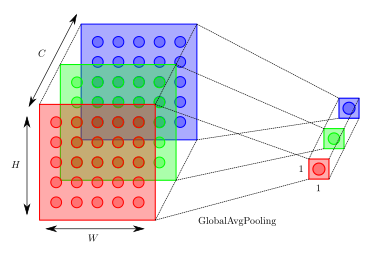

Bien que cela soit assez destructeur, les opérations globales de pooling, et surtout GlobalAvgPooling, permettent d'obtenir des propriétés de localisation intéressante de la part des CNNs.

### ResNet

Les modèles ayant des architectures de plus en plus profondes, il est nécéssaire de comprendre comment le fait d'ajouter de nouvelles couches peut augmenter la compléxité du modèle et le rendre plus expressif. Rendre un modèle plus expressif étant plus important que de le rendre unique, il faut être sûr que les couches que nous rajoutons soient utiles.

Considérons $\mathcal{F}$, la classe des fonctions quu'une architecture spécifique peut approximer, ie, pour tout fonction $f$ appartenant à $\mathcal{F}$, il existe des paramètres $\vartheta$ qui peuvent être obtenus sur un dataset particulier permettant à cette architecture d'approximer $f$.

Si $f^{\ast}$ est la vraie fonction recherchée et qu'elle est dans $\mathcal{F}$, on est alors en bonne position pour l'approximer, mais c'est rarement le cas.

On peut alors considérer $f^{\ast}_{\mathcal{F}}$, la meilleure approximation possible de $f^{\ast}$ dans $\mathcal{F}$, ie

\[
    f^{\ast}_{\mathcal{F}} := \underset{f \in \mathcal{F}}{\text{argmin}} \mathcal{L}_{\vartheta}(y, \hat{y}, f)
\]

Supposons que l'on définisse une architecture plus complexe aboutissant à une nouvelle classe $\mathcal{F}'$. Si $\mathcal{F} \not\subset \mathcal{F}'$, il n'y a aucune garantie que $f^{\ast}_{\mathcal{F}'}$ soit mieux ou plus facile à trouver que $f^{\ast}_{\mathcal{F}}$.

!!! info "Remarque"

    C'est la situation rencontrée par He & al. dans l'article *Deep Residual Learning for Image Recognition* : rajouter plus de couches de façon naïve ne fait qu'empirer le problème d'approximation.

L'idée de l'article est alors la suivante : tout bloc de couches rajoutées devrait être capable d'approximer l'identité $f(x)=x$. Ainsi, s'i n'apporte rien de plus et que l'architecture était déjà optimale, le rajout de ces couches n'aura que peu d'impact. C'est le principe des **blocs résiduels**.

Voici ce qu'ils disent dans l'article.

!!! tldr "Résumé"

    1. Driven by the significance of depth, a question arises : *Is learning better networks as easy as stacking more layers ?* An obstacle to answering this question was the notorious problem of vanishing/exploding gradient [...]. This problem, however, has been largely addressed by normalized initilization and intermediate normalization layers. (ie BatchNorm et initialisation des poids)

    2. When deeper networks are able to start converging, a *degradation* problem has been exposed : : with the network depth increasing, accuracy gets saturated (...) and then degrades rapidly. **Unexpectedly, such a degradation is *not caused by overfitting*, and adding more layers to a suitably deep model leads to *higher training error***.

    3. We show that :

        1. Our extremely deep *residual nets* are esay to optimize, but the counterpart "plain" nets (that simply stacks layers) exhibit higher training error when the depth increases.

        2. Our deep residual nets can easily enjoy accuracy gains from greatly increased depth, producing results substantially better than previous networks.

    4. Our 152-layers residual net is the deeper network ever presented on ImageNet (2015), while still having lower complexity than VGG nets.

    5. The degradation problem suggests that the solvers (ie weights optimization) might have difficulties in approximating identity mappings by multiple nonlinear layers.

#### Architecture

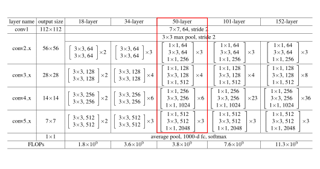

#### Bloc de base

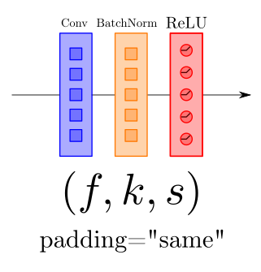

#### Bloc identité

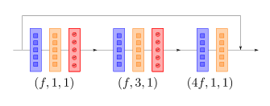

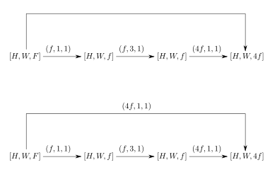

#### Bloc projection

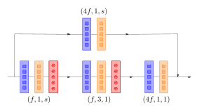

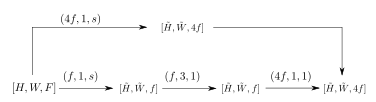

#### Bloc ResNet

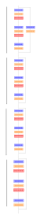

### DenseNet

ResNet a radicalement changé la vision que l'on avait de la construction des réseaux de neurones profonds.

DenseNet, introduit par Huang & al. dans *Densely Connected Convolutional Networks* est l'extension logique de ResNet. La différence majeure avec ResNet est que DenseNet décompose la fonction approximée en termes de compléxité croissante non plus en utilisant l'addiction, mais la concaténation cette fois ci.

Voici ce qu'ils disent dans l'article.

!!! tldr "Résumé"

    1. As CNNs become increasingly deep, a new research problem emerges : as information about the input of gradient passes through many layers, it can vanish and "wash out" by the time it reaches the end (or beginning) of the network.

    2. to ensure maximum information flow between layers in the network, we connect *all layers* (with matching feature maps sizes) directly with each other.

    3. Crucially, in contrast to ResNets, we never combine features through summation before they are passed into a layer, instead, we combine features by concatenating them.

    4. the final classifier makes a decision based on all features maps in the network.

#### Architecture

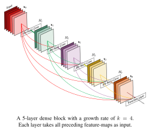

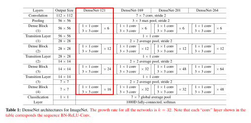

#### Bloc dense

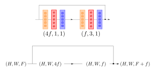

#### Bloc transition

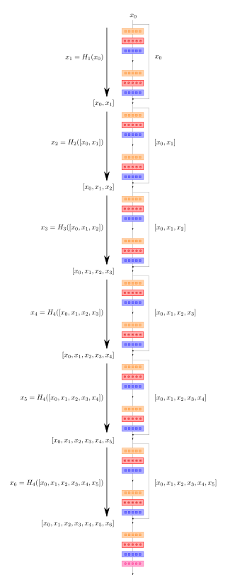